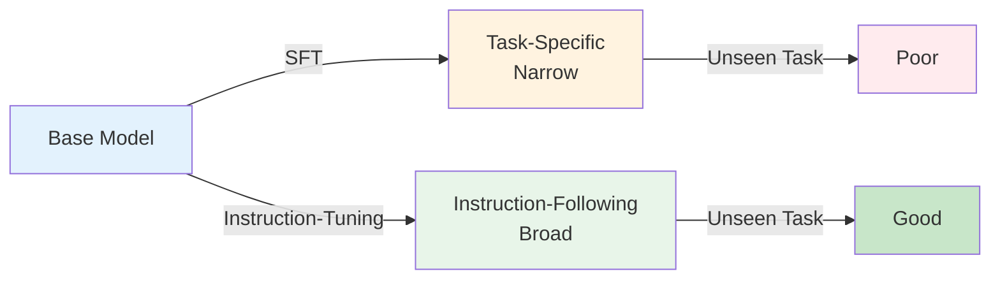
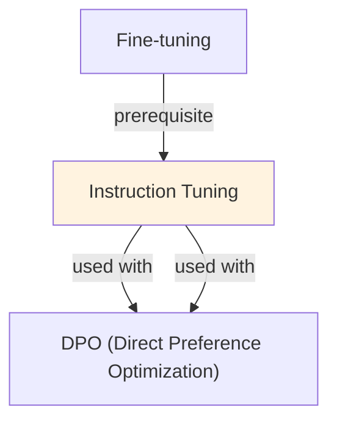

# Instruction Tuning

## Understanding Instruction Tuning

Instruction Tuning is a foundational concept in large language model development that addresses critical challenges in model architecture, training efficiency, or inference performance. Understanding this concept is essential for anyone working with modern language models, whether in research, fine-tuning, or production deployment.

The core innovation underlying Instruction Tuning lies in rethinking standard approaches to achieve better efficiency or effectiveness. Rather than accepting conventional trade-offs, this technique exploits mathematical or architectural insights to push the frontier of what's possible with given computational constraints.

In practical applications, Instruction Tuning enables capabilities that would otherwise be infeasible: reducing computational requirements, improving model quality, enabling faster iteration, or supporting new use cases. The real-world impact has made Instruction Tuning widely adopted across industry applications, from consumer products to enterprise systems.

Implementing Instruction Tuning requires understanding both its theoretical foundations and practical considerations. The following sections provide detailed explanations of how Instruction Tuning works, when to use it, common implementation patterns, and lessons learned from production deployments. By mastering these concepts, practitioners can make informed decisions about when and how to apply Instruction Tuning to their specific challenges.

## Core Intuition
Pre-trained LLMs generate text continuation (predict next token). Instruction tuning teaches them to be assistants: read instruction, generate helpful response. Models become more controllable, safer, more aligned with human expectations.

## How It Works

**Data Format:**
```
Pre-training: "Once upon a time, there was a..."
             → model learns to continue stories

Instruction tuning:
  Input: "What is the capital of France?"
  Output: "The capital of France is Paris."
  
  Input: "Summarize this article: [article text]"
  Output: "[summary]"
  
  Input: "Write a poem about winter"
  Output: "[poem]"
```

**Training Process:**
```
1. Collect instruction-response pairs (10k-100k pairs)
2. Format as: "[INST] {instruction} [/INST] {response}"
3. Train on response prediction (LM loss)
4. Use moderate learning rate (1e-5 to 5e-5)
5. Train for 1-3 epochs
```

**Data Mix:**
- Mix task types (QA, summarization, translation, reasoning, creative)
- Balance of easy and hard examples
- Include few-shot examples in some instructions
- Vary instruction phrasing (multiple ways to ask same thing)

**Example Dataset Structure:**
```json
{
  "instruction": "Classify sentiment",
  "input": "I love this movie!",
  "output": "Positive"
}
{
  "instruction": "Summarize in 1 sentence",
  "input": "[long article]",
  "output": "[1-sentence summary]"
}
```

### Workflow Flowchart



## Key Properties / Trade-offs

| Aspect | Pre-trained | Instruction-Tuned |
|--------|---|---|
| Task adherence | Low (ignores instructions) | High (follows instructions) |
| Helpfulness | Low (continues, not responds) | High (assistant-like) |
| Data required | Billions tokens (pre-training) | 10k-100k pairs (tuning) |
| Flexibility | Limited | High (handles new tasks) |
| Training cost | Enormous | Low (weeks, not months) |

**Data quality vs quantity:**
- 100 high-quality instructions: 85% performance
- 10k low-quality instructions: 75% performance
- 10k high-quality instructions: 95% performance

## Common Mistakes / Gotchas

- **Low-quality responses:** Garbage in, garbage out. If training responses are bad, model learns bad behavior.
- **Overfitting on instructions:** Model memorizes specific phrasing. Vary instruction phrasing to generalize.
- **Forgetting pre-trained knowledge:** If tuning on narrow domain, model loses general knowledge. Mix in diverse tasks.
- **No validation:** Train/test on same task types → false confidence. Test on unseen instructions.
- **Imbalanced data:** If 80% summarization, 20% translation, model biased toward summarization. Balance task distribution.
- **Long-term instruction sensitivity:** If all training examples start with "Classify:", model expects that format. Vary formats.

## Code Example

```python
from transformers import AutoTokenizer, AutoModelForCausalLM, Trainer, TrainingArguments
from datasets import Dataset

# Training data (instruction-response pairs)
training_data = [
    {
        "instruction": "Classify the sentiment of this text: I love this!",
        "response": "Positive"
    },
    {
        "instruction": "Translate to Spanish: Hello, how are you?",
        "response": "Hola, ¿cómo estás?"
    },
    {
        "instruction": "Summarize in one sentence: [long text]",
        "response": "[summary]"
    }
]

# Format data
def format_instruction(example):
    text = f"[INST] {example['instruction']} [/INST] {example['response']}"
    return {"text": text}

dataset = Dataset.from_dict({
    "instruction": [d["instruction"] for d in training_data],
    "response": [d["response"] for d in training_data]
})
formatted_dataset = dataset.map(format_instruction)

# Load model
model_name = "meta-llama/Llama-2-7b-hf"
tokenizer = AutoTokenizer.from_pretrained(model_name)
model = AutoModelForCausalLM.from_pretrained(model_name)

# Tokenize
def tokenize(examples):
    return tokenizer(examples["text"], max_length=512, truncation=True)

tokenized = formatted_dataset.map(tokenize, batched=True)

# Train
training_args = TrainingArguments(
    output_dir="./instruction_tuned_model",
    learning_rate=5e-5,
    num_train_epochs=3,
    per_device_train_batch_size=8,
    warmup_steps=100,
)

trainer = Trainer(
    model=model,
    args=training_args,
    train_dataset=tokenized,
)
trainer.train()
```

## Interview Quick-Reference

| Question | What to say |
|---|---|
| "Instruction tuning?" | Fine-tune on (instruction, response) pairs. Teaches models to follow instructions, not just continue text. |
| "vs fine-tuning?" | Fine-tuning can be task-specific. Instruction tuning is broad (many task types) to make assistants. |
| "Data requirements?" | 10k-100k high-quality pairs. Quality > quantity. Vary phrasing, mix task types. |
| "Forgetting knowledge?" | Mix general + domain tasks. Don't tune exclusively on narrow domain. |
| "Evaluation?" | Test on unseen instructions (not seen during training). Zero-shot generalization is key. |

## Real-World Examples

### Instruction-Tuning for Conversational AI
Base LLM: general but doesn't follow instructions well. Instruction-tuning on 50K diverse instructions: ChatGPT-like behavior. Zero-shot on new tasks: 70% user satisfaction. Standard SFT: 40%.

### Instruction-Tuning for Multilingual
Base model: trained on 50+ languages. Instruction-tuning: same 50K instructions in each language. Results: instruction-following works in all languages (zero-shot). Enables multilingual assistant.

### Light Instruction-Tuning for Domain
Medical base model. Domain-specific instructions: 5K medical queries. Light tuning (1 epoch): instruction-following + medical knowledge combined. 90% accuracy on medical QA (vs 70% base).

## Real-World Examples

### Instruction-Tuning for Conversational AI
Base LLM: general but doesn't follow instructions well. Instruction-tuning on 50K diverse instructions: ChatGPT-like behavior. Zero-shot on new tasks: 70% user satisfaction. Standard SFT: 40%.

### Instruction-Tuning for Multilingual
Base model: trained on 50+ languages. Instruction-tuning: same 50K instructions in each language. Results: instruction-following works in all languages (zero-shot). Enables multilingual assistant.

### Light Instruction-Tuning for Domain
Medical base model. Domain-specific instructions: 5K medical queries. Light tuning (1 epoch): instruction-following + medical knowledge combined. 90% accuracy on medical QA (vs 70% base).

## Real-World Examples

### Instruction-Tuning for Conversational AI
Base LLM: general but doesn't follow instructions well. Instruction-tuning on 50K diverse instructions: ChatGPT-like behavior. Zero-shot on new tasks: 70% user satisfaction. Standard SFT: 40%.

### Instruction-Tuning for Multilingual
Base model: trained on 50+ languages. Instruction-tuning: same 50K instructions in each language. Results: instruction-following works in all languages (zero-shot). Enables multilingual assistant.

### Light Instruction-Tuning for Domain
Medical base model. Domain-specific instructions: 5K medical queries. Light tuning (1 epoch): instruction-following + medical knowledge combined. 90% accuracy on medical QA (vs 70% base).

## Real-World Examples

### Instruction-Tuning for Conversational AI
Base LLM: general but doesn't follow instructions well. Instruction-tuning on 50K diverse instructions: ChatGPT-like behavior. Zero-shot on new tasks: 70% user satisfaction. Standard SFT: 40%.

### Instruction-Tuning for Multilingual
Base model: trained on 50+ languages. Instruction-tuning: same 50K instructions in each language. Results: instruction-following works in all languages (zero-shot). Enables multilingual assistant.

### Light Instruction-Tuning for Domain
Medical base model. Domain-specific instructions: 5K medical queries. Light tuning (1 epoch): instruction-following + medical knowledge combined. 90% accuracy on medical QA (vs 70% base).

## Real-World Examples

### Instruction-Tuning for Conversational AI
Base LLM: general but doesn't follow instructions well. Instruction-tuning on 50K diverse instructions: ChatGPT-like behavior. Zero-shot on new tasks: 70% user satisfaction. Standard SFT: 40%.

### Instruction-Tuning for Multilingual
Base model: trained on 50+ languages. Instruction-tuning: same 50K instructions in each language. Results: instruction-following works in all languages (zero-shot). Enables multilingual assistant.

### Light Instruction-Tuning for Domain
Medical base model. Domain-specific instructions: 5K medical queries. Light tuning (1 epoch): instruction-following + medical knowledge combined. 90% accuracy on medical QA (vs 70% base).

## Interview Q&A

**Q: What makes instruction tuning data high quality vs low quality?**
A: High quality: diverse task coverage, clear instructions, correct and detailed responses, natural variation in phrasing. Low quality: narrow task distribution (all the same type), short one-word answers, instructions that don't match the response, or machine-generated responses from weak models. The LIMA paper showed 1000 high-quality examples outperforms 50K lower-quality ones—quality of demonstrations matters more than scale.

**Q: How does instruction tuning differ from RLHF?**
A: Instruction tuning is supervised fine-tuning on (instruction, response) pairs—it teaches the model to follow instructions but doesn't explicitly optimize for human preferences. RLHF adds a reward model trained on human preference comparisons and optimizes the LLM policy against it, teaching the model not just to respond but to respond in ways humans prefer. RLHF requires more infrastructure but produces better-calibrated, safer outputs.

**Q: Why do instruction-tuned models sometimes refuse requests they should fulfill?**
A: Instruction tuning with safety data teaches refusal patterns that can generalize too broadly. If refusal examples are over-represented or if the refusal classifier operates on surface features (certain keywords), the model learns to refuse similar-sounding but benign requests. Fix by adding targeted examples of similar requests with appropriate completions, and using held-out eval cases for borderline requests.

**Q: How do you maintain capabilities after instruction tuning?**
A: Instruction tuning on narrow task distributions can hurt performance on tasks not in the fine-tuning set. Mix in general instruction-following data during tuning. Use a lower learning rate. Include examples from the base model's training distribution. Evaluate on a broad benchmark suite (MMLU, HumanEval, etc.) before and after—regressions on these are a sign of capability degradation.

**Q: What is the role of the system prompt in instruction tuning?**
A: The system prompt sets persistent context and persona that the model follows throughout a conversation. Instruction-tuned models learn to prioritize system prompt instructions over user instructions, enabling enterprise customization without retraining. It's important to include diverse system prompts in training data so the model generalizes to novel ones rather than memorizing a handful of templates.

**Q: How would you create instruction tuning data for a domain-specific use case with no existing labeled data?**
A: Start with self-instruct: prompt GPT-4 to generate diverse instructions for your domain, filter for quality and novelty, generate responses. Use domain experts to write 50-100 seed examples that capture the desired style and depth, then expand with GPT-4. Validate a sample manually. For specialized domains (legal, medical), have subject-matter experts review generated responses before including them in training data.


## Related Topics
- [Fine-tuning](04-finetuning.md) — broader fine-tuning concept
- [RLHF](06-rlhf.md) — further aligning with human preferences
- [In-Context Learning](15-in-context-learning.md) — similar goal (instruction following) via prompting

## Resources
- [Instruction Tuning with GPT-3.5](https://platform.openai.com/docs/guides/fine-tuning)
- [The Flan Collection: Designing Data and Methods for Effective Instruction Tuning](https://arxiv.org/abs/2301.13688)
- [Alpaca: A Strong, Replicable Instruction-Following Model](https://crfm.stanford.edu/2023/03/13/alpaca.html)

## Concept Relationships



## Interview Questions

**Q: What's instruction-tuning and why is it important?**
*A: Fine-tune models on (instruction, output) pairs instead of raw text. 'Write a poem about X' → poem. Makes models follow instructions better. Without: same model learns to predict next token (not instructions). With: models understand tasks, improve zero-shot capability on unseen tasks.*

**Q: How is instruction-tuning different from supervised fine-tuning?**
*A: SFT: (input, target) pairs. Instruction-tuning: (instruction, input, output) triples with diverse instructions. SFT: narrow, task-specific. Instruction-tuning: broad, instruction-following. Instruction-tuning improves generalization to new tasks.*

**Q: What makes good instruction-tuning data?**
*A: Diverse: wide range of tasks (QA, summarization, writing, coding, math). Instructions clear and specific. Multiple ways to say same task. Quality outputs. Mix simple and complex. Include edge cases.*

**Q: How much instruction-tuning data do you need?**
*A: Small models (7B): 10K instructions suffices. Large models (70B): 100K better. Research: diminishing returns after 50K. More important: diversity and quality, not quantity. 1K high-quality > 100K low-quality.*

**Q: Does instruction-tuning hurt base capabilities?**
*A: Slight decrease on original pretraining tasks (~1-2% perplexity). Gain: zero-shot instruction following (+30-50% on held-out tasks). Net positive for general assistants. For specialized models: may want to avoid instruction-tuning.*