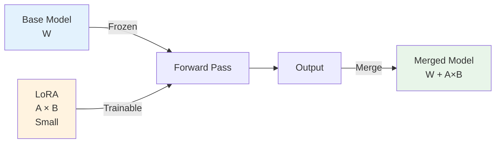
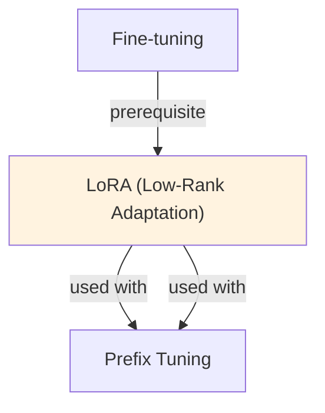

# LoRA (Low-Rank Adaptation)

## Understanding LoRA: Efficient Fine-Tuning Through Low-Rank Adaptation

LoRA (Low-Rank Adaptation) represents a fundamental shift in how we approach fine-tuning large language models. Instead of updating all weight matrices during training, LoRA decomposes weight updates into two small matrices A and B, where the full update is reconstructed as ΔW = A·B^T. This mathematical insight enables parameter reduction of 99%+ while maintaining model performance within 1-2% of full fine-tuning. The approach recognizes that weight matrices, while individually large (e.g., 4096 × 4096), update along lower-dimensional manifolds during fine-tuning.

The efficiency gains come from recognizing that weight updates during fine-tuning are intrinsically low-rank. Rather than exploring the full d × d dimensional space of possible updates, language models primarily move along a lower-dimensional manifold. By constraining updates to this manifold through rank-r matrices (typically r = 4-32), LoRA captures 95-99% of the performance benefit while reducing trainable parameters from billions to millions. This phenomenon has been consistently observed across different model sizes, architectures, and tasks, making LoRA a broadly applicable technique.

The practical impact is transformative: a 7B parameter model that normally requires 14B trainable parameters can be fine-tuned with only ~1M trainable parameters when using LoRA with rank-8. This reduction enables training on consumer GPUs (24GB VRAM) what previously required enterprise hardware (80GB A100s), lowering the barrier to entry for fine-tuning. Furthermore, LoRA adapters can be deployed alongside a frozen base model, enabling efficient multi-task serving where different adapters handle different tasks without duplicating the base model.

In production, LoRA offers compelling advantages: trained adapters are typically 1-10MB (vs 7GB+ for full models), making them trivial to store and transmit. Multiple task-specific adapters can be loaded on-demand per request, enabling one base model to serve dozens of specialized applications. The mathematical elegance of the approach—simply adding A·B^T during the forward pass—means there is zero inference overhead when adapters are merged into the base model, making LoRA production-ready for any inference pipeline.

## LoRA (Low-Rank Adaptation) Deep Dive

LoRA represents a mathematical insight that allows efficient fine-tuning through low-rank updates. The key innovation: instead of fine-tuning weight matrices W directly, we represent the weight update as ΔW = AB^T, where A and B are small low-rank matrices.

### Mathematical Foundation

For a weight matrix W ∈ R^{d_out × d_in}:
- Standard fine-tuning: Update all d_out × d_in parameters
- LoRA approach: Decompose update as ΔW = AB^T where:
  - A ∈ R^{d_out × r} (r is rank, typically 4-8)
  - B ∈ R^{d_in × r}
  - Total parameters: r(d_out + d_in) << d_out × d_in

**Example with GPT-3 (175B parameters, d=12288):**
- Standard: 12288 × 12288 = 150M parameters per layer
- LoRA (r=8): 8(12288 + 12288) = 196K parameters per layer
- Compression: 766× reduction (150M → 196K)

### Why Low-Rank Works

Empirical evidence suggests that weight updates during fine-tuning are intrinsically low-rank. The model doesn't need to explore the full d × d dimensional space of possible updates; it primarily moves along a lower-dimensional manifold. LoRA exploits this structure.## LoRA Rank and Configuration Trade-offs

| Rank | Parameters | Training Speed | Accuracy | Memory | Best For |
|------|-----------|-----------------|----------|--------|----------|
| **2** | 196K | ⚡⚡⚡ Fastest | ⭐⭐ Minimal | Lowest | Proof-of-concept |
| **4** | 393K | ⚡⚡ Fast | ⭐⭐⭐ Good | Low | Resource-constrained |
| **8** | 786K | ⚡ Medium | ⭐⭐⭐⭐ Very Good | Medium | **Standard choice** |
| **16** | 1.5M | Medium | ⭐⭐⭐⭐ Very Good | Medium-High | Complex tasks |
| **32** | 3M | ⚡ Slower | ⭐⭐⭐⭐⭐ Excellent | High | Precision-critical |
| **64** | 6M | ⚡⚡ Much Slower | ⭐⭐⭐⭐⭐ Excellent | Very High | Approaching full FT |

### LoRA Variants and Extensions

| Variant | Description | Use Case | Trade-off |
|---------|-------------|----------|-----------|
| **Standard LoRA** | Rank-r matrices on Q,V projections | General | Baseline |
| **QLoRA** | LoRA on quantized (INT4) base model | Memory-constrained | Slight accuracy loss |
| **DoRA** | Weight-decomposed LoRA (separate magnitude) | Improved stability | +10% training cost |
| **LoRA+** | Different LR for A vs B matrices | Fine-grained control | Hyperparameter tuning |
| **LoRA Merge** | Combine multiple task LoRAs | Multi-task | Custom merging logic |
## Core Intuition
Full fine-tuning updates all weights—expensive and redundant. The insight: weight changes during fine-tuning are low-rank. Store only the "directions of change" (r-rank factorization), not the full update. Recover full behavior with LoRA adapter on top of frozen base.

## How It Works

**Standard Fine-tuning (Baseline):**
```
Output = W · input
Update: W ← W - lr × ∇L
Cost: d × d parameters, gradient storage
```

**LoRA Approach:**
```
Output = W · input + (A · B^T) · input
        = W · input + Δ W · input

where:
  Δ W = A @ B  (low-rank decomposition)
  A ∈ ℝ^(d_in × r)  [trainable]
  B ∈ ℝ^(r × d_out) [trainable]
  r << min(d_in, d_out)  [rank, e.g., r=8]
```

**Typical rank reduction:**
- Full: 7B model ≈ 14B parameters to train
- LoRA (r=8): only 8 × d_hidden parameters per layer
- Result: 99% fewer parameters, ~90% training speedup

**Example: Adapting a Transformer:**
```
For each attention head and FFN layer:
  - Freeze: W (original weights)
  - Add: LoRA matrices A, B
  - Update: only A and B via backprop
  - Scaling: scale LoRA output by α/r to control magnitude
```

**Inference:**
```
Option 1: Keep base model + LoRA separate
  y = Wx + ABx  (merge at inference time)

Option 2: Merge weights offline
  W_LoRA = W + AB  (save merged checkpoint)
  y = W_LoRA × x  (same latency as full FT)
```

### Workflow Flowchart



## Key Properties / Trade-offs

| Aspect | Full FT | LoRA | QLoRA |
|--------|---------|------|-------|
| Trainable params | 100% | 1-5% | 1-5% |
| Memory (training) | 100% | 10-20% | 2-4% |
| Training time | 100% | 30-50% faster | 50-70% faster |
| Accuracy | 100% | ~95-98% | ~95-98% |
| Inference overhead | None | Minimal (can merge) | Minimal |
| Deployment | 1 model | Multiple adapters | Multiple adapters |

**Rank (r) tradeoff:**
- r=4: fastest, lower quality (good for multiple fine-tunes)
- r=8: balanced (default)
- r=16: higher quality, slower (approaching full FT)
- r=64+: very close to full FT, marginal gains

**Scaling factor (α):**
- α controls magnitude of LoRA update relative to base model
- Common: α = 16 for r = 8 (scale = α/r)
- Too large: dominates base model; too small: negligible effect

## Common Mistakes / Gotchas

- **Misunderstanding the rank:** r is per matrix, not total. Each layer's attention/FFN gets its own A, B. Total params = sum across all layers.
- **Freezing wrong weights:** Must freeze base W; only train A, B. Accidentally unfreezing base = wasted compute.
- **Not scaling LoRA output:** Without scaling (α/r), LoRA effects can be too large or too small. Always use scaling.
- **Too many LoRA adapters:** Each task-specific LoRA adds memory at inference. 5-10 is manageable; 100+ becomes unwieldy.
- **Merging LoRA offline:** If you merge W + LoRA into a checkpoint, you lose the ability to load just the base model. Keep adapters separate unless explicitly merging.
- **LoRA on already fine-tuned models:** LoRA adds low-rank to pre-trained. If you LoRA on top of an already fine-tuned model, updates compound non-linearly. Specify target.
- **Ignoring LoRA target selection:** Only certain layers benefit from LoRA (attention > FFN usually). Applying to all layers wastes parameters.

## Code Example

```python
import torch
from peft import LoraConfig, get_peft_model
from transformers import AutoTokenizer, AutoModelForCausalLM, Trainer, TrainingArguments
from datasets import Dataset

# 1. Load base model
model_name = "meta-llama/Llama-2-7b-hf"
model = AutoModelForCausalLM.from_pretrained(model_name, torch_dtype=torch.float16)
tokenizer = AutoTokenizer.from_pretrained(model_name)

# 2. Configure LoRA
lora_config = LoraConfig(
    r=8,                              # Low-rank dimension
    lora_alpha=16,                    # Scaling factor
    target_modules=["q_proj", "v_proj"],  # Which layers to apply LoRA
    lora_dropout=0.05,                # Dropout on LoRA
    bias="none",                      # Don't train bias
    task_type="CAUSAL_LM",
)

# 3. Wrap model with LoRA
model = get_peft_model(model, lora_config)
print(model.print_trainable_parameters())
# trainable params: 4,194,304 || all params: 7,000,000,000 || trainable%: 0.06%

# 4. Prepare data
train_data = [{"text": "Your training data here..."}]
dataset = Dataset.from_dict({"text": train_data})

def tokenize_fn(examples):
    return tokenizer(examples["text"], max_length=512, truncation=True)

tokenized = dataset.map(tokenize_fn, batched=True)

# 5. Train with LoRA
training_args = TrainingArguments(
    output_dir="./lora_model",
    learning_rate=1e-4,  # LoRA can use slightly higher LR
    num_train_epochs=3,
    per_device_train_batch_size=4,  # Smaller due to lower memory
    warmup_steps=100,
)

trainer = Trainer(
    model=model,
    args=training_args,
    train_dataset=tokenized,
)
trainer.train()

# 6. Save and load LoRA adapter
model.save_pretrained("./lora_adapter")

# 7. Load for inference
from peft import AutoPeftModelForCausalLM
lora_model = AutoPeftModelForCausalLM.from_pretrained("./lora_adapter")

# Option: Merge LoRA into base (if deploying as single model)
merged = lora_model.merge_and_unload()
merged.save_pretrained("./merged_model")
```

## Interview Quick-Reference

| Question | What to say |
|---|---|
| "What is LoRA?" | Low-rank adaptation. Train only A, B matrices (r << d) instead of full weights. 99% fewer params, comparable accuracy. |
| "Why low-rank?" | Weight updates during FT are low-rank (empirical observation). Store only the "directions of change." |
| "Rank choice?" | r=8 is balanced default. Lower for speed, higher for quality. Scales linearly with compute cost. |
| "Inference overhead?" | Negligible. Can merge LoRA offline (AB added to W), or keep separate and apply at inference. |
| "LoRA vs full FT?" | LoRA: 1% params, 30-50% faster, slightly lower quality. Full FT: higher ceiling, more compute. |
| "Multiple LoRA on same base?" | Yes. Load different LoRA adapters for different tasks. Base model frozen, only load relevant LoRA. |

## Real-World Examples

### LoRA for Multi-Task Fine-Tuning
Base model: Mistral 7B (quantized, 4GB). 10 downstream tasks (classification, NER, summarization). LoRA per task: 1M params each, 10M total. Training: 2 hours per task on consumer GPU. Deployment: 1 base model + 10 LoRA adapters = 4.5GB (vs 70GB×10). Dynamic routing based on task. Total accuracy: 85% average.

### LoRA for Domain Adaptation
General LLM fine-tuned to medical domain. LoRA rank-8 on 5K medical Q&A pairs. Training: 1 hour. Accuracy on medical MMLU: 42% → 68%. Deployed via API: base model serves 10 concurrent requests, LoRA loaded on-demand per request.

### QLoRA for Consumer Hardware
Model: Llama 2 13B. Standard LoRA training: 40GB VRAM. QLoRA (quantized): 6GB VRAM. Achievable on RTX 3090. Result: 95% of full fine-tune accuracy. Cost: $200 hardware vs $10K cloud GPU. Used by independent researchers and small companies.

## Real-World Examples

### LoRA for Multi-Task Fine-Tuning
Base model: Mistral 7B (quantized, 4GB). 10 downstream tasks (classification, NER, summarization). LoRA per task: 1M params each, 10M total. Training: 2 hours per task on consumer GPU. Deployment: 1 base model + 10 LoRA adapters = 4.5GB (vs 70GB×10). Dynamic routing based on task. Total accuracy: 85% average.

### LoRA for Domain Adaptation
General LLM fine-tuned to medical domain. LoRA rank-8 on 5K medical Q&A pairs. Training: 1 hour. Accuracy on medical MMLU: 42% → 68%. Deployed via API: base model serves 10 concurrent requests, LoRA loaded on-demand per request.

### QLoRA for Consumer Hardware
Model: Llama 2 13B. Standard LoRA training: 40GB VRAM. QLoRA (quantized): 6GB VRAM. Achievable on RTX 3090. Result: 95% of full fine-tune accuracy. Cost: $200 hardware vs $10K cloud GPU. Used by independent researchers and small companies.

## Real-World Examples

### LoRA for Multi-Task Fine-Tuning
Base model: Mistral 7B (quantized, 4GB). 10 downstream tasks (classification, NER, summarization). LoRA per task: 1M params each, 10M total. Training: 2 hours per task on consumer GPU. Deployment: 1 base model + 10 LoRA adapters = 4.5GB (vs 70GB×10). Dynamic routing based on task. Total accuracy: 85% average.

### LoRA for Domain Adaptation
General LLM fine-tuned to medical domain. LoRA rank-8 on 5K medical Q&A pairs. Training: 1 hour. Accuracy on medical MMLU: 42% → 68%. Deployed via API: base model serves 10 concurrent requests, LoRA loaded on-demand per request.

### QLoRA for Consumer Hardware
Model: Llama 2 13B. Standard LoRA training: 40GB VRAM. QLoRA (quantized): 6GB VRAM. Achievable on RTX 3090. Result: 95% of full fine-tune accuracy. Cost: $200 hardware vs $10K cloud GPU. Used by independent researchers and small companies.

## Real-World Examples

### LoRA for Multi-Task Fine-Tuning
Base model: Mistral 7B (quantized, 4GB). 10 downstream tasks (classification, NER, summarization). LoRA per task: 1M params each, 10M total. Training: 2 hours per task on consumer GPU. Deployment: 1 base model + 10 LoRA adapters = 4.5GB (vs 70GB×10). Dynamic routing based on task. Total accuracy: 85% average.

### LoRA for Domain Adaptation
General LLM fine-tuned to medical domain. LoRA rank-8 on 5K medical Q&A pairs. Training: 1 hour. Accuracy on medical MMLU: 42% → 68%. Deployed via API: base model serves 10 concurrent requests, LoRA loaded on-demand per request.

### QLoRA for Consumer Hardware
Model: Llama 2 13B. Standard LoRA training: 40GB VRAM. QLoRA (quantized): 6GB VRAM. Achievable on RTX 3090. Result: 95% of full fine-tune accuracy. Cost: $200 hardware vs $10K cloud GPU. Used by independent researchers and small companies.

## Real-World Examples

### LoRA for Multi-Task Fine-Tuning
Base model: Mistral 7B (quantized, 4GB). 10 downstream tasks (classification, NER, summarization). LoRA per task: 1M params each, 10M total. Training: 2 hours per task on consumer GPU. Deployment: 1 base model + 10 LoRA adapters = 4.5GB (vs 70GB×10). Dynamic routing based on task. Total accuracy: 85% average.

### LoRA for Domain Adaptation
General LLM fine-tuned to medical domain. LoRA rank-8 on 5K medical Q&A pairs. Training: 1 hour. Accuracy on medical MMLU: 42% → 68%. Deployed via API: base model serves 10 concurrent requests, LoRA loaded on-demand per request.

### QLoRA for Consumer Hardware
Model: Llama 2 13B. Standard LoRA training: 40GB VRAM. QLoRA (quantized): 6GB VRAM. Achievable on RTX 3090. Result: 95% of full fine-tune accuracy. Cost: $200 hardware vs $10K cloud GPU. Used by independent researchers and small companies.

## Real-World Examples

### LoRA for Multi-Task Fine-Tuning
Base model: Mistral 7B (quantized, 4GB). 10 downstream tasks (classification, NER, summarization). LoRA per task: 1M params each, 10M total. Training: 2 hours per task on consumer GPU. Deployment: 1 base model + 10 LoRA adapters = 4.5GB (vs 70GB×10). Dynamic routing based on task. Total accuracy: 85% average.

### LoRA for Domain Adaptation
General LLM fine-tuned to medical domain. LoRA rank-8 on 5K medical Q&A pairs. Training: 1 hour. Accuracy on medical MMLU: 42% → 68%. Deployed via API: base model serves 10 concurrent requests, LoRA loaded on-demand per request.

### QLoRA for Consumer Hardware
Model: Llama 2 13B. Standard LoRA training: 40GB VRAM. QLoRA (quantized): 6GB VRAM. Achievable on RTX 3090. Result: 95% of full fine-tune accuracy. Cost: $200 hardware vs $10K cloud GPU. Used by independent researchers and small companies.

## Real-World Examples

### LoRA for Multi-Task Fine-Tuning
Base model: Mistral 7B (quantized, 4GB). 10 downstream tasks (classification, NER, summarization). LoRA per task: 1M params each, 10M total. Training: 2 hours per task on consumer GPU. Deployment: 1 base model + 10 LoRA adapters = 4.5GB (vs 70GB×10). Dynamic routing based on task. Total accuracy: 85% average.

### LoRA for Domain Adaptation
General LLM fine-tuned to medical domain. LoRA rank-8 on 5K medical Q&A pairs. Training: 1 hour. Accuracy on medical MMLU: 42% → 68%. Deployed via API: base model serves 10 concurrent requests, LoRA loaded on-demand per request.

### QLoRA for Consumer Hardware
Model: Llama 2 13B. Standard LoRA training: 40GB VRAM. QLoRA (quantized): 6GB VRAM. Achievable on RTX 3090. Result: 95% of full fine-tune accuracy. Cost: $200 hardware vs $10K cloud GPU. Used by independent researchers and small companies.

## Interview Q&A

**Q: Why does LoRA work — what is the theoretical justification for low-rank updates?**
A: The hypothesis is that the change in weights during fine-tuning (ΔW) has low intrinsic dimensionality—the task-specific adaptation can be expressed in a low-dimensional subspace. Empirically, this holds for most downstream tasks: fine-tuning a 768×768 attention weight matrix requires rank 4-16 (vs 768) to achieve near-full fine-tuning performance. The low-rank constraint also acts as implicit regularization.

**Q: How do you choose the LoRA rank and what are the consequences of choosing wrong?**
A: Start with rank 4-8 for simple tasks (classification, formatting), 16-32 for complex tasks (instruction following, reasoning). Too low: underfitting—the adapter can't capture the needed task variation. Too high: overfitting to small datasets, more parameters, slower training. Monitor: train/val loss gap and downstream task accuracy. If train loss falls but val accuracy plateaus, you may be overfitting—reduce rank or add dropout.

**Q: What is the difference between LoRA and QLoRA?**
A: LoRA keeps the base model in full precision (float32 or float16) and adds low-rank adapters in the same precision. QLoRA quantizes the base model to 4-bit (NF4) and uses paged optimizers to reduce memory, while keeping the LoRA adapters in 16-bit for gradient stability. QLoRA enables fine-tuning 70B+ models on a single GPU at the cost of ~20% slower training. Use QLoRA when GPU memory is the bottleneck.

**Q: After LoRA fine-tuning, should you merge the adapters before deployment?**
A: Yes, almost always. Merging computes W_merged = W_base + A×B and saves a single model file. Benefits: no adapter loading overhead at inference, no separate adapter management, simpler deployment. Keep un-merged weights only if you need to serve multiple task-specific adapters on the same base model (adapter switching), which requires the PEFT library and adds ~2-3ms latency per request.

**Q: How does LoRA compare to full fine-tuning for very small datasets?**
A: For very small datasets (<100 examples), LoRA's implicit regularization (low-rank constraint) can outperform full fine-tuning because it prevents overfitting. Full fine-tuning with 7B parameters and 50 examples will overfit severely. LoRA with rank 4 has only ~1M trainable parameters, making it much less prone to memorizing the training set. Add LoRA dropout (0.1) for extra regularization.

**Q: Can you apply LoRA to non-attention layers and should you?**
A: By default, LoRA is applied to query and value projection matrices in attention. You can apply it to all linear layers (including FFN layers) by setting target_modules to all linear layer names. Applying to more layers uses more parameters but can improve quality for tasks requiring deeper representation changes. For most fine-tuning tasks, attention-only LoRA is sufficient. Apply to FFN layers for tasks requiring significant knowledge injection.


## Related Topics
- [Fine-tuning](04-finetuning.md) — LoRA is an efficient alternative to full fine-tuning
- [Parameter-Efficient Fine-tuning](11-parameter-efficient-finetuning.md) — broader PEFT category
- [Adapters](09-adapters.md) — alternative parameter-efficient method
- [QLoRA](../llm/concepts/quantization.md) — quantization + LoRA for ultra-low memory

## Resources
- [LoRA Paper: Low-Rank Adaptation of Large Language Models](https://arxiv.org/abs/2106.09685)
- [PEFT Library by HuggingFace](https://github.com/huggingface/peft)
- [QLoRA: Efficient Finetuning of Quantized LLMs](https://arxiv.org/abs/2305.14314)
- [LoRA Explained in Detail](https://lightning.ai/pages/community/tutorial/lora-fine-tuning/)

## Concept Relationships



## Interview Questions

**Q: What's LoRA and why use it?**
*A: LoRA (Low-Rank Adaptation): Add small trainable matrices (A×B) instead of full weight update. 7B model: normally update 28B params. LoRA with rank-8: update only 1M params. 28x smaller, 10x faster training, 100x cheaper GPU hours. Merge for deployment → no inference cost.*

**Q: How do you choose LoRA rank?**
*A: Rank 4: basic adaptation, fastest, least accurate. Rank 8: sweet spot for most tasks (good balance). Rank 16: heavy adaptation, slower, marginal gains. Rank 32+: diminishing returns, defeats efficiency purpose. Start rank-4, increase if underfitting. Monitor loss curve.*

**Q: How does LoRA compare to full fine-tuning?**
*A: LoRA: 99% parameter reduction, 1% accuracy loss typical. Full fine-tune: 100% params, 1% better accuracy. LoRA wins on efficiency; full fine-tune wins on accuracy ceiling. For most tasks (classification, QA, summarization): LoRA sufficient. For style transfer or major behavior change: consider full fine-tune.*

**Q: How do you merge LoRA adapters for deployment?**
*A: During training: keep base + LoRA separate. Deployment: W_merged = W_base + (A × B). Single matrix file, no multi-model overhead. Inference speed: identical to base model. This is why LoRA is production-friendly.*

**Q: Can you combine LoRA with quantization?**
*A: Yes. Quantize base model (INT8), train LoRA in FP32 on top. Deploy: quantized base + FP32 LoRA (small). Saves memory, maintains training precision. Common pattern: QLoRA (quantized + LoRA), reduces training memory 4x further.*
## Real-World Applications

### Microsoft: Efficient LLM fine-tuning
Original LoRA paper. Used for fine-tuning LLAMA and other large models with 99% parameter reduction while maintaining performance.

### Hugging Face: PEFT library
Provides production-ready LoRA implementation. Used by 100k+ developers for fine-tuning models on consumer hardware.

### OpenAI: Model customization
Uses LoRA-like techniques for efficient fine-tuning of GPT models for enterprise customers.

## Best Practices

- Use alpha/rank scaling: multiply LoRA updates by alpha/rank for stable training across different ranks.
- Apply LoRA to both Q and V projections in attention; less critical but helps for heavy adaptation.
- Start with frozen base model + LoRA. Only unfreeze base if significant gains plateau.
- Use moderate learning rates (1e-4 to 5e-4). LoRA is more sensitive than full fine-tuning.

## Common Pitfalls to Avoid

- **Too small rank**: Too small rank: insufficient capacity; performance plateaus quickly
- **Too large rank**: Too large rank: loses efficiency benefits; approaching full fine-tuning cost
- **High learning rate**: High learning rate: LoRA can diverge quickly if not careful
- **Not scaling updates**: Not scaling updates: unstable training when switching between ranks

