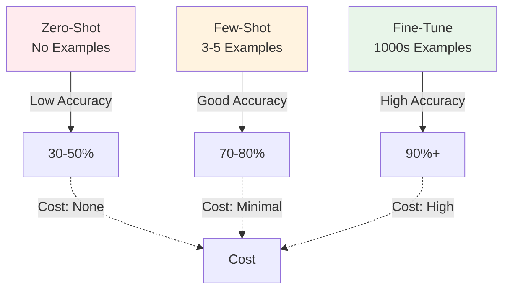
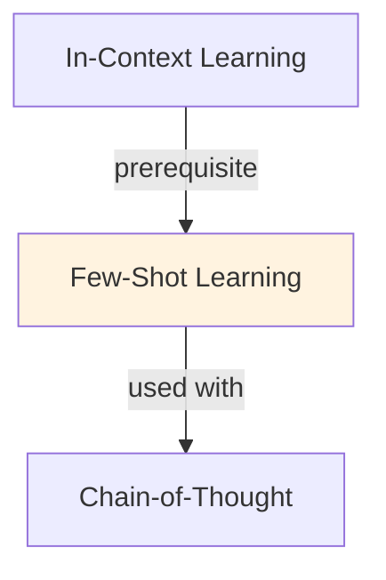

# Few-Shot Learning

## Understanding Few-Shot Learning: Learning from Minimal Examples

Few-shot learning leverages a fundamental insight about large language models: they possess latent knowledge of diverse tasks and can adapt to new tasks using minimal examples provided as context. Rather than fine-tuning on thousands of examples, few-shot learning provides 3-10 demonstration examples directly in the prompt, allowing the model to infer the task structure and apply it to new inputs. This approach requires zero parameter updates and works immediately.

The mechanism underlying few-shot learning is in-context learning—the model's ability to recognize patterns from demonstrations and apply them to novel inputs without changing its weights. The effectiveness of few-shot learning depends critically on example quality, diversity, and ordering. Well-chosen examples that span the task space enable models to achieve 70-85% of fine-tuned performance while requiring no training whatsoever, making it ideal for rapid prototyping and dynamic task adaptation.

The trade-offs are straightforward: few-shot learning eliminates training time and infrastructure costs but uses more tokens in the prompt (increasing latency and API costs) and typically achieves 10-15% lower accuracy than fine-tuning on equivalent data. For tasks where quick customization, minimal latency overhead, or frequent task switching is important, few-shot learning often provides the best cost-benefit ratio. For production systems demanding maximum accuracy, fine-tuning remains superior.

Practical guidance for few-shot prompt design: (1) Include diverse examples spanning the input space, (2) Place harder examples later to benefit from model warm-up, (3) Use explanations and reasoning steps for complex tasks, (4) Ensure example formatting exactly matches the test input format, (5) Optimize the number of examples (often 3-5 suffice; diminishing returns appear around 10 examples). These techniques consistently improve few-shot performance by 5-15% over naive prompt design.

## Core Intuition
Humans learn fast from examples: show one translation, they get the pattern. Few-shot leverages LLMs' ability to recognize patterns from in-context examples. No weight updates needed.

## How It Works

**Structure:**
```
Task instruction (optional but helps)
Example 1: Input → Output
Example 2: Input → Output
Example 3: Input → Output
New input → [Model generates]
```

**Example: Sentiment Classification**
```
Classify sentiment (positive/negative):

Text: "I loved this movie!" → Sentiment: positive
Text: "Terrible experience." → Sentiment: negative
Text: "It was okay." → Sentiment: neutral

Text: "Amazing product, highly recommend!"
Sentiment:
```

**Effective Strategies:**
- **Diversity:** Mix different examples (long/short, obvious/subtle)
- **Order:** Put harder examples later (model performs better with warm-up)
- **Similarity:** Examples similar to test case → better few-shot performance
- **Explanations:** Include reasoning in examples (especially for complex tasks)

### Workflow Flowchart



## Key Properties / Trade-offs

| Shots | Examples | Latency | Accuracy | Best For |
|-------|----------|---------|----------|----------|
| Zero | 0 | Fast | Lower | Simple tasks, general |
| One | 1 | Fast | Medium | Basic patterns |
| Few | 3-5 | Medium | High | Most use cases |
| Many | 10+ | Slow | Marginal gain | Complex, nuanced |

**Diminishing returns:** Typically 3-5 examples sufficient; 20+ shows little improvement.

## Common Mistakes / Gotchas

- **Bad example selection:** Unrepresentative or wrong examples confuse model. Choose carefully.
- **Too many examples:** Exceeds context window, dilutes signal. Sweet spot: 3-10.
- **No instructions:** Only examples, no task description. Add instruction for clarity.
- **Inconsistent formats:** If examples vary in format, model confused. Be consistent.

## Code Example

```python
from anthropic import Anthropic

client = Anthropic()

# Few-shot prompt
prompt = """Classify sentiment (positive, negative, neutral):

Examples:
"I love this product!" → positive
"Waste of money" → negative
"It works fine" → neutral

Now classify: "This is amazing!"
Sentiment:"""

response = client.messages.create(
    model="claude-3-5-sonnet-20241022",
    max_tokens=50,
    messages=[{"role": "user", "content": prompt}]
)
print(response.content[0].text)
```

## Interview Quick-Reference

| Question | What to say |
|---|---|
| "Few-shot?" | Show examples in prompt to teach task. 3-5 examples typical. Fast, no fine-tuning. |
| "vs fine-tuning?" | Few-shot: instant, flexible. Fine-tuning: better accuracy, requires data/compute. |
| "How many examples?" | 3-5 for most tasks. More helps complex tasks; diminishing returns >10. |
| "Bad performance?" | Check example quality and diversity. Adjust format, add instructions. |

## Real-World Examples

### Few-Shot for Customer Intent Classification
Chatbot: classify support tickets. Examples: 'Refund request' → returns, 'Can't login' → technical, 'Feedback' → general. Zero-shot: 45% accuracy. Few-shot (3 examples): 72% accuracy. Deployed in Zendesk integration.

### Few-Shot Semantic Matching
Task: match product descriptions to categories. Descriptions vary (informal, typos, abbreviations). Few-shot with diverse examples: 88% accuracy. Cost: <$0.01 per classification vs. $0.50 with fine-tuning.

### Multi-Language Few-Shot
Translate task instructions to 10 languages. Few-shot examples in each language. Model generalizes zero-shot to other languages through few-shot anchoring. Accuracy: 75% (vs 40% direct translation).

## Real-World Examples

### Few-Shot for Customer Intent Classification
Chatbot: classify support tickets. Examples: 'Refund request' → returns, 'Can't login' → technical, 'Feedback' → general. Zero-shot: 45% accuracy. Few-shot (3 examples): 72% accuracy. Deployed in Zendesk integration.

### Few-Shot Semantic Matching
Task: match product descriptions to categories. Descriptions vary (informal, typos, abbreviations). Few-shot with diverse examples: 88% accuracy. Cost: <$0.01 per classification vs. $0.50 with fine-tuning.

### Multi-Language Few-Shot
Translate task instructions to 10 languages. Few-shot examples in each language. Model generalizes zero-shot to other languages through few-shot anchoring. Accuracy: 75% (vs 40% direct translation).

## Real-World Examples

### Few-Shot for Customer Intent Classification
Chatbot: classify support tickets. Examples: 'Refund request' → returns, 'Can't login' → technical, 'Feedback' → general. Zero-shot: 45% accuracy. Few-shot (3 examples): 72% accuracy. Deployed in Zendesk integration.

### Few-Shot Semantic Matching
Task: match product descriptions to categories. Descriptions vary (informal, typos, abbreviations). Few-shot with diverse examples: 88% accuracy. Cost: <$0.01 per classification vs. $0.50 with fine-tuning.

### Multi-Language Few-Shot
Translate task instructions to 10 languages. Few-shot examples in each language. Model generalizes zero-shot to other languages through few-shot anchoring. Accuracy: 75% (vs 40% direct translation).

## Real-World Examples

### Few-Shot for Customer Intent Classification
Chatbot: classify support tickets. Examples: 'Refund request' → returns, 'Can't login' → technical, 'Feedback' → general. Zero-shot: 45% accuracy. Few-shot (3 examples): 72% accuracy. Deployed in Zendesk integration.

### Few-Shot Semantic Matching
Task: match product descriptions to categories. Descriptions vary (informal, typos, abbreviations). Few-shot with diverse examples: 88% accuracy. Cost: <$0.01 per classification vs. $0.50 with fine-tuning.

### Multi-Language Few-Shot
Translate task instructions to 10 languages. Few-shot examples in each language. Model generalizes zero-shot to other languages through few-shot anchoring. Accuracy: 75% (vs 40% direct translation).

## Real-World Examples

### Few-Shot for Customer Intent Classification
Chatbot: classify support tickets. Examples: 'Refund request' → returns, 'Can't login' → technical, 'Feedback' → general. Zero-shot: 45% accuracy. Few-shot (3 examples): 72% accuracy. Deployed in Zendesk integration.

### Few-Shot Semantic Matching
Task: match product descriptions to categories. Descriptions vary (informal, typos, abbreviations). Few-shot with diverse examples: 88% accuracy. Cost: <$0.01 per classification vs. $0.50 with fine-tuning.

### Multi-Language Few-Shot
Translate task instructions to 10 languages. Few-shot examples in each language. Model generalizes zero-shot to other languages through few-shot anchoring. Accuracy: 75% (vs 40% direct translation).

## Interview Q&A

**Q: How many few-shot examples are optimal and how do you decide?**
A: More examples generally improve performance up to a point (diminishing returns after 8-16 examples for most tasks). But each example consumes context window tokens and adds latency. Test with 1, 3, 5, 8 examples on your eval set. For LLMs >10B, 3-5 examples typically captures most of the benefit. For complex tasks requiring diverse coverage, 8-16 may be better. When context is limited (e.g., long user inputs), prioritize quality over quantity—2 excellent examples > 8 mediocre ones.

**Q: How do you select which examples to include in few-shot prompts?**
A: Strategies in increasing sophistication: (1) random selection from a pool of curated examples; (2) diverse selection—cover different sub-types of the task; (3) similarity-based—retrieve examples most similar to the query using embedding search (dynamic few-shot); (4) hard example selection—prefer examples similar to cases the model struggles on. Dynamic few-shot (embedding retrieval) typically improves accuracy 5-15% over static examples for tasks with diverse inputs.

**Q: What is the difference between few-shot prompting and in-context learning?**
A: Few-shot prompting is a specific technique: provide examples in the prompt. In-context learning is the broader phenomenon: LLMs can learn new patterns from information in the context window without gradient updates. ICL includes few-shot examples but also single demonstrations, analogy-based reasoning, and task descriptions. The mechanism is debated—models may do implicit gradient-based learning in the forward pass, or they may use examples to identify the task distribution.

**Q: Why do example ordering and formatting matter in few-shot prompts?**
A: Recency bias: the model pays more attention to the last few examples before the query. Distributional skew: if early examples are all one class, the model may bias toward it. Consistent formatting across examples helps the model identify the pattern. Always ensure the final few examples before the query reflect the diversity you want in outputs. Randomizing example order and testing on multiple orderings gives a more robust evaluation.

**Q: When does few-shot prompting fail and what should you do instead?**
A: Fails when: the task requires knowledge the model doesn't have (no amount of examples helps); the format is so unusual that examples confuse rather than guide; or examples cover only a narrow slice of the actual input distribution. In these cases: fine-tune on domain data, use retrieval-augmented generation to provide factual context, or decompose the task into simpler subtasks that the model can handle individually.

**Q: How do you measure if your few-shot examples are actually helping?**
A: Compare: zero-shot performance vs. your few-shot configuration on a held-out eval set. If few-shot doesn't beat zero-shot by >5%, your examples may not be well-chosen. Run ablations: remove one example at a time and see which ones contribute most. Use leave-one-out cross-validation across your example pool. Track performance vs. number of examples to find the sweet spot for your context budget.


## Related Topics
- [In-Context Learning](15-in-context-learning.md) — broader ICL concept
- [Zero-Shot Learning](14-zero-shot-learning.md) — no examples, just instructions
- [Chain-of-Thought](16-chain-of-thought.md) — combine CoT with few-shot for better reasoning

## Resources
- [In-Context Learning in Large Language Models](https://arxiv.org/abs/2301.00234)
- [What In-Context Learning "Learns"](https://arxiv.org/abs/2310.00867)

## Concept Relationships



## Interview Questions

**Q: What's few-shot learning and how does it differ from zero-shot?**
*A: Zero-shot: 'Classify sentiment: positive/negative'. Few-shot: '"Good product" → positive. "Bad product" → negative. "Good quality" → positive. Now classify: "Great service"'. Few-shot dramatically improves accuracy (sometimes 30-50% gain).*

**Q: How many examples do you need for effective few-shot?**
*A: Task-dependent: simple classification = 1-2 examples sufficient. Complex reasoning = 5-10 needed. Diminishing returns beyond 10 (20+ shows minimal improvement). Rule of thumb: start with 3, increase if accuracy low. Quality > quantity (good examples matter more than many).*

**Q: What makes a good few-shot example?**
*A: Diverse: cover range of inputs (easy + hard cases). Representative: similar to test distribution. Explained: include reasoning if helpful. Consistent: same format for all. Bad: unrepresentative or noisy examples confuse model.*

**Q: How do you select few-shot examples programmatically?**
*A: Random: simple, sometimes okay. Similarity-based: choose examples most similar to test input (use embeddings). Uncertainty sampling: examples model uncertain on. Diversity-based: examples covering feature space. Best: combination of similarity + diversity.*

**Q: When is few-shot insufficient and you need fine-tuning?**
*A: Few-shot works: general tasks, simple patterns, prompt-able behaviors. Fails: task requires significant internal model change, distribution shift, style transfer. Example: sentiment classification (few-shot fine) vs. writing style adaptation (needs fine-tuning).*