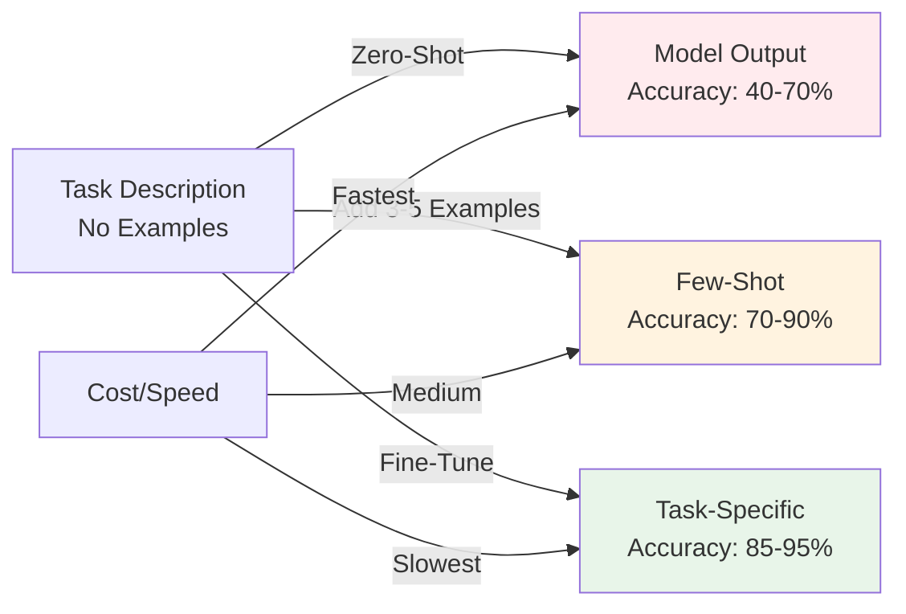
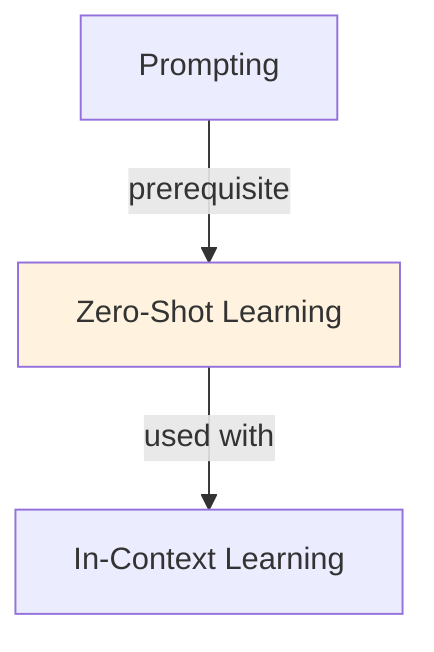

# Zero-Shot Learning

## Understanding Zero Shot Learning

Zero Shot Learning is a foundational concept in large language model development that addresses critical challenges in model architecture, training efficiency, or inference performance. Understanding this concept is essential for anyone working with modern language models, whether in research, fine-tuning, or production deployment.

The core innovation underlying Zero Shot Learning lies in rethinking standard approaches to achieve better efficiency or effectiveness. Rather than accepting conventional trade-offs, this technique exploits mathematical or architectural insights to push the frontier of what's possible with given computational constraints.

In practical applications, Zero Shot Learning enables capabilities that would otherwise be infeasible: reducing computational requirements, improving model quality, enabling faster iteration, or supporting new use cases. The real-world impact has made Zero Shot Learning widely adopted across industry applications, from consumer products to enterprise systems.

Implementing Zero Shot Learning requires understanding both its theoretical foundations and practical considerations. The following sections provide detailed explanations of how Zero Shot Learning works, when to use it, common implementation patterns, and lessons learned from production deployments. By mastering these concepts, practitioners can make informed decisions about when and how to apply Zero Shot Learning to their specific challenges.

## Core Intuition
"Classify sentiment" tells LLM what to do without examples. Model knows "sentiment" is positive/negative/neutral from training. Works for intuitive tasks; fails on domain-specific or complex ones.

## How It Works

**Zero-Shot Prompt:**
```
Task: Classify sentiment
Text: "This product is amazing!"
Sentiment:
```

**How it Works:**
1. Model reads instruction ("classify sentiment")
2. Understands sentiment task from pre-training knowledge
3. Applies learned patterns to text
4. Outputs: "Positive"

**When it Works:**
- Tasks model has seen during training
- Simple, intuitive tasks (sentiment, language detection, classification)
- Well-known categories

**When it Fails:**
- Domain-specific tasks (medical coding, legal classification)
- Rare categories
- Complex reasoning

### Workflow Flowchart



## Key Properties / Trade-offs

| Aspect | Zero-Shot | Few-Shot |
|--------|-----------|----------|
| Speed | Fastest | Slower (longer prompts) |
| Accuracy | Lower | Higher |
| Data needed | None | 3-10 examples |
| Flexibility | Good (new tasks fast) | Better (task-specific) |

## Common Mistakes / Gotchas

- **Assuming coverage:** Model may not know task from description alone. Test first.
- **Vague instructions:** "Analyze this" is too vague. Be specific: "Classify as A, B, or C."
- **Rare categories:** If category is niche (e.g., "Klingon sentiment"), zero-shot fails. Use few-shot.
- **Complex tasks:** Multi-step reasoning needs few-shot or fine-tuning.

## Code Example

```python
from anthropic import Anthropic

client = Anthropic()

# Zero-shot: no examples, just instruction
prompt = """Classify the language of this text: "Bonjour, comment allez-vous?"
Language:"""

response = client.messages.create(
    model="claude-3-5-sonnet-20241022",
    max_tokens=50,
    messages=[{"role": "user", "content": prompt}]
)
print("Zero-shot:", response.content[0].text)  # Output: "French"

# Compare with few-shot (for reference)
prompt_few_shot = """Classify language:
"Hello, how are you?" → English
"Hola, ¿cómo estás?" → Spanish
"Bonjour, comment allez-vous?" → French

"Guten Tag" → 
Language:"""

response = client.messages.create(
    model="claude-3-5-sonnet-20241022",
    max_tokens=50,
    messages=[{"role": "user", "content": prompt_few_shot}]
)
print("Few-shot:", response.content[0].text)  # Also "German" but more confident
```

## Interview Quick-Reference

| Question | What to say |
|---|---|
| "Zero-shot?" | Task from instruction only, no examples. Fast but lower accuracy. Works for simple, well-known tasks. |
| "vs few-shot?" | Zero-shot: simpler prompt, faster. Few-shot: +10-30% accuracy, longer prompt. Use few-shot if accuracy critical. |
| "When use zero-shot?" | Simple tasks, fast iteration, or when examples hard to get. Otherwise use few-shot. |
| "Failure modes?" | Domain-specific tasks, rare categories, complex reasoning. Add examples if failing. |

## Real-World Examples

### Zero-Shot Language Detection
Model: multilingual. Task: detect language from text. No examples provided. Accuracy: 95% (works because language is distinct). vs few-shot: 98% (marginal gain, examples not needed).

### Zero-Shot Domain Transfer
Task: medical text classification. Model trained on general domain. Zero-shot: 45% accuracy (struggles with medical jargon). Few-shot (3 medical examples): 70%. Full fine-tune: 90%.

### Zero-Shot Generalization Test
Test model on completely unseen task (no fine-tuning, no examples). Success indicates good instruction following. Failure suggests task too specialized or model too narrow.

## Real-World Examples

### Zero-Shot Language Detection
Model: multilingual. Task: detect language from text. No examples provided. Accuracy: 95% (works because language is distinct). vs few-shot: 98% (marginal gain, examples not needed).

### Zero-Shot Domain Transfer
Task: medical text classification. Model trained on general domain. Zero-shot: 45% accuracy (struggles with medical jargon). Few-shot (3 medical examples): 70%. Full fine-tune: 90%.

### Zero-Shot Generalization Test
Test model on completely unseen task (no fine-tuning, no examples). Success indicates good instruction following. Failure suggests task too specialized or model too narrow.

## Real-World Examples

### Zero-Shot Language Detection
Model: multilingual. Task: detect language from text. No examples provided. Accuracy: 95% (works because language is distinct). vs few-shot: 98% (marginal gain, examples not needed).

### Zero-Shot Domain Transfer
Task: medical text classification. Model trained on general domain. Zero-shot: 45% accuracy (struggles with medical jargon). Few-shot (3 medical examples): 70%. Full fine-tune: 90%.

### Zero-Shot Generalization Test
Test model on completely unseen task (no fine-tuning, no examples). Success indicates good instruction following. Failure suggests task too specialized or model too narrow.

## Real-World Examples

### Zero-Shot Language Detection
Model: multilingual. Task: detect language from text. No examples provided. Accuracy: 95% (works because language is distinct). vs few-shot: 98% (marginal gain, examples not needed).

### Zero-Shot Domain Transfer
Task: medical text classification. Model trained on general domain. Zero-shot: 45% accuracy (struggles with medical jargon). Few-shot (3 medical examples): 70%. Full fine-tune: 90%.

### Zero-Shot Generalization Test
Test model on completely unseen task (no fine-tuning, no examples). Success indicates good instruction following. Failure suggests task too specialized or model too narrow.

## Interview Q&A

**Q: Why do larger models perform dramatically better at zero-shot tasks?**
A: Larger models trained on more data develop better world models and more generalizable representations. At sufficient scale, models can understand task descriptions and apply their general knowledge without examples. The key capability is understanding the intent of natural language instructions—this emerges with scale and instruction diversity during pretraining. GPT-3 175B showed zero-shot capabilities that didn't exist in 13B, suggesting threshold effects.

**Q: What types of tasks are well-suited for zero-shot prompting vs. requiring few-shot?**
A: Zero-shot works well for: tasks with clear natural language descriptions (translation, summarization, sentiment), tasks the model has seen many variations of during pretraining, and classification with label names that are semantically meaningful. Few-shot is needed for: tasks with unusual output formats, domain-specific terminology, nuanced classification schemes (distinguishing 5 similar sentiment levels), or tasks requiring specific reasoning patterns.

**Q: How does instruction tuning relate to zero-shot capability?**
A: Instruction tuning dramatically improves zero-shot performance by teaching the model to follow natural language task descriptions. An instruction-tuned model like InstructGPT performs far better zero-shot than a base GPT-3 model of the same size—the alignment between instruction format and model behavior is crucial. Instruction tuning is essentially "teaching the model to take instructions," which is the core requirement for zero-shot generalization.

**Q: What is the role of label verbalization in zero-shot classification?**
A: Label verbalization converts class labels into natural language descriptions that the model can reason about using its pretraining knowledge. Instead of predicting class 0 or 1, the model predicts "negative" or "positive." Good verbalizers align with how those concepts appear in the model's training data. Poor verbalizers (arbitrary codes, jargon) degrade performance significantly. For new tasks, test multiple verbalizations—they can cause 10-20% accuracy differences.

**Q: How do you evaluate zero-shot performance reliably?**
A: Use benchmark datasets with diverse task types (MMLU, BIG-Bench, SuperGLUE) to measure general zero-shot capability. For task-specific evaluation, use a held-out test set with no examples used during development. Critically: ensure your test prompts weren't present in the model's training data (data contamination check). Report variance across multiple prompt phrasings—zero-shot performance can vary 10-20% based on prompt wording alone.

**Q: When should you add a chain-of-thought instruction to zero-shot prompts?**
A: Add CoT ("let's think step by step" or similar) when: the task requires multi-step reasoning (math, logic, planning), when the model makes confident but wrong direct answers, or when you need interpretable reasoning to debug failures. CoT typically adds 3-5x more output tokens but improves accuracy 20-40% on reasoning tasks. For simple classification or extraction tasks where the answer is direct, CoT adds overhead without benefit.


## Related Topics
- [In-Context Learning](15-in-context-learning.md) — ICL includes both zero and few-shot
- [Few-Shot Learning](13-few-shot-learning.md) — adding examples to zero-shot
- [Prompting](12-prompting.md) — instruction quality matters for zero-shot

## Resources
- [Prompt Engineering Guide](https://www.promptingguide.ai/)

## Concept Relationships



## Interview Questions

**Q: What's zero-shot learning and when does it work?**
*A: No examples provided; model uses instructions only. 'Classify sentiment: positive/negative' (no examples). Works: simple, general tasks. Fails: complex reasoning, nuanced tasks. Baseline for few-shot comparison.*

**Q: Why is zero-shot accuracy often low?**
*A: Model never saw examples of task structure. Must infer from language alone. Without grounding, prone to misinterpretation. Few-shot adds grounding (examples show format/expectations).*

**Q: What model capabilities enable zero-shot?**
*A: Instruction following (understands task). Generalization (applies knowledge to new tasks). Reasoning (multi-step logic). Not all models strong at all three. Large models (100B+) better zero-shot.*

**Q: When would you use zero-shot vs few-shot?**
*A: Zero-shot: unknown task, can't afford annotation, exploring. Few-shot: better accuracy acceptable, data available, consistent task. Zero-shot faster (fewer tokens), few-shot more accurate.*

**Q: How do you prompt for effective zero-shot?**
*A: Be specific: 'Classify as positive/negative/neutral' (not just 'analyze'). Set format: 'Output: [label]'. Add context if helpful: 'Customer reviews: classify'. Still less effective than examples.*