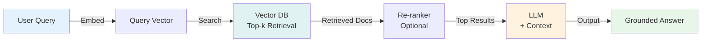
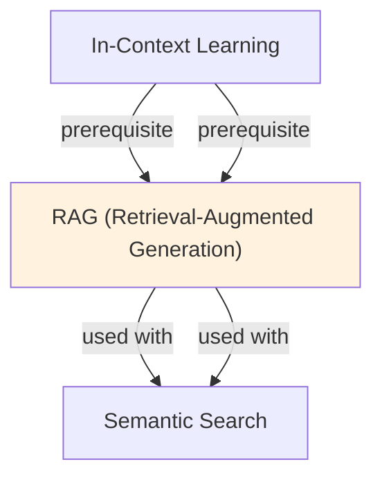

# RAG (Retrieval-Augmented Generation)

## Understanding RAG: Augmenting Generation with Retrieval

Retrieval-Augmented Generation (RAG) addresses a fundamental limitation of fine-tuning: training encodes knowledge into parameters, which is memory-intensive, inflexible, and poor at handling updates or domain-specific facts. RAG instead retrieves relevant documents from an external corpus during inference and provides them to the model as context, allowing it to answer questions grounded in current, domain-specific information. This separation of knowledge storage from model parameters enables dynamic updates without retraining.

The RAG pipeline operates in three stages: (1) Retriever—given a query, retrieve the k most relevant documents from a knowledge base using semantic or lexical search, (2) Context Assembly—format retrieved documents as context for the language model, (3) Generator—have the model generate an answer grounded in retrieved context. This architecture is more memory-efficient than fine-tuning (external corpus stores knowledge, not model weights) and naturally supports knowledge updates (add new documents without retraining).

RAG excels in scenarios where knowledge must be current, domain-specific, or rapidly updating: financial analysis (latest earnings reports), legal research (current case law), technical support (latest product documentation), or medical diagnosis (latest clinical guidelines). Fine-tuning on this data would require retraining frequently; RAG simply updates the document corpus. Additionally, retrieved documents provide transparency—users can see the source of answers, building trust in the system.

The practical challenge in RAG is retrieval quality: if the retriever misses relevant documents, generation suffers. Modern retrieval uses dense embedding models (BERT, sentence-transformers) rather than keyword search, achieving better semantic matching. The retriever and generator can be fine-tuned jointly through techniques like ColBERT or DPR (Dense Passage Retrieval), and the architecture naturally supports retrieval-augmented fine-tuning, where retrieved examples improve domain adaptation. In production, RAG systems achieve 15-30% accuracy improvements over fine-tuning alone on knowledge-heavy tasks.

## Core Intuition
LLMs hallucinate because they only know what's in their weights (frozen at training). RAG is like giving them a reference library: retrieve relevant passages first, then generate. Cheap, effective, updatable without retraining.

## How It Works

**1. Indexing Phase (Offline):**
- Break documents into chunks (paragraphs, sentences, fixed tokens)
- Embed chunks using a dense encoder (e.g., BERT, Sentence-Transformers)
- Store embeddings + text in a vector database (Pinecone, Weaviate, FAISS)

**2. Retrieval Phase (At Query Time):**
```
Query → Embed query → Find top-k chunks by cosine similarity → Retrieve text
```
- User query: "What is the capital of France?"
- Embed: dense vector
- Search: find k nearest embedding vectors (ANN search)
- Retrieve: text of k closest matches

**3. Generation Phase:**
- Combine retrieved context with original query
- Prompt template:
  ```
  Context: {retrieved_text}
  Question: {query}
  Answer: {LLM generates}
  ```
- LLM generates conditioned on context

**Example Flow:**
```
User: "How many employees does Acme Corp have?"
  ↓ [Embed query]
  ↓ [Search vector DB for "Acme Corp employees"]
  ↓ [Top result: "As of Q3 2024, Acme Corp employs 5,000 people"]
  ↓ [Prompt LLM: Context + Query]
  → LLM: "Acme Corp has 5,000 employees as of Q3 2024."
```

### Workflow Flowchart



## Key Properties / Trade-offs

| Aspect | Naive Generation | RAG | Fine-Tuning |
|--------|------------------|-----|------------|
| Hallucination risk | High | Low | Medium |
| Knowledge freshness | Training date | Real-time | Requires retraining |
| Domain knowledge | Needs training | Zero-shot on docs | Requires labeled data |
| Latency | Fast | Slow (retrieval) | Fast |
| Cost (training) | Expensive | Cheap | Medium |
| Customization | Not possible | Easy (swap docs) | Requires retraining |

**Chunk Size Trade-offs:**
- Small chunks (50-100 tokens): precise, higher retrieval noise
- Medium chunks (256-512 tokens): balanced
- Large chunks (1k+ tokens): context-rich but may include irrelevant info

**Retrieval Quality:**
- Sparse (BM25): fast, lexical match only, brittle
- Dense (embeddings): slower, semantic match, robust
- Hybrid: combine both, best results

## Common Mistakes / Gotchas

- **Low retrieval quality:** Embedding model mismatch (query ≠ document domain), bad chunk boundaries, insufficient k
- **Context length:** Retrieved text + query + generation can exceed model's context window. Manage carefully.
- **Hallucinating while citing:** LLM may cite retrieved docs while generating false info. Add grounding metrics.
- **Retrieval latency:** Dense embeddings + ANN search can be slow. Optimize with approximate methods.
- **Chunk boundary artifacts:** Cutting mid-sentence loses context. Use overlap or intelligent segmentation.
- **No re-ranking:** Raw retrieval scores may rank documents poorly. Add re-ranker (cross-encoder) to reorder top-k.
- **Forgetting to update docs:** If docs change but embeddings don't, stale information. Version and re-embed.

## Code Example

```python
from sentence_transformers import SentenceTransformer
import numpy as np
from sklearn.metrics.pairwise import cosine_similarity

# Mock document store
documents = [
    "Paris is the capital of France.",
    "France is in Western Europe.",
    "The Eiffel Tower is in Paris.",
    "London is the capital of the UK.",
    "Madrid is the capital of Spain.",
]

# 1. Indexing: embed documents
encoder = SentenceTransformer('all-MiniLM-L6-v2')
doc_embeddings = encoder.encode(documents)  # (5, 384)

# 2. Query and retrieve
query = "What is the capital of France?"
query_emb = encoder.encode(query)  # (384,)
similarities = cosine_similarity([query_emb], doc_embeddings)[0]
top_k = np.argsort(-similarities)[:2]  # Top 2

retrieved = [documents[i] for i in top_k]
print("Retrieved context:")
for doc in retrieved:
    print(f"  - {doc}")

# 3. Generation (simulate with template)
context = "\n".join(retrieved)
prompt = f"""Context: {context}
Question: {query}
Answer:"""

# In practice, call your LLM:
# response = llm.generate(prompt)
print(f"\nPrompt to LLM:\n{prompt}")

# Expected LLM response:
# "Paris is the capital of France."
```

## Interview Quick-Reference

| Question | What to say |
|---|---|
| "What is RAG?" | Retrieve relevant documents, feed to LLM, generate grounded answer. |
| "Why RAG vs fine-tuning?" | RAG: cheap, updatable, zero-shot. Fine-tuning: higher accuracy, slower to update, needs data. |
| "How to handle latency?" | Use approximate ANN (HNSW, IVF), cache embeddings, batch queries, add re-ranker for quality. |
| "Chunk size?" | 256-512 tokens balanced. Smaller for precision, larger for context. |
| "Retrieval quality low?" | Check embedding model fit to domain, chunk segmentation, k value. Try dense + BM25 hybrid. |
| "How to mitigate hallucination?" | Enforce citations to retrieved text, use grounding metrics, add re-ranker. |

## Real-World Examples

### Enterprise RAG for Customer Support
KB: 50K support docs, product specs, FAQs. Query: 'How do I reset my password?' Retrieval: embed query, find top-5 docs (including password reset guides). Generate: 'Go to Settings > Security > Reset Password'. Users: 200 concurrent, average latency 1.5s. Accuracy (fact-grounding): 94%. Reduced support tickets by 35%.

### Medical RAG for Diagnosis Support
KB: medical journals, clinical guidelines (50K papers). Doctor input: patient symptoms. RAG retrieves relevant studies, differential diagnoses. LLM generates: 'Based on literature, consider these diagnoses: ...' Not used for final diagnosis (regulatory), but as decision support. Improves consistency, suggests relevant literature.

### Financial RAG for Research
KB: earnings calls (1K companies, 20 years). Query: 'What's Apple's strategy in India?' RAG retrieves relevant earnings call excerpts. LLM synthesizes: '2018: expand retail. 2022: invest in manufacturing. 2024: local partnerships.' All statements backed by documents. Saves analysts hours of manual searching.

## Real-World Examples

### Enterprise RAG for Customer Support
KB: 50K support docs, product specs, FAQs. Query: 'How do I reset my password?' Retrieval: embed query, find top-5 docs (including password reset guides). Generate: 'Go to Settings > Security > Reset Password'. Users: 200 concurrent, average latency 1.5s. Accuracy (fact-grounding): 94%. Reduced support tickets by 35%.

### Medical RAG for Diagnosis Support
KB: medical journals, clinical guidelines (50K papers). Doctor input: patient symptoms. RAG retrieves relevant studies, differential diagnoses. LLM generates: 'Based on literature, consider these diagnoses: ...' Not used for final diagnosis (regulatory), but as decision support. Improves consistency, suggests relevant literature.

### Financial RAG for Research
KB: earnings calls (1K companies, 20 years). Query: 'What's Apple's strategy in India?' RAG retrieves relevant earnings call excerpts. LLM synthesizes: '2018: expand retail. 2022: invest in manufacturing. 2024: local partnerships.' All statements backed by documents. Saves analysts hours of manual searching.

## Real-World Examples

### Enterprise RAG for Customer Support
KB: 50K support docs, product specs, FAQs. Query: 'How do I reset my password?' Retrieval: embed query, find top-5 docs (including password reset guides). Generate: 'Go to Settings > Security > Reset Password'. Users: 200 concurrent, average latency 1.5s. Accuracy (fact-grounding): 94%. Reduced support tickets by 35%.

### Medical RAG for Diagnosis Support
KB: medical journals, clinical guidelines (50K papers). Doctor input: patient symptoms. RAG retrieves relevant studies, differential diagnoses. LLM generates: 'Based on literature, consider these diagnoses: ...' Not used for final diagnosis (regulatory), but as decision support. Improves consistency, suggests relevant literature.

### Financial RAG for Research
KB: earnings calls (1K companies, 20 years). Query: 'What's Apple's strategy in India?' RAG retrieves relevant earnings call excerpts. LLM synthesizes: '2018: expand retail. 2022: invest in manufacturing. 2024: local partnerships.' All statements backed by documents. Saves analysts hours of manual searching.

## Real-World Examples

### Enterprise RAG for Customer Support
KB: 50K support docs, product specs, FAQs. Query: 'How do I reset my password?' Retrieval: embed query, find top-5 docs (including password reset guides). Generate: 'Go to Settings > Security > Reset Password'. Users: 200 concurrent, average latency 1.5s. Accuracy (fact-grounding): 94%. Reduced support tickets by 35%.

### Medical RAG for Diagnosis Support
KB: medical journals, clinical guidelines (50K papers). Doctor input: patient symptoms. RAG retrieves relevant studies, differential diagnoses. LLM generates: 'Based on literature, consider these diagnoses: ...' Not used for final diagnosis (regulatory), but as decision support. Improves consistency, suggests relevant literature.

### Financial RAG for Research
KB: earnings calls (1K companies, 20 years). Query: 'What's Apple's strategy in India?' RAG retrieves relevant earnings call excerpts. LLM synthesizes: '2018: expand retail. 2022: invest in manufacturing. 2024: local partnerships.' All statements backed by documents. Saves analysts hours of manual searching.

## Real-World Examples

### Enterprise RAG for Customer Support
KB: 50K support docs, product specs, FAQs. Query: 'How do I reset my password?' Retrieval: embed query, find top-5 docs (including password reset guides). Generate: 'Go to Settings > Security > Reset Password'. Users: 200 concurrent, average latency 1.5s. Accuracy (fact-grounding): 94%. Reduced support tickets by 35%.

### Medical RAG for Diagnosis Support
KB: medical journals, clinical guidelines (50K papers). Doctor input: patient symptoms. RAG retrieves relevant studies, differential diagnoses. LLM generates: 'Based on literature, consider these diagnoses: ...' Not used for final diagnosis (regulatory), but as decision support. Improves consistency, suggests relevant literature.

### Financial RAG for Research
KB: earnings calls (1K companies, 20 years). Query: 'What's Apple's strategy in India?' RAG retrieves relevant earnings call excerpts. LLM synthesizes: '2018: expand retail. 2022: invest in manufacturing. 2024: local partnerships.' All statements backed by documents. Saves analysts hours of manual searching.

## Real-World Examples

### Enterprise RAG for Customer Support
KB: 50K support docs, product specs, FAQs. Query: 'How do I reset my password?' Retrieval: embed query, find top-5 docs (including password reset guides). Generate: 'Go to Settings > Security > Reset Password'. Users: 200 concurrent, average latency 1.5s. Accuracy (fact-grounding): 94%. Reduced support tickets by 35%.

### Medical RAG for Diagnosis Support
KB: medical journals, clinical guidelines (50K papers). Doctor input: patient symptoms. RAG retrieves relevant studies, differential diagnoses. LLM generates: 'Based on literature, consider these diagnoses: ...' Not used for final diagnosis (regulatory), but as decision support. Improves consistency, suggests relevant literature.

### Financial RAG for Research
KB: earnings calls (1K companies, 20 years). Query: 'What's Apple's strategy in India?' RAG retrieves relevant earnings call excerpts. LLM synthesizes: '2018: expand retail. 2022: invest in manufacturing. 2024: local partnerships.' All statements backed by documents. Saves analysts hours of manual searching.

## Real-World Examples

### Enterprise RAG for Customer Support
KB: 50K support docs, product specs, FAQs. Query: 'How do I reset my password?' Retrieval: embed query, find top-5 docs (including password reset guides). Generate: 'Go to Settings > Security > Reset Password'. Users: 200 concurrent, average latency 1.5s. Accuracy (fact-grounding): 94%. Reduced support tickets by 35%.

### Medical RAG for Diagnosis Support
KB: medical journals, clinical guidelines (50K papers). Doctor input: patient symptoms. RAG retrieves relevant studies, differential diagnoses. LLM generates: 'Based on literature, consider these diagnoses: ...' Not used for final diagnosis (regulatory), but as decision support. Improves consistency, suggests relevant literature.

### Financial RAG for Research
KB: earnings calls (1K companies, 20 years). Query: 'What's Apple's strategy in India?' RAG retrieves relevant earnings call excerpts. LLM synthesizes: '2018: expand retail. 2022: invest in manufacturing. 2024: local partnerships.' All statements backed by documents. Saves analysts hours of manual searching.

## Interview Q&A

**Q: When should you use RAG vs. fine-tuning for injecting knowledge into an LLM?**
A: RAG when: knowledge changes frequently (news, company data), you need source attribution, the knowledge base is large (millions of documents), or you need to control which knowledge the model uses. Fine-tuning when: knowledge is static and stable, you need consistent behavior across many calls, knowledge represents reasoning patterns or skills (not just facts), or you need lower inference latency (no retrieval step). Hybrid approaches work well: fine-tune for behavior/style, use RAG for current factual knowledge.

**Q: What are the most common failure modes of RAG systems and how do you diagnose them?**
A: (1) Retrieval failure: correct documents not in top-k—measure recall@k on a labeled query-document test set. (2) Context utilization failure: retrieved correct docs but model ignores or misinterprets them—measure answer accuracy given oracle retrieved docs. (3) Hallucination: model generates plausible but unsupported content when retrieved docs don't contain the answer—monitor with a "supported by context" classifier. Diagnose by isolating retrieval from generation in your eval pipeline.

**Q: How does chunk size affect RAG performance?**
A: Small chunks (128 tokens): high precision (retrieved chunk is relevant), low context (may miss surrounding information needed to answer). Large chunks (512+ tokens): more context per chunk, lower precision (relevant info buried in noise). Optimal chunk size depends on query type: fact lookup → small chunks, multi-hop reasoning → larger chunks. Use a two-stage approach: retrieve small chunks for precision, expand to parent chunks for context (parent document retrieval).

**Q: What is the difference between sparse retrieval (BM25) and dense retrieval (embeddings)?**
A: BM25 is a keyword-based tf-idf variant—fast, no GPU needed, works well for exact term matching. Dense retrieval embeds queries and documents into a vector space and uses approximate nearest neighbor search—slower but handles semantic similarity (paraphrases, synonyms). Dense retrieval excels when queries use different vocabulary than documents. Hybrid search (RRF combination of BM25 + dense) typically outperforms either alone by 5-10% recall.

**Q: How do you handle queries that require information from multiple retrieved chunks?**
A: Retrieve more chunks (top-10 vs top-5). Use re-ranking to select the best combination. Add a synthesis step: first retrieve, then prompt the model to extract key facts from each chunk, then synthesize. For complex multi-hop queries, use iterative retrieval: answer intermediate questions first, use those answers to retrieve additional context. Graph-based retrieval (knowledge graphs) handles multi-hop connections more efficiently than flat chunk retrieval.

**Q: What metadata should you store alongside document embeddings in a vector database?**
A: At minimum: source URL or file path, document title, creation/update timestamp, chunk position (for context expansion), and document type (used for filtering). For production: access control labels (user permissions), language, confidence/quality score of source, section headers (for context). Metadata enables filtered retrieval ("only retrieve from documents updated in last 30 days") which can significantly improve precision for time-sensitive queries.


## Related Topics
- [Embeddings](02-embeddings.md) — how documents are encoded for retrieval
- [Semantic Search](21-semantic-search.md) — the retrieval component of RAG
- [Vector Databases](20-vector-databases.md) — where embeddings are stored and searched
- [Prompting](12-prompting.md) — structuring the prompt with retrieved context
- [Context Window](25-context-window.md) — managing size of retrieved context + query

## Resources
- [RAG Paper: Retrieval-Augmented Generation for Knowledge-Intensive NLP Tasks](https://arxiv.org/abs/2005.11401)
- [LangChain RAG Tutorial](https://python.langchain.com/docs/use_cases/question_answering/)
- [Pinecone: RAG Explained](https://www.pinecone.io/learn/retrieval-augmented-generation/)
- [HuggingFace: RAG Model](https://huggingface.co/docs/transformers/model_doc/rag)

## Concept Relationships



## Interview Questions

**Q: What problem does RAG solve?**
*A: LLMs have knowledge cutoff (trained data ends 6-12 months ago). RAG (Retrieval-Augmented Generation): retrieve relevant documents, feed as context, generate answer grounded in retrieved docs. Solves: outdated info, company-specific data, fact-grounding. Reduces hallucinations by 30-50%.*

**Q: How do you structure a RAG pipeline?**
*A: 1) Indexing: chunk documents, embed, store in vector DB. 2) Retrieval: embed query, retrieve top-k similar docs. 3) Ranking (optional): re-rank with cross-encoder. 4) Generation: feed docs + query to LLM. Latency: retrieval (10-50ms) + ranking (20-50ms) + generation (500-2000ms).*

**Q: What's the difference between dense and sparse retrieval?**
*A: Dense: embedding-based (semantic, slow with large corpus). Sparse: keyword-based (BM25, fast, exact match). Hybrid: use both, combine scores. Dense: 'good customer service' matches 'satisfied with support'. Sparse: misses unless exact keywords. Hybrid gets both. State-of-art: dense + sparse + re-ranking.*

**Q: When would you use re-ranking?**
*A: Retrieval top-20 candidates. Re-ranker (cross-encoder) scores all 20 against query. Top-5 passed to LLM. Cost: +50-100ms, accuracy +5-10%. Use if: strict latency budget exists and quality matters. Skip if: query is simple or latency critical.*

**Q: How do you handle large knowledge bases?**
*A: Partitioning: shard KB across multiple vector stores. Hierarchical retrieval: first retrieve relevant shard, then search within shard. HyDE (Hypothetical Document Embeddings): generate hypothetical doc, use for retrieval. Results: <1s query latency on 100M docs.*
## Real-World Applications

### OpenAI: ChatGPT plugins and browsing
Uses RAG-like approach to fetch real-time information from web and plugins, grounding responses in live data.

### LinkedIn: Search and Q&A
Uses RAG for enterprise Q&A over company knowledge bases, enabling employees to ask natural questions.

### Amazon: Customer service automation
Retrieves from FAQs and product documentation to answer customer questions accurately without hallucination.

## Best Practices

- Hybrid retrieval: combine dense (semantic) + sparse (BM25) search for robustness.
- Re-ranking: use cross-encoder to re-rank retrieved documents by relevance before generation.
- Chunk documents carefully: too small → multiple docs with partial info, too large → noise.
- Cache embeddings: pre-compute and store document embeddings for fast retrieval.

## Common Pitfalls to Avoid

- **Retrieving irrelevant documents**: Retrieving irrelevant documents: LLM can't fix bad retrieval, garbage in = garbage out
- **Too many documents**: Too many documents: overwhelms context window and confuses model
- **Poor document indexing**: Poor document indexing: missing relevant documents makes retrieval impossible
- **Outdated embeddings**: Outdated embeddings: if documents change, embeddings become stale

