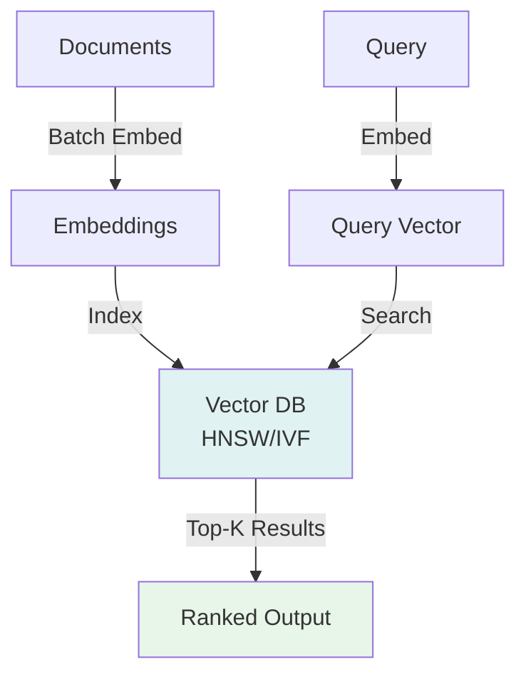
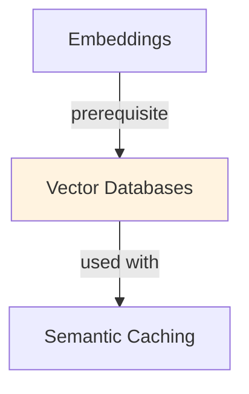

# Vector Databases

## Understanding Vector Databases

Vector Databases is a foundational concept in large language model development that addresses critical challenges in model architecture, training efficiency, or inference performance. Understanding this concept is essential for anyone working with modern language models, whether in research, fine-tuning, or production deployment.

The core innovation underlying Vector Databases lies in rethinking standard approaches to achieve better efficiency or effectiveness. Rather than accepting conventional trade-offs, this technique exploits mathematical or architectural insights to push the frontier of what's possible with given computational constraints.

In practical applications, Vector Databases enables capabilities that would otherwise be infeasible: reducing computational requirements, improving model quality, enabling faster iteration, or supporting new use cases. The real-world impact has made Vector Databases widely adopted across industry applications, from consumer products to enterprise systems.

Implementing Vector Databases requires understanding both its theoretical foundations and practical considerations. The following sections provide detailed explanations of how Vector Databases works, when to use it, common implementation patterns, and lessons learned from production deployments. By mastering these concepts, practitioners can make informed decisions about when and how to apply Vector Databases to their specific challenges.

## Core Intuition
Regular databases optimize for exact key lookups (e.g., "get user ID 42"). Vector DBs optimize for approximate nearest neighbors (e.g., "find 10 vectors similar to [0.5, -0.2, ...]"). They answer "which documents are similar to this query?" efficiently.

## How It Works

**Core Operations:**

1. **Insert/Upsert:** Add vectors (and metadata) to the database
   ```
   db.upsert(id="doc_1", vector=[0.1, 0.2, ...], metadata={"title": "..."})
   ```

2. **Search:** Find k nearest neighbors
   ```
   results = db.query(vector=query_vec, k=10)
   → returns [(id, distance, metadata), ...]
   ```

3. **Delete/Update:** Remove or modify vectors
   ```
   db.delete(id="doc_1")
   ```

**Indexing Strategies:**

**Flat (Exhaustive Search):**
- Compare query to all vectors (no index)
- Pros: exact nearest neighbors, simple
- Cons: slow (O(n) time), for <1M vectors only

**HNSW (Hierarchical Navigable Small World):**
- Graph-based, navigates layers (fast)
- Fast search: O(log n)
- Memory overhead: ~20% extra
- Default for production (Pinecone, Weaviate use this)

**IVF (Inverted File):**
- Partition space into clusters
- Search only nearby clusters
- Fast but approximate
- Good for billions of vectors

**FAISS (Facebook AI Similarity Search):**
- Quantization + IVF combo
- Reduces memory 4-16x
- Trade: accuracy for memory

**Filtering:**
- Pre-filter by metadata: "find similar docs where author='John'"
- Post-filter: retrieve k+buffer, filter, return top-k
- Metadata filtering: exact match, range, boolean ops

### Workflow Flowchart



## Key Properties / Trade-offs

| Database | Latency | Scale | Cost | Ease |
|----------|---------|-------|------|------|
| FAISS (local) | <1ms | 100M-1B | Free | Medium |
| Pinecone | 10-100ms | Unlimited | $$$ | Easy |
| Weaviate | 10-100ms | Billions | $$ | Medium |
| Milvus | 10-100ms | Billions | $$ | Medium |
| Qdrant | 10-100ms | Billions | $$ | Easy |
| Redis | 1-10ms | <100M | $ | Easy |

**Dimension vs Speed:**
- 100D: very fast, lower quality
- 384D (Sentence-BERT): balanced
- 768D (BERT-large): slower, better quality
- 1536D (GPT-3 embeddings): slowest, best quality

**Latency vs Accuracy:**
- Flat index: O(n), exact (slow)
- HNSW: O(log n), 99%+ accuracy (medium)
- IVF: ~1-10ms, 90-95% accuracy (fast)
- FAISS: <1ms, 80-90% accuracy (very fast)

## Common Mistakes / Gotchas

- **Wrong vector dimension:** If indexed at 384D but query is 768D, incompatible. Standardize embeddings.
- **Stale vectors:** If documents change but embeddings don't, outdated search results. Re-embed when docs update.
- **Unscaled dimensions:** Mixing 100D and 1000D vectors confuses distance metrics. Normalize or scale.
- **No metadata filtering:** If querying millions of vectors, add metadata filters to reduce search space.
- **Latency surprises:** FAISS is fast locally, but network latency (cloud) adds 50-100ms. Check end-to-end latency.
- **Memory explosion:** Storing billions of vectors uses lots of RAM. Use quantization (int8, int4) to compress.
- **Not handling deletes:** Soft deletes (mark deleted) vs hard deletes (remove). Soft deletes faster, hard deletes save memory.

## Code Example

```python
import pinecone
import numpy as np
from sentence_transformers import SentenceTransformer

# 1. Initialize Pinecone
pinecone.init(api_key="YOUR_API_KEY", environment="us-east1-aws")
index = pinecone.Index("documents")

# 2. Prepare embeddings
model = SentenceTransformer('all-MiniLM-L6-v2')
documents = [
    {"id": "doc_1", "text": "Python is a programming language"},
    {"id": "doc_2", "text": "Snakes are reptiles"},
]

vectors_to_upsert = [
    (doc["id"], model.encode(doc["text"]).tolist(), {"text": doc["text"]})
    for doc in documents
]

# 3. Upsert vectors
index.upsert(vectors=vectors_to_upsert)

# 4. Search for similar documents
query = "What is Python?"
query_vec = model.encode(query)

results = index.query(query_vec.tolist(), top_k=3, include_metadata=True)
for match in results["matches"]:
    print(f"ID: {match['id']}, Score: {match['score']:.3f}, Text: {match['metadata']['text']}")

# 5. Delete document
index.delete(ids=["doc_1"])

# 6. Local FAISS (alternative to cloud)
import faiss
dimension = 384
faiss_index = faiss.IndexIVFFlat(faiss.IndexFlatL2(dimension), dimension, 10)

# Add vectors
vectors = np.array([model.encode(doc["text"]) for doc in documents]).astype('float32')
faiss_index.train(vectors)
faiss_index.add(vectors)

# Search
query_vec = model.encode(query).astype('float32').reshape(1, -1)
distances, indices = faiss_index.search(query_vec, k=3)
print(indices, distances)
```

## Interview Quick-Reference

| Question | What to say |
|---|---|
| "Vector DB vs regular DB?" | Regular: exact key lookups. Vector DB: nearest neighbor search at scale. Optimized for similarity. |
| "HNSW vs IVF?" | HNSW: graph-based, balanced (10-100ms, 99% accurate). IVF: partition-based, fast (1-10ms, 90% accurate). |
| "Scaling to billions?" | Use approximate methods (IVF, FAISS). Quantization (int8/int4) for memory. Cloud DBs (Pinecone) for unlimited scale. |
| "Latency?" | Local FAISS: <1ms. Network latency adds 10-100ms. Cloud DBs: 10-100ms depending on index type. |
| "Filtering?" | Pre-filter metadata before search (faster) or post-filter results (more accurate). Trade latency vs precision. |

## Real-World Examples

### Pinecone for Semantic Search
Pinecone: serverless vector DB. Index: 10M product embeddings. Query latency: <50ms p99. Compare to: Redis (memory-intensive), Postgres (slow).

### Milvus for Enterprise
On-premise deployment: 100M embeddings. Multi-shard setup for scale. Accuracy: 99% (vs 95% IVF-only). Useful for compliance (no cloud data transfer).

## Real-World Examples

### Pinecone for Semantic Search
Pinecone: serverless vector DB. Index: 10M product embeddings. Query latency: <50ms p99. Compare to: Redis (memory-intensive), Postgres (slow).

### Milvus for Enterprise
On-premise deployment: 100M embeddings. Multi-shard setup for scale. Accuracy: 99% (vs 95% IVF-only). Useful for compliance (no cloud data transfer).

## Real-World Examples

### Pinecone for Semantic Search
Pinecone: serverless vector DB. Index: 10M product embeddings. Query latency: <50ms p99. Compare to: Redis (memory-intensive), Postgres (slow).

### Milvus for Enterprise
On-premise deployment: 100M embeddings. Multi-shard setup for scale. Accuracy: 99% (vs 95% IVF-only). Useful for compliance (no cloud data transfer).

## Interview Q&A

**Q: What is the difference between HNSW and IVF indexing and when do you use each?**
A: HNSW (Hierarchical Navigable Small Worlds): builds a multi-layer graph, extremely fast queries (1-5ms), high recall (0.99+), but requires all vectors in memory and slow to update. IVF (Inverted File): clusters vectors, can be stored on disk with compression (IVF+PQ), slower queries (10-50ms) but handles billion-scale corpora and supports efficient updates. Use HNSW for production RAG with up to 10M vectors; use IVF+FAISS for large-scale or memory-constrained scenarios.

**Q: How does vector quantization affect retrieval quality and what trade-offs does it make?**
A: Product quantization (PQ) compresses vectors from float32 to 1-2 bytes per dimension by approximating them as products of subvector codebook entries. This reduces memory by 8-16x at the cost of 2-5% recall loss. Scalar quantization (SQ) is simpler with less compression. For most RAG applications, PQ-compressed indexes achieve sufficient recall (0.95+) while enabling much larger corpora in memory. Always measure recall@k on your dataset after quantization.

**Q: How do you handle multi-modal embeddings (text and images) in a single vector database?**
A: Option 1: Separate namespaces/collections—text embeddings in one collection, image embeddings in another, query both and merge results with reciprocal rank fusion. Option 2: Joint embedding space—use a model like CLIP that embeds both text and images into the same space, enabling cross-modal retrieval directly. Option 3: Late fusion—retrieve top-k from each modality separately, then re-rank with a cross-modal model. Joint embedding space is cleanest but requires compatible embedding models.

**Q: What metadata filtering capabilities do you need from a vector database and how do they affect performance?**
A: Common filters: by date range, document type, access level, category. Filtering implementation: pre-filter (filter before vector search, reduces recall if many vectors excluded), post-filter (vector search then filter, wasted compute), or combined index (partition vectors by filter value, search relevant partitions). Pre-filter + HNSW can degrade recall significantly if the filtered subset is small. Weaviate, Qdrant, and Pinecone implement efficient filtered HNSW that maintains recall.

**Q: How do you migrate a production vector database to a new embedding model?**
A: Zero-downtime migration: (1) deploy new embedding model alongside old; (2) start dual-writing new documents with both embeddings; (3) backfill old documents with new embeddings in background; (4) once backfill is complete, switch query routing to new index; (5) decommission old index. Validate retrieval quality before and after with a held-out query set. The backfill can take hours to days for large corpora—plan accordingly.

**Q: When should you use a dedicated vector database vs. adding vector search to PostgreSQL (pgvector)?**
A: pgvector for: <1M vectors, team already uses PostgreSQL, need transactional consistency between vectors and metadata, CRUD operations are frequent. Dedicated vector DB (Pinecone, Weaviate, Qdrant) for: >1M vectors, need multi-modal support, require advanced filtering, or need managed scaling and replication without PostgreSQL expertise. pgvector HNSW is competitive in performance up to ~10M vectors; beyond that, dedicated solutions handle sharding and replication better.


## Related Topics
- [Embeddings](02-embeddings.md) — what gets stored in vector DBs
- [Semantic Search](21-semantic-search.md) — uses vector DBs for retrieval
- [RAG](18-rag.md) — vector DB is the retrieval component
- [Inference Caching](../system-design/patterns/inference-caching.md) — cache vector search results

## Resources
- [Pinecone: Vector Database](https://www.pinecone.io/)
- [Weaviate: Open-source Vector Database](https://weaviate.io/)
- [Qdrant: Vector Database for Similarity Search](https://qdrant.tech/)
- [FAISS: Efficient Similarity Search and Clustering](https://github.com/facebookresearch/faiss)
- [Milvus: Open-source Vector Database](https://milvus.io/)

## Concept Relationships



## Interview Questions

**Q: What's a vector database and why not just use Postgres+embeddings?**
*A: Vector DB: optimized for similarity search (HNSW, IVF indices), fast approximate search. Postgres: general-purpose, slower for similarity (full scan). At scale (1M docs): Postgres = 1s query, vector DB = 10ms query. For small datasets: Postgres fine.*

**Q: What's the difference between HNSW and IVF indexing?**
*A: HNSW (Hierarchical Navigable Small World): graph-based, better quality but memory-intensive. IVF (Inverted File): cluster-based, faster but less accurate. Trade-off: quality vs speed. Most: hybrid (IVF + HNSW).*

**Q: How do you handle real-time updates in vector DB?**
*A: Append-only: add new docs constantly. Problem: old docs become stale. Solutions: 1) Rebuild index periodically. 2) Delete old docs (expensive). 3) TTL (time-to-live) for automatic expiration.*

**Q: What's the relationship between vector dimension and accuracy?**
*A: Higher dimension: more expressive (better accuracy). Lower dimension: faster search. Trade-off: 384 dims = 90% accuracy, 1536 dims = 95%. Most use 384-768 for balance.*

**Q: How do you scale vector search to billions of documents?**
*A: Sharding: split across multiple nodes. Index on each shard separately. Query: broadcast to all shards, merge results. Latency: scales, throughput scales.*