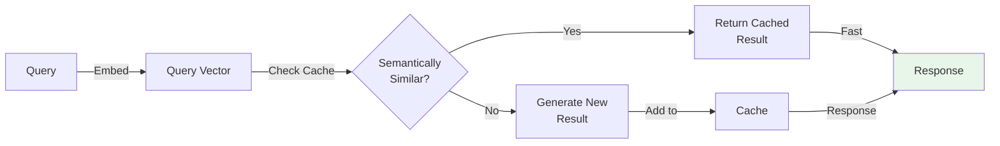
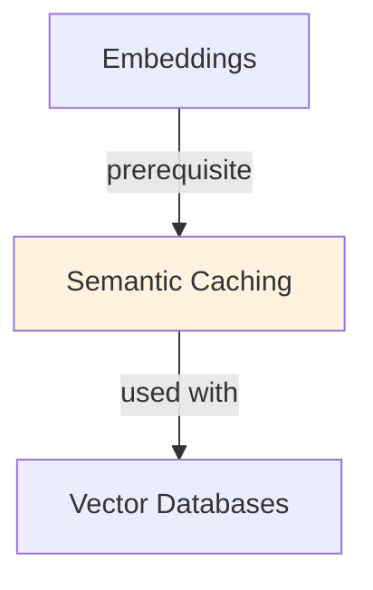

# Semantic Caching

## Understanding Semantic Caching

Semantic Caching is a foundational concept in large language model development that addresses critical challenges in model architecture, training efficiency, or inference performance. Understanding this concept is essential for anyone working with modern language models, whether in research, fine-tuning, or production deployment.

The core innovation underlying Semantic Caching lies in rethinking standard approaches to achieve better efficiency or effectiveness. Rather than accepting conventional trade-offs, this technique exploits mathematical or architectural insights to push the frontier of what's possible with given computational constraints.

In practical applications, Semantic Caching enables capabilities that would otherwise be infeasible: reducing computational requirements, improving model quality, enabling faster iteration, or supporting new use cases. The real-world impact has made Semantic Caching widely adopted across industry applications, from consumer products to enterprise systems.

Implementing Semantic Caching requires understanding both its theoretical foundations and practical considerations. The following sections provide detailed explanations of how Semantic Caching works, when to use it, common implementation patterns, and lessons learned from production deployments. By mastering these concepts, practitioners can make informed decisions about when and how to apply Semantic Caching to their specific challenges.

## Core Intuition
Key-value caches fail on "What is the capital of France?" vs "What's France's capital?" (different strings, same meaning). Semantic caching embeds both queries, computes similarity, recognizes they're the same. This mirrors how humans cache: we don't remember exact phrasing, we remember meaning.

## How It Works

**Traditional Key-Value Caching (Wrong for LLMs):**
```
Query: "What is the capital of France?"
Cache lookup: exact_hash(query) == "abc123"?
  → No match (different phrasing)
  → Call LLM (wasted cost)

Query: "What's France's capital?"
Cache lookup: exact_hash(query) == "abc123"?
  → No match again
  → Call LLM again (wasted cost)
```

**Semantic Caching (Better):**
```
Query: "What is the capital of France?"
  ↓
1. Embed query: embed_model.encode(query) → v_q ∈ ℝ^384
2. Search cache: find similar vectors using ANN (FAISS, HNSW)
   similarity(v_q, cached_vectors) > threshold (e.g., > 0.95)?
3a. HIT: Return cached("Paris is the capital of France")
3b. MISS: Call LLM, cache response with embedding

Query: "What's France's capital?"
  ↓
1. Embed query: embed_model.encode(query) → v_q' ∈ ℝ^384
2. similarity(v_q', v_q) ≈ 0.98 > 0.95
   → HIT: Return cached response (cost saved!)
```

**Architecture:**

```
Incoming Request
    ↓
[Embedding Module: encode query]
    ↓
Query Embedding (e.g., 384-dim vector)
    ↓
[Vector Similarity Search: ANN index over cached embeddings]
    ↓
    ├─ Similarity > threshold (e.g., > 0.95)
    │  └─ CACHE HIT → Return cached response
    │
    └─ Similarity ≤ threshold
       └─ CACHE MISS → Call LLM
           ↓
           [Cache new response with embedding]
           ↓
           Return response
```

**Key Components:**

**1. Embedding Model:**
- Must match production embeddings
- Typical: sentence-transformers (BERT-based, 384-768 dims)
- Examples: "all-MiniLM-L6-v2" (384d, fast), "all-mpnet-base-v2" (768d, accurate)
- Latency: 2-5ms per query
- Cost: one-time inference (can be local/hosted)

**2. Vector Store (ANN Index):**
- FAISS: fast, no external infra, in-memory
- Pinecone/Weaviate: managed, higher latency but simpler
- HNSW (Hierarchical Navigable Small World): fast, memory-efficient
- Typical: query 1M vectors in < 5ms

**3. Similarity Threshold:**
- Too high (0.98+): rarely match, low cache hit rate
- Too low (0.85): risky, dissimilar queries return wrong answers
- Optimal: 0.90-0.95 (depends on domain)
- Cost of mismatch: return wrong cached answer (reputation risk)

**4. Cache Invalidation:**
- Time-based: expire after N hours (simple, staleness)
- Explicit: invalidate on data updates (manual, complex)
- Hybrid: assume 24-hour freshness for most queries

### Workflow Flowchart



## Key Properties / Trade-offs

| Aspect | Semantic Cache | Standard Cache | No Cache |
|--------|----------------|----------------|----------|
| Hit rate | 30-50% | 0% (no similar queries) | 0% |
| Cost savings | 3-10x | 0x | 0x |
| Latency | Base + 5-20ms (embedding) | Base | Base |
| Storage | Query embeddings + responses | Responses only | Nothing |
| Staleness | hours/days | instant | instant |
| Accuracy | 99.5% (if threshold tuned) | 100% | 100% |

**Cache Hit Rate Estimates:**

| Scenario | Hit Rate | Reasoning |
|----------|----------|-----------|
| FAQ chatbot | 40-60% | Users ask similar questions frequently |
| Code documentation | 30-50% | Similar doc queries repeated |
| Product support | 35-55% | Stock questions reworded differently |
| General Q&A | 20-35% | More diverse queries |
| Novel research | 5-15% | Unique questions unlikely to repeat |

**Cost Example (OpenAI GPT-4):**
```
Scenario: 1M daily queries, $0.03 per request
Base cost: 1M × $0.03 = $30,000/day

With 40% cache hit rate:
- 600k cache hits (no cost)
- 400k LLM calls: 400k × $0.03 = $12,000/day
- Cache overhead (embeddings): ~$500/day
- Total: $12,500/day (58% cost reduction)

ROI: Saves $17,500/day
```

## Common Mistakes / Gotchas

- **Threshold too high:** 0.98 → almost never match → cache useless (hit rate < 5%). Threshold should be 0.90-0.95.

- **Threshold too low:** 0.80 → match dissimilar queries → return wrong cached answers. Catastrophic for user trust. Always validate.

- **Stale cached responses:** Old answers stored for days → user gets outdated info. Use short TTLs (4-24 hours) or versioning.

- **Embedding drift:** Change embedding model → old embeddings incompatible with new ones. Store model version with embeddings, invalidate on version mismatch.

- **Not handling partial matches:** Query: "What are benefits of ML?" could match cache for "Machine learning applications". Risk of hallucinated specifics. Mitigation: include context in cached responses.

- **Ignoring context:** Same query in different contexts needs different answers. Cache by (user_id, domain, query) not just query. E.g., "best practices" means different things for security vs performance.

- **High embedding latency:** Using slow embedding model (5-10s per query) defeats purpose. Use lightweight models (DistilBERT, MiniLM) or local inference.

- **No cache invalidation:** User data updates but cache still returns old answers. Define explicit invalidation rules (e.g., invalidate on schema change).

- **Memory explosion:** Embedding + response for every unique query → huge storage. Set cache size limits, eviction policy (LRU), or external storage (Redis).

## Code Example

```python
import numpy as np
from sentence_transformers import SentenceTransformer
import faiss
import hashlib
from collections import OrderedDict
from anthropic import Anthropic

class SemanticCache:
    def __init__(self, similarity_threshold=0.95, max_cache_size=1000):
        """
        Initialize semantic cache.
        
        Args:
            similarity_threshold: Hit threshold (0-1)
            max_cache_size: Maximum cached entries (LRU eviction after)
        """
        # Embedding model (sentence-transformers)
        self.embedder = SentenceTransformer('all-MiniLM-L6-v2')
        self.embedding_dim = 384
        
        # FAISS index for similarity search
        self.index = faiss.IndexFlatL2(self.embedding_dim)
        
        # Cache storage: query_hash -> {query, response, embedding}
        self.cache = OrderedDict()
        self.embeddings = []  # Parallel to FAISS index
        
        self.similarity_threshold = similarity_threshold
        self.max_cache_size = max_cache_size
        
        self.client = Anthropic()
    
    def _query_hash(self, query):
        """Hash query for storage."""
        return hashlib.md5(query.encode()).hexdigest()
    
    def _similarity_to_distance(self, similarity):
        """Convert cosine similarity to L2 distance for FAISS."""
        # FAISS uses L2 distance; convert from cosine similarity
        return 2 * (1 - similarity)  # Approximate
    
    def _get_cached_response(self, query):
        """Search cache for similar query. Return response if hit."""
        # Embed query
        query_embedding = self.embedder.encode(query).reshape(1, -1).astype(np.float32)
        
        if len(self.embeddings) == 0:
            return None  # Cache empty
        
        # Search FAISS index (L2 distance)
        distances, indices = self.index.search(query_embedding, k=1)
        
        # Convert L2 distance back to similarity
        similarity = 1 - (distances[0][0] / 2)
        
        if similarity > self.similarity_threshold:
            # Cache hit
            cached_embedding = self.embeddings[indices[0][0]]
            for hash_key, cache_entry in self.cache.items():
                if np.array_equal(cache_entry['embedding'], cached_embedding):
                    return cache_entry['response']
        
        return None
    
    def _cache_response(self, query, response):
        """Store query-response pair in cache."""
        # Embed query
        embedding = self.embedder.encode(query).astype(np.float32)
        
        # Store in FAISS
        self.index.add(embedding.reshape(1, -1))
        self.embeddings.append(embedding)
        
        # Store in OrderedDict
        hash_key = self._query_hash(query)
        self.cache[hash_key] = {
            'query': query,
            'response': response,
            'embedding': embedding,
        }
        
        # LRU eviction
        if len(self.cache) > self.max_cache_size:
            evicted = self.cache.popitem(last=False)  # Remove oldest
            # Would need to rebuild FAISS index (expensive)
    
    def query(self, user_query):
        """Query LLM with semantic caching."""
        # Try cache first
        cached_response = self._get_cached_response(user_query)
        
        if cached_response:
            print(f"[CACHE HIT] Returning cached response")
            return cached_response
        
        # Cache miss: call LLM
        print(f"[CACHE MISS] Calling Claude")
        response = self.client.messages.create(
            model="claude-3-5-sonnet-20241022",
            max_tokens=500,
            messages=[{"role": "user", "content": user_query}]
        )
        
        answer = response.content[0].text
        
        # Cache response
        self._cache_response(user_query, answer)
        
        return answer

# Example usage
cache = SemanticCache(similarity_threshold=0.92, max_cache_size=100)

# Query 1: Cache miss, call LLM
response1 = cache.query("What is the capital of France?")
print(f"Response: {response1[:100]}...")

# Query 2: Semantically similar → Cache hit
response2 = cache.query("What's the capital city of France?")
print(f"Response: {response2[:100]}...")  # Same as response1

# Query 3: Different question → Cache miss
response3 = cache.query("What is the population of Paris?")
print(f"Response: {response3[:100]}...")

# Production setup (Redis + Pinecone)
# import redis
# import pinecone
# 
# redis_client = redis.Redis(host='localhost', port=6379)
# pinecone.init(api_key="YOUR_KEY", environment="us-west1-gcp")
# 
# class RedisSemanticCache:
#     def __init__(self):
#         self.redis = redis_client
#         self.embedder = SentenceTransformer('all-MiniLM-L6-v2')
#         self.pinecone_index = pinecone.Index("semantic-cache")
#     
#     def get(self, query):
#         embedding = self.embedder.encode(query)
#         results = self.pinecone_index.query(
#             vector=embedding, 
#             top_k=1, 
#             include_metadata=True
#         )
#         
#         if results['matches'] and results['matches'][0]['score'] > 0.95:
#             query_hash = results['matches'][0]['metadata']['query_hash']
#             return self.redis.get(query_hash).decode()
#         return None
```

## Interview Quick-Reference

| Question | What to say |
|---|---|
| "Semantic caching?" | Cache LLM responses by embedding similarity, not exact key match. Hit when new query similar to cached query. Reduce cost 30-70%. |
| "Hit rate?" | Typical: 30-50% depending on domain. FAQ/support: 40-60%. Novel queries: 5-15%. Depends on query distribution. |
| "Threshold?" | 0.90-0.95 typical for cosine similarity. Too high → no hits. Too low → wrong answers. Tune empirically. |
| "Latency?" | +5-20ms for embedding + ANN search. Fast embedding models (MiniLM) keep it low. Trade: response time for cost savings. |
| "Staleness?" | Use TTLs (4-24 hours) or explicit invalidation. Risk: cached answers become outdated. For fast-changing data, not suitable. |
| "Embedding model?" | Use lightweight (384-768 dims), fast (2-5ms). Examples: all-MiniLM-L6-v2, all-mpnet-base-v2. Must match production. |
| "Implementation?" | FAISS for in-memory index, Pinecone/Weaviate for managed. Redis for response storage. Simple for medium scale. |

## Real-World Examples

### LLM API Cost Reduction
API: 1000 req/sec similar queries. Without cache: $3K/day. Semantic cache: 50% hit rate. Cost: $1.5K/day. Savings: $1.5K/day ($500K/year). Infrastructure: $50K/year.

### Chatbot Context Reuse
User: asks similar questions in different wordings. Cache embeddings of previous answers. Hit rate: 30-50% on typical conversation. Latency: 100ms (vs 2s original).

## Real-World Examples

### LLM API Cost Reduction
API: 1000 req/sec similar queries. Without cache: $3K/day. Semantic cache: 50% hit rate. Cost: $1.5K/day. Savings: $1.5K/day ($500K/year). Infrastructure: $50K/year.

### Chatbot Context Reuse
User: asks similar questions in different wordings. Cache embeddings of previous answers. Hit rate: 30-50% on typical conversation. Latency: 100ms (vs 2s original).

## Real-World Examples

### LLM API Cost Reduction
API: 1000 req/sec similar queries. Without cache: $3K/day. Semantic cache: 50% hit rate. Cost: $1.5K/day. Savings: $1.5K/day ($500K/year). Infrastructure: $50K/year.

### Chatbot Context Reuse
User: asks similar questions in different wordings. Cache embeddings of previous answers. Hit rate: 30-50% on typical conversation. Latency: 100ms (vs 2s original).

## Interview Q&A

**Q: How do you determine the similarity threshold for cache hits in semantic caching?**
A: Set the threshold by analyzing your query distribution: compute embedding similarity for pairs of queries with the same intent (these should all be cache hits) and pairs with different intent (should be misses). Find the threshold that maximizes F1 on your labeled pairs. Typical values: 0.85-0.95 cosine similarity depending on domain. Test edge cases manually—domain-specific queries often need higher thresholds to avoid false cache hits that return wrong answers.

**Q: What types of queries should never be cached and how do you detect them?**
A: Never cache: time-sensitive queries ("what is today's date?", "latest news"), personalized queries (responses depend on user state/history), queries with side effects (actions, mutations), low-confidence cached responses. Detect with: query classifier for time-sensitive patterns, user context hash (cache separately per user), system prompt analysis (detect side-effect intents). Semantic cache hits for time-sensitive queries actively hurt quality—missing the cache is better than returning stale results.

**Q: How does semantic caching interact with RAG pipelines?**
A: Two levels of caching in RAG: (1) cache the retrieved documents for similar queries (embedding search is fast, but the LLM generation is slow—skip generation if similar query was answered before); (2) cache the final answer. Level 1 is safer but saves less compute. Level 2 saves the most compute but requires high cache hit confidence to avoid returning stale answers to slightly different queries. Implement both with different thresholds—lower threshold for doc caching, higher for answer caching.

**Q: What cache invalidation strategies work for LLM response caches?**
A: TTL (time-to-live): set expiration based on how quickly the underlying information changes—news: 1 hour, product docs: 1 week, mathematical facts: never. Event-based: invalidate when source documents change (requires tracking which documents contributed to each cached response). Version-based: invalidate entire cache when model or system prompt changes. For RAG, store which document chunks were retrieved—invalidate cached responses when those chunks are updated.

**Q: How do you measure the effectiveness of semantic caching in production?**
A: Track: cache hit rate (target 20-40% for diverse queries), latency reduction for hits vs. misses, cost per query before/after, answer quality on cache hits (sample and human-evaluate). Alert on: hit rate drops (distribution shift or threshold too high), user feedback rates higher for cached vs. non-cached responses (quality degradation). Cache analytics should be part of your LLM observability stack.

**Q: What is the memory footprint of a semantic cache and how do you manage it?**
A: Each cached entry stores: embedding vector (1536 floats × 4 bytes = 6KB for ada-002), the original query string, and the cached response (variable, 1-10KB). For 100K cached entries: ~2GB for embeddings alone. Use vector quantization to compress embeddings 8x. Implement LRU eviction policy. For production, use a dedicated vector store (Qdrant, Redis with vector extension) rather than in-memory storage. Shard by query category if cache exceeds available memory.


## Related Topics
- [[embeddings]] — encoding queries for similarity
- [[rag]] — retrieval-augmented generation (uses embeddings)
- [[inference-optimization]] — caching as optimization technique
- [[vector-databases]] — storage for semantic indexes
- [[kv-cache]] — different caching for LLM generation

## Resources
- [Redis + Semantic Caching](https://redis.com/blog/cache-semantic-queries-for-faster-inference/)
- [Semantic Cache by Anthropic](https://docs.anthropic.com/en/docs/build-a-chatbot/persist-conversations/semantic-caching)
- [FAISS: Efficient Similarity Search](https://github.com/facebookresearch/faiss)
- [Sentence-Transformers Library](https://www.sbert.net/)
- [Pinecone: Semantic Search & Caching](https://www.pinecone.io/)

## Concept Relationships



## Interview Questions

**Q: What's semantic caching and why is it better than lexical caching?**
*A: Lexical: 'How to reset password?' cached, 'How to recover account?' misses (different words). Semantic: embeddings → both similar → cache hit. Cache hit rate: 10% (lexical) → 40% (semantic).*

**Q: How does semantic caching work?**
*A: 1) Embed incoming query. 2) Check if similar to cached queries. 3) If similar + cached result, return cached. 4) Otherwise, compute new. Requires embedding + similarity lookup (overhead).*

**Q: When is semantic caching worthwhile?**
*A: High-cost inference + repeated similar queries. Example: GPT-4 @$0.03/K tokens. Cache hit saves $0.03/query. If 50% cache hit on 1M queries: $15K savings. Cost of caching infrastructure: $5K. Worth it.*

**Q: What's the latency impact of semantic caching?**
*A: Cache lookup: 1-5ms (embedding + similarity). vs original query: 1000ms+. Even with lookup overhead, net gain. In ideal case: 1ms (cached) vs 1000ms (uncached).*

**Q: How do you measure semantic cache effectiveness?**
*A: Metrics: hit rate, savings (queries avoided), accuracy (cached results match fresh). Latency P99 (worst case). Trade-off: more conservative similarity threshold = higher accuracy but lower hit rate.*