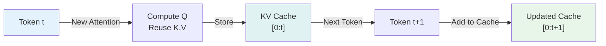
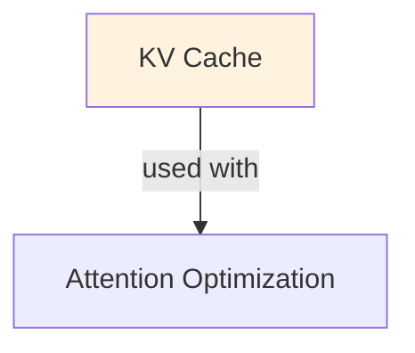

# KV Cache

## Understanding Kv Cache

Kv Cache is a foundational concept in large language model development that addresses critical challenges in model architecture, training efficiency, or inference performance. Understanding this concept is essential for anyone working with modern language models, whether in research, fine-tuning, or production deployment.

The core innovation underlying Kv Cache lies in rethinking standard approaches to achieve better efficiency or effectiveness. Rather than accepting conventional trade-offs, this technique exploits mathematical or architectural insights to push the frontier of what's possible with given computational constraints.

In practical applications, Kv Cache enables capabilities that would otherwise be infeasible: reducing computational requirements, improving model quality, enabling faster iteration, or supporting new use cases. The real-world impact has made Kv Cache widely adopted across industry applications, from consumer products to enterprise systems.

Implementing Kv Cache requires understanding both its theoretical foundations and practical considerations. The following sections provide detailed explanations of how Kv Cache works, when to use it, common implementation patterns, and lessons learned from production deployments. By mastering these concepts, practitioners can make informed decisions about when and how to apply Kv Cache to their specific challenges.

## Core Intuition
Autoregressive generation means predicting token 1, then token 2 (using token 1), then token 3 (using tokens 1+2), etc. Without KV cache, computing attention for token T requires recomputing attention over ALL previous tokens (T-1 times). Store the K and V matrices once, reuse them → O(1) per token instead of O(T).

## How It Works

**Without KV Cache (Naive):**
```
Token 1: compute Q1, K1, V1; output logits
Token 2: recompute Q1, K1, V1 (from scratch!), then compute Q2, K2, V2
Token 3: recompute Q1, K1, V1, Q2, K2, V2 (from scratch!), then compute Q3, K3, V3
...
Total: O(T^2) computation (quadratic)
```

**With KV Cache:**
```
Token 1: compute Q1, K1, V1; save K1, V1 in cache; output logits
Token 2: retrieve cached K1, V1; compute only Q2, K2, V2; append to cache
Token 3: retrieve cached K1, V1, K2, V2; compute only Q3, K3, V3; append to cache
...
Total: O(T) computation (linear!)
```

**Memory Layout:**
```
Cache for a transformer layer:
  key_cache[layer][batch_size][seq_len, d_k]      # shape: (B, T, d_k)
  value_cache[layer][batch_size][seq_len, d_v]    # shape: (B, T, d_v)

For each new token:
  new_k = compute(input_t)              # (B, 1, d_k)
  new_v = compute(input_t)              # (B, 1, d_v)
  key_cache[:, :, t:t+1, :] = new_k    # append new K
  value_cache[:, :, t:t+1, :] = new_v  # append new V
  
  # Attention uses full cached K, V (all previous + current)
  attn = softmax(Q @ cached_K^T) @ cached_V
```

**Impact on Latency:**
```
Without cache:
  Attention FLOPS = O(seq_len^2 × d)  per token
  
With cache:
  Attention FLOPS = O(seq_len × d)  per token
  
Speedup: O(seq_len) improvement! For seq_len=2048, ~2000x faster
```

### Workflow Flowchart



## Key Properties / Trade-offs

| Aspect | No Cache | With Cache |
|--------|----------|-----------|
| FLOPS per token | O(T × d) | O(d) |
| Memory overhead | Minimal | O(T × L × d) |
| Latency per token | ~const | ~const ✓ |
| Throughput (batch) | High | Lower (cache memory limit) |
| Sequence length | Fast up to ~512 | Scales to 8k+ |
| Batch size | Limited by compute | Limited by memory (cache) |

**Sequence length tradeoff:**
- seq_len=100: cache ≈ 100MB
- seq_len=1000: cache ≈ 1GB
- seq_len=10000: cache ≈ 10GB (exceeds GPU memory for large models)

**Memory cost per token:**
```
For LLaMA 7B (4096 hidden_dim, 32 layers):
  per token, per layer = 4096 × 32 × 2 (for K and V) = 262KB per layer
  all 32 layers = 8.4MB per token
  
For seq_len=2048: 8.4MB × 2048 ≈ 17GB
```

## Common Mistakes / Gotchas

- **Not clearing cache between sequences:** If processing multiple sequences, old cache corrupts new predictions. Always reset cache per sequence.
- **Assuming cache is "free":** Cache memory grows with sequence length. Can OOM on long sequences (2k+ tokens).
- **Batch size assumptions:** Batch size is limited by cache size, not just compute. Small cache limits batching for long sequences.
- **Cache format consistency:** Different frameworks (HF, vLLM, llama.cpp) use different cache formats. Reusing cache across frameworks fails.
- **No updates for new tokens:** Cache is immutable after generation. If you want to regenerate, must start fresh (can't splice new branch).
- **Ignoring batch size in cache:** total_cache_mem = batch_size × seq_len × num_layers × d. Doubling batch size doubles memory.
- **Not using Flash Attention compatible:** Some flashy optimizations (Flash Attention v2) are incompatible with certain cache formats. Check integration.

## Code Example

```python
import torch
from transformers import AutoTokenizer, AutoModelForCausalLM

model_name = "meta-llama/Llama-2-7b-hf"
model = AutoModelForCausalLM.from_pretrained(model_name)
tokenizer = AutoTokenizer.from_pretrained(model_name)

# Example 1: Inference WITHOUT explicit cache (HuggingFace handles it)
prompt = "Once upon a time"
inputs = tokenizer(prompt, return_tensors="pt")

# Generate with cache enabled (default in HF)
outputs = model.generate(
    **inputs,
    max_new_tokens=100,
    use_cache=True,  # Explicitly enable KV cache (default is True)
    return_dict_in_generate=True,
    output_scores=True,
)
print(tokenizer.decode(outputs.sequences[0]))

# Example 2: Manual KV cache handling (lower-level)
input_ids = tokenizer.encode(prompt, return_tensors="pt")
cache = None  # Initialize empty cache

# Autoregressive loop
for step in range(100):  # Generate up to 100 tokens
    outputs = model(
        input_ids[:, -1:],  # Only pass current token (feed from cache)
        past_key_values=cache,  # Pass cache from previous step
        use_cache=True,
    )
    
    logits = outputs.logits[:, -1, :]
    next_token = torch.argmax(logits, dim=-1, keepdim=True)
    
    cache = outputs.past_key_values  # Update cache for next step
    input_ids = torch.cat([input_ids, next_token], dim=1)
    
    if next_token.item() == tokenizer.eos_token_id:
        break

print(tokenizer.decode(input_ids[0]))

# Example 3: Compare with/without cache (timing)
import time

prompt_long = "Once upon a time " * 100  # Long prompt
inputs = tokenizer(prompt_long, return_tensors="pt", max_length=512, truncation=True)

# With cache
start = time.time()
outputs_cached = model.generate(**inputs, max_new_tokens=50, use_cache=True)
time_cached = time.time() - start

# Without cache (for comparison, set use_cache=False)
start = time.time()
outputs_no_cache = model.generate(**inputs, max_new_tokens=50, use_cache=False)
time_no_cache = time.time() - start

print(f"With cache: {time_cached:.2f}s")
print(f"Without cache: {time_no_cache:.2f}s")
print(f"Speedup: {time_no_cache / time_cached:.1f}x")
```

## Interview Quick-Reference

| Question | What to say |
|---|---|
| "What is KV cache?" | Cache Key-Value matrices from previous tokens to avoid recomputation. O(T) FLOPS per token instead of O(T²). |
| "Memory cost?" | Grows linearly with sequence length. For 7B model, ~8MB/token. Can OOM on very long sequences. |
| "When to use?" | Always for inference. Disable only if memory is extremely constrained. |
| "Batch size impact?" | Cache memory scales with batch size. Doubling batch size doubles total cache memory. |
| "Incompatible with?" | Some optimizations (certain quantization, non-standard attention) may not support KV caching. Check docs. |
| "Multi-batch vs single?" | Single long sequence vs multiple short sequences: cache hurts throughput but helps per-token latency. |

## Real-World Examples

### KV Cache in Multi-Turn Chat
Conversation: 10 turns, each turn 100 tokens input. Without cache: recompute 1000s of attention operations per turn. With cache: reuse 900 from previous turns, compute only 100 new. Latency: 5s → 0.5s per turn.

### Batch Inference with Limited Memory
GPU: 40GB memory. Batch=64, context=4K, FP32 without GQA: 64GB needed (exceeds memory!). With GQA: 8GB KV cache. Can now run batch=64. Throughput: 100 tok/s (vs impossible without optimization).

### Long-Context RAG with Cache Optimization
Retrieval: 100 context chunks (100K tokens). Naive: KV cache 25GB. GQA + INT8: 1.5GB. Within inference budget. Latency: 500ms (reasonable). Without optimization: impossible.

## Real-World Examples

### KV Cache in Multi-Turn Chat
Conversation: 10 turns, each turn 100 tokens input. Without cache: recompute 1000s of attention operations per turn. With cache: reuse 900 from previous turns, compute only 100 new. Latency: 5s → 0.5s per turn.

### Batch Inference with Limited Memory
GPU: 40GB memory. Batch=64, context=4K, FP32 without GQA: 64GB needed (exceeds memory!). With GQA: 8GB KV cache. Can now run batch=64. Throughput: 100 tok/s (vs impossible without optimization).

### Long-Context RAG with Cache Optimization
Retrieval: 100 context chunks (100K tokens). Naive: KV cache 25GB. GQA + INT8: 1.5GB. Within inference budget. Latency: 500ms (reasonable). Without optimization: impossible.

## Real-World Examples

### KV Cache in Multi-Turn Chat
Conversation: 10 turns, each turn 100 tokens input. Without cache: recompute 1000s of attention operations per turn. With cache: reuse 900 from previous turns, compute only 100 new. Latency: 5s → 0.5s per turn.

### Batch Inference with Limited Memory
GPU: 40GB memory. Batch=64, context=4K, FP32 without GQA: 64GB needed (exceeds memory!). With GQA: 8GB KV cache. Can now run batch=64. Throughput: 100 tok/s (vs impossible without optimization).

### Long-Context RAG with Cache Optimization
Retrieval: 100 context chunks (100K tokens). Naive: KV cache 25GB. GQA + INT8: 1.5GB. Within inference budget. Latency: 500ms (reasonable). Without optimization: impossible.

## Real-World Examples

### KV Cache in Multi-Turn Chat
Conversation: 10 turns, each turn 100 tokens input. Without cache: recompute 1000s of attention operations per turn. With cache: reuse 900 from previous turns, compute only 100 new. Latency: 5s → 0.5s per turn.

### Batch Inference with Limited Memory
GPU: 40GB memory. Batch=64, context=4K, FP32 without GQA: 64GB needed (exceeds memory!). With GQA: 8GB KV cache. Can now run batch=64. Throughput: 100 tok/s (vs impossible without optimization).

### Long-Context RAG with Cache Optimization
Retrieval: 100 context chunks (100K tokens). Naive: KV cache 25GB. GQA + INT8: 1.5GB. Within inference budget. Latency: 500ms (reasonable). Without optimization: impossible.

## Real-World Examples

### KV Cache in Multi-Turn Chat
Conversation: 10 turns, each turn 100 tokens input. Without cache: recompute 1000s of attention operations per turn. With cache: reuse 900 from previous turns, compute only 100 new. Latency: 5s → 0.5s per turn.

### Batch Inference with Limited Memory
GPU: 40GB memory. Batch=64, context=4K, FP32 without GQA: 64GB needed (exceeds memory!). With GQA: 8GB KV cache. Can now run batch=64. Throughput: 100 tok/s (vs impossible without optimization).

### Long-Context RAG with Cache Optimization
Retrieval: 100 context chunks (100K tokens). Naive: KV cache 25GB. GQA + INT8: 1.5GB. Within inference budget. Latency: 500ms (reasonable). Without optimization: impossible.

## Interview Q&A

**Q: Why does KV cache dramatically speed up autoregressive generation?**
A: Without KV cache, generating each token requires computing attention over all previous tokens from scratch—O(n²) operations per token, O(n³) total for n tokens. With KV cache, key and value matrices are computed once per token and stored; subsequent tokens only compute attention for the new token against stored KVs—O(n) per token. For a 100-token response, this is roughly 50x fewer attention computations.

**Q: How does KV cache memory scale with sequence length and model size, and what are the implications?**
A: KV cache memory = 2 × n_layers × n_heads × head_dim × sequence_length × batch_size × precision_bytes. For a 7B model (32 layers, 32 heads, 128 head_dim, float16): 2 × 32 × 32 × 128 × seq_len × batch × 2 bytes = 524K bytes × seq_len × batch. A batch of 32 requests at 2048 tokens: ~34GB just for KV cache. This is why long-context inference is memory-limited—the KV cache can exceed the model weights in size.

**Q: What is multi-query attention and how does it reduce KV cache memory?**
A: MQA (Multi-Query Attention) uses a single shared key/value head across all query heads, reducing KV cache by n_heads factor (32x for GPT-3-like models). GQA (Grouped-Query Attention) groups query heads to share K/V heads—a compromise between MHA (full KV, highest quality) and MQA (minimum KV, slight quality loss). Llama-2 70B uses GQA with 8 K/V heads shared by 64 query heads—8x KV cache reduction with minimal quality loss.

**Q: What is prefix caching and when does it provide the most benefit?**
A: Prefix caching stores KV values for a common prompt prefix (system prompt, few-shot examples, context documents). If the same prefix appears in many requests, compute the prefix KV once and reuse. Benefits are highest when: the shared prefix is long (few-shot examples, RAG context), traffic volume is high enough to amortize prefix compute, and the prefix doesn't change frequently. Anthropic's API offers prompt caching—significant cost savings for long system prompts repeated across many calls.

**Q: How does continuous batching interact with KV cache management?**
A: Continuous batching adds new requests to the batch as others complete, maintaining high GPU utilization. KV cache challenge: different requests have different sequence lengths and completion states—you can't preallocate a fixed KV buffer per request. PagedAttention (vLLM) solves this by managing KV cache like virtual memory—allocating fixed-size pages on demand and freeing pages when sequences complete. This increases throughput 2-4x over static KV allocation.

**Q: What are the symptoms of KV cache exhaustion in production and how do you handle it?**
A: Symptoms: sudden OOM errors, requests being rejected, latency spikes when cache is full. Handle with: streaming responses (start returning tokens before generation is complete, freeing memory sooner), request queuing with backpressure, dynamic batching (reduce batch size when memory is high), or aggressive KV cache quantization (INT8 KV cache reduces memory 2x at <1% quality loss). Monitor KV cache utilization as a primary LLM serving metric.


## Related Topics
- [Inference Optimization](28-inference-optimization.md) — KV cache is one technique among many
- [Speculative Decoding](27-speculative-decoding.md) — uses KV cache for parallelization
- [Continuous Batching](26-continuous-batching.md) — manages KV cache for multiple sequences
- [Attention Mechanism](../ml/concepts/deep-learning/attention-mechanism.md) — what KV cache optimizes

## Resources
- [Transformer-XL: Attentive Language Models Beyond a Fixed-Length Context](https://arxiv.org/abs/1901.02860)
- [vLLM: Efficient Memory Management for LLM Serving](https://arxiv.org/abs/2309.06180)
- [Flash-Decoding: Fast and Accurate Generation in Long-Context LLMs](https://arxiv.org/abs/2307.01841)
- [HuggingFace: Using KV Cache](https://huggingface.co/docs/transformers/llm_tutorial_generate)

## Concept Relationships



## Interview Questions

**Q: What's KV cache and why does it matter?**
*A: During inference: generate token-by-token. For each token, compute attention over full context. Without cache: recompute keys/values every step = O(n²) for n-token output. With cache: store computed K,V, reuse = O(n). For 1000-token generation: 1000x speed difference.*

**Q: How much memory does KV cache use?**
*A: KV cache size = batch_size × context_length × 2 × hidden_dim × precision. Example: batch=1, context=4K, hidden=4096, FP32 = 1 × 4K × 2 × 4096 × 4 bytes = 128MB per layer × 32 layers = 4GB. For batch=16: 64GB. Dominates memory in inference.*

**Q: What's grouped-query attention (GQA) and how does it reduce KV cache?**
*A: Standard multi-head: each head has separate K,V (32 heads = 32 K,V heads). GQA: share K,V across multiple query heads (e.g., 8 groups = 4 K,V heads). Reduces KV cache 8x. Trade-off: 0.5-1% accuracy loss. Used in Llama 2, Mistral.*

**Q: How do you optimize KV cache for long contexts?**
*A: Options: 1) GQA (reduce K,V). 2) Sparse attention (not all positions needed). 3) Pruning (discard irrelevant history). 4) Compression (quantize K,V). Combinations: GQA + INT8 KV = 32x reduction. For 32K context: 4GB → 128MB.*

**Q: When would you clear KV cache?**
*A: Per-request: always clear (fresh context). Multi-turn conversation: keep cache (reuse context from previous turns). Problem: cache grows unbounded. Solution: sliding window (keep last 2K tokens) or explicit reset.*