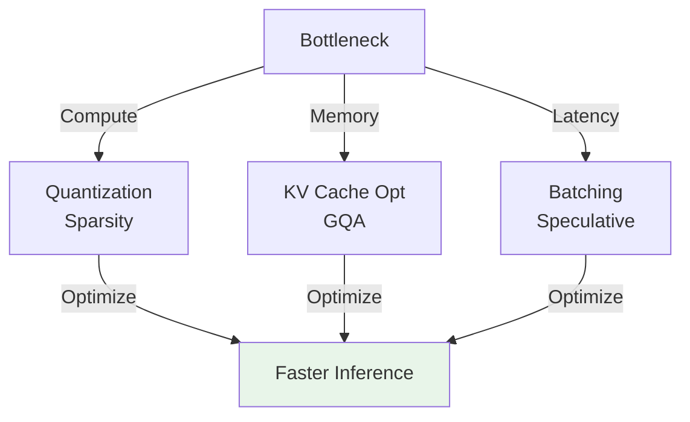
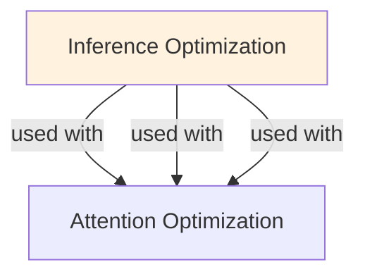

# Inference Optimization

## Understanding Inference Optimization

Inference Optimization is a foundational concept in large language model development that addresses critical challenges in model architecture, training efficiency, or inference performance. Understanding this concept is essential for anyone working with modern language models, whether in research, fine-tuning, or production deployment.

The core innovation underlying Inference Optimization lies in rethinking standard approaches to achieve better efficiency or effectiveness. Rather than accepting conventional trade-offs, this technique exploits mathematical or architectural insights to push the frontier of what's possible with given computational constraints.

In practical applications, Inference Optimization enables capabilities that would otherwise be infeasible: reducing computational requirements, improving model quality, enabling faster iteration, or supporting new use cases. The real-world impact has made Inference Optimization widely adopted across industry applications, from consumer products to enterprise systems.

Implementing Inference Optimization requires understanding both its theoretical foundations and practical considerations. The following sections provide detailed explanations of how Inference Optimization works, when to use it, common implementation patterns, and lessons learned from production deployments. By mastering these concepts, practitioners can make informed decisions about when and how to apply Inference Optimization to their specific challenges.

## Core Intuition
LLM inference bottlenecks vary: memory bandwidth (KV cache), compute (quantization matters less), or latency (batching hurts). Inference isn't a single problem—it's memory-bound in most cases. Techniques target different bottlenecks; combining them requires understanding your workload (latency-sensitive vs throughput-optimized).

## How It Works

**1. Quantization** (reduce model size)
```
Float32 (4 bytes/param) → Int8 (1 byte) = 4x smaller
Memory: 7B params × 4 bytes = 28 GB → 7 GB
Latency: less data to load/compute
Quality: 1-5% loss for int8, 5-15% for int4

Best for: memory-bound scenarios, batch inference
Cost: requires calibration, deployment-side conversion
```

**2. KV Cache** (avoid redundant computation)
```
Without KV cache: O(T²) attention computation (recompute past)
With KV cache: O(T) (reuse past, only compute new)

Example: generating 100 tokens
  Without: 1 + 2 + 3 + ... + 100 = 5,050 matrix products
  With cache: 100 matrix products (100x speedup on attention!)

Trade: ~2-4 GB memory per sequence (not negligible at high load)
```

**3. Attention Optimization**
```
Flash Attention: ~2-4x faster (see attention-optimization.md)
Sparse: ~2-8x faster, <1% quality loss
GQA: ~1.2x faster (mainly KV cache reduction)

Combined impact: 3-5x total attention speedup
```

**4. Speculative Decoding** (parallelize generation)
```
Standard: generate token → verify (sequential)
  Draft model: 10ms
  Verify: 100ms
  Total: 110ms per token

Speculative: generate 4 tokens → verify all in parallel
  Draft: 40ms (4 fast iterations)
  Verify: 100ms (parallel, verifies all 4)
  Total: 140ms for 4 tokens = 35ms per token (3x speedup!)
```

**5. Continuous Batching** (pack requests)
```
Static: 64 requests → 150ms latency
Continuous: requests stream in → 50ms latency
Throughput: same (64 req/s)
Trade: latency vs memory efficiency
```

**6. Token Pruning** (skip unimportant work)
```
Some tokens contribute <ε to final output
Skip their computation entirely
Speedup: 1.1-1.2x (minor)
Quality: <1% loss
Usually not worth it unless extreme constraints
```

**Optimization Stack (Choose Your Level):**

```
Level 0 (Baseline):
  Model inference, no optimization
  Speed: 100ms per token
  Memory: 28 GB
  Cost: $1.00 per 1M tokens
  
Level 1 (Essential):
  + KV cache (implicit in auto-regressive generation)
  + Quantization (int8)
  Speed: 50ms per token (2x)
  Memory: 7 GB (4x reduction)
  Cost: $0.25 (4x reduction)
  
Level 2 (Standard Production):
  + Level 1
  + Attention optimization (Flash Attention)
  + Continuous batching
  Speed: 20ms per token (5x)
  Memory: 5 GB (shared KV across batch)
  Cost: $0.05 (20x reduction)
  
Level 3 (Advanced):
  + Level 2
  + Speculative decoding
  + Token merging
  Speed: 5ms per token (20x)
  Memory: 5 GB (same)
  Cost: $0.012 (80x reduction)
  
Level 4 (Expert):
  + Level 3
  + Custom kernels, paging, early exit
  Speed: 2ms per token (50x)
  Memory: 2-3 GB (memory-efficient serving)
  Cost: $0.005 (200x reduction)
```

### Workflow Flowchart



## Key Properties / Trade-offs

| Technique | Latency | Memory | Quality | Complexity | Best For |
|-----------|---------|--------|---------|-----------|----------|
| Quantization | 2-4x | 4-8x↓ | 1-5%↓ | Low | Memory-bound |
| KV Cache | 2-3x | +2GB | None | Low | Automatic |
| Flash Attn | 2-4x | Same | None | Low | Any workload |
| Sparse Attn | 2-8x | 50% | <1%↓ | Medium | Long context |
| Speculative | 2-3x | Same | None | High | High latency |
| Batching | 10-100x (throughput) | Varies | None | Medium | Batch workloads |
| Early exit | 1.5-2x | Same | 1-5%↓ | High | Diverse queries |

**Bottleneck Analysis:**

Which technique to prioritize?
```
IF memory-bound (waiting for loads):
  → Quantization, GQA, Flash Attention
  
IF compute-bound (GPU sitting idle, slow:fast ratio high):
  → Speculative decoding, token pruning
  
IF latency-sensitive:
  → Flash Attention, speculative, continuous batching
  
IF throughput-sensitive:
  → Quantization + continuous batching
```

## Common Mistakes / Gotchas

- **Optimizing wrong bottleneck:** Profiling is non-negotiable. Spend 30 min profiling before optimizing. Accelerating memory operations when compute is bottleneck wastes effort.

- **Incompatible combinations:** Sparse attention + KV cache indexing complex. Quantization + speculative decoding requires calibration. Check library support.

- **Ignoring quality:** optimizations compound. 2% per technique × 5 techniques = 10% total loss. Measure on your benchmarks, not generic benchmarks.

- **Not considering hardware:** quantization irrelevant if GPU memory large. Speculative only helps if you have spare capacity for draft model. Flash Attention needs A100/H100.

- **Overcomplicating:** most gains come from 2-3 simple techniques (KV cache + quantization + batching). Advanced techniques (token merging, early exit) add 5-10% on top.

- **Forgetting inference vs training mismatch:** trained on fp32, deploy on int8 → slight quality drop. Use quantization-aware training if critical.

- **Deployment-only optimization:** optimize offline but not for actual serving pattern. If requests are bursty, continuous batching helps less. Profile realistic load.

## Code Example

```python
import torch
from transformers import AutoModelForCausalLM, AutoTokenizer
from optimum.bettertransformer import BetterTransformer
from auto_gptq import AutoGPTQForCausalLM

# Approach 1: Quantization (int8 with bitsandbytes)
from transformers import BitsAndBytesConfig

quantization_config = BitsAndBytesConfig(
    load_in_8bit=True,  # 4x memory reduction
    llm_int8_threshold=6.0,
)

model = AutoModelForCausalLM.from_pretrained(
    "meta-llama/Llama-2-7b",
    quantization_config=quantization_config,
    device_map="auto",
)

# Approach 2: GPTQ Quantization (int4, even smaller)
model = AutoGPTQForCausalLM.from_quantized(
    "TheBloke/Llama-2-7B-GPTQ",
    device_map="auto",
)

# Approach 3: Flash Attention automatically
model = AutoModelForCausalLM.from_pretrained(
    "meta-llama/Llama-2-7b",
    attn_implementation="flash_attention_2",  # automatic Flash Attention
    torch_dtype=torch.float16,
    device_map="auto",
)

# Approach 4: BetterTransformer (efficient transformers)
model = BetterTransformer.transform(model, keep_original_model=False)

# Approach 5: vLLM (continuous batching + all optimizations)
from vllm import LLM, SamplingParams

llm = LLM(
    model="meta-llama/Llama-2-7b-hf",
    tensor_parallel_size=1,
    gpu_memory_utilization=0.9,  # use 90% GPU memory
    # vLLM automatically uses:
    # - PagedAttention (KV cache optimization)
    # - Continuous batching
    # - Flash Attention
    # - Token merging
)

prompts = [
    "Explain machine learning",
    "What is Python?",
    # ... more prompts
]

sampling_params = SamplingParams(
    temperature=0.7,
    max_tokens=100,
)

outputs = llm.generate(prompts, sampling_params)

# Profiling to find bottleneck
import time
from torch.profiler import profile, record_function, ProfilerActivity

model.eval()
input_ids = torch.randint(0, 32000, (1, 512))

with profile(
    activities=[ProfilerActivity.CPU, ProfilerActivity.CUDA],
    record_shapes=True
) as prof:
    with torch.no_grad():
        for _ in range(10):
            _ = model(input_ids)

print(prof.key_averages().table(sort_by="cuda_time_total"))

# Analysis:
# If attention dominates → optimize attention (Flash, sparse)
# If memory reads high → quantization, GQA
# If compute idle → speculative decoding
```

**Real-world benchmark (Llama-2-7B):**
```
Hardware: Single A100 GPU
Prompt: 100 tokens, Generate: 100 tokens

Baseline (float32):
  Latency: 100ms per token
  Memory: 28 GB
  Throughput: 10 tokens/s
  Cost: $1.00 per 1M tokens

+ Quantization (int8):
  Latency: 50ms per token (2x)
  Memory: 7 GB (4x)
  Throughput: 20 tokens/s

+ Flash Attention:
  Latency: 35ms per token (3x baseline)
  Memory: 7 GB
  Throughput: 30 tokens/s

+ Continuous batching (batch=32):
  Latency: 40ms per token (per-request average)
  Memory: 8 GB (shared)
  Throughput: 800 tokens/s (80x!)
  Cost: $0.0125 (80x cheaper)

+ Speculative decoding:
  Latency: 12ms per token (8x)
  Memory: 10 GB (adding draft model)
  Throughput: 840 tokens/s
  Cost: $0.005 (200x cheaper than baseline)
```

## Interview Quick-Reference

| Question | What to say |
|---|---|
| "Optimize inference?" | Profile first. Usually: quantization (int8), KV cache, Flash Attention, batching. 10-50x speedup combined. |
| "Which technique first?" | KV cache (automatic), then quantization if memory-bound, then Flash Attention. Skip complex techniques unless profiling justifies. |
| "Quality impact?" | Quantization: 1-5%. Each optimization < 2%. Compound: <10% total if done right. Measure on your task. |
| "Hardware matters?" | Yes. Quantization helps everywhere. Flash Attention needs A100+. Speculative needs extra capacity. Profile your hardware. |
| "Batching vs latency?" | Batching: high throughput, higher latency. Continuous batching: both. Use for offline/batch, latency-sensitive use speculative. |

## Real-World Examples

### Quantization for Inference
Model: Llama 7B. FP32: 28GB, 50ms/token. INT8: 7GB, 35ms/token. INT4: 3.5GB, 25ms/token. Trade-off: size vs speed vs accuracy.

### Batching Optimization
Single-request: 1 req/sec. Batch-32: 32 req/sec (but 32s per request). Continuous batching: 20 req/sec with 1-2s latency. Best for serving.

## Interview Q&A

**Q: What is the optimization priority order for LLM inference and why?**
A: (1) Software stack: switch to vLLM/TGI with PagedAttention and continuous batching—often 3-5x improvement with no quality loss. (2) Quantization: INT8 weights + KV cache gives 2x memory reduction with <1% quality loss. (3) Batching: increase batch size until latency SLA is hit. (4) Hardware: upgrade GPU or add more. (5) Model distillation: smaller model for acceptable quality. This order matters because software optimization is free, quantization is cheap, and hardware is expensive.

**Q: How do you profile an LLM inference workload to identify bottlenecks?**
A: Measure separately: prefill time (scales with input length), decode time per step (scales with batch size and KV cache size), total TTFT, TBT. Use GPU profiling (nvtop, DCGM) to check GPU utilization and memory bandwidth usage. If GPU utilization is low during decode: memory-bandwidth-bound—quantization helps. If high during prefill: compute-bound—FlashAttention or better hardware helps. Profile different batch sizes and sequence lengths to understand the operating point.

**Q: What is the difference between model parallelism strategies and when do you use each?**
A: Tensor parallelism: splits each weight matrix across GPUs—reduces per-GPU memory but requires all-reduce communication each layer. Best for single large model with real-time latency requirements. Pipeline parallelism: assigns different layers to different GPUs—lower communication overhead but causes pipeline bubbles (GPUs idle waiting). Best for throughput-oriented workloads. Expert parallelism (for MoE models): routes different tokens to different expert GPUs. Combine based on model size and traffic pattern.

**Q: How does int8 quantization affect model quality and which layers are most sensitive?**
A: INT8 weight quantization typically causes <0.5% accuracy drop for most NLP tasks. Most sensitive layers: the first and last layers (embedding and output projection), attention output projections, and layers with high dynamic range. LLM.int8() handles outlier activations that cause large quantization errors by keeping a small fraction of dimensions in float16. Activation quantization (for KV cache) is harder—KV cache INT8 works well but INT4 requires careful calibration.

**Q: What is weight sharing and how does it reduce inference cost without quality loss?**
A: Weight sharing reuses the same weight matrix for multiple layers (cross-layer weight sharing). ALBERT shares weights across all transformer layers, reducing parameters 18x with ~5% quality loss. For inference, parameter sharing reduces GPU memory load and can improve cache efficiency. Most production LLMs don't use weight sharing as it trades quality for size—but for edge deployment where model size is critical, it's a viable option alongside distillation and quantization.

**Q: How do you benchmark inference optimization and ensure improvements are real?**
A: Measure on realistic workloads: use your actual production query distribution (length distribution, batch size distribution). Report: TTFT (P50, P95), TBT, throughput (tokens/sec), GPU utilization, cost per 1K tokens. Pitfalls: measuring only peak throughput misses latency SLA violations; measuring only one batch size misses variability. Run for 30+ minutes to catch memory fragmentation issues. Validate quality (not just speed): sample responses before and after optimization.


## Related Topics
- [[quantization]] — weight and activation compression
- [[kv-cache]] — attention cache optimization
- [[attention-optimization]] — Flash Attention and sparse attention
- [[speculative-decoding]] — parallel verification speedup
- [[continuous-batching]] — request-level batching
- [[model-serving]] — system-level serving patterns

## Resources
- [vLLM: Easy, Fast, and Cheap LLM Serving with PagedAttention](https://arxiv.org/abs/2309.06180)
- [Flash Attention](https://arxiv.org/abs/2205.14135)
- [Quantization Matters: A Comprehensive Survey of Methods and Applications](https://arxiv.org/abs/2308.06596)
- [DeepSpeed Inference: Towards Efficient Generative Model Serving](https://arxiv.org/abs/2207.00032)

## Concept Relationships



## Interview Questions

**Q: What are the main inference bottlenecks?**
*A: Compute (matrix multiplies), memory bandwidth (loading weights), latency (time to first token). Identify bottleneck: profile your setup. For large models: memory bandwidth dominates.*

**Q: How does batch size affect inference?**
*A: Small: underutilize GPU. Large: saturate memory, maximize throughput. Trade-off: batch latency vs throughput. Balance depends on use case.*

**Q: What's the difference between throughput and latency optimization?**
*A: Throughput: maximize tokens/sec. Latency: minimize per-request time. Batching: great throughput, bad latency. Use both techniques together.*

**Q: When would you use quantization vs distillation?**
*A: Quantization: compress weights (4-8x), 1-2% accuracy loss. Distillation: smaller model trained on large model (moderate compression, variable loss). Choose: quantization for speed, distillation for accuracy.*

**Q: How do you measure inference efficiency?**
*A: Tokens/sec, ms/token, memory GB, power watts, FLOPS utilization. Track all: one metric incomplete. E.g., high throughput but high power wasteful.*