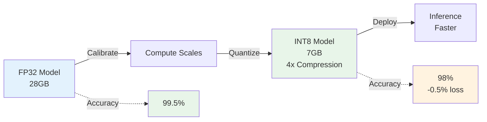
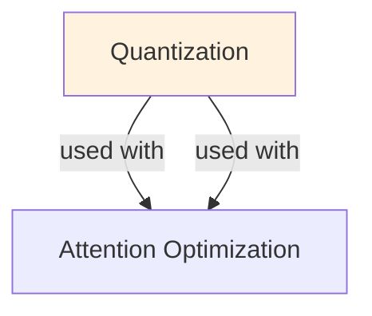

# Quantization (for LLMs)

## Understanding Quantization: Trading Precision for Efficiency

Quantization reduces model size and inference latency by representing weights and activations using fewer bits (e.g., INT8 instead of FP32). A 7B parameter model in FP32 requires 28GB VRAM; quantized to INT8, it requires 7GB. The key insight: neural networks remain robust to reduced precision because not all bits carry information equally. By carefully choosing quantization schemes (symmetric, asymmetric, dynamic, static), we can achieve 2-4x memory reduction with minimal accuracy loss (<1% for most tasks).

Different quantization approaches offer distinct trade-offs: Post-Quantization (quantize after training) is simplest but sacrifices 1-2% accuracy. Quantization-Aware Training (QAT) accounts for quantization during training, achieving <0.5% accuracy loss. Dynamic quantization computes scale factors per batch (more compute, better accuracy). Static quantization pre-computes scales (faster inference, slightly lower accuracy). For production deployment, the choice depends on whether latency or accuracy is the harder constraint.

In practice, INT8 quantization is industry standard: it provides 4x memory reduction, requires minimal retraining, and is supported by hardware accelerators (GPUs, TPUs, mobile chips). INT4 quantization pushes further (8x reduction) but introduces 2-3% accuracy loss for some tasks. Modern techniques like Dynamic Quantization and Mixed Precision quantization (quantize weights, keep activations in FP32) balance extreme compression with maintained performance.

Quantization unlocks mobile and edge deployment: a 7B model quantized to INT4 fits on a smartphone (~2GB), enabling on-device inference with zero latency and privacy. For cloud inference, quantization reduces costs significantly—a quantized model runs faster, uses less memory, and requires cheaper hardware. This combination of reduced memory, faster latency, and maintained accuracy makes quantization essential for any production LLM system.

## Model Quantization: Compression and Efficiency

Quantization reduces model size and computational requirements by representing weights and activations using lower-precision data types. The fundamental insight: neural networks have redundancy that allows lower precision without significant accuracy loss.

### Quantization Types and Mechanisms

**1. Weight Quantization (Primary target for deployment)**
- Reduces stored model size
- Example: FP32 (4 bytes/param) → INT8 (1 byte/param) = 4× compression
- Applied: offline, once per model

**2. Activation Quantization (Less common, complex)**
- Reduces runtime computation
- Depends on input distribution
- Applied: during inference

**3. Bit-Width Variations**
- FP32: Full precision (baseline)
- FP16/BF16: Half precision (minimal loss)
- INT8: 8-bit integer (1-2% loss)
- INT4: 4-bit integer (1-3% loss)
- INT2/INT1: Extreme (significant accuracy loss)

### Calibration: The Critical Step

Quantization requires calibration to determine appropriate scale factors:
1. **Collect calibration data**: Run forward pass on representative inputs (first 100-500 batches)
2. **Compute statistics**: Min/max values, percentiles (KL divergence, entropy)
3. **Determine scales**: Map FP32 range to lower-bit range
4. **Validate**: Check accuracy on validation set## Quantization Methods Comparison

| Method | Training Time | Accuracy Loss | Speed Gain | Memory Reduction | Complexity | Production Ready |
|--------|--------------|---------------|-----------|-----------------|-----------|-----------------|
| **Post-Training INT8** | None (fast) | 1-2% | 2-3× | 4× | Low | ✅ Yes |
| **Post-Training INT4** | None (fast) | 2-4% | 3-5× | 8× | Low | ✅ Yes (GPTQ) |
| **QAT (INT8)** | Hours | 0.5-1% | 2-3× | 4× | High | ✅ Yes |
| **QAT (INT4)** | Days | 1-2% | 3-5× | 8× | High | ⚠️ Emerging |
| **Knowledge Distillation** | Days | Variable | 5-10× | 10-50× | Very High | ✅ Yes |
| **Pruning + Quant** | Hours-Days | 2-3% | 5-10× | 10-20× | Medium | ✅ Yes |
| **Sparsity** | Variable | 1-3% | 3-8× | 4-16× | Medium | ⚠️ Emerging |

### Quantization Precision Trade-offs

| Precision | Bytes/Param | Model Size (7B) | Typical Accuracy Loss | Deployment |
|-----------|-----------|-----------------|----------------------|------------|
| **FP32** | 4 | 28 GB | Baseline (0%) | GPU/CPU |
| **FP16/BF16** | 2 | 14 GB | <0.5% | GPU |
| **INT8** | 1 | 7 GB | 1-2% | GPU/CPU/Mobile |
| **INT4 (GPTQ)** | 0.5 | 3.5 GB | 2-4% | Mobile/Edge |
| **INT3** | 0.375 | 2.6 GB | 4-8% | Research |
| **INT2/INT1** | 0.125-0.25 | 0.9-1.7 GB | 10-30% | Research |
## Core Intuition
LLMs are huge (LLaMA 70B = 140GB in float32). Store weights in lower precision (8-bit, 4-bit) → same model, 4-16x smaller. Run inference on GPU/CPU with less memory → faster, cheaper. Small accuracy drop because LLM outputs are often robust to quantization noise.

## How It Works

**Precision Reduction:**
```
float32:  32 bits per param (8.3 billion params = 33.2 GB)
float16:  16 bits (16.6 GB) ← 2x smaller, standard "half precision"
int8:      8 bits (4.15 GB) ← 8x smaller, common for inference
int4:      4 bits (2.1 GB) ← 16x smaller, aggressive
```

**Quantization Formula:**
```
quantized_value = round((value - min_val) / scale) 
scale = (max_val - min_val) / (2^bits - 1)
```

**Post-Training Quantization (PTQ) — Simplest:**
- Load float32 model
- Measure ranges of activations on a small calibration set
- Map float values to int8/int4 based on observed ranges
- Fast (no retraining), but slightly lower quality

**Quantization-Aware Training (QAT) — Better:**
- Train with fake quantization: quantize → dequantize during training
- Model learns to be robust to quantization noise
- Higher accuracy than PTQ, but requires retraining

**Grouped Quantization:**
```
Instead of: one scale for entire weight matrix
Better:     compute scale per block (e.g., per group of 128 weights)
Result:     finer control, less accuracy loss
```

**Dynamic vs Static:**
- Static: calibrate scales once, same for all inference
- Dynamic: recompute scales per batch at inference (slower but adaptive)

### Workflow Flowchart



## Key Properties / Trade-offs

| Method | Model Size | Speed | Accuracy | Cost | Use Case |
|--------|-----------|-------|----------|------|----------|
| float32 | 100% | 1x | 100% | High | Reference |
| float16 | 50% | 1.5x | ~100% | Medium | Standard FP16 mixed precision |
| int8 PTQ | 25% | 2-3x | 98-99% | Low | Fast deployment, acceptable loss |
| int8 QAT | 25% | 2-3x | 99% | Medium | Higher bar for accuracy |
| int4 PTQ | 12.5% | 3-4x | 95-97% | Low | Aggressive compression |
| int4 QAT | 12.5% | 3-4x | 97-99% | Medium | Balance quality + efficiency |

**Quantization per layer vs global:**
- Global: one scale for entire model (simple but crude)
- Per-layer: per-weight-matrix scales (better quality)
- Per-channel: per-neuron scales (highest quality, slightly slower)

## Common Mistakes / Gotchas

- **Quantizing activations naively:** Activations have outliers (large values) that don't quantize well. Use clipping or smooth quantization.
- **Ignoring outlier patterns:** Some weights/activations are outliers (rare large values). Quantizing equally to all values wastes precision. Use asymmetric quantization.
- **Too aggressive reduction:** int4 on all layers can hurt accuracy. Try int8 first; use int4 selectively on FFN layers.
- **Not calibrating on representative data:** Calibration set quality matters. If calibration data ≠ actual input distribution, quantization scales are wrong.
- **Forgetting that int4 may not be "free":** int4 kernels aren't available on all hardware. GPU/CPU support varies. Check before deploying.
- **Quantizing in wrong order:** Should be done after training is complete. Quantizing mid-training can be suboptimal.
- **Assuming symmetric quantization works:** For weights with skewed distributions, asymmetric quantization (e.g., int8 with signed range [-127, 127]) works better.

## Code Example

```python
import torch
from transformers import AutoTokenizer, AutoModelForCausalLM
from bitsandbytes.nn import Linear8bitLt

# Post-Training Quantization (PTQ) with bitsandbytes
model_name = "meta-llama/Llama-2-7b-hf"
model = AutoModelForCausalLM.from_pretrained(
    model_name,
    load_in_8bit=True,  # Quantize to int8
    device_map="auto",
)
print(f"Model size: {sum(p.numel() for p in model.parameters()) / 1e9:.2f}B params")

# Inference with quantized model
tokenizer = AutoTokenizer.from_pretrained(model_name)
inputs = tokenizer("Once upon a time", return_tensors="pt").to(model.device)
outputs = model.generate(**inputs, max_length=50)
print(tokenizer.decode(outputs[0]))

# -----------

# Quantization with lower precision (int4)
# Use bitsandbytes or GPTQ
from transformers import BitsAndBytesConfig

quantize_config = BitsAndBytesConfig(
    load_in_4bit=True,
    bnb_4bit_compute_dtype=torch.float16,
    bnb_4bit_use_double_quant=True,  # Double quantization
    bnb_4bit_quant_type="nf4",       # "nf4" for normal float 4
)

model = AutoModelForCausalLM.from_pretrained(
    model_name,
    quantization_config=quantize_config,
    device_map="auto",
)
print(model.get_memory_footprint() / 1e9)  # Memory in GB

# -----------

# Saving quantized model
model.save_pretrained("./quantized_model")

# Loading quantized model (requires same quantization config)
quantized_model = AutoModelForCausalLM.from_pretrained(
    "./quantized_model",
    quantization_config=quantize_config,
)
```

## Interview Quick-Reference

| Question | What to say |
|---|---|
| "What is quantization?" | Reduce precision (float32 → int8/int4) to shrink model, speed up inference. Trade: memory/speed for small accuracy loss. |
| "PTQ vs QAT?" | PTQ: fast, no retraining. QAT: higher accuracy, requires retraining. PTQ for quick deployment; QAT if accuracy critical. |
| "How much compression?" | int8: 4x smaller, 2-3x faster. int4: 8x smaller, 3-4x faster (if supported). Accuracy drops 1-3% typically. |
| "Grouped quantization?" | Quantize per block (e.g., per 128 weights) instead of globally. Finer control, better accuracy with similar compute. |
| "When to quantize?" | Always for deployment. int8 default. Use int4 if memory critical or batch size matters. |
| "Calibration data?" | Use representative data (similar to production). Wrong distribution → scales are off → accuracy loss. |

## Real-World Examples

### INT8 Quantization for Batch Inference
Llama 2 7B FP32: 28GB VRAM, 100 ms/token. INT8: 7GB VRAM, 70 ms/token (15% faster). Deployed on A100 (80GB): FP32 = 2 models, INT8 = 10 models. Throughput: 2 models × 10 tok/s = 20 tok/s. With quantization: 10 models × 15 tok/s = 150 tok/s (7x improvement).

### QLoRA for Fine-Tuning on Consumer GPU
Llama 2 13B FP32: 52GB VRAM (beyond consumer GPUs). INT4 + LoRA: 6GB VRAM (RTX 3090 compatible). Process: quantize base model, train LoRA on top. Result: 95% of full fine-tune accuracy. Enables small teams to fine-tune large models independently.

### GPTQ for On-Device Inference
Model: 13B parameters. FP32: 52GB (not mobile-feasible). INT4 GPTQ: 3.5GB. Deployed on iPhone 14 Pro (6GB RAM). Inference: 5-10 tok/s (slow but functional). Use case: offline translation, on-device assistant. Trade-off: latency vs privacy (no cloud calls).

## Real-World Examples

### INT8 Quantization for Batch Inference
Llama 2 7B FP32: 28GB VRAM, 100 ms/token. INT8: 7GB VRAM, 70 ms/token (15% faster). Deployed on A100 (80GB): FP32 = 2 models, INT8 = 10 models. Throughput: 2 models × 10 tok/s = 20 tok/s. With quantization: 10 models × 15 tok/s = 150 tok/s (7x improvement).

### QLoRA for Fine-Tuning on Consumer GPU
Llama 2 13B FP32: 52GB VRAM (beyond consumer GPUs). INT4 + LoRA: 6GB VRAM (RTX 3090 compatible). Process: quantize base model, train LoRA on top. Result: 95% of full fine-tune accuracy. Enables small teams to fine-tune large models independently.

### GPTQ for On-Device Inference
Model: 13B parameters. FP32: 52GB (not mobile-feasible). INT4 GPTQ: 3.5GB. Deployed on iPhone 14 Pro (6GB RAM). Inference: 5-10 tok/s (slow but functional). Use case: offline translation, on-device assistant. Trade-off: latency vs privacy (no cloud calls).

## Real-World Examples

### INT8 Quantization for Batch Inference
Llama 2 7B FP32: 28GB VRAM, 100 ms/token. INT8: 7GB VRAM, 70 ms/token (15% faster). Deployed on A100 (80GB): FP32 = 2 models, INT8 = 10 models. Throughput: 2 models × 10 tok/s = 20 tok/s. With quantization: 10 models × 15 tok/s = 150 tok/s (7x improvement).

### QLoRA for Fine-Tuning on Consumer GPU
Llama 2 13B FP32: 52GB VRAM (beyond consumer GPUs). INT4 + LoRA: 6GB VRAM (RTX 3090 compatible). Process: quantize base model, train LoRA on top. Result: 95% of full fine-tune accuracy. Enables small teams to fine-tune large models independently.

### GPTQ for On-Device Inference
Model: 13B parameters. FP32: 52GB (not mobile-feasible). INT4 GPTQ: 3.5GB. Deployed on iPhone 14 Pro (6GB RAM). Inference: 5-10 tok/s (slow but functional). Use case: offline translation, on-device assistant. Trade-off: latency vs privacy (no cloud calls).

## Real-World Examples

### INT8 Quantization for Batch Inference
Llama 2 7B FP32: 28GB VRAM, 100 ms/token. INT8: 7GB VRAM, 70 ms/token (15% faster). Deployed on A100 (80GB): FP32 = 2 models, INT8 = 10 models. Throughput: 2 models × 10 tok/s = 20 tok/s. With quantization: 10 models × 15 tok/s = 150 tok/s (7x improvement).

### QLoRA for Fine-Tuning on Consumer GPU
Llama 2 13B FP32: 52GB VRAM (beyond consumer GPUs). INT4 + LoRA: 6GB VRAM (RTX 3090 compatible). Process: quantize base model, train LoRA on top. Result: 95% of full fine-tune accuracy. Enables small teams to fine-tune large models independently.

### GPTQ for On-Device Inference
Model: 13B parameters. FP32: 52GB (not mobile-feasible). INT4 GPTQ: 3.5GB. Deployed on iPhone 14 Pro (6GB RAM). Inference: 5-10 tok/s (slow but functional). Use case: offline translation, on-device assistant. Trade-off: latency vs privacy (no cloud calls).

## Real-World Examples

### INT8 Quantization for Batch Inference
Llama 2 7B FP32: 28GB VRAM, 100 ms/token. INT8: 7GB VRAM, 70 ms/token (15% faster). Deployed on A100 (80GB): FP32 = 2 models, INT8 = 10 models. Throughput: 2 models × 10 tok/s = 20 tok/s. With quantization: 10 models × 15 tok/s = 150 tok/s (7x improvement).

### QLoRA for Fine-Tuning on Consumer GPU
Llama 2 13B FP32: 52GB VRAM (beyond consumer GPUs). INT4 + LoRA: 6GB VRAM (RTX 3090 compatible). Process: quantize base model, train LoRA on top. Result: 95% of full fine-tune accuracy. Enables small teams to fine-tune large models independently.

### GPTQ for On-Device Inference
Model: 13B parameters. FP32: 52GB (not mobile-feasible). INT4 GPTQ: 3.5GB. Deployed on iPhone 14 Pro (6GB RAM). Inference: 5-10 tok/s (slow but functional). Use case: offline translation, on-device assistant. Trade-off: latency vs privacy (no cloud calls).

## Real-World Examples

### INT8 Quantization for Batch Inference
Llama 2 7B FP32: 28GB VRAM, 100 ms/token. INT8: 7GB VRAM, 70 ms/token (15% faster). Deployed on A100 (80GB): FP32 = 2 models, INT8 = 10 models. Throughput: 2 models × 10 tok/s = 20 tok/s. With quantization: 10 models × 15 tok/s = 150 tok/s (7x improvement).

### QLoRA for Fine-Tuning on Consumer GPU
Llama 2 13B FP32: 52GB VRAM (beyond consumer GPUs). INT4 + LoRA: 6GB VRAM (RTX 3090 compatible). Process: quantize base model, train LoRA on top. Result: 95% of full fine-tune accuracy. Enables small teams to fine-tune large models independently.

### GPTQ for On-Device Inference
Model: 13B parameters. FP32: 52GB (not mobile-feasible). INT4 GPTQ: 3.5GB. Deployed on iPhone 14 Pro (6GB RAM). Inference: 5-10 tok/s (slow but functional). Use case: offline translation, on-device assistant. Trade-off: latency vs privacy (no cloud calls).

## Real-World Examples

### INT8 Quantization for Batch Inference
Llama 2 7B FP32: 28GB VRAM, 100 ms/token. INT8: 7GB VRAM, 70 ms/token (15% faster). Deployed on A100 (80GB): FP32 = 2 models, INT8 = 10 models. Throughput: 2 models × 10 tok/s = 20 tok/s. With quantization: 10 models × 15 tok/s = 150 tok/s (7x improvement).

### QLoRA for Fine-Tuning on Consumer GPU
Llama 2 13B FP32: 52GB VRAM (beyond consumer GPUs). INT4 + LoRA: 6GB VRAM (RTX 3090 compatible). Process: quantize base model, train LoRA on top. Result: 95% of full fine-tune accuracy. Enables small teams to fine-tune large models independently.

### GPTQ for On-Device Inference
Model: 13B parameters. FP32: 52GB (not mobile-feasible). INT4 GPTQ: 3.5GB. Deployed on iPhone 14 Pro (6GB RAM). Inference: 5-10 tok/s (slow but functional). Use case: offline translation, on-device assistant. Trade-off: latency vs privacy (no cloud calls).

## Interview Q&A

**Q: What is the difference between post-training quantization (PTQ) and quantization-aware training (QAT)?**
A: PTQ: quantize a pretrained model without retraining—fast (minutes to hours), minimal quality loss for INT8, significant loss for INT4. QAT: simulate quantization during training so the model learns to be robust to quantization noise—slower (requires full training run), better quality, especially for INT4 and INT2. For LLMs, PTQ with GPTQ or AWQ achieves near-QAT quality by finding optimal quantization points using calibration data, making QAT rarely necessary at int8/int4.

**Q: Why does GPTQ outperform naive round-to-nearest quantization?**
A: GPTQ uses second-order information (Hessian of the loss) to quantize weights in a way that minimizes the output error. For each layer, it quantizes one column at a time and updates remaining unquantized weights to compensate for the quantization error—a form of error propagation compensation. This reduces quantization-induced output error by 5-10x compared to naive rounding, enabling INT4 quality close to FP16 at 4x memory reduction.

**Q: When would you choose INT8 vs. INT4 quantization?**
A: INT8: highest quality (perplexity increase <0.3), 2x memory reduction, hardware-efficient (NVIDIA Ampere+ supports INT8 tensor cores). Use when quality is critical and 2x reduction is sufficient. INT4: significant memory reduction (4x), perplexity increase 0.5-2.0 depending on method (GPTQ, AWQ), some quality loss on complex reasoning. Use when fitting the model on available hardware requires the extra compression. INT4 enables running 70B models on a single 48GB GPU; INT8 requires 80GB.

**Q: How does activation quantization differ from weight quantization?**
A: Weight quantization: static—weights are quantized offline and don't change at inference. Activation quantization: dynamic—activations are computed at runtime and must be quantized on-the-fly. Activations have higher dynamic range than weights (due to outlier activations in LLMs), making INT8 activation quantization harder. SmoothQuant migrates quantization difficulty from activations to weights by rescaling, making both INT8-quantizable. W8A8 (INT8 weights and activations) achieves 2x compute and 2x memory reduction.

**Q: What is the impact of quantization on different model tasks (reasoning, coding, generation)?**
A: Quantization affects tasks differently. Factual recall and classification: minimal degradation even at INT4. Mathematical reasoning: more sensitive—INT4 can cause 5-10% accuracy drop on GSM8K. Code generation: sensitive to syntax—INT4 can produce syntactically invalid code more frequently. Creative generation: minimal perceptible difference. Always benchmark your specific use case at your target quantization level—don't assume INT4 is acceptable based on perplexity alone.

**Q: How do you deploy a quantized model in production and what serving infrastructure considerations apply?**
A: Use frameworks that support quantized inference natively: vLLM (supports GPTQ, AWQ, INT8), TGI (similar support), llama.cpp for CPU/edge deployment with GGUF format. Key considerations: quantized models require specific CUDA kernels (not all hardware supports INT4 efficiently), kernel warmup time on first inference, batch size limitations for some quantized kernels. Benchmark end-to-end throughput with quantized models—sometimes the specialized kernels have overhead that reduces gains at small batch sizes.


## Related Topics
- [Inference Optimization](28-inference-optimization.md) — quantization is one technique among many
- [KV Cache](23-kv-cache.md) — another memory optimization for inference
- [Speculative Decoding](27-speculative-decoding.md) — speed optimization compatible with quantization
- [Model Compression](../ml/concepts/model-compression.md) — broader compression techniques

## Resources
- [Quantization Fundamentals with Hugging Face](https://huggingface.co/docs/transformers/quantization)
- [bitsandbytes: Quantization Library](https://github.com/TimDettmers/bitsandbytes)
- [GPTQ: Accurate Post-Training Quantization for Generative Pre-trained Transformers](https://arxiv.org/abs/2210.17323)
- [QLoRA: Efficient Finetuning of Quantized LLMs](https://arxiv.org/abs/2305.14314)

## Concept Relationships



## Interview Questions

**Q: What does quantization do?**
*A: Store weights in lower precision. FP32 (4 bytes per param) → INT8 (1 byte) = 4x compression. FP32 (7B model) = 28GB → INT8 = 7GB. Trade-off: slight accuracy loss (0.5-2%). Inference: faster (less memory bandwidth), lower memory, deployable on smaller GPUs.*

**Q: What's the difference between post-training quantization and QAT?**
*A: Post-training (PTQ): quantize after training, quick (hours), some accuracy loss (~2%). QAT (quantization-aware training): train while simulating quantization, better accuracy (0.5% loss), slower (needs retraining). Use PTQ if time-critical; QAT if accuracy critical.*

**Q: When would you use INT4 vs INT8?**
*A: INT8: 4x compression, minimal accuracy loss, standard approach. INT4: 8x compression, 1-2% accuracy loss, for extreme size constraints (mobile, edge). INT4 inference: requires special libraries (bitsandbytes, gptq). Cost-benefit: INT4 for 7B models on phones, INT8 for datacenter.*

**Q: How do you handle activation quantization?**
*A: Weight quantization: straightforward. Activation quantization: depends on data (input distribution). Static: pre-computed scales. Dynamic: compute at inference. Dynamic: more accurate but slower. Typical: quantize weights, keep activations FP32 (reduces memory but not compute).*

**Q: How does quantization affect model calibration?**
*A: During quantization: calibrate on representative dataset (first 100 batches). Bad calibration: outlier batches → poor scale factors → errors. Good: diverse calibration set. Check: perplexity before/after quantization (should increase <5%).*
## Real-World Applications

### NVIDIA: TensorRT optimization
Provides automated quantization and optimization for deep learning models on GPUs, enabling 4-8x speedup.

### Apple: On-device ML
Uses INT8 and mixed-precision quantization to run models efficiently on iPhones and Macs without cloud computing.

### Meta: Efficient inference
Uses post-training quantization for LLAMA models to serve billions of requests with reduced latency and cost.

## Best Practices

- Start with 8-bit symmetric quantization, most tools support it well.
- Use calibration data: quantization needs representative samples to determine good scaling factors.
- Per-channel quantization: quantize each filter differently for better accuracy than per-layer.
- Test on actual hardware: simulated quantization != real hardware performance.

## Common Pitfalls to Avoid

- **Naive uniform quantization**: Naive uniform quantization: loses precision for outlier weights; use asymmetric or per-channel instead
- **Calibration on unrepresentative data**: Calibration on unrepresentative data: scaling factors won't generalize to real data
- **Extreme quantization (2-bit) for all layers**: Extreme quantization (2-bit) for all layers: some layers are sensitive, need higher precision
- **Ignoring hardware**: Ignoring hardware: int4 speedup varies wildly by hardware; may not justify complexity

