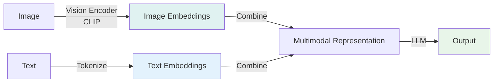
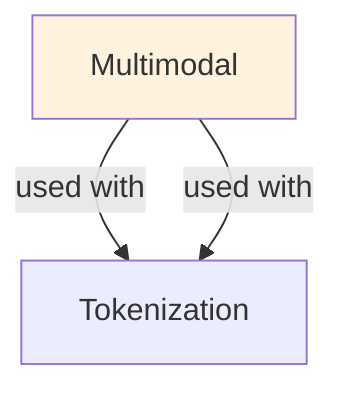

# Multimodal

## Understanding Multimodal

Multimodal is a foundational concept in large language model development that addresses critical challenges in model architecture, training efficiency, or inference performance. Understanding this concept is essential for anyone working with modern language models, whether in research, fine-tuning, or production deployment.

The core innovation underlying Multimodal lies in rethinking standard approaches to achieve better efficiency or effectiveness. Rather than accepting conventional trade-offs, this technique exploits mathematical or architectural insights to push the frontier of what's possible with given computational constraints.

In practical applications, Multimodal enables capabilities that would otherwise be infeasible: reducing computational requirements, improving model quality, enabling faster iteration, or supporting new use cases. The real-world impact has made Multimodal widely adopted across industry applications, from consumer products to enterprise systems.

Implementing Multimodal requires understanding both its theoretical foundations and practical considerations. The following sections provide detailed explanations of how Multimodal works, when to use it, common implementation patterns, and lessons learned from production deployments. By mastering these concepts, practitioners can make informed decisions about when and how to apply Multimodal to their specific challenges.

## Core Intuition
Humans understand images and text together. Multimodal LLMs bridge this: convert images to embeddings (vectors), concatenate with text tokens, feed to LLM. Key insight: vision encoders (ViT, CLIP) compress images to ~100-500 embedding tokens—same token format as text. This lets standard LLMs process both.

## How It Works

**Architecture Overview:**

```
Input: Image + Prompt
  ↓
Image Encoding:
  Image (3×H×W) → Vision Encoder → patch embeddings
  → compress to 100-500 tokens
  ↓
Text Encoding:
  Prompt text → tokenizer → token IDs
  ↓
Projection:
  image_tokens (768-dim) → text_embed_space (4096-dim)
  ↓
Concatenate:
  [image_tokens (projected), text_tokens]
  → sequence of length 100-500 + prompt_length
  ↓
LLM Processing:
  Pass through transformer, generate response
```

**Vision Encoders (by architecture):**

**1. Vision Transformer (ViT):**
```
Image → patch embeddings (16×16 patches)
  → transformer encoder (12-24 layers)
  → [CLS] token (image representation)

Example (CLIP ViT-L):
  Input: 224×224 RGB image
  Patches: 16×16 = 196 patches (7×7 grid)
  Output: 768-dim vector
  
Pros: state-of-art, parallelizable
Cons: needs significant compute, large models
```

**2. CNN-based (ResNet):**
```
Image → convolutional layers → feature maps
  → global average pooling → vector

Example (ResNet-50):
  Input: 224×224
  Output: 2048-dim vector
  
Pros: smaller, faster
Cons: less expressive, local receptive field
```

**3. Dense Visual Features (for tokens):**
```
Instead of single vector per image:
  → preserve spatial information (grid of vectors)
  → pass ~100-500 tokens to LLM

Example (CLIP + pooling):
  ViT output: 196 patch embeddings (16×16)
  Adaptive pooling: 100-144 tokens
  
Pros: more information, better for details
Cons: higher token count, slower LLM inference
```

**Projection Layer:**
```
Vision encoder output: 768-dim
LLM embedding space: 4096-dim

Linear projection: (768,) → (4096,)
Single matrix multiply

Parameters: 768 × 4096 = ~3.1M (small, trainable)

Optional: multi-layer MLP for more expressiveness
  Vision output → FC layer (768→2048) → ReLU
           → FC layer (2048→4096) → LLM space
```

**Integration Methods:**

**1. Early Fusion (concat at input):**
```
[visual_tokens, text_tokens] → LLM
+ allows cross-modal attention
- requires retraining LLM on multimodal data
```

**2. Late Fusion (parallel encoders):**
```
Image → Vision Encoder → features
Text → LLM → features
Combine features at output layer
+ vision encoder frozen, LLM frozen
- less cross-modal interaction, typically weaker
```

**3. Mid-layer Fusion (adapter):**
```
Image → Vision Encoder → adapter → text_space
Text → Text Encoder
Concatenate before final LLM layers
+ balance between parameters and expressiveness
- requires some LLM tuning
```

**Examples of Popular Architectures:**

```
GPT-4V / Claude Vision:
  Vision: Custom ViT-based encoder
  LLM: Large causal transformer
  Method: Early fusion
  Token cost: ~85 tokens per image
  
CLIP:
  Vision: ViT (frozen)
  Text: Text encoder (frozen)
  Method: Contrastive learning (not generative)
  Use case: retrieval, classification
  
LLaVA (Large Language and Vision Assistant):
  Vision: CLIP ViT-L encoder
  Projection: Linear layer (768→4096)
  LLM: Llama-2 (frozen or fine-tuned)
  Total params: 13B (7B Llama + 5M projection + CLIP vision)
  
PaliGemma:
  Vision: Pre-trained ViT
  LLM: Gemma (small, 3B)
  Method: Early fusion with co-training
```

### Workflow Flowchart



## Key Properties / Trade-offs

| Aspect | Text-Only | Text+Image | Text+Image+Audio | Full Multimodal |
|--------|-----------|-----------|------------------|-----------------|
| Model size | 7B | 13B-70B | 20B-100B | 50B-300B |
| Training data | 1B tokens | 1B text + 100M images | Above + 500k hours audio | Diverse, large-scale |
| Inference latency | 20ms/token | 30ms/token (+50%) | 40ms/token (+100%) | 50ms/token (+150%) |
| Quality (MMLU) | 85% | 88-92% | 88-93% | 90-95% |
| Context window | 4-200K tokens | Same (images count!) | Same | Same |
| Cost | Cheap | 2-3x (more tokens) | 3-5x | 5-10x |

**Image Token Costs:**
```
Architecture | Tokens per image |  Latency per image
CLIP ViT-L  | 100-144          |  ~10ms
GPT-4V      | 85 (estimated)   |  ~5ms
Dense grid  | 196-576          |  ~15ms (too many)
Compressed  | 32-64 (aggressive) |  ~3ms (quality risk)
```

## Common Mistakes / Gotchas

- **Frozen vision encoder is weak:** if vision encoder frozen to original CLIP, can't adapt to LLM distribution. Should fine-tune encoder + LLM together for best results. Or: use lightweight projector but train it well.

- **Image token explosion:** dense ViT features (196 patches) → 196 tokens per image. With long documents + multiple images → context exhaustion. Mitigate: adaptive pooling (compress to 50-100 tokens), or aggressive pruning (worse quality).

- **Modality misalignment:** image of a cat + text "explain neural networks" → model confused (image irrelevant). Curate training data with aligned image-text pairs. Test with off-topic pairs to ensure robustness.

- **Asymmetric training:** text loss dominates because text sequences longer. Use weighted losses: weight_image = 0.5, weight_text = 0.5 to balance. Or oversample image-heavy samples.

- **Position encoding for heterogeneous sequences:** mixing image embeddings and text tokens → position encodings don't align well. Use modality-specific position encodings or relative position biases.

- **Generalization to unseen modalities:** trained on high-quality images → fails on screenshots, diagrams, low-quality photos. Augment training data with diverse image qualities.

- **Hallucination in multimodal setting:** model generates detailed captions that don't match image. Add text-image contrastive loss or use beam search with image-grounding verification.

## Code Example

```python
from transformers import CLIPVisionModel, CLIPProcessor, AutoTokenizer, AutoModelForCausalLM
import torch
from PIL import Image
import requests

# Load components
vision_model = CLIPVisionModel.from_pretrained("openai/clip-vit-large-patch14")
processor = CLIPProcessor.from_pretrained("openai/clip-vit-large-patch14")
llm = AutoModelForCausalLM.from_pretrained("meta-llama/Llama-2-7b")
tokenizer = AutoTokenizer.from_pretrained("meta-llama/Llama-2-7b")

# Simple multimodal forward pass
image = Image.open(requests.get("https://example.com/image.jpg", stream=True).raw)
prompt = "Describe this image:"

# Process image
image_inputs = processor(images=image, return_tensors="pt")
with torch.no_grad():
    image_features = vision_model(**image_inputs).pooler_output  # (1, 768)

# Project to LLM space
projection = torch.nn.Linear(768, 4096).to(vision_model.device)
image_embeddings = projection(image_features)  # (1, 4096)

# Process text
text_inputs = tokenizer(prompt, return_tensors="pt")
text_embeddings = llm.transformer.wte(text_inputs.input_ids)  # (1, seq_len, 4096)

# Concatenate
combined = torch.cat([image_embeddings.unsqueeze(1), text_embeddings], dim=1)

# Generate
with torch.no_grad():
    outputs = llm.generate(inputs_embeds=combined, max_new_tokens=100)

response = tokenizer.decode(outputs[0], skip_special_tokens=True)
print(response)

# Using higher-level APIs (LLaVA)
from llava.model.builder import load_pretrained_model
from llava.mm_utils import process_images, tokenizer_image_token
from llava.constants import IMAGE_TOKEN_INDEX, DEFAULT_IMAGE_TOKEN

model_path = "liuhaotian/llava-v1.5-7b"
tokenizer, model, image_processor, context_len = load_pretrained_model(
    model_path, None, "llava", torch_dtype=torch.float16
)

image = Image.open("image.jpg")
prompt = "Describe this image in detail."

# Process image
image_tensor = process_images([image], image_processor, model.config)

# Prepare input
input_ids = tokenizer_image_token(
    f"{DEFAULT_IMAGE_TOKEN}\n{prompt}",
    tokenizer,
    IMAGE_TOKEN_INDEX,
    return_tensors="pt",
)

# Generate
with torch.no_grad():
    outputs = model.generate(
        input_ids.unsqueeze(0),
        images=image_tensor,
        do_sample=True,
        temperature=0.2,
        max_new_tokens=1024,
    )

response = tokenizer.decode(outputs[0], skip_special_tokens=True)
print(response)

# Custom projection training
class MultimodalProjector(torch.nn.Module):
    def __init__(self, vision_dim=768, llm_dim=4096):
        super().__init__()
        self.mlp = torch.nn.Sequential(
            torch.nn.Linear(vision_dim, 2048),
            torch.nn.GELU(),
            torch.nn.Linear(2048, llm_dim),
        )
    
    def forward(self, vision_features):
        return self.mlp(vision_features)

projector = MultimodalProjector(768, 4096)
optimizer = torch.optim.AdamW(projector.parameters(), lr=1e-4)

# Training loop
for images, captions in dataloader:
    # Encode
    vision_features = vision_encoder(images)  # (batch, 768)
    projected = projector(vision_features)  # (batch, 4096)
    
    # Loss
    output = llm(inputs_embeds=projected, labels=captions)
    loss = output.loss
    
    # Backprop
    optimizer.zero_grad()
    loss.backward()
    optimizer.step()
```

## Interview Quick-Reference

| Question | What to say |
|---|---|
| "Multimodal LLM?" | Processes text + images (+ audio/video). Encode each modality, project to shared space, concatenate, feed to LLM. |
| "Vision encoder?" | Usually ViT (Vision Transformer). Takes image, outputs 768-dim vector. Frozen or fine-tuned. |
| "Image tokens?" | ~100-200 tokens per image. Adds latency (30-50% slower) and cost. Trade-off: more tokens = better understanding. |
| "Training?" | Vision encoder pre-trained (CLIP), projection layer trainable, LLM frozen or fine-tuned. Or: end-to-end training. |
| "Alignment problem?" | Images and text must be paired in training. Off-topic pairs confuse model. Curate data carefully. |
| "Quality vs speed?" | Dense features (196 tokens): best quality. Pooled (100 tokens): balanced. Aggressive (32 tokens): fast, lower quality. |

## Real-World Examples

### GPT-4V Image Understanding
Input: image of a recipe. Task: extract ingredients, instructions. Accuracy: 95%. vs OCR+NLP: 70% (misses context). Multimodal: understands layout, context.

### Accessibility: Image Descriptions
Generate captions for web images automatically. Model: vision encoder + language model. Coverage: 90% of web images can be described (manual: 10% due to cost).

## Real-World Examples

### GPT-4V Image Understanding
Input: image of a recipe. Task: extract ingredients, instructions. Accuracy: 95%. vs OCR+NLP: 70% (misses context). Multimodal: understands layout, context.

### Accessibility: Image Descriptions
Generate captions for web images automatically. Model: vision encoder + language model. Coverage: 90% of web images can be described (manual: 10% due to cost).

## Real-World Examples

### GPT-4V Image Understanding
Input: image of a recipe. Task: extract ingredients, instructions. Accuracy: 95%. vs OCR+NLP: 70% (misses context). Multimodal: understands layout, context.

### Accessibility: Image Descriptions
Generate captions for web images automatically. Model: vision encoder + language model. Coverage: 90% of web images can be described (manual: 10% due to cost).

## Interview Q&A

**Q: How do vision-language models (VLMs) align visual and textual representations?**
A: Most VLMs use a visual encoder (ViT or CLIP) to extract patch embeddings, then a projection layer to map visual embeddings into the LLM's token embedding space. The projection layer bridges the visual and language representation spaces. Training involves: first training the projection layer while freezing both encoder and LLM, then jointly fine-tuning with vision-language data. Newer approaches (LLaVA-1.5) use a simple MLP projection and find that instruction-following data quality matters more than architecture complexity.

**Q: What are the limitations of current VLMs for tasks requiring fine-grained spatial understanding?**
A: VLMs struggle with: counting objects accurately (often off by 1-2), precise coordinate localization (bounding box prediction), reading dense text at very high resolution (character-level detail), and understanding spatial relationships for unusual viewpoints. ViT patches (16×16 or 14×14 pixels) create a resolution bottleneck. Specialized models (document understanding models, OCR-specialized VLMs) outperform general VLMs for fine-grained spatial tasks by using higher resolution inputs or specialized position encodings.

**Q: How do you handle documents with mixed text and images in a RAG pipeline?**
A: Three approaches: (1) extract text with OCR, discard images—loses visual information; (2) describe images with a VLM and include descriptions in the text index—preserves semantic content but loses visual fidelity; (3) multi-modal retrieval—embed both text blocks and images separately, retrieve both modalities. ColPali takes approach 3 with direct page embedding from a VLM, enabling retrieval on PDF pages as images without OCR. Choose based on how much visual content (charts, diagrams) matters for your use case.

**Q: What is the role of image resolution in VLM performance and how do you handle high-resolution images?**
A: Higher resolution preserves more detail but increases token count quadratically (2× resolution = 4× patches). Most VLMs use 224×224 or 336×336 inputs—adequate for scene understanding, poor for document/OCR tasks. High-resolution strategies: dynamic tiling (split high-res image into overlapping tiles, process each, combine), mixture of resolutions (process at multiple resolutions and fuse features), or specialized high-res encoders. For document tasks, use models specifically designed for high-resolution like LLaVA-HD or InternVL.

**Q: How do you evaluate the quality of a VLM for a specific use case?**
A: General benchmarks: VQAv2 (visual question answering), TextVQA (text in images), MMBench (comprehensive), POPE (hallucination). Task-specific: for document understanding use DocVQA, for chart reading use ChartQA. Build your own eval dataset from representative examples of your actual use case—general benchmarks often don't capture domain-specific requirements. Measure: accuracy on structured tasks, hallucination rate (does the model invent visual details?), and latency (VLMs are slower than text-only LLMs).

**Q: What are the key considerations for deploying VLMs in production vs. text-only LLMs?**
A: Image preprocessing: standardize image size, handle JPEG/PNG/PDF inputs, implement malicious image detection. Latency: image encoding adds 100-500ms; use caching for repeated images. Cost: VLM inference is 2-5x more expensive per request than text-only due to image tokens. Context limits: images consume significant context (256-1024 tokens per image); limit simultaneous images. Rate limiting: separate rate limits for visual vs. text-only requests. Monitoring: track image token usage separately from text token usage.


## Related Topics
- [[embeddings]] — vision embeddings and projection
- [[transfer-learning]] — using pre-trained vision encoders
- [[vision-transformers]] — ViT architecture details
- [[clip]] — vision-language contrastive learning

## Resources
- [An Image is Worth 16x16 Words: Transformers for Image Recognition at Scale (ViT)](https://arxiv.org/abs/2010.11929)
- [Learning Transferable Visual Models From Natural Language Supervision (CLIP)](https://arxiv.org/abs/2103.14030)
- [Flamingo: a Visual Language Model for Few-Shot Learning](https://arxiv.org/abs/2204.14198)
- [LLaVA: Large Language and Vision Assistant](https://arxiv.org/abs/2304.08485)
- [GPT-4V(ision) System Card](https://cdn.openai.com/papers/gpt_4_vision_system_card.pdf)

## Concept Relationships



## Interview Questions

**Q: What's multimodal learning in LLMs?**
*A: Process multiple input types: text, images, audio. Example: 'What's in this image?' Model sees image + question → generates answer. Enables: image understanding, video understanding, audio transcription.*

**Q: How do you handle image inputs with LLMs?**
*A: Approach 1: use vision encoder (CLIP) → embeddings → feed to LLM. Approach 2: end-to-end training on image+text. CLIP approach more practical (separate vision, reusable).*

**Q: What's the trade-off between image resolution and latency?**
*A: High-res (1024×1024): better detail, slow. Low-res (224×224): fast, miss details. Typical: 256-512×256-512 (good balance).*

**Q: How do you train multimodal models?**
*A: Contrastive learning: image-text pairs, learn similar embeddings. Generative: generate captions from images. Alignment: learn shared representation. Data: millions of image-text pairs (LAION, etc).*

**Q: When does multimodal fail?**
*A: Hallucination: generate plausible but false image descriptions. Bias: reflect biases in training data. Understand: struggle with complex reasoning about images.*