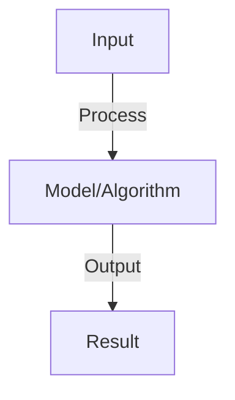

# Vision Transformers (ViT)

## Detailed Explanation

Apply transformer architecture to computer vision by dividing images into patches and treating them as sequences

## Core Intuition

Apply transformer architecture to computer vision by dividing images into patches and treating them as sequences Core idea: understand the fundamental principle and how it applies.

## How It Works

1. Divide image into fixed patches (16×16 pixels)
2. Flatten patches into vectors and linearly project to embedding dimension
3. Add positional embeddings (absolute position of each patch)
4. Pass through transformer encoder stack
5. Use [CLS] token embedding for image classification
6. Compare: ViT vs CNN receptive fields, ViT requires more data, ViT scales better

## Architecture / Trade-offs

### Vision Transformers (ViT) Architecture

| Component | Role | Trade-off |
|-----------|------|-----------|
| **Core** | Primary functionality | Complexity vs effectiveness |
| **Support** | Auxiliary systems | Overhead vs robustness |

### Design Considerations

- **Scalability:** System scales with data and model size
- **Efficiency:** Computational and memory trade-offs
- **Flexibility:** Adaptability to different tasks
- **Robustness:** Handling edge cases and failures

### Implementation Strategy

- **Baseline:** Start with simple approach
- **Iterate:** Measure and optimize bottlenecks
- **Validate:** Test on representative data

## Interview Q&A

**Q: Why divide images into patches instead of processing pixels directly?**
A: Patches reduce sequence length: 224×224 image = 196 patches vs 50K pixels. Transformers have O(n²) complexity, so patches are essential. Also enables positional embeddings.

**Q: How does ViT compare to CNNs?**
A: ViT: no inductive bias (worse small-data), requires more training data, scales better to large datasets, more interpretable attention. CNN: inductive bias (shift/scale invariance), data-efficient, good for small images.

**Q: What is the [CLS] token in ViT?**
A: Learned token prepended to patch sequence, similar to BERT. Its final representation is used as image embedding for classification. Learned end-to-end via supervised training.

**Q: How does positional encoding work in ViT?**
A: Learned absolute positional embeddings (no sinusoidal like NLP). Added to patch embeddings before transformer. Why learned? ViT authors found it matched sinusoidal, so learned is simpler.

**Q: Can ViT process images of different sizes?**
A: No, fixed input size by design. To handle different sizes: resize, crop, or retrain. Some methods use adaptive pooling or dynamic patch sizes, but vanilla ViT needs fixed size.

## Best Practices

- Research and implement best practices as you learn the concept
- Consider production implications and scalability
- Test on realistic data and benchmarks
- Monitor performance and iterate

## Common Pitfalls

- Oversimplifying the problem — understand nuances
- Ignoring computational costs and practicality
- Not validating assumptions with real data
- Premature optimization without profiling

## Code Examples

See concept implementation and real-world examples in the associated notebook.

## Related Concepts

- Review foundational concepts first
- Understand prerequisites before advanced topics
- Connect concepts to build integrated knowledge
