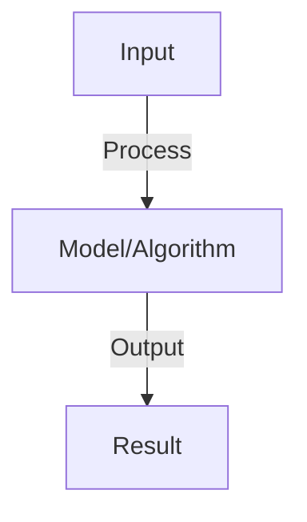

# Multimodal Fusion

## Detailed Explanation

Combine image and text representations in a shared embedding space for tasks like image captioning, visual question answering, and image-text retrieval

## Core Intuition

Combine image and text representations in a shared embedding space for tasks like image captioning, visual question answering, and image-text retrieval Core idea: understand the fundamental principle and how it applies.

## How It Works

1. Encode images with CNN/ViT → image embeddings (2048D)
2. Encode text with BERT/GPT → text embeddings (768D)
3. Project both to shared dimension (e.g., 256D)
4. Compute similarity: cosine distance in shared space
5. Contrastive learning: pull matching pairs close, push mismatched pairs apart
6. Applications: CLIP (image-text matching), BLIP (captioning), LLaVA (vision-language models)

## Architecture / Trade-offs

Trade-off 1 vs trade-off 2 — consider context and requirements.

## Interview Q&A

**Q: What is the key insight in CLIP?**
A: Train on 400M image-text pairs with contrastive loss: similar pairs have high cosine similarity, dissimilar pairs have low. Results in aligned embedding space without labeled data.

**Q: How do you handle modality gaps?**
A: Modalities have different dimensionality and structure (image 2048D, text 768D). Solution: project to shared space (256D). Train end-to-end so projections are mutually aligned.

**Q: What's the difference between early fusion and late fusion?**
A: Early: concatenate features before processing (sensitive to modality differences). Late: process separately, combine at end (more modality-agnostic). ViLBERT uses late fusion for vision-language.

**Q: How do you evaluate multimodal models?**
A: Image-text retrieval: rank images for query, measure recall@k. Image captioning: BLEU/CIDEr scores. VQA: accuracy on questions. Use cross-modal metrics (retrieval) and task-specific metrics.

**Q: What is the role of negative sampling in contrastive learning?**
A: Without negatives, model could collapse (all embeddings identical). Negatives force discrimination: positive pair distance < negative pair distance. Batch size matters: larger batches = more negatives = better learning.

## Best Practices

- Research and implement best practices as you learn the concept
- Consider production implications and scalability
- Test on realistic data and benchmarks
- Monitor performance and iterate

## Common Pitfalls

- Oversimplifying the problem — understand nuances
- Ignoring computational costs and practicality
- Not validating assumptions with real data
- Premature optimization without profiling

## Code Examples

See concept implementation and real-world examples in the associated notebook.

## Related Concepts

- Review foundational concepts first
- Understand prerequisites before advanced topics
- Connect concepts to build integrated knowledge
