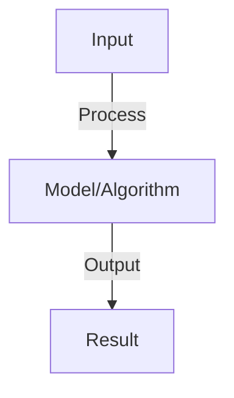

# Model Interpretability

## Detailed Explanation

Understand what features and patterns neural networks learn by visualizing attention, probing hidden representations, and analyzing decision boundaries

## Core Intuition

Understand what features and patterns neural networks learn by visualizing attention, probing hidden representations, and analyzing decision boundaries Core idea: understand the fundamental principle and how it applies.

## How It Works

1. Attention visualization: show which tokens attend to which (heatmaps)
2. Feature attribution: which input features contributed most to prediction
   - Gradient-based: ∂output/∂input (saliency maps)
   - Perturbation: remove tokens, measure output change
3. Probing: train classifier on hidden representations to extract information
4. Representation analysis: PCA/t-SNE on embeddings to visualize clusters
5. Layer-wise relevance propagation: trace predictions back through layers

## Architecture / Trade-offs

### Model Interpretability Architecture

| Component | Role | Trade-off |
|-----------|------|-----------|
| **Core** | Primary functionality | Complexity vs effectiveness |
| **Support** | Auxiliary systems | Overhead vs robustness |

### Design Considerations

- **Scalability:** System scales with data and model size
- **Efficiency:** Computational and memory trade-offs
- **Flexibility:** Adaptability to different tasks
- **Robustness:** Handling edge cases and failures

### Implementation Strategy

- **Baseline:** Start with simple approach
- **Iterate:** Measure and optimize bottlenecks
- **Validate:** Test on representative data

## Interview Q&A

**Q: What can attention heatmaps tell us?**
A: They show which tokens the model focuses on for a prediction. Not always interpretable (attention != explanation), but useful for debugging. Multi-head attention shows different patterns per head.

**Q: What is probing and how is it different from inspection?**
A: Probing: train a classifier on hidden representations to check if information exists. Inspection: look at activations directly. Probing is more rigorous: shows what a decoder can extract, not what the model actually uses.

**Q: What's the difference between saliency and attribution?**
A: Saliency: gradient ∂y/∂x (local linear approximation). Attribution: integrated gradients (path from baseline to input, sums gradients). Attribution more stable, saliency faster.

**Q: Can attention really explain model decisions?**
A: Not always. Attention is computed, but model may make decisions based on hidden computation before attention. Attention is correlated with important features but not causal. Use with caution.

**Q: How do you interpret embeddings from language models?**
A: PCA: reduce to 2D, look for clusters (synonyms close?). Nearest neighbors: find similar words. Probing classifiers: train on known properties (gender, tense). Combinations give best insight.

## Best Practices

- Research and implement best practices as you learn the concept
- Consider production implications and scalability
- Test on realistic data and benchmarks
- Monitor performance and iterate

## Common Pitfalls

- Oversimplifying the problem — understand nuances
- Ignoring computational costs and practicality
- Not validating assumptions with real data
- Premature optimization without profiling

## Code Examples

See concept implementation and real-world examples in the associated notebook.

## Related Concepts

- Review foundational concepts first
- Understand prerequisites before advanced topics
- Connect concepts to build integrated knowledge
