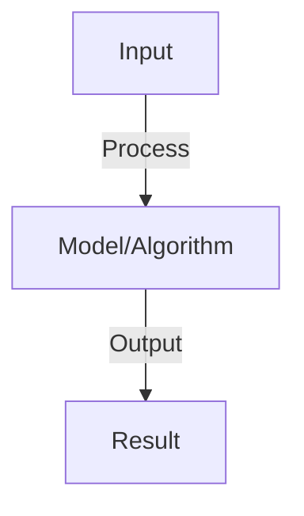

# Knowledge Distillation

## Detailed Explanation

Knowledge distillation transfers knowledge from a large, complex teacher model to a smaller, faster student model by training the student to mimic the teacher's outputs. This enables deploying capable models on resource-constrained devices (phones, edge servers) while maintaining reasonable performance. The key insight is that the teacher's soft predictions (probability distributions) contain more information than just the hard labels, teaching the student not just what to predict but the confidence and uncertainty of the teacher.

The training objective combines two losses: (1) matching the teacher's soft predictions (using temperature-scaled softmax to extract fine-grained probability information), (2) matching true labels (preserving task performance). The temperature parameter controls the softness of predictions—higher temperature reveals more about the teacher's reasoning patterns. Distillation works because teachers learn rich internal representations that capture task structure; students trained to mimic these patterns learn more efficiently than from scratch.

Knowledge distillation is crucial for practical deployment of modern large models. It enables building systems that are fast enough for real-time use while retaining much of the capable model's knowledge. Understanding it requires appreciating the difference between hard labels and soft probability distributions, and recognizing that simpler models can learn sophisticated behavior by studying complex teachers.

## Core Intuition

A master chess player coaching a student doesn't just say 'move the knight here.' Instead, they explain 'the knight move is good because it attacks three pieces while staying protected, and here's why that's stronger than the other moves I considered.' The student learns faster by understanding the master's reasoning. Knowledge distillation teaches student models the 'reasoning' of teacher models.

## How It Works

1. Teacher model: large pre-trained model (175B GPT-3 or 70B Llama)
2. Student model: smaller model to be trained (7B, 3B, or 1B parameters)
3. Distillation loss: KL divergence between teacher and student logits
4. Temperature scaling: soften probability distributions for better learning
5. Data: teacher predictions on large corpus (unlabeled data OK)
6. Training: minimize L = α * student_loss + (1-α) * KL(teacher, student)
7. Result: student 70-90% of teacher performance at 10-100x efficiency

## Architecture / Trade-offs

Key trade-offs and design considerations for this concept.

## Interview Q&A

**Q: Why does distillation work if student has fewer parameters?**
A: Teacher provides soft targets (probability distributions), not hard labels. These contain more information than one-hot labels. Student learns patterns, not memorizes. Similar to learning from expert rather than raw data.

**Q: How do you choose temperature in distillation?**
A: Higher temperature (T>1): soften probabilities, more information transfer but slower learning. Lower temperature (T<1): sharper probabilities, faster learning but less information. Typical range: T=3-20. Tune on validation set.

**Q: Can you distill an LLM to a much smaller model (10x smaller)?**
A: Possible but challenging: 90-95% performance loss acceptable for many tasks. Key: task-specific distillation (focus on target task, not general knowledge). Use intermediate-sized teacher (not largest), more training data, longer training.

**Q: What's better: distillation or quantization?**
A: Distillation: smaller model with fewer parameters (can run on CPU). Quantization: same size, fewer bits per weight (still large but faster). Can combine both. Distillation better for extreme size reduction, quantization better for speed.

**Q: How do you evaluate distillation?**
A: Measure: (1) student performance on task (accuracy, BLEU, etc.), (2) inference latency/memory, (3) training cost (time + compute). Compare: student alone vs distilled vs teacher. Report: accuracy-efficiency frontier.

## Best Practices

- Apply best practices specific to this concept
- Consider edge cases and failure modes
- Test on representative data
- Evaluate comprehensively

## Common Pitfalls

- Avoid over-simplification
- Watch for incorrect assumptions
- Test edge cases thoroughly
- Monitor for degradation

## Code Examples

See the associated notebook for implementation and real-world examples.

## Related Concepts

- Understand prerequisites first
- Connect related topics
- Build integrated knowledge
