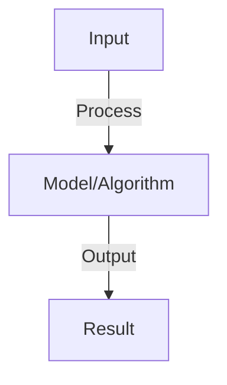

# Knowledge Distillation

## Detailed Explanation

Transfer knowledge from large teacher models to smaller student models for efficiency

## Core Intuition

Transfer knowledge from large teacher models to smaller student models for efficiency Understanding this concept enables better system design and problem-solving.

## How It Works

1. Teacher model: large pre-trained model (175B GPT-3 or 70B Llama)
2. Student model: smaller model to be trained (7B, 3B, or 1B parameters)
3. Distillation loss: KL divergence between teacher and student logits
4. Temperature scaling: soften probability distributions for better learning
5. Data: teacher predictions on large corpus (unlabeled data OK)
6. Training: minimize L = α * student_loss + (1-α) * KL(teacher, student)
7. Result: student 70-90% of teacher performance at 10-100x efficiency

## Architecture / Trade-offs

Key trade-offs and design considerations for this concept.

## Interview Q&A

**Q: Why does distillation work if student has fewer parameters?**
A: Teacher provides soft targets (probability distributions), not hard labels. These contain more information than one-hot labels. Student learns patterns, not memorizes. Similar to learning from expert rather than raw data.

**Q: How do you choose temperature in distillation?**
A: Higher temperature (T>1): soften probabilities, more information transfer but slower learning. Lower temperature (T<1): sharper probabilities, faster learning but less information. Typical range: T=3-20. Tune on validation set.

**Q: Can you distill an LLM to a much smaller model (10x smaller)?**
A: Possible but challenging: 90-95% performance loss acceptable for many tasks. Key: task-specific distillation (focus on target task, not general knowledge). Use intermediate-sized teacher (not largest), more training data, longer training.

**Q: What's better: distillation or quantization?**
A: Distillation: smaller model with fewer parameters (can run on CPU). Quantization: same size, fewer bits per weight (still large but faster). Can combine both. Distillation better for extreme size reduction, quantization better for speed.

**Q: How do you evaluate distillation?**
A: Measure: (1) student performance on task (accuracy, BLEU, etc.), (2) inference latency/memory, (3) training cost (time + compute). Compare: student alone vs distilled vs teacher. Report: accuracy-efficiency frontier.

## Best Practices

- Apply best practices specific to this concept
- Consider edge cases and failure modes
- Test on representative data
- Evaluate comprehensively

## Common Pitfalls

- Avoid over-simplification
- Watch for incorrect assumptions
- Test edge cases thoroughly
- Monitor for degradation

## Code Examples

See the associated notebook for implementation and real-world examples.

## Related Concepts

- Understand prerequisites first
- Connect related topics
- Build integrated knowledge
