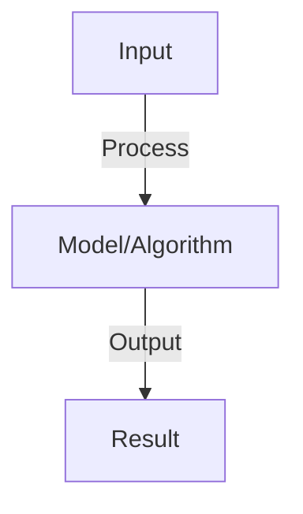

# Neural Architecture Search

## Detailed Explanation

Automatically find optimal neural network architectures instead of manual design

## Core Intuition

Automatically find optimal neural network architectures instead of manual design Understanding this concept enables better system design and problem-solving.

## How It Works

1. Search space: define possible operations (layers, attention heads, dimensions)
2. Search strategy: random search, grid search, reinforcement learning, evolutionary algorithms
3. Reinforcement learning approach: controller network generates architectures
4. Evaluation: train architecture candidate, measure accuracy + latency
5. Reward: accuracy - λ * latency (trade-off between performance and efficiency)
6. Iterate: generate new architectures based on successful designs
7. Output: optimal architecture (AutoML)

## Architecture / Trade-offs

Key trade-offs and design considerations for this concept.

## Interview Q&A

**Q: Why is NAS expensive and how do you reduce cost?**
A: NAS trains hundreds of models, each taking hours. Expensive because: full training per candidate. Reduce: (1) early stopping (train only 10 epochs), (2) weight sharing (reuse weights across architectures), (3) proxy tasks (smaller dataset), (4) Bayesian optimization (fewer candidates).

**Q: What are differentiable NAS and evolutionary NAS?**
A: Differentiable (DARTS): continuous relaxation of architecture search, gradient-based optimization. Fast (hours vs days). Evolutionary: mutation/crossover of architecture genes, population-based. Slower but more flexible. DARTS better for time-constrained, evolutionary more thorough.

**Q: Can NAS find good architectures for LLMs?**
A: Yes but expensive: LLM search space huge (embedding dim, heads, layers, hidden size). Cost: millions of GPU hours. Recent work: search for small LLMs (efficient architectures), search for adapters (not full models). Practical: use human-guided search (architect suggests promising configurations).

**Q: How do you avoid getting stuck in local optima in NAS?**
A: Use population-based methods (evolutionary), not greedy. Diversity: encourage exploration of different architecture families. Multi-objective: optimize for multiple metrics (accuracy, latency, memory) to escape single-objective local optima.

**Q: What is Bayesian optimization in NAS?**
A: Gaussian process models performance as function of architecture parameters. Iteratively: (1) sample next architecture (exploit high expected performance + explore uncertainty), (2) train + evaluate, (3) update model. Fewer evaluations than random search (10-100x speedup).

## Best Practices

- Apply best practices specific to this concept
- Consider edge cases and failure modes
- Test on representative data
- Evaluate comprehensively

## Common Pitfalls

- Avoid over-simplification
- Watch for incorrect assumptions
- Test edge cases thoroughly
- Monitor for degradation

## Code Examples

See the associated notebook for implementation and real-world examples.

## Related Concepts

- Understand prerequisites first
- Connect related topics
- Build integrated knowledge
