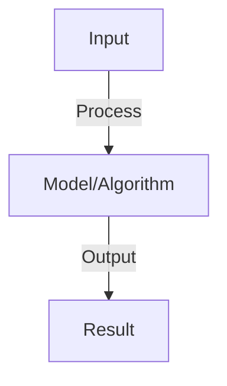
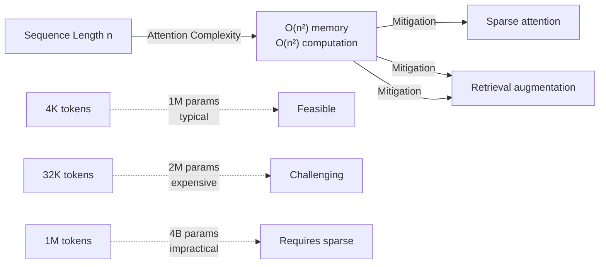

# Long-Context Handling

## Detailed Explanation

Long context handling addresses the fundamental limitation that transformers have O(n²) memory and computation complexity in sequence length, making them unable to efficiently process very long documents (books, codebases, long conversations). This is increasingly important as applications demand understanding of extensive context: legal documents, medical records, scientific papers, and multi-turn conversations spanning many turns. Current models are typically limited to 2-8K tokens; handling 100K+ tokens requires rethinking architecture, inference, and training.

Approaches to handle long contexts include: (1) Sparse attention patterns (attending to only important positions instead of all positions), (2) Hierarchical processing (summarizing chunks, then attending between summaries), (3) Retrieval-based methods (finding relevant portions rather than processing everything), (4) Sliding window (attending only to recent context), and (5) New architectures (Mamba, state-space models) that replace self-attention with more efficient mechanisms. Each trades off different properties: sparse attention maintains expressiveness but needs careful pattern design, retrieval-based methods need fast search mechanisms, while new architectures need retraining from scratch.

Long context is crucial for real-world applications where complete context matters. Understanding it requires appreciating computational constraints, the trade-off between context length and inference speed, and recognizing that not all positions are equally important (recent tokens and relevant earlier information matter most).

## Core Intuition

A person can barely remember a 100-page document in detail but recalls key points and important sections. Transformers face similar challenge: remember everything takes too much brain power. Long context solutions work like humans: attend carefully to what matters (recent messages, relevant previous context), skim less important parts, or look up specific information when needed.

## How It Works

1. Context window: max sequence length (GPT-4: 8K-128K, Llama: 4K-100K)
2. Challenge: transformers have O(n²) complexity, can't process unlimited length
3. Approaches:
   - Sliding window: process chunks, maintain state across chunks
   - Sparse attention: attend to every k-th token, reduce complexity to O(n log n)
   - Hierarchical: summarize chunks, attend to summaries not raw tokens
   - Retrieval-augmented: retrieve relevant chunks, don't process all
4. Long-context training: train on progressively longer sequences
5. Position interpolation: reuse position embeddings trained on shorter context

## Architecture / Trade-offs

### Context Length vs Computation

### Trade-offs: Context Length

| Method | Max Context | Speed | Memory | Quality |
|--------|-------------|-------|--------|---------|
| **Dense Attention** | 4-8K | Fast | Medium | Excellent |
| **Sparse Patterns** | 32K | Medium | Medium | Good |
| **Hierarchical** | 64K+ | Slow | High | Medium |
| **Retrieval-based** | Unlimited | Variable | Variable | Depends on retrieval |
| **State-space models** | 1M+ | Fast | Low | Emerging |
## Interview Q&A

**Q: How do sliding window and recurrence help with long contexts?**
A: Sliding window: process document in chunks (2K-4K tokens), keep hidden state. Recurrence: pass compressed state to next chunk. Tradeoff: some information loss at chunk boundaries but enables processing of 100K+ documents.

**Q: What is ALiBi and position interpolation?**
A: ALiBi (Attention with Linear Biases): replace sinusoidal position embeddings with learnable relative position biases. Position interpolation: scale position embeddings to longer lengths. Both enable extending context beyond training length without retraining.

**Q: How does retrieval-augmented generation avoid long context limits?**
A: Instead of processing entire document, retrieve most relevant chunks (BM25 or dense retrieval). Process retrieved chunks (2K-4K) not full document. Enables effective use of very long documents (100K+) with standard context windows.

**Q: What is the cost of processing long contexts?**
A: O(n²) for standard attention: 2x context = 4x compute. Sparse/hierarchical reduce to O(n log n). Cost tradeoff: faster inference but lower quality (may miss relevant distant context). Measure on task performance.

**Q: Can you extend any model to longer context?**
A: Partially: ALiBi and position interpolation work on many models. Challenge: model may not have seen long sequences in training, learns to ignore distant tokens. Better: models trained on long context from start (Llama 2 100K, GPT-4 128K). Fine-tuning helps but expensive.

## Best Practices

- Apply best practices specific to this concept
- Consider edge cases and failure modes
- Test on representative data
- Evaluate comprehensively

## Common Pitfalls

- Avoid over-simplification
- Watch for incorrect assumptions
- Test edge cases thoroughly
- Monitor for degradation

## Code Examples

See the associated notebook for implementation and real-world examples.

## Related Concepts

- Understand prerequisites first
- Connect related topics
- Build integrated knowledge
