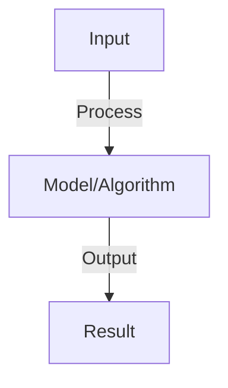

# Long-Context Handling

## Detailed Explanation

Process very long documents (100K+ tokens) beyond typical context windows

## Core Intuition

Process very long documents (100K+ tokens) beyond typical context windows Understanding this concept enables better system design and problem-solving.

## How It Works

1. Context window: max sequence length (GPT-4: 8K-128K, Llama: 4K-100K)
2. Challenge: transformers have O(n²) complexity, can't process unlimited length
3. Approaches:
   - Sliding window: process chunks, maintain state across chunks
   - Sparse attention: attend to every k-th token, reduce complexity to O(n log n)
   - Hierarchical: summarize chunks, attend to summaries not raw tokens
   - Retrieval-augmented: retrieve relevant chunks, don't process all
4. Long-context training: train on progressively longer sequences
5. Position interpolation: reuse position embeddings trained on shorter context

## Architecture / Trade-offs

Key trade-offs and design considerations for this concept.

## Interview Q&A

**Q: How do sliding window and recurrence help with long contexts?**
A: Sliding window: process document in chunks (2K-4K tokens), keep hidden state. Recurrence: pass compressed state to next chunk. Tradeoff: some information loss at chunk boundaries but enables processing of 100K+ documents.

**Q: What is ALiBi and position interpolation?**
A: ALiBi (Attention with Linear Biases): replace sinusoidal position embeddings with learnable relative position biases. Position interpolation: scale position embeddings to longer lengths. Both enable extending context beyond training length without retraining.

**Q: How does retrieval-augmented generation avoid long context limits?**
A: Instead of processing entire document, retrieve most relevant chunks (BM25 or dense retrieval). Process retrieved chunks (2K-4K) not full document. Enables effective use of very long documents (100K+) with standard context windows.

**Q: What is the cost of processing long contexts?**
A: O(n²) for standard attention: 2x context = 4x compute. Sparse/hierarchical reduce to O(n log n). Cost tradeoff: faster inference but lower quality (may miss relevant distant context). Measure on task performance.

**Q: Can you extend any model to longer context?**
A: Partially: ALiBi and position interpolation work on many models. Challenge: model may not have seen long sequences in training, learns to ignore distant tokens. Better: models trained on long context from start (Llama 2 100K, GPT-4 128K). Fine-tuning helps but expensive.

## Best Practices

- Apply best practices specific to this concept
- Consider edge cases and failure modes
- Test on representative data
- Evaluate comprehensively

## Common Pitfalls

- Avoid over-simplification
- Watch for incorrect assumptions
- Test edge cases thoroughly
- Monitor for degradation

## Code Examples

See the associated notebook for implementation and real-world examples.

## Related Concepts

- Understand prerequisites first
- Connect related topics
- Build integrated knowledge
