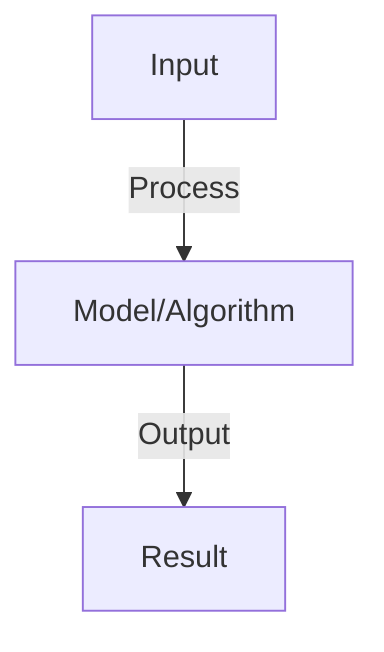
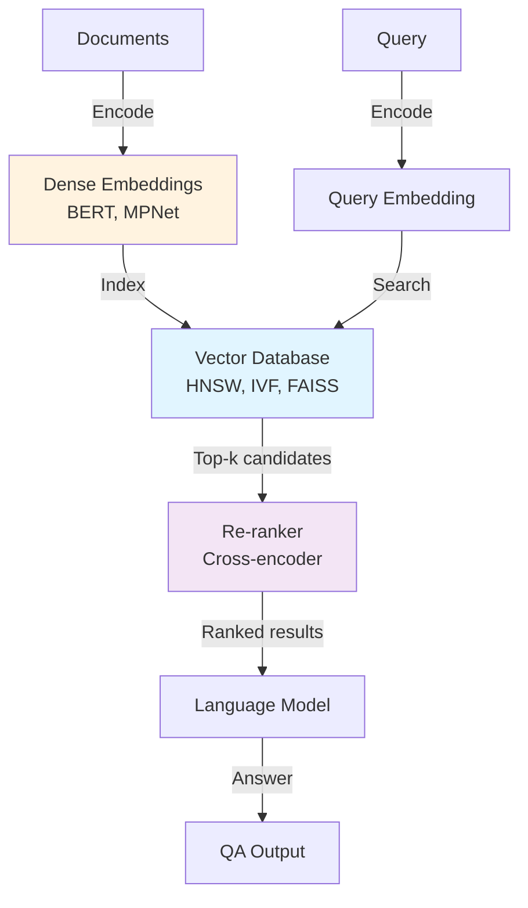

# Retrieval Systems

## Detailed Explanation

Retrieval systems find relevant documents or information snippets matching a query, forming the backbone of modern search, question-answering, and retrieval-augmented generation (RAG). Unlike generation models that produce text from parameters alone, retrieval systems complement language models by finding relevant context, enabling them to answer questions about external knowledge without retraining on new data.

Key components: (1) Text encoding (converting documents and queries to dense vectors using embedding models), (2) Indexing (organizing millions of vectors for fast search using approximate nearest neighbor methods like HNSW or locality-sensitive hashing), (3) Ranking (efficiently finding top-k most relevant documents from billions), (4) Integration (combining retrieval with generation for end-to-end QA). The challenge is balancing speed (returning results in milliseconds) against relevance (finding documents that genuinely answer the question). Techniques like dense passage retrieval, cross-encoders for re-ranking, and hybrid methods combining keyword and semantic search address these trade-offs.

Retrieval systems are crucial for scaling language models to external knowledge without retraining, enabling applications from search engines to specialized QA systems. Understanding them requires knowledge of vector similarity, approximate nearest neighbor search, and the distinction between recall (finding relevant documents) and precision (ensuring found documents are relevant).

## Core Intuition

When answering a question about current events, you don't have that knowledge in your head. Instead, you'd search for articles, read them, then answer the question based on what you found. Retrieval systems work exactly this way: they find relevant documents, the language model reads them, and generates an answer. This separates knowledge storage (documents) from reasoning (language model).

## How It Works

1. Query: user question or task
2. Retrieval: find most relevant documents
   - Sparse retrieval: BM25 (keyword matching, TF-IDF), fast but limited semantic understanding
   - Dense retrieval: embed query and documents, cosine similarity, slower but semantic
3. Ranking: re-rank top candidates with more sophisticated model
4. Indexing: store document embeddings in vector database (Pinecone, Weaviate, Milvus)
5. Pipeline: query embedding → vector search → dense ranking → return top-k
6. Evaluation: recall@k (was right doc in top-k?), MRR (rank of first relevant doc)

## Architecture / Trade-offs

### Retrieval System Architecture

### Retrieval Methods Trade-offs

| Method | Speed | Accuracy | Memory | Scalability |
|--------|-------|----------|--------|-------------|
| **Lexical (BM25)** | Very fast | Moderate | Low | Excellent |
| **Dense (DPR)** | Slow | High | High | Moderate |
| **Hybrid** | Medium | Very high | High | Good |
| **Approximate NN** | Fast | High | Medium | Excellent |
| **Reranking** | Slower | Much higher | Low | Good |
## Interview Q&A

**Q: When should you use BM25 vs dense retrieval?**
A: BM25: exact keyword matches, fast, works for domain with jargon. Dense: semantic understanding, slow, works across paraphrases. Hybrid: BM25 initial retrieval (100 candidates) + dense re-ranking. Typical: dense + sparse together.

**Q: What is vector quantization and why does it matter?**
A: VQ: compress embeddings (8-bit instead of 32-bit). Reduces storage (4x) and speeds search (fewer bytes to compare). Tradeoff: small accuracy loss (typically <1%). Essential for very large indexes (billions of documents).

**Q: How do you handle out-of-domain queries in retrieval?**
A: Challenge: model trained on domain A, query from domain B. Solutions: (1) fine-tune on target domain, (2) ensemble multiple retrievers, (3) use universal embeddings (trained on many domains), (4) detect out-of-domain and alert user.

**Q: What is the difference between retrieval and re-ranking?**
A: Retrieval: fast, retrieve 100-1000 candidates (recall focused). Re-ranking: slower, reorder top candidates with expensive model (precision focused). Together: get high recall + high precision. Typical: BM25 retrieval + dense re-ranking.

**Q: How do you evaluate retrieval quality?**
A: Metrics: recall@k (relevant doc in top-k?), NDCG (position of relevant docs matter), MRR (rank of first), precision@k (% of top-k relevant). Task matters: sometimes recall@1 critical, sometimes need top-10 for diversity.

## Best Practices

- Apply best practices specific to this concept
- Consider edge cases and failure modes
- Test on representative data
- Evaluate comprehensively

## Common Pitfalls

- Avoid over-simplification
- Watch for incorrect assumptions
- Test edge cases thoroughly
- Monitor for degradation

## Code Examples

See the associated notebook for implementation and real-world examples.

## Related Concepts

- Understand prerequisites first
- Connect related topics
- Build integrated knowledge
