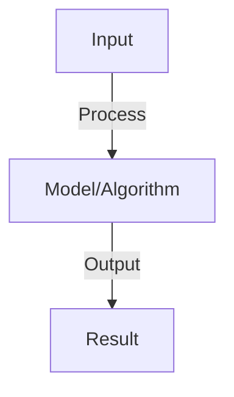

# Retrieval Systems

## Detailed Explanation

Efficiently search and retrieve relevant information from large document collections

## Core Intuition

Efficiently search and retrieve relevant information from large document collections Understanding this concept enables better system design and problem-solving.

## How It Works

1. Query: user question or task
2. Retrieval: find most relevant documents
   - Sparse retrieval: BM25 (keyword matching, TF-IDF), fast but limited semantic understanding
   - Dense retrieval: embed query and documents, cosine similarity, slower but semantic
3. Ranking: re-rank top candidates with more sophisticated model
4. Indexing: store document embeddings in vector database (Pinecone, Weaviate, Milvus)
5. Pipeline: query embedding → vector search → dense ranking → return top-k
6. Evaluation: recall@k (was right doc in top-k?), MRR (rank of first relevant doc)

## Architecture / Trade-offs

Key trade-offs and design considerations for this concept.

## Interview Q&A

**Q: When should you use BM25 vs dense retrieval?**
A: BM25: exact keyword matches, fast, works for domain with jargon. Dense: semantic understanding, slow, works across paraphrases. Hybrid: BM25 initial retrieval (100 candidates) + dense re-ranking. Typical: dense + sparse together.

**Q: What is vector quantization and why does it matter?**
A: VQ: compress embeddings (8-bit instead of 32-bit). Reduces storage (4x) and speeds search (fewer bytes to compare). Tradeoff: small accuracy loss (typically <1%). Essential for very large indexes (billions of documents).

**Q: How do you handle out-of-domain queries in retrieval?**
A: Challenge: model trained on domain A, query from domain B. Solutions: (1) fine-tune on target domain, (2) ensemble multiple retrievers, (3) use universal embeddings (trained on many domains), (4) detect out-of-domain and alert user.

**Q: What is the difference between retrieval and re-ranking?**
A: Retrieval: fast, retrieve 100-1000 candidates (recall focused). Re-ranking: slower, reorder top candidates with expensive model (precision focused). Together: get high recall + high precision. Typical: BM25 retrieval + dense re-ranking.

**Q: How do you evaluate retrieval quality?**
A: Metrics: recall@k (relevant doc in top-k?), NDCG (position of relevant docs matter), MRR (rank of first), precision@k (% of top-k relevant). Task matters: sometimes recall@1 critical, sometimes need top-10 for diversity.

## Best Practices

- Apply best practices specific to this concept
- Consider edge cases and failure modes
- Test on representative data
- Evaluate comprehensively

## Common Pitfalls

- Avoid over-simplification
- Watch for incorrect assumptions
- Test edge cases thoroughly
- Monitor for degradation

## Code Examples

See the associated notebook for implementation and real-world examples.

## Related Concepts

- Understand prerequisites first
- Connect related topics
- Build integrated knowledge
