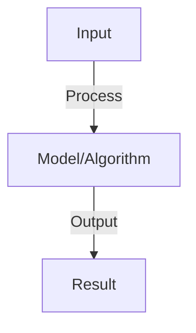
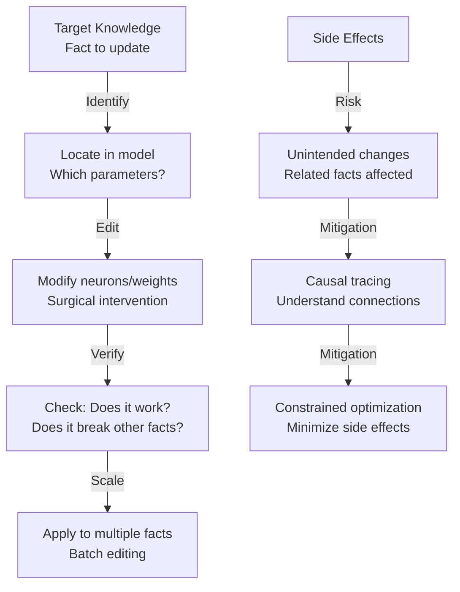

# Model Editing

## Detailed Explanation

Model editing updates specific knowledge or behaviors in trained language models without full retraining. As models become larger and more capable, retraining to fix errors or update knowledge becomes prohibitively expensive. Model editing provides lightweight alternatives: targeted interventions that modify model behavior for specific inputs or concepts while preserving overall capabilities. Applications include correcting factual errors ('Paris is the capital of France' if the model says otherwise), updating outdated information, or removing harmful capabilities.

Techniques vary in scope: (1) In-context learning (adding corrected information to the prompt), (2) Fine-tuning (training on small correction datasets), (3) Weight editing (directly modifying parameters based on analysis of model internals), and (4) Representation editing (changing activations in intermediate layers). Trade-offs differ: in-context is simple but uses context length, fine-tuning is reliable but may cause forgetting or shift other behaviors, weight editing is efficient but requires understanding model internals. Recent work has focused on locating where specific knowledge is stored in models, enabling surgical edits.

Model editing is increasingly important as models become deployed and new facts emerge or errors are discovered. Understanding it requires appreciation for how knowledge is distributed across model parameters, the dangers of side effects (editing one fact unintentionally breaks another), and the difference between fixing surface behaviors and underlying knowledge.

## Core Intuition

If you were a giant library and someone discovered we got one historical date wrong, you'd want to fix just that one piece of knowledge rather than reorganize the entire library. Model editing is like precision surgery: instead of rebuilding the model, we reach in and fix specific wrong knowledge, hopefully without breaking anything else.

## How It Works

1. Problem: model learned incorrect fact, wants to update without full retraining
2. Approach: rank-one model editing (ROME), modify specific neuron activations
3. ROME: identify neurons storing fact, update their weights slightly
4. Process:
   - Locate fact: find layer and neurons responding to query
   - Compute update: gradient to maximize correct answer
   - Apply: update weights in target neurons only
5. Alternative: in-context editing (provide correct info in prompt, model learns from context)
6. Evaluation: does edit work? Does it break other facts? How stable?

## Architecture / Trade-offs

### Knowledge Editing Methods

### Editing Approaches Trade-offs

| Approach | Precision | Side Effects | Speed | Generality |
|----------|-----------|--------------|-------|-----------|
| **Layer-wise** | Medium | High | Fast | Low |
| **Weight editing** | High | Variable | Medium | Low |
| **LoRA fine-tuning** | High | Low | Slow | High |
| **In-context examples** | Medium | None | Instant | High |
## Interview Q&A

**Q: Why is model editing useful vs retraining?**
A: Retraining: expensive (hours/days, requires data). Editing: seconds, no data needed. Tradeoff: editing updates local facts, retraining updates model comprehensively. Edit for small corrections (fix typo in training data), retrain for systematic improvements.

**Q: How do you know which neurons store which facts?**
A: Mechanistic interpretability: trace information flow (activations at each layer). Identify layers/neurons that change when querying fact. Use probing classifiers: train small classifier on neuron activations, predicts fact value. Works surprisingly well.

**Q: Can you edit multiple facts without conflicts?**
A: Sequential editing: edit fact A, then fact B. Risk: fact B edit interferes with fact A update (write conflicts). Mitigations: (1) choose disjoint neurons, (2) detect conflicts and resolve, (3) joint editing (update multiple neurons simultaneously).

**Q: What is in-context editing and how does it differ from weight editing?**
A: In-context: include correct fact in prompt (context learning). Weight editing: modify model weights. In-context: temporary (only for this inference), no permanent change. Weight: persistent. Combined: in-context for quick fixes, weight for permanent updates.

**Q: How do you evaluate editing?**
A: Metrics: (1) target accuracy (does edit work?), (2) side effect (other facts broken?), (3) generalization (does it generalize to paraphrases?). Ideal: high target accuracy, low side effects, high generalization.

## Best Practices

- Apply best practices specific to this concept
- Consider edge cases and failure modes
- Test on representative data
- Evaluate comprehensively

## Common Pitfalls

- Avoid over-simplification
- Watch for incorrect assumptions
- Test edge cases thoroughly
- Monitor for degradation

## Code Examples

See the associated notebook for implementation and real-world examples.

## Related Concepts

- Understand prerequisites first
- Connect related topics
- Build integrated knowledge
