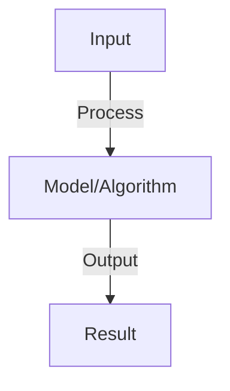

# Mixture of Experts (MoE)

## Detailed Explanation

Conditionally activate subsets of model parameters for improved efficiency and performance

## Core Intuition

Conditionally activate subsets of model parameters for improved efficiency and performance Understanding this concept enables better system design and problem-solving.

## How It Works

1. Expert networks: partition model into experts (separate networks)
2. Router network: decides which experts to use for each token
3. Process: token → router → select top-k experts → combine outputs
4. Advantages: activate only k of e experts (if e=8, k=2 → 75% params inactive)
5. Training: router learns what task each expert should specialize in
6. Load balancing: encourage router to use all experts evenly
7. Example: Switch Transformer (1.6T params, efficient), GPTQ-MoE variants

## Architecture / Trade-offs

Key trade-offs and design considerations for this concept.

## Interview Q&A

**Q: How does MoE reduce inference cost?**
A: Selective activation: if 128 experts but use 2, only compute for 2 experts. O(param_count / num_experts) speedup. Example: 1T model with 8 experts, use 2 → 14x speedup vs full model. Tradeoff: need specialized routing.

**Q: What is load balancing in MoE and why is it needed?**
A: Problem: router might overuse 1-2 experts (ignore others). Load balancing loss: penalizes imbalanced selection, encourages uniform usage. Why: unused experts waste capacity, load concentration causes bottlenecks.

**Q: How do you train the router network?**
A: Router: small network (1-2 layers) outputting logits over experts. Trained jointly with experts. Loss: task loss + load balance loss. Router learns through gradient descent which experts are useful for which inputs.

**Q: What is sparse MoE vs dense MoE?**
A: Sparse: each input uses small subset of experts (k=2 of 128). Dense: each input uses all experts (weighted, not sparse). Sparse much more efficient, denser slightly higher quality. Typical: sparse MoE for large models.

**Q: How do you handle MoE in distributed training?**
A: Challenge: experts might be unbalanced across devices (some devices compute more). Solution: (1) expert parallelism (distribute experts across devices), (2) dynamic load balancing (move computation to balance load), (3) auxiliary loss to encourage balanced expert usage.

## Best Practices

- Apply best practices specific to this concept
- Consider edge cases and failure modes
- Test on representative data
- Evaluate comprehensively

## Common Pitfalls

- Avoid over-simplification
- Watch for incorrect assumptions
- Test edge cases thoroughly
- Monitor for degradation

## Code Examples

See the associated notebook for implementation and real-world examples.

## Related Concepts

- Understand prerequisites first
- Connect related topics
- Build integrated knowledge
