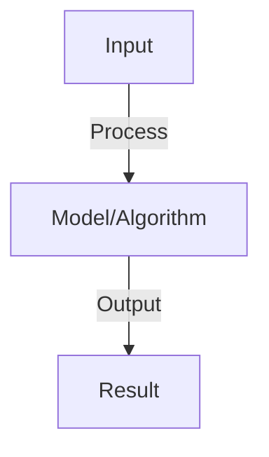
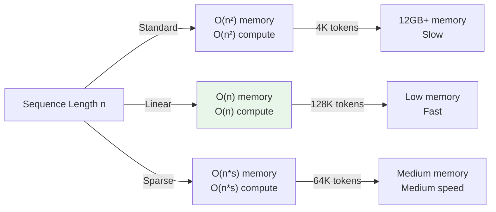

# Efficient Attention

## Detailed Explanation

Efficient attention mechanisms address the O(n²) complexity bottleneck of standard self-attention, which prevents transformers from handling very long sequences. Since attention requires computing similarity between every position and every other position, sequences longer than a few thousand tokens become prohibitively expensive. Modern applications demand longer contexts: document understanding (legal documents, books), code understanding (entire files or repositories), multi-turn conversations with history.

Approaches to efficient attention include: (1) Sparse attention (limiting which positions attend to which, e.g., sliding window only attends to nearby positions), (2) Approximate methods (using clever tricks to approximate the attention matrix without computing it fully), (3) Linear attention (rewriting attention computation to avoid the quadratic term), (4) Hierarchical approaches (attending first within chunks, then between chunks). Each trades computation against expressiveness: sparse attention is fast but might miss long-range dependencies, linear attention is efficient but loses the ability to select which previous tokens matter most.

Efficient attention is fundamental to scaling transformers beyond current limits. Understanding it requires mathematical sophistication (understanding how attention computation can be reorganized) and awareness of the specific bottleneck: computing the full attention matrix is O(n²), and efficient methods avoid computing or storing this full matrix.

## Core Intuition

Standard attention is like having a person remember every detail they've ever heard about the topic, comparing current input to every past fact. That's exhausting for long memories. Efficient attention is like having a person remember key facts and recent context, quickly skipping irrelevant details. Different efficient methods skip details differently—some remember recency, others remember importance, others remember specific structural patterns.

## How It Works

1. Standard attention: compute attention over all n tokens, O(n²) complexity
2. Bottleneck: long sequences intractable (2K context = 4M attention scores)
3. Efficient approaches:
   - Sparse attention: attend to local neighbors + random sampled tokens (BigBird, Longformer)
   - Low-rank: decompose attention matrix into lower-rank factors
   - Linear attention: use kernel trick, O(n) complexity
   - Flash Attention: hardware-aware, same complexity but much faster (4x speedup)
4. Implementation: choose based on sequence length and available hardware

## Architecture / Trade-offs

### Attention Mechanism Complexity

### Attention Approximation Methods

| Method | Complexity | Information Loss | Stability |
|--------|-----------|-----------------|-----------|
| **Full attention** | O(n²) | None | High |
| **Sliding window** | O(n) | High (missing long-range) | Very high |
| **Local + global** | O(n) | Low | High |
| **Linear attention** | O(n) | Medium (approximation) | Medium |
| **Hierarchical** | O(n log n) | Low | High |
| **Random projection** | O(n) | Medium | Low |
## Interview Q&A

**Q: What is Flash Attention and why is it so fast?**
A: Flash Attention: I/O aware algorithm, reduces memory access (main bottleneck). Groups computation to fit in GPU cache. Mathematically same result as standard attention but 4-10x faster in practice. No approximation, just better implementation.

**Q: How do sparse attention patterns work?**
A: Idea: don't attend to all tokens, only subset. Patterns: (1) local (attend to neighbors), (2) strided (attend to every k-th token), (3) random (attend to random subset). Reduces complexity to O(n log n). Slight accuracy loss but enables longer sequences.

**Q: What is linear attention and how does it work?**
A: Linear attention: replace softmax with kernel function (e.g., elu+1). Enables O(n) complexity using associativity: (QK^T)V = Q(K^T V). Tradeoff: lower quality than softmax, but much faster for very long sequences.

**Q: How do you choose between sparse and linear attention?**
A: Sparse: better accuracy (closer to full attention), moderate speedup (2-4x). Linear: fast (10x+) but lower quality. Choose based on: priority (accuracy vs speed), sequence length (sparse for 8K, linear for 100K+), domain (recurrent tasks tolerate approximation).

**Q: Can you combine efficient attention with long-context training?**
A: Yes, combine for best results: (1) efficient attention (Flash/sparse) during training, (2) position interpolation for longer context, (3) train on progressively longer sequences. Enables training on very long context (100K+) with reasonable compute.

## Best Practices

- Apply best practices specific to this concept
- Consider edge cases and failure modes
- Test on representative data
- Evaluate comprehensively

## Common Pitfalls

- Avoid over-simplification
- Watch for incorrect assumptions
- Test edge cases thoroughly
- Monitor for degradation

## Code Examples

See the associated notebook for implementation and real-world examples.

## Related Concepts

- Understand prerequisites first
- Connect related topics
- Build integrated knowledge
