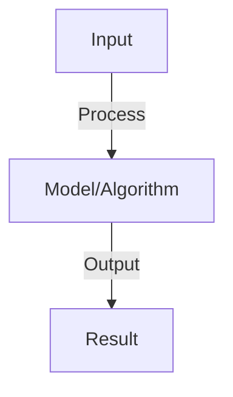

# Efficient Attention

## Detailed Explanation

Reduce O(n²) complexity of standard attention to enable longer sequences

## Core Intuition

Reduce O(n²) complexity of standard attention to enable longer sequences Understanding this concept enables better system design and problem-solving.

## How It Works

1. Standard attention: compute attention over all n tokens, O(n²) complexity
2. Bottleneck: long sequences intractable (2K context = 4M attention scores)
3. Efficient approaches:
   - Sparse attention: attend to local neighbors + random sampled tokens (BigBird, Longformer)
   - Low-rank: decompose attention matrix into lower-rank factors
   - Linear attention: use kernel trick, O(n) complexity
   - Flash Attention: hardware-aware, same complexity but much faster (4x speedup)
4. Implementation: choose based on sequence length and available hardware

## Architecture / Trade-offs

Key trade-offs and design considerations for this concept.

## Interview Q&A

**Q: What is Flash Attention and why is it so fast?**
A: Flash Attention: I/O aware algorithm, reduces memory access (main bottleneck). Groups computation to fit in GPU cache. Mathematically same result as standard attention but 4-10x faster in practice. No approximation, just better implementation.

**Q: How do sparse attention patterns work?**
A: Idea: don't attend to all tokens, only subset. Patterns: (1) local (attend to neighbors), (2) strided (attend to every k-th token), (3) random (attend to random subset). Reduces complexity to O(n log n). Slight accuracy loss but enables longer sequences.

**Q: What is linear attention and how does it work?**
A: Linear attention: replace softmax with kernel function (e.g., elu+1). Enables O(n) complexity using associativity: (QK^T)V = Q(K^T V). Tradeoff: lower quality than softmax, but much faster for very long sequences.

**Q: How do you choose between sparse and linear attention?**
A: Sparse: better accuracy (closer to full attention), moderate speedup (2-4x). Linear: fast (10x+) but lower quality. Choose based on: priority (accuracy vs speed), sequence length (sparse for 8K, linear for 100K+), domain (recurrent tasks tolerate approximation).

**Q: Can you combine efficient attention with long-context training?**
A: Yes, combine for best results: (1) efficient attention (Flash/sparse) during training, (2) position interpolation for longer context, (3) train on progressively longer sequences. Enables training on very long context (100K+) with reasonable compute.

## Best Practices

- Apply best practices specific to this concept
- Consider edge cases and failure modes
- Test on representative data
- Evaluate comprehensively

## Common Pitfalls

- Avoid over-simplification
- Watch for incorrect assumptions
- Test edge cases thoroughly
- Monitor for degradation

## Code Examples

See the associated notebook for implementation and real-world examples.

## Related Concepts

- Understand prerequisites first
- Connect related topics
- Build integrated knowledge
