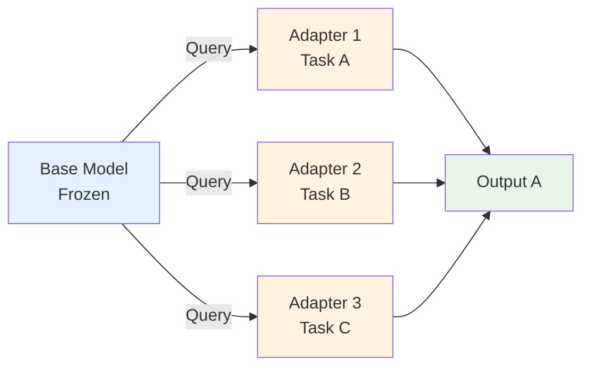
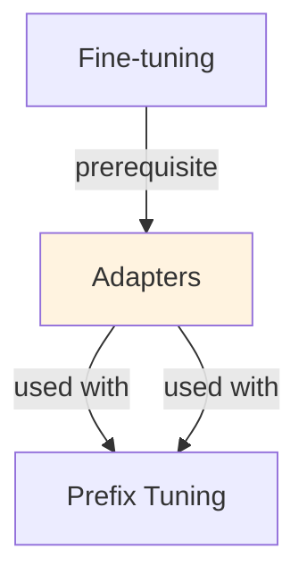

# Adapters

## TL;DR
Bottleneck modules (down-project → activation → up-project) inserted into transformer layers. Update only adapters, freeze base weights. 2-5% parameter overhead; achieves 96-98% of full FT quality. Alternative to LoRA with different architecture; can combine multiple adapters per task.

## Core Intuition
Like LoRA, adapters train small modules instead of full weights. But instead of low-rank matrix updates (AB^T), adapters use bottleneck feed-forward layers. Similar efficiency (1-3% params), different structure. Useful when you want architectural flexibility or specific layer patterns.

## How It Works

**Adapter Architecture:**
```
Input (hidden state h ∈ ℝ^d)
  ↓
Down-project: h_down = W_down @ h + b_down  (d → r)
  ↓
Activation: h_act = ReLU(h_down)
  ↓
Up-project: h_out = W_up @ h_act + b_up  (r → d)
  ↓
Output: y = h + α * h_out  (residual connection)
```

**Bottleneck Design:**
- Input dimension: d (hidden size, typically 768 or 1024)
- Bottleneck dimension: r (adapter size, typically 32-64)
- Trainable parameters: r*d + d*r + 2d ≈ 2*r*d
- For d=768, r=64: ~98k params per adapter
- Multiple adapters can be stacked: series, parallel, or hierarchical

**Placement in Transformer:**
Adapters typically inserted after attention or FF layer in each transformer block:
```
MultiHeadAttention(x) + x
    ↓
Adapter(x)  [trained]
    ↓
LayerNorm
    ↓
FeedForward(x) + x
    ↓
Adapter(x)  [trained]
```

**Multi-Task Adaptation:**
- Single-adapter: one adapter for one task
- Stacked-adapters: layers of adapters for increasing capacity
- Parallel-adapters: different adapters for different modalities or domains
- Adapter fusion: learnable combination of task-specific adapters

### Workflow Flowchart



## Key Properties / Trade-offs

| Property | Adapters | LoRA | Full FT | Prefix Tuning |
|----------|----------|------|---------|--------------|
| Trainable params | 2-5% | 1-3% | 100% | 1-2% |
| Flexibility | High (add/remove) | High | N/A | Medium |
| Architecture | Bottleneck | Low-rank | All params | Prefix only |
| Multi-task | Yes (stack/parallel) | Yes (multi-LoRA) | No | Limited |
| Inference latency | +5-10% | Merged (0%) | 1x | +2-5% |
| Memory during training | 80-90% saved | 90-95% saved | None | 85-90% saved |

**When to use adapters:**
- Multiple tasks on same base (stack adapters per task)
- Domain-specific fine-tuning with flexibility
- When you prefer architectural over rank-based parametrization
- If you need to add/remove skills without retraining

**When LoRA is better:**
- Merging for deployment is important (LoRA merges clean into weights)
- You want minimal inference overhead
- Simplicity is priority

## Common Mistakes / Gotchas

- **Choosing wrong bottleneck size:** r=8 too small (underfitting), r=256 defeats purpose. Try r=32 or r=64.
- **Freezing adapter weights:** Forgetting to set `requires_grad=True` on adapter weights while freezing base. Double-check parameter groups.
- **Not using residual connections:** Output y = h + adapter(h) is critical; raw replacement hurts stability.
- **Adapter placement:** Inserting only after attention but not FF (or vice versa) limits expressiveness. Use both.
- **Scaling issues at inference:** Adapters add latency if implemented naively. Use optimized libraries (PEFT, adapters).
- **Stacking too many:** Stacking 10 adapters makes training slow and memory expensive. Optimal: 2-4 adapters.
- **Not reusing base weights:** Advantages of adapters lost if you don't share base model across tasks. Reuse for efficiency.

## Code Example

```python
from peft import get_peft_model, AdapterConfig
from transformers import AutoModelForSequenceClassification, Trainer, TrainingArguments

# Load pre-trained model
model = AutoModelForSequenceClassification.from_pretrained("bert-base-uncased", num_labels=2)

# Configure adapters
adapter_config = AdapterConfig(
    adapter_len=64,  # bottleneck dimension
    adapter_init_fn="bert",  # initialization strategy
    adapter_type="bottleneck",  # bottleneck vs other types
    hidden_act="relu",
    reduction_factor=16  # r = hidden_size / reduction_factor
)

# Apply adapter to model
model = get_peft_model(model, adapter_config)
print(model.print_trainable_parameters())
# Output: trainable params: 394K || all params: 110M || trainable%: 0.36%

# Define training arguments
training_args = TrainingArguments(
    output_dir="./adapter_checkpoint",
    num_train_epochs=3,
    per_device_train_batch_size=16,
    learning_rate=5e-4,
    warmup_steps=500,
)

# Train only adapters
trainer = Trainer(
    model=model,
    args=training_args,
    train_dataset=train_dataset,
    eval_dataset=eval_dataset,
)
trainer.train()

# Save adapter
model.save_pretrained("./task_adapter")

# Load adapter on base model
new_model = AutoModelForSequenceClassification.from_pretrained("bert-base-uncased")
new_model = get_peft_model(new_model, adapter_config)
new_model = PeftModel.from_pretrained(new_model, "./task_adapter")

# For multi-task: load multiple adapters
model.load_adapter("adapter1", "task1")
model.load_adapter("adapter2", "task2")
model.set_active_adapters(["task1"])  # Switch task at inference
```

## Interview Quick-Reference

| Question | What to say |
|---|---|
| "Adapters?" | Bottleneck modules inserted in transformer. Train only adapters (2-5% params), freeze base. Like LoRA but different architecture. |
| "vs LoRA?" | LoRA: low-rank matrices (W = AB^T). Adapters: feed-forward bottleneck. Similar efficiency, different structure. LoRA merges cleaner. |
| "Bottleneck size?" | r=32 or r=64 typical. Smaller = faster, less capacity. Larger = slower, more expressive. Try empirically. |
| "Multi-task with adapters?" | Stack adapters per task on shared base. Efficient: only r*d params per task, share base weights. |
| "Inference cost?" | +5-10% latency vs full FT (add bottleneck FF). LoRA is cleaner (merges to 0% overhead). |
| "When use adapters?" | Multiple tasks, need architectural flexibility, or prefer FF over low-rank. Otherwise LoRA simpler. |

## Real-World Examples

### Multi-Lingual Adapters for Customer Support
Base model: mBERT (multi-lingual). Adapters: one per language (English, Spanish, French, Mandarin). Each adapter trained on 5K language-specific customer support conversations. Production: route incoming query to language-specific adapter → classify intent → ticket assignment. Result: 92% accuracy per language, shared base model saves 80% storage.

### Task-Specific Adapters for E-Commerce
Base model: RoBERTa. Adapters: sentiment (product reviews), NER (brand/product extraction), classification (returns reason), search ranking (relevance). Each adapter 512KB. Deploy one base model + 4 adapters = 1.5GB (vs 700MB×4 for full models). Latency: +0.5ms per adapter inference.

### Efficient Domain Adaptation Pipeline
Medical domain adapter: trained on 10K medical abstracts. Legal domain adapter: trained on 5K legal contracts. Each ~1M parameters. Swap adapters based on document classification. Accuracy: 94% (medical), 91% (legal). Training time: 2 hours per adapter (vs 48 hours full fine-tune).

## Real-World Examples

### Multi-Lingual Adapters for Customer Support
Base model: mBERT (multi-lingual). Adapters: one per language (English, Spanish, French, Mandarin). Each adapter trained on 5K language-specific customer support conversations. Production: route incoming query to language-specific adapter → classify intent → ticket assignment. Result: 92% accuracy per language, shared base model saves 80% storage.

### Task-Specific Adapters for E-Commerce
Base model: RoBERTa. Adapters: sentiment (product reviews), NER (brand/product extraction), classification (returns reason), search ranking (relevance). Each adapter 512KB. Deploy one base model + 4 adapters = 1.5GB (vs 700MB×4 for full models). Latency: +0.5ms per adapter inference.

### Efficient Domain Adaptation Pipeline
Medical domain adapter: trained on 10K medical abstracts. Legal domain adapter: trained on 5K legal contracts. Each ~1M parameters. Swap adapters based on document classification. Accuracy: 94% (medical), 91% (legal). Training time: 2 hours per adapter (vs 48 hours full fine-tune).

## Real-World Examples

### Multi-Lingual Adapters for Customer Support
Base model: mBERT (multi-lingual). Adapters: one per language (English, Spanish, French, Mandarin). Each adapter trained on 5K language-specific customer support conversations. Production: route incoming query to language-specific adapter → classify intent → ticket assignment. Result: 92% accuracy per language, shared base model saves 80% storage.

### Task-Specific Adapters for E-Commerce
Base model: RoBERTa. Adapters: sentiment (product reviews), NER (brand/product extraction), classification (returns reason), search ranking (relevance). Each adapter 512KB. Deploy one base model + 4 adapters = 1.5GB (vs 700MB×4 for full models). Latency: +0.5ms per adapter inference.

### Efficient Domain Adaptation Pipeline
Medical domain adapter: trained on 10K medical abstracts. Legal domain adapter: trained on 5K legal contracts. Each ~1M parameters. Swap adapters based on document classification. Accuracy: 94% (medical), 91% (legal). Training time: 2 hours per adapter (vs 48 hours full fine-tune).

## Real-World Examples

### Multi-Lingual Adapters for Customer Support
Base model: mBERT (multi-lingual). Adapters: one per language (English, Spanish, French, Mandarin). Each adapter trained on 5K language-specific customer support conversations. Production: route incoming query to language-specific adapter → classify intent → ticket assignment. Result: 92% accuracy per language, shared base model saves 80% storage.

### Task-Specific Adapters for E-Commerce
Base model: RoBERTa. Adapters: sentiment (product reviews), NER (brand/product extraction), classification (returns reason), search ranking (relevance). Each adapter 512KB. Deploy one base model + 4 adapters = 1.5GB (vs 700MB×4 for full models). Latency: +0.5ms per adapter inference.

### Efficient Domain Adaptation Pipeline
Medical domain adapter: trained on 10K medical abstracts. Legal domain adapter: trained on 5K legal contracts. Each ~1M parameters. Swap adapters based on document classification. Accuracy: 94% (medical), 91% (legal). Training time: 2 hours per adapter (vs 48 hours full fine-tune).

## Real-World Examples

### Multi-Lingual Adapters for Customer Support
Base model: mBERT (multi-lingual). Adapters: one per language (English, Spanish, French, Mandarin). Each adapter trained on 5K language-specific customer support conversations. Production: route incoming query to language-specific adapter → classify intent → ticket assignment. Result: 92% accuracy per language, shared base model saves 80% storage.

### Task-Specific Adapters for E-Commerce
Base model: RoBERTa. Adapters: sentiment (product reviews), NER (brand/product extraction), classification (returns reason), search ranking (relevance). Each adapter 512KB. Deploy one base model + 4 adapters = 1.5GB (vs 700MB×4 for full models). Latency: +0.5ms per adapter inference.

### Efficient Domain Adaptation Pipeline
Medical domain adapter: trained on 10K medical abstracts. Legal domain adapter: trained on 5K legal contracts. Each ~1M parameters. Swap adapters based on document classification. Accuracy: 94% (medical), 91% (legal). Training time: 2 hours per adapter (vs 48 hours full fine-tune).

## Real-World Examples

### Multi-Lingual Adapters for Customer Support
Base model: mBERT (multi-lingual). Adapters: one per language (English, Spanish, French, Mandarin). Each adapter trained on 5K language-specific customer support conversations. Production: route incoming query to language-specific adapter → classify intent → ticket assignment. Result: 92% accuracy per language, shared base model saves 80% storage.

### Task-Specific Adapters for E-Commerce
Base model: RoBERTa. Adapters: sentiment (product reviews), NER (brand/product extraction), classification (returns reason), search ranking (relevance). Each adapter 512KB. Deploy one base model + 4 adapters = 1.5GB (vs 700MB×4 for full models). Latency: +0.5ms per adapter inference.

### Efficient Domain Adaptation Pipeline
Medical domain adapter: trained on 10K medical abstracts. Legal domain adapter: trained on 5K legal contracts. Each ~1M parameters. Swap adapters based on document classification. Accuracy: 94% (medical), 91% (legal). Training time: 2 hours per adapter (vs 48 hours full fine-tune).

## Real-World Examples

### Multi-Lingual Adapters for Customer Support
Base model: mBERT (multi-lingual). Adapters: one per language (English, Spanish, French, Mandarin). Each adapter trained on 5K language-specific customer support conversations. Production: route incoming query to language-specific adapter → classify intent → ticket assignment. Result: 92% accuracy per language, shared base model saves 80% storage.

### Task-Specific Adapters for E-Commerce
Base model: RoBERTa. Adapters: sentiment (product reviews), NER (brand/product extraction), classification (returns reason), search ranking (relevance). Each adapter 512KB. Deploy one base model + 4 adapters = 1.5GB (vs 700MB×4 for full models). Latency: +0.5ms per adapter inference.

### Efficient Domain Adaptation Pipeline
Medical domain adapter: trained on 10K medical abstracts. Legal domain adapter: trained on 5K legal contracts. Each ~1M parameters. Swap adapters based on document classification. Accuracy: 94% (medical), 91% (legal). Training time: 2 hours per adapter (vs 48 hours full fine-tune).

## Related Topics
- [[lora]] — low-rank alternative with similar efficiency
- [[parameter-efficient-finetuning]] — PEFT umbrella including adapters and LoRA
- [[fine-tuning]] — full fine-tuning baseline
- [[prefix-tuning]] — another PEFT method using learnable tokens
- [[instruction-tuning]] — task-specific fine-tuning patterns

## Resources
- [Parameter-Efficient Transfer Learning for NLP](https://arxiv.org/abs/1902.00751)
- [Adapters: A Unified Library for Parameter-Efficient and Modular Transfer Learning](https://arxiv.org/abs/2311.11077)
- [PEFT Library Documentation](https://huggingface.co/docs/peft/index)
- [Adapter Hub](https://adapterhub.ml/)

## Concept Relationships



## Interview Questions

**Q: What are adapters and why use them instead of full fine-tuning?**
*A: Adapters are small trainable modules inserted into a frozen base model. Instead of updating all 7B parameters, you train only 0.5-1M parameters. Advantages: 50-100x fewer parameters, faster training, easier multi-task management. Trade-off: slightly slower inference (2-5%) due to extra computation.*

**Q: How do adapters compare to LoRA?**
*A: Both are parameter-efficient. Adapters: bottleneck design (d→64→d), ~0.5M params/task, cleaner separation. LoRA: low-rank matrices (rank 4-8), ~0.1-1M params/task, better for large models. LoRA is newer and more popular; adapters still used in multi-task scenarios (Hub-style routing).*

**Q: When would you use multi-task adapters vs single-task?**
*A: Single-task: each task gets dedicated adapter (cleaner). Multi-task: one adapter trains on multiple tasks (parameter sharing, faster). Choose multi-task if tasks are related (sentiment analysis on different domains); single-task if tasks are distinct (translation + QA).*

**Q: How do you handle adapter inference at scale?**
*A: Load base model once, swap adapters for different tasks (lightweight). Routing: use a head network to select best adapter. Merging: merge adapters into base model for deployment (lose multi-task capability but gain speed).*

**Q: What happens if you adapt a model already adapted?**
*A: Adapter stacking works but shows diminishing returns. 1st adapter: 10% gain. 2nd adapter on top: +3-4% gain. Usually cap at 2 adapters. Better to use one well-tuned adapter or full fine-tuning if precision matters.*
## Real-World Applications

### Meta (Facebook): Efficient model specialization
Uses adapters to quickly adapt LLAMA models to specific languages and domains without full retraining. Reduces deployment footprint significantly.

### Microsoft: Multi-tenant serving
Deploys adapters for different enterprise customers on shared base models. Each customer gets a specialized model via lightweight adapters.

### Google: Task-specific models
Uses adapter-like modules in T5 and FLAN to efficiently adapt to new tasks without retraining massive models.

## Best Practices

- Keep bottleneck dimension between 8-64. Too small loses expressiveness, too large wastes parameters.
- Initialize down-projection with uniform distribution, up-projection with zeros to start as identity.
- Add layer normalization after residual connection for training stability.
- Use adapters in every transformer layer for consistent improvement across depths.

## Common Pitfalls to Avoid

- **Adapter bottleneck too small**: Adapter bottleneck too small: insufficient capacity for complex task shifts
- **Placing adapters only in middle layers**: Placing adapters only in middle layers: misses specialization opportunities in early/late layers
- **Not freezing base model**: Not freezing base model: defeats the purpose of parameter efficiency
- **Insufficient adapter training data**: Insufficient adapter training data: small adaptation sets may overfit to adapters

