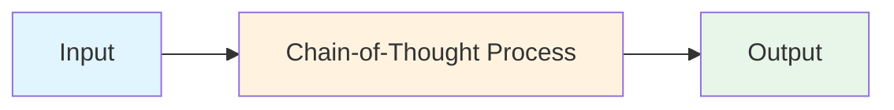
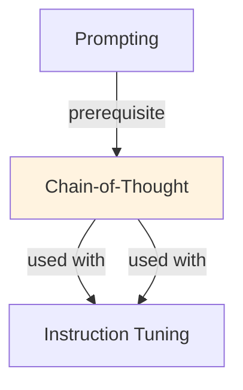

# Chain-of-Thought (CoT)

## TL;DR
Prompt LLMs to show reasoning steps before answering. "Let's think step-by-step" improves accuracy on complex tasks (math, logic, reasoning). Results: 10-50% accuracy gains on benchmarks. Trades token cost for accuracy; enables interpretability.

## Core Intuition
Humans solve hard problems by thinking aloud. "I need to: 1) understand the problem, 2) identify steps, 3) compute, 4) verify." CoT tells LLMs to do the same. More thinking → better answers, but costs more tokens.

## How It Works

**Without CoT:**
```
Q: If John has 3 apples, buys 2 more, then eats 1, how many does he have?
A: 4 apples
(No intermediate reasoning shown)
```

**With CoT:**
```
Q: If John has 3 apples, buys 2 more, then eats 1, how many does he have?

Let's think step-by-step:
1. John starts with 3 apples
2. He buys 2 more: 3 + 2 = 5 apples
3. He eats 1: 5 - 1 = 4 apples
4. Answer: John has 4 apples
```

**Few-shot CoT (Most effective):**
```
Prompt: "Solve step-by-step. Examples:

Q: 5 + 3*2 = ?
A: 1) Order of operations: multiply first
   2) 3 * 2 = 6
   3) 5 + 6 = 11
   Answer: 11

Now solve: 10 - 4/2 = ?"
```

**Self-Consistency (Voting):**
```
Run CoT multiple times (different sampled generations)
Take majority vote on final answer
Improves accuracy by 5-15% (handles hallucinations)
```

### Workflow Flowchart



## Key Properties / Trade-offs

| Approach | Accuracy | Token Cost | Latency |
|----------|----------|-----------|---------|
| No reasoning | 60% | 1x | 1x |
| CoT prompt | 75% | 3-5x | 3-5x |
| Few-shot CoT | 85% | 5-10x | 5-10x |
| Self-consistency CoT | 90% | 10-30x | 10-30x |

**Task suitability:**
- Works best: math, logic, reasoning, multi-step
- Marginal benefit: factual QA, classification
- Minimal benefit: simple generation, creative writing

## Common Mistakes / Gotchas

- **Not letting model think:** "Step-by-step" alone isn't enough; LLM needs examples of detailed reasoning.
- **Reasoning contradicts answer:** CoT reasons correctly but final answer is wrong. Check consistency.
- **Hallucinating steps:** LLM invents plausible-sounding reasoning that's false. Validate against facts.
- **Too verbose:** Very long CoT can confuse. Optimal: 2-5 reasoning steps, concise language.
- **Task mismatch:** Using CoT for simple tasks wastes tokens. Only use for complex reasoning.
- **Extracting wrong answer:** Model shows correct CoT but final answer is incorrect extraction. Parse carefully.

## Code Example

```python
import openai

# Without CoT
prompt_no_cot = "Q: Sally has 12 apples. She gives 3 to her friend and eats 2. How many does she have?\nA:"

response = openai.ChatCompletion.create(
    model="gpt-4",
    messages=[{"role": "user", "content": prompt_no_cot}],
    temperature=0,
)
print("No CoT:", response['choices'][0]['message']['content'])
# Output: "7 apples"

# With CoT
prompt_cot = """Q: Sally has 12 apples. She gives 3 to her friend and eats 2. How many does she have?

Let's think step-by-step:
1. Sally starts with 12 apples
2. She gives 3 away: 12 - 3 = 9
3. She eats 2: 9 - 2 = 7
A: 7 apples"""

response = openai.ChatCompletion.create(
    model="gpt-4",
    messages=[{"role": "user", "content": prompt_cot}],
    temperature=0,
)
print("With CoT:", response['choices'][0]['message']['content'])

# Self-consistency (voting over multiple generations)
prompt_problem = "Q: Sally has 12 apples. She gives 3 to her friend and eats 2. How many does she have?\nLet's think step-by-step:"

answers = []
for _ in range(5):  # Run 5 times
    response = openai.ChatCompletion.create(
        model="gpt-4",
        messages=[{"role": "user", "content": prompt_problem}],
        temperature=0.7,  # Allow variation
    )
    reasoning = response['choices'][0]['message']['content']
    # Extract final number from reasoning
    answer = int(reasoning.split()[-1])  # Simplified extraction
    answers.append(answer)

# Majority vote
from collections import Counter
most_common = Counter(answers).most_common(1)[0][0]
print(f"Self-consistency answer (majority vote): {most_common}")
```

## Interview Quick-Reference

| Question | What to say |
|---|---|
| "Chain-of-thought?" | Prompt LLM to show reasoning steps. Improves accuracy 10-50% on complex tasks. Trade: more tokens. |
| "When use CoT?" | Reasoning tasks (math, logic, multi-step). Not needed for simple classification or generation. |
| "Few-shot vs prompt?" | Few-shot (examples of reasoning) much better than just "think step-by-step." Show examples. |
| "Self-consistency?" | Run CoT multiple times, vote on answer. Reduces hallucinations, +5-15% accuracy, but 10-30x tokens. |
| "Hallucinating reasoning?" | Risk: LLM shows plausible-sounding but false reasoning. Validate facts independently. |

## Related Topics
- [Prompting](prompting.md) — structuring prompts for effectiveness
- [Planning & Reasoning](../agentic-ai/concepts/planning-reasoning.md) — agents use similar decomposition
- [In-Context Learning](in-context-learning.md) — few-shot examples improve CoT

## Resources
- [Chain-of-Thought Prompting Elicits Reasoning in LLMs](https://arxiv.org/abs/2201.11903)
- [Self-Consistency Improves Chain of Thought Reasoning](https://arxiv.org/abs/2203.11171)
- [OpenAI: Chain-of-Thought Prompting](https://platform.openai.com/docs/guides/prompt-engineering)

## Concept Relationships



## Interview Questions

**Q: What's the core problem this concept solves?**
*A: See the 'Core Intuition' section above for the fundamental problem and how this concept addresses it.*

**Q: What are the main advantages and disadvantages?**
*A: See 'Key Properties / Trade-offs' section for detailed comparison with alternatives.*

**Q: How do you implement this in practice?**
*A: Refer to the corresponding Jupyter notebook in `llm/notebooks/` for working Python implementations and examples.*

