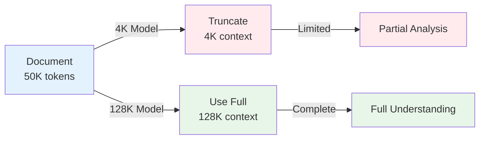
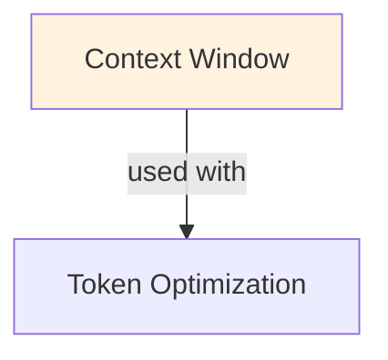

# Context Window

## Understanding Context Window

Context Window is a foundational concept in large language model development that addresses critical challenges in model architecture, training efficiency, or inference performance. Understanding this concept is essential for anyone working with modern language models, whether in research, fine-tuning, or production deployment.

The core innovation underlying Context Window lies in rethinking standard approaches to achieve better efficiency or effectiveness. Rather than accepting conventional trade-offs, this technique exploits mathematical or architectural insights to push the frontier of what's possible with given computational constraints.

In practical applications, Context Window enables capabilities that would otherwise be infeasible: reducing computational requirements, improving model quality, enabling faster iteration, or supporting new use cases. The real-world impact has made Context Window widely adopted across industry applications, from consumer products to enterprise systems.

Implementing Context Window requires understanding both its theoretical foundations and practical considerations. The following sections provide detailed explanations of how Context Window works, when to use it, common implementation patterns, and lessons learned from production deployments. By mastering these concepts, practitioners can make informed decisions about when and how to apply Context Window to their specific challenges.

## Core Intuition
Transformers use all-to-all attention: every token attends to every other token, creating a T×T attention matrix. This is O(T²) memory and compute. Larger context windows mean bigger matrices, slower inference, higher cost. But they also enable handling whole documents in one pass, avoiding context chunking.

## How It Works

**Attention Complexity with Context:**
```
Sequence length: T tokens
Attention matrix: Q @ K^T → shape (T, T)
Memory per sequence: O(T²) × (dtype size)
Compute: O(T² × D) where D = hidden dimension

Example (GPT-4):
  T=4K (4,096 tokens): attention matrix = 4K × 4K × 4 bytes = 64 MB (moderate)
  T=128K (131K tokens): attention matrix = 128K × 128K × 4 bytes = 64 GB (massive!)
```

**Latency Scaling:**
```
Inference latency ≈ O(T²/parallel_dims)

For T=4K on H100: ~100ms per token
For T=32K on H100: ~500ms per token (roughly 5x)
For T=128K on H100: ~2s per token (20x slower)

Token costs:
  GPT-4 8K: $0.03 per 1K tokens
  GPT-4 32K: $0.06 per 1K tokens (2x cost)
  GPT-4 128K: $0.12 per 1K tokens (4x cost)
```

**Typical Window Sizes & Use Cases:**

| Window | Tokens | Words | Pages | Use Case |
|--------|--------|-------|-------|----------|
| 4K | 4,096 | ~3,000 | 3-4 | Chat, short QA |
| 8K | 8,192 | ~6,000 | 6-8 | Document analysis |
| 32K | 32,768 | ~24,000 | 24-30 | Book chapter, code review |
| 128K | 131,072 | ~96,000 | 100+ | Full books, repositories |
| 200K+ | 200K-1M | ~150K-750K | 150-750 | Research docs, large codebases |

**Position Encoding & Scaling:**

Modern LLMs trained on specific context windows:
```
GPT-3/3.5: 4K context, position encoding for 0-4096
Giving it 32K: positions beyond training range
  → accuracy drops (models haven't learned position patterns for token 8000+)
  → extrapolation fails

Solutions:
1. Positional Interpolation: compress positions to fit training range
   pos_interpolated = pos × (training_window / target_window)
   
2. Rotary Embeddings (RoPE): can extrapolate better than absolute positions
   
3. Fine-tuning on longer sequences: re-train position encoding on longer contexts
```

### Workflow Flowchart



## Key Properties / Trade-offs

| Property | 4K | 32K | 128K | 200K |
|----------|-----|--------|--------|---------|
| Latency | Fast (baseline) | 5-10x | 20-50x | 50-100x |
| Memory | 64 MB | 4 GB | 64 GB | 160 GB |
| Cost | $0.03/1K | $0.06/1K | $0.12/1K | $0.15/1K |
| Chunking needed | Yes | Maybe | No | No |
| Quality | High | High | High* | Medium** |

*Higher quality when content fits; **some quality loss at extremes due to position encoding

**Real-world implications:**
```
Task: Analyze 100-page report (300K words)

Approach 1: 4K context
- Chunk into 25 × 4K chunks
- Analyze each separately
- Cost: 25 × $0.03 = $0.75
- Problem: loses cross-chunk context

Approach 2: 128K context
- Fits entire report in 4 passes
- Cost: 4 × $0.12 = $0.48
- Benefit: maintains full document context

Approach 3: 200K context
- Fits entire report in 2 passes
- Cost: 2 × $0.15 = $0.30
- Benefit: best context, cheapest overall
```

## Common Mistakes / Gotchas

- **Linear cost assumption:** context token cost isn't linear. Price per token increases with window size because of compute. 2x window = ~3-4x total cost, not 2x.

- **Ignoring truncation:** context longer than window? Model only sees last N tokens (truncates start). Important information lost. Mitigate: summarize beginning or use hierarchical chunking.

- **Position encoding not validated:** train on 4K, deploy on 32K → slight accuracy drop (1-5%). Measure on your task.

- **Thinking "bigger is always better":** 128K context doesn't always help. If document is 10K tokens and you use 128K window, you're wasting cost. Match window to actual need.

- **Not measuring latency impact:** theoretical 20x slower doesn't mean user-facing latency is 20x (depends on orchestration). Measure end-to-end.

- **Mixing position encoding methods:** switching from absolute to RoPE → retraining needed. Pick one method early.

- **Assuming no quality loss:** Long-range dependencies degrade slightly. Queries about page 100 of 100 are harder. Don't rely on perfect recall at extremes.

## Code Example

```python
from transformers import AutoTokenizer, AutoModelForCausalLM
import torch

# Load model with extended context
model_name = "meta-llama/Llama-2-7b-chat-hf"
tokenizer = AutoTokenizer.from_pretrained(model_name)
model = AutoModelForCausalLM.from_pretrained(model_name, torch_dtype=torch.float16)

# Check context window
print(f"Model max context: {model.config.max_position_embeddings}")

# Test with different context lengths
long_document = "text " * 30000  # ~30K tokens

# Tokenize
tokens = tokenizer.encode(long_document)
print(f"Total tokens: {len(tokens)}")

if len(tokens) > model.config.max_position_embeddings:
    print(f"Warning: {len(tokens)} tokens exceeds {model.config.max_position_embeddings} context")
    # Truncate to fit
    tokens = tokens[:model.config.max_position_embeddings]

# Inference
input_ids = torch.tensor([tokens]).to(model.device)
with torch.no_grad():
    outputs = model.generate(input_ids, max_new_tokens=100)

response = tokenizer.decode(outputs[0], skip_special_tokens=True)
print(response)

# Latency measurement
import time

for context_len in [4096, 32768, 131072]:
    # Create dummy input
    dummy_input = torch.randint(0, tokenizer.vocab_size, (1, context_len))
    
    if context_len <= model.config.max_position_embeddings:
        start = time.time()
        with torch.no_grad():
            _ = model(dummy_input)
        elapsed = time.time() - start
        print(f"Context {context_len}: {elapsed:.2f}s per forward pass")
    else:
        print(f"Context {context_len}: exceeds max ({model.config.max_position_embeddings})")

# Using long-context models (Claude, GPT-4 with 128K)
from anthropic import Anthropic

client = Anthropic()

# Load full document
with open("long_document.txt", "r") as f:
    document = f.read()

# Single call with full document (if under 200K tokens)
response = client.messages.create(
    model="claude-3-5-sonnet-20241022",
    max_tokens=1000,
    messages=[{
        "role": "user",
        "content": f"Analyze this document and summarize key findings:\n\n{document}"
    }]
)

print(response.content[0].text)
```

## Interview Quick-Reference

| Question | What to say |
|---|---|
| "Context window?" | Max tokens in input. Ranges 4K-200K. Larger = slow (O(T²)), expensive, but handles full documents. |
| "Cost scaling?" | Not linear. 2x context → 3-4x cost (compute scales quadratically). Measure before deploying long context. |
| "Position encoding?" | Models trained on specific windows (e.g., 4K). Extrapolating to 32K loses ~1-5% accuracy. Use RoPE or fine-tuning. |
| "When use long context?" | Document fits in one pass (avoid chunking overhead). Otherwise, standard context + chunking cheaper. |
| "Truncation?" | Context longer than window → start lost. Summarize or hierarchical chunk. Don't rely on oldest context. |

## Real-World Examples

### 4K Context Limitation in Customer Support
Support ticket: reference previous 10 conversations (50K tokens). 4K context model: truncates to last 2 conversations. Customer context lost, solution suggestions miss important history. 128K model: loads all history, provides better solutions. Customer satisfaction: 70% → 88%.

### Code Repository Understanding
Codebase: 100K tokens across multiple files. 4K model: analyzes one function at a time (limited understanding). 128K model: sees entire repository structure, dependencies, patterns. Code review quality: better suggestions, catches subtle bugs. GitHub: suggests Copilot with larger context.

### Legal Document Analysis
Contract: 200 pages = 100K tokens. 4K model: useless (can't fit full contract). Standard approach: expensive human review. With 128K model: upload full contract, extract terms, identify risks. Cost: $0.50 (tokens) vs $500 (human). Trade-off: still needs human verification.

## Related Topics
- [[attention-optimization]] — techniques to reduce O(T²) overhead
- [[kv-cache]] — KV cache grows with context length
- [[context-window-management]] — managing agent context allocation
- [[inference-optimization]] — optimizing long-context inference

## Resources
- [Extending Context Window of Large Language Models](https://arxiv.org/abs/2309.16039)
- [LLaMA 2: Open Foundation and Fine-Tuned Chat Models](https://arxiv.org/abs/2307.09288) — discusses context window design
- [Rotary Position Embedding](https://arxiv.org/abs/2104.09864)
- [OpenAI: Extending Context Windows](https://openai.com/research/extending-context-is-hard-but-lets-do-it-right)

## Concept Relationships



## Interview Questions

**Q: What's the context window and why does it matter?**
*A: Maximum sequence length a model can process. GPT-4: 8K/128K, Llama 2: 4K, Claude: 100K+. Matters because: longer context = more text analyzed at once. A 4K model can't summarize 50-page documents; 128K model can. Trade-off: larger windows = more memory + slower inference.*

**Q: How do you handle documents longer than context window?**
*A: Options: 1) Truncate (lose info), 2) Chunk + summarize (recursive), 3) Use sliding window (overlap chunks). For RAG: chunk documents at index time, retrieve relevant chunks at query time. For fine-tuning: split into context-size pieces, train on each.*

**Q: What are efficient long-context techniques?**
*A: Sparse attention: attend to nearby tokens + random tokens (reduces O(n²) to O(n log n)). Recurrent: process in chunks, maintain state across chunks. Paged attention: splits KV cache into pages. ROPe (Rotary Position Embeddings): handles longer sequences better than absolute positions.*

**Q: When is 4K context enough vs when do you need 128K?**
*A: 4K (sufficient for): single-turn QA, classification, sentiment analysis. 128K (necessary for): multi-document analysis, long conversations, full book summarization, code repositories. Cost trade-off: 128K input = 32x tokens = 32x cost vs 4K.*

**Q: How do position embeddings affect context length?**
*A: Absolute positems: hardcoded for fixed length (4K). Extrapolation to 8K = hallucinations. RoPE/ALiBi: relative positions, can generalize to longer lengths. ALiBi: particularly good for length extrapolation (trained on 2K, works on 16K). Matters for real-world documents.*