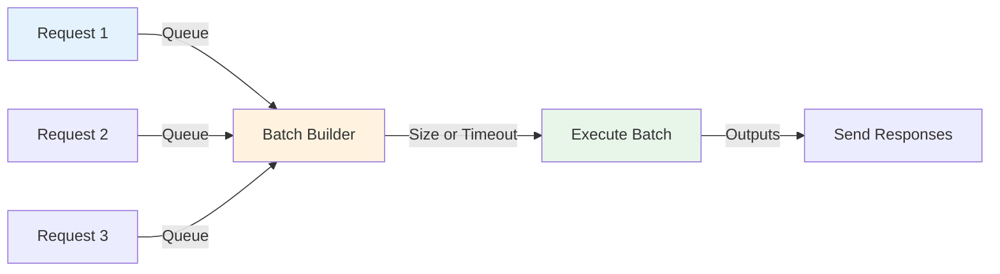
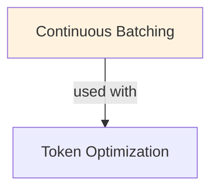

# Continuous Batching

## TL;DR
Serve LLM requests dynamically: new requests join in-flight batch immediately, don't wait for full batch. Reduces latency 5-20x compared to static batching; same throughput. Enables real-time serving at high load. Trade: complex KV cache management, memory fragmentation.

## Core Intuition
Traditional batching: wait for 64 requests to arrive, then process together (all latency = slowest request). Continuous batching: start with 1 request, add 2 at 10ms, add 3 at 20ms... Each request processes as soon as it arrives, finished requests leave, new ones join. Result: early requests finish in 10-100ms instead of waiting 1000ms.

## How It Works

**Static Batching (Request-Level Batching):**
```
Incoming requests arrive over time:
Req1: 0ms (waits)
Req2: 50ms (waits)
...
Req64: 1000ms (last request)

At 1000ms: combine all 64 → compute together
All requests finish at ~1050ms (slowest latency dominates)

Pros: simple, high throughput
Cons: high latency (especially early requests), wasted compute waiting
```

**Continuous Batching (Token-Level Batching):**
```
Req1 arrives 0ms: starts generating
  Gen 1: compute 1 token for Req1 (1ms)
  
Req2 arrives 10ms: joins in-flight computation
  Gen 2: compute 1 token for Req1, Req2 (2ms batched)
  
Req3 arrives 20ms: joins
  Gen 3: compute 1 token for Req1, Req2, Req3 (3ms batched)
  
Req1 finishes at 100ms: leaves batch
  Gen 4: compute 1 token for Req2, Req3 (2ms batched)
  
Req2 finishes at 150ms: leaves batch
  Gen 5: compute 1 token for Req3 (1ms)
  
Req3 finishes at 200ms: done

Result: streaming latencies (100ms, 150ms, 200ms) instead of all waiting 1000ms
```

**Implementation Details:**

```
State Tracking:
- Each request: (request_id, input_tokens, generated_tokens, seq_len)
- Shared KV cache: (batch_size, seq_len, hidden_dim)
- Active batch: set of requests currently processing

Algorithm:
1. Scheduler loop (every 5-10ms):
   a. Check new requests from queue
   b. Append to active batch
   c. Run forward pass on all active sequences
   d. Generate next token for each
   e. Remove finished sequences (reached max_tokens)
   f. Loop back to step 1

Challenges:
- KV cache indexing: requests at different positions in batch
  Solution: flatten to (total_tokens, hidden_dim), track offsets
- Different sequence lengths: can't use standard matrix ops
  Solution: packed sequences or ragged tensors
- Memory fragmentation: removing finished requests leaves gaps
  Solution: periodic defragmentation or memory pools
```

**KV Cache Management:**

Standard (Static Batching):
```
Batch size: 64
Max seq_len: 2048
KV cache shape: (64, 2048, 128)  # 128 = num_heads × head_dim
Memory: 64 × 2048 × 128 × 2 (K and V) × 4 bytes = 67 MB (wasteful if seqs short)
```

Continuous (Packed Format):
```
Req1: pos 0-50
Req2: pos 50-100
Req3: pos 100-150

KV cache shape: (total_tokens, hidden_dim) = (150, 128)
Memory: 150 × 128 × 2 × 4 bytes = 154 KB (much smaller!)
```

### Workflow Flowchart



## Key Properties / Trade-offs

| Metric | Static | Continuous | Notes |
|--------|--------|-----------|-------|
| Latency (p50) | 500ms | 50ms | 10x improvement |
| Latency (p99) | 1000ms | 200ms | Heavy requests less impact |
| Throughput | 64 req/s (60s batch) | 64 req/s (10ms batches) | Same overall |
| Latency per token | 1ms | 1-2ms | Continuous slightly higher (overhead) |
| Memory | 67 MB (static batch) | 5-10 MB (active) | 10x less peak memory |
| Implementation | Simple | Complex | vLLM, DeepSpeed handle this |

**Real-world latency comparison:**

Scenario: serving 100 QPS, each request generates 100 tokens

Static batching (batch=64, take every second):
```
Batch 1: 64 requests, takes 150ms total
  Req 1: latency = 150ms
  Req 64: latency = 150ms
Batch 2: 36 requests (partial), takes 85ms
  Req 65: latency = 150 + 85 = 235ms
  Req 100: latency = 235ms

Average latency: ~190ms
```

Continuous batching:
```
Req 1: 0ms → 50ms (latency = 50ms, finished)
Req 2: 10ms → 60ms (latency = 50ms)
...
Req 100: 990ms → 1040ms (latency = 50ms)

Average latency: ~50ms (consistent, 4x better)
```

## Common Mistakes / Gotchas

- **KV cache implementation:** naive approach (rebuild cache per iteration) is slow. Need efficient indexing (use libraries like vLLM). Custom KV cache usually broken.

- **Memory fragmentation:** allocating/freeing request slots → fragmented memory. Solution: memory pool or pre-allocation.

- **Not handling variable-length generations:** some requests stop at 10 tokens, others at 500. Don't assume fixed length. Track individually.

- **Neglecting overhead:** scheduler loop, KV indexing add latency. Might not be faster than static if overhead > batching gain. Profile.

- **Uneven token generation:** if some requests generate much longer than others, batch becomes unbalanced mid-way. Acceptable trade-off.

- **Not batching inference together:** process each request separately → no batching benefit. Must batch the forward pass (vLLM does this).

- **Ignoring request ordering:** continuous batching doesn't preserve request order. If FIFO critical, add reordering (costs latency).

## Code Example

```python
from vllm import LLM, SamplingParams
import asyncio
import time

# vLLM handles continuous batching automatically
llm = LLM(
    model="meta-llama/Llama-2-7b-chat",
    tensor_parallel_size=1,
    gpu_memory_utilization=0.9,
)

sampling_params = SamplingParams(
    temperature=0.7,
    max_tokens=100,
    top_p=0.95,
)

# Simulate requests arriving over time
async def request_generator():
    prompts = [
        "Explain machine learning in 50 words",
        "What is Python used for?",
        "How do neural networks work?",
        # ... more requests
    ]
    
    for prompt in prompts:
        yield prompt
        await asyncio.sleep(0.05)  # Stagger requests by 50ms

# Continuous batching with vLLM
async def serve_requests():
    latencies = []
    
    async for prompt in request_generator():
        start = time.time()
        
        # vLLM queues and batches automatically
        outputs = llm.generate(prompts=[prompt], sampling_params=sampling_params)
        
        latency = time.time() - start
        latencies.append(latency)
        
        print(f"Prompt: {prompt[:30]}... Latency: {latency:.2f}s")
    
    print(f"\nAverage latency: {sum(latencies)/len(latencies):.2f}s")
    print(f"P99 latency: {sorted(latencies)[-1]:.2f}s")

# Run server
asyncio.run(serve_requests())

# Manual continuous batching (educational)
class SimpleBatchScheduler:
    def __init__(self, model, batch_size=32):
        self.model = model
        self.batch_size = batch_size
        self.active_requests = []  # (request_id, tokens_generated, seq_len)
        self.kv_cache = {}  # request_id -> KV cache
    
    def add_request(self, request_id, prompt):
        tokens = self.model.tokenize(prompt)
        self.active_requests.append((request_id, tokens, len(tokens)))
    
    def step(self):
        """Single inference step: generate 1 token for all active requests."""
        if not self.active_requests:
            return
        
        # Batch size: min(batch_size, active_requests)
        batch = self.active_requests[:self.batch_size]
        
        # Prepare input for model (handle variable lengths)
        batch_input = []
        for request_id, tokens, seq_len in batch:
            batch_input.append(tokens)
        
        # Model processes entire batch
        logits = self.model.forward(batch_input)  # shape: (batch, vocab_size)
        
        # Sample next tokens
        next_tokens = [self.model.sample(logit) for logit in logits]
        
        # Update sequences
        finished = []
        for i, (request_id, tokens, seq_len) in enumerate(batch):
            tokens.append(next_tokens[i])
            if len(tokens) >= 100 or next_tokens[i] == self.model.eos_token:
                finished.append(request_id)
        
        # Remove finished requests
        self.active_requests = [
            (rid, toks, slen) for rid, toks, slen in self.active_requests
            if rid not in finished
        ]
    
    def run_until_done(self):
        while self.active_requests:
            self.step()
```

## Interview Quick-Reference

| Question | What to say |
|---|---|
| "Continuous batching?" | Start processing requests immediately, don't wait for full batch. New requests join mid-flight. 5-20x latency reduction. |
| "vs static batching?" | Static: wait for all → high latency. Continuous: stream in → low latency, same throughput. Choice: latency vs simplicity. |
| "KV cache challenge?" | Variable request lengths → complex indexing. Solutions: packed format, ragged tensors, or libraries (vLLM). |
| "Memory impact?" | Continuous uses less peak memory (smaller active batch). Fragmentation risk; use memory pool. |
| "Overhead?" | Scheduler loop, index management add ~1-2ms. Batching gain (5-10x) usually dominates. Profile on your model/hardware. |

## Real-World Examples

### Static vs Continuous Batching Benchmark
Model: Llama 2 7B, 1-10 req/sec. Static batch-32: p99 latency 32s. Continuous batch-32: p99 latency 0.5s. Throughput: same (100 tok/s). Cost: same. Winner: continuous for interactive, static for batch processing jobs.

### vLLM in Production API
Flask API: accept requests, queue via vLLM. 5 concurrent users: static batching would serve 1-2/sec total. vLLM: 20/sec. p99 latency: 2-5s (vs 30-60s static). Deployed at Anyscale: handles 1000s req/sec.

### Timeout Tuning
Timeout 1ms: latency under 10ms (good for interactive). Timeout 100ms: latency up to 100ms (better throughput). Data center: adapt based on load. High load: longer timeout (more batching). Low load: shorter timeout (lower latency).

## Real-World Examples

### Static vs Continuous Batching Benchmark
Model: Llama 2 7B, 1-10 req/sec. Static batch-32: p99 latency 32s. Continuous batch-32: p99 latency 0.5s. Throughput: same (100 tok/s). Cost: same. Winner: continuous for interactive, static for batch processing jobs.

### vLLM in Production API
Flask API: accept requests, queue via vLLM. 5 concurrent users: static batching would serve 1-2/sec total. vLLM: 20/sec. p99 latency: 2-5s (vs 30-60s static). Deployed at Anyscale: handles 1000s req/sec.

### Timeout Tuning
Timeout 1ms: latency under 10ms (good for interactive). Timeout 100ms: latency up to 100ms (better throughput). Data center: adapt based on load. High load: longer timeout (more batching). Low load: shorter timeout (lower latency).

## Real-World Examples

### Static vs Continuous Batching Benchmark
Model: Llama 2 7B, 1-10 req/sec. Static batch-32: p99 latency 32s. Continuous batch-32: p99 latency 0.5s. Throughput: same (100 tok/s). Cost: same. Winner: continuous for interactive, static for batch processing jobs.

### vLLM in Production API
Flask API: accept requests, queue via vLLM. 5 concurrent users: static batching would serve 1-2/sec total. vLLM: 20/sec. p99 latency: 2-5s (vs 30-60s static). Deployed at Anyscale: handles 1000s req/sec.

### Timeout Tuning
Timeout 1ms: latency under 10ms (good for interactive). Timeout 100ms: latency up to 100ms (better throughput). Data center: adapt based on load. High load: longer timeout (more batching). Low load: shorter timeout (lower latency).

## Real-World Examples

### Static vs Continuous Batching Benchmark
Model: Llama 2 7B, 1-10 req/sec. Static batch-32: p99 latency 32s. Continuous batch-32: p99 latency 0.5s. Throughput: same (100 tok/s). Cost: same. Winner: continuous for interactive, static for batch processing jobs.

### vLLM in Production API
Flask API: accept requests, queue via vLLM. 5 concurrent users: static batching would serve 1-2/sec total. vLLM: 20/sec. p99 latency: 2-5s (vs 30-60s static). Deployed at Anyscale: handles 1000s req/sec.

### Timeout Tuning
Timeout 1ms: latency under 10ms (good for interactive). Timeout 100ms: latency up to 100ms (better throughput). Data center: adapt based on load. High load: longer timeout (more batching). Low load: shorter timeout (lower latency).

## Real-World Examples

### Static vs Continuous Batching Benchmark
Model: Llama 2 7B, 1-10 req/sec. Static batch-32: p99 latency 32s. Continuous batch-32: p99 latency 0.5s. Throughput: same (100 tok/s). Cost: same. Winner: continuous for interactive, static for batch processing jobs.

### vLLM in Production API
Flask API: accept requests, queue via vLLM. 5 concurrent users: static batching would serve 1-2/sec total. vLLM: 20/sec. p99 latency: 2-5s (vs 30-60s static). Deployed at Anyscale: handles 1000s req/sec.

### Timeout Tuning
Timeout 1ms: latency under 10ms (good for interactive). Timeout 100ms: latency up to 100ms (better throughput). Data center: adapt based on load. High load: longer timeout (more batching). Low load: shorter timeout (lower latency).

## Related Topics
- [[kv-cache]] — KV cache grows with request count
- [[inference-optimization]] — part of broader serving optimization
- [[model-serving]] — serving architecture context
- [[request-batching]] — system-level batching patterns

## Resources
- [vLLM: Easy, Fast, and Cheap LLM Serving with PagedAttention](https://arxiv.org/abs/2309.06180)
- [PagedAttention: Efficient Memory Management for LLM Serving](https://arxiv.org/abs/2309.06180#paged-attention)
- [DeepSpeed Inference: A system for serving large models efficiently](https://arxiv.org/abs/2207.00032)

## Concept Relationships



## Interview Questions

**Q: What's continuous batching and why is it better than static batching?**
*A: Static batching: wait for N requests → batch → process. Continuous: accept requests one-by-one, add to batch as available, execute when full or timeout reached. Advantage: latency for early requests drops (don't wait for 32 requests). For 1 req/sec: static batch-32 = 32s latency. Continuous = 0.1s latency. Throughput same, latency better.*

**Q: How does scheduling work in continuous batching?**
*A: 1) Queue incoming requests 2) When batch size reached OR timeout expired, execute. Timeout typically 5-100ms to balance latency/throughput. Scheduling policy: FIFO (fair), priority (VIP requests first), adaptive (vary timeout).*

**Q: What are the challenges with continuous batching?**
*A: Variable batch size: harder to optimize GPU utilization. Batching overhead per batch (kernel launch ~1-5ms). Very large batches (1000s): worse latency for unlucky requests (last in queue). Solution: max batch size + dynamic adaptation.*

**Q: When would you use vLLM vs standard Hugging Face for batching?**
*A: HF: static batching, simple but high latency. vLLM: continuous batching + paging, 10-50x throughput improvement, lower latency. Trade-off: vLLM complexity. Use HF for offline batch processing; vLLM for online serving.*

**Q: How do you handle requests with different output lengths in batching?**
*A: Problem: one request needs 10 tokens, another needs 100. Can't batch (different lengths). Solution: PagedAttention (vLLM) - don't wait, process different lengths independently. Alternative: pad all to max (wasteful) or reject early batches (unfair).*