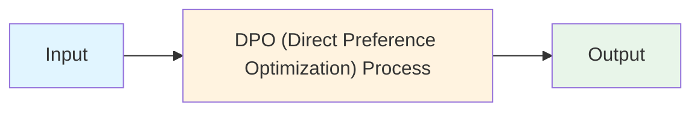
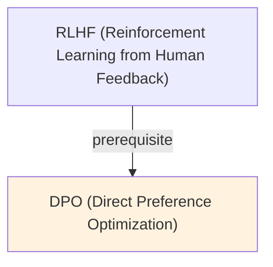

# DPO (Direct Preference Optimization)

## TL;DR
Fine-tune LLM directly using human preference pairs, without training separate reward model. Eliminates RLHF's reward model + RL training pipeline. Simpler, faster, fewer hyperparameters, comparable quality to RLHF. Single SFT stage instead of SFT → reward model → PPO.

## Core Intuition
RLHF trains two models (reward model + policy) using RL, which is complex and unstable. DPO realizes you can extract preference signals directly via loss function: if humans prefer output A over B for prompt X, optimize LLM to assign higher likelihood to A. No separate reward model needed. Single stage fine-tuning.

## How It Works

**RLHF Pipeline (Traditional):**
```
1. SFT: Fine-tune LLM on (prompt, response) pairs
2. Reward Model Training:
   - Collect (prompt, A, B) where A > B (human preference)
   - Train reward model: r(x, y) → scalar score
   - Optimize: minimize -log(σ(r(x, y_A) - r(x, y_B)))
3. RL Fine-tuning (PPO):
   - Use reward model as signal
   - RL objective: maximize E[reward] - KL(policy || base_policy)
   - Multiple gradient steps per sample
```

**DPO Pipeline (Direct):**
```
1. SFT: Fine-tune LLM on (prompt, response) pairs [optional]
2. Collect preference data: (prompt, y_preferred, y_dispreferred)
3. DPO Loss (single stage):
   Optimize: minimize -log(σ(β * (log p(y_w | x) - log p(y_l | x))))
   where σ is logistic, β is temperature
```

**DPO Loss Derivation:**
```
Goal: maximize human preference likelihood
P(y_w > y_l | x) ∝ exp(r(x, y_w) - r(x, y_l))

Implicit reward model:
r(x, y) = (β / (1 - π_SFT)) * log(π_θ(y | x) / π_ref(y | x))

DPO Loss:
L_DPO = -log(σ(β * log(π(y_w|x) / π_ref(y_w|x)) - β * log(π(y_l|x) / π_ref(y_l|x))))

Where:
- π(y|x): policy (model being optimized)
- π_ref(y|x): reference (SFT model)
- β: temperature controlling preference strength
- σ: logistic function
```

**Key Insight:**
DPO extracts reward model implicitly. No need to:
- Train separate reward model (saves compute)
- Run PPO (unstable RL training)
- Tune RL hyperparameters (learning rate, KL penalty, etc.)

**Algorithm:**
```
Input: Preference pairs {(x, y_w, y_l)}, base SFT model π_ref, β (temperature)

For each preference pair:
  1. Forward pass on preferred response: log_probs_w = π(y_w | x)
  2. Forward pass on dispreferred response: log_probs_l = π(y_l | x)
  3. Reference forward passes: log_probs_ref_w, log_probs_ref_l
  4. Compute DPO loss
  5. Backward pass, update π_θ
```

### Workflow Flowchart



## Key Properties / Trade-offs

| Method | Stages | Reward Model | Complexity | Speed | Quality | Stability |
|--------|--------|--------------|-----------|-------|---------|-----------|
| SFT | 1 | None | Low | Fast | 70-80% | High |
| RLHF | 3 (SFT+RM+PPO) | Yes (separate) | High | Slow (weeks) | 90-95% | Medium |
| DPO | 2 (SFT+DPO) | Implicit | Medium | Fast (days) | 90-95% | High |
| IPO | 2 (SFT+IPO) | Implicit | Medium | Fast | 91-96% | Very High |

**DPO Advantages:**
- Simpler: single supervised loss, no RL
- Faster: days vs weeks
- Fewer hyperparameters: just β (vs KL penalty, learning rate, etc.)
- Stable: gradient-based, not policy optimization
- Computationally cheaper: one forward pass per pair

**DPO Disadvantages:**
- Implicit reward model (harder to inspect/debug)
- Requires good SFT base (quality matters)
- β hyperparameter critical (affects preference strength)
- Less tested at scale than RLHF

## Common Mistakes / Gotchas

- **Wrong temperature (β):** Too low β (< 0.1) → model ignores preferences. Too high β (> 1.0) → overfitting to preferences, language quality drops. Try β = 0.5 default.
- **Bad SFT base:** DPO amplifies base model issues. If SFT is poor, DPO doesn't fix it. Start with good SFT.
- **Preference data quality:** Noisy labels (arbitrary or inconsistent preferences) → model learns bad patterns. Collect carefully, check inter-annotator agreement.
- **Ignoring reference model:** Using π instead of π_ref in loss → diverges from base behavior. Always include reference log probabilities.
- **Not normalizing lengths:** Long preferred responses vs short dispreferred → length bias. Normalize by response length or use length-controlled sampling.
- **Greedy decoding:** DPO optimizes likelihood, not decoding. Use nucleus/temperature sampling at inference to match training distribution.
- **Comparing unfairly:** DPO on 10k pairs vs RLHF on 50k pairs. Fair comparison needs same data/compute budgets.

## Code Example

```python
from datasets import load_dataset
from transformers import AutoModelForCausalLM, AutoTokenizer, TrainingArguments
from trl import DPOTrainer

# Load base model and tokenizer
model_name = "meta-llama/Llama-2-7b-hf"
model = AutoModelForCausalLM.from_pretrained(model_name, torch_dtype="auto")
tokenizer = AutoTokenizer.from_pretrained(model_name)
tokenizer.pad_token = tokenizer.eos_token

# Load preference data
# Expected format: {prompt, chosen, rejected}
train_data = load_dataset("argilla/ultrafeedback-harmless-vs-harmful", split="train")

def format_dataset(examples):
    """Convert to prompt, chosen, rejected format."""
    return {
        "prompt": examples["prompt"],
        "chosen": examples["chosen"],
        "rejected": examples["rejected"],
    }

train_data = train_data.map(format_dataset)

# Training arguments
training_args = TrainingArguments(
    output_dir="./dpo_llama",
    num_train_epochs=3,
    per_device_train_batch_size=4,
    gradient_accumulation_steps=2,
    learning_rate=5e-5,
    warmup_steps=500,
    weight_decay=0.01,
    logging_steps=10,
    save_steps=500,
)

# DPO Trainer
dpo_trainer = DPOTrainer(
    model=model,
    args=training_args,
    train_dataset=train_data,
    tokenizer=tokenizer,
    beta=0.5,  # Temperature for preference strength
    max_prompt_length=512,
    max_length=1024,
    loss_type="sigmoid",  # sigmoid (default) or hinge or ipo
)

# Train
dpo_trainer.train()

# Save model
model.save_pretrained("./dpo_llama_final")

# Inference
from transformers import pipeline

pipe = pipeline("text-generation", model="./dpo_llama_final", device=0)
prompt = "How can I learn machine learning?"
output = pipe(prompt, max_length=200, temperature=0.7)
print(output[0]["generated_text"])
```

**Alternative: IPO (Identity Preference Optimization)**
```python
# IPO is more stable variant of DPO
dpo_trainer = DPOTrainer(
    model=model,
    args=training_args,
    train_dataset=train_data,
    tokenizer=tokenizer,
    beta=0.5,
    loss_type="ipo",  # Use IPO instead of sigmoid DPO
)
dpo_trainer.train()
```

## Interview Quick-Reference

| Question | What to say |
|---|---|
| "DPO?" | Direct preference optimization. Fine-tune LLM directly from preference pairs (A > B). No separate reward model or RL. |
| "vs RLHF?" | RLHF: 3 stages (SFT → reward model → PPO), complex, slow (weeks). DPO: 2 stages (SFT → DPO), simple, fast (days). Quality comparable. |
| "Why simpler?" | DPO uses supervised loss on preference pairs directly. No need separate reward model or RL training. Single gradient update. |
| "β (temperature)?" | Controls preference strength. Default: β = 0.5. Too low → ignores preferences. Too high → overfits. Tune empirically. |
| "Data requirements?" | Preference pairs (prompt, chosen, rejected). Quality matters. 10k-100k pairs typical. Collect carefully, check consistency. |
| "Implicit reward model?" | DPO computes reward implicitly in loss function. Can't inspect/debug separately. Trade-off: simplicity vs interpretability. |
| "When use DPO?" | When you have preference data and want speed/simplicity. RLHF if you need maximum quality and have compute budget. |

## Related Topics
- [[rlhf]] — traditional preference optimization approach (more complex)
- [[fine-tuning]] — supervised fine-tuning baseline
- [[instruction-tuning]] — task-specific training foundation
- [[in-context-learning]] — combining with ICL for better outputs

## Resources
- [Direct Preference Optimization: Your Language Model is Secretly a Reward Model](https://arxiv.org/abs/2305.18290)
- [Identity Preference Optimization (IPO)](https://arxiv.org/abs/2310.12036)
- [TRL Library: DPO Trainer](https://huggingface.co/docs/trl/en/dpo_trainer)
- [Arxiv: A Comparative Study of DPO vs RLHF](https://arxiv.org/abs/2307.02027)

## Concept Relationships



## Interview Questions

**Q: What's the core problem this concept solves?**
*A: See the 'Core Intuition' section above for the fundamental problem and how this concept addresses it.*

**Q: What are the main advantages and disadvantages?**
*A: See 'Key Properties / Trade-offs' section for detailed comparison with alternatives.*

**Q: How do you implement this in practice?**
*A: Refer to the corresponding Jupyter notebook in `llm/notebooks/` for working Python implementations and examples.*

