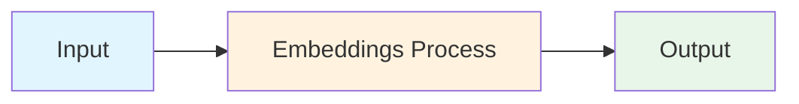
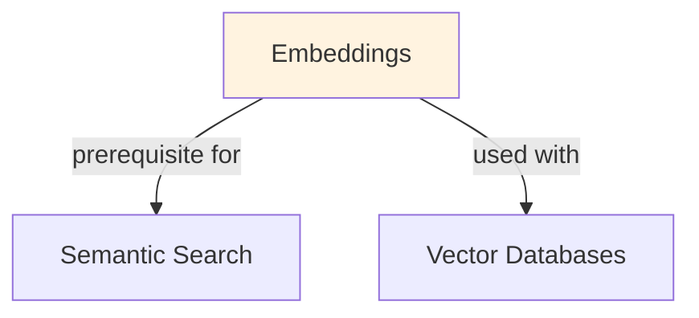

# Embeddings

## TL;DR
Dense vector representations of tokens or text. Transform discrete symbols (words, sentences) into continuous space where semantically similar items are close. Foundation for similarity search, clustering, retrieval, and LLM input representations.

## Core Intuition
Words are just labels—meaningless. Embeddings translate them into geometry. Two words mean similar things if their vectors are near each other (low distance). The embedding space captures semantic and syntactic structure learned from data.

## How It Works

**Static Embeddings (Word2Vec, GloVe):**
- Each word → one fixed vector (e.g., "king" always = [0.2, 0.5, -0.1])
- Learned via matrix factorization (SVD) or prediction tasks (skip-gram, CBOW)
- Fast inference but ignore context (homonyms: "bank" has one vector, not two)

**Contextual Embeddings (BERT, LLaMA):**
- Same word → different vectors depending on context ("bank deposit" vs "river bank")
- Produced by transformer layers; meaning shifts based on surrounding tokens
- Slower but capture polysemy

**Similarity in Embedding Space:**
```
similarity(u, v) = cos(u, v) = (u · v) / (||u|| ||v||)
```
Cosine similarity preferred because:
- Direction matters, magnitude doesn't
- Robust to scaling
- Range: [-1, 1], interpretable

**Text Embeddings (Sentence/Document):**
- Average token embeddings (simple but noisy)
- Use special tokens (CLS token from BERT)
- Task-specific fine-tuning (contrastive learning on pairs)
- Specialized models (Sentence-BERT, MPNet)

### Workflow Flowchart



## Key Properties / Trade-offs

| Property | Static | Contextual | Task-Specific |
|----------|--------|-----------|---------------|
| Speed | ⭐⭐⭐⭐⭐ | ⭐⭐ | ⭐⭐⭐ |
| Semantic quality | ⭐⭐⭐ | ⭐⭐⭐⭐⭐ | ⭐⭐⭐⭐⭐ |
| Polysemy handling | ✗ | ✓ | ✓ |
| Memory footprint | ⭐⭐⭐⭐⭐ | ⭐ | ⭐ |
| Training data req | ⭐⭐ | ⭐⭐⭐⭐ | ⭐⭐⭐ |

**Dimension trade-offs:**
- 50-100D: fast, compact, low semantic quality
- 300D (Word2Vec default): balanced (similarity search, clustering)
- 768D (BERT-base): rich but slower, overkill for some tasks
- 1536D+ (large models): highest quality but memory/latency expensive

## Common Mistakes / Gotchas

- **Assuming embeddings are "meaningful":** They're learned, not interpretable. Don't try to understand dimensions individually.
- **Not normalizing for cosine similarity:** Magnitudes can vary; always normalize or use cosine directly.
- **Reusing embeddings across domains:** "COVID" embeddings from news ≠ "COVID" in medical text. Fine-tune or retrain.
- **Averaging subword tokens:** "unbelievable" tokenizes as ["un", "believe", "able"]. Averaging produces noise; use CLS token or fine-tune pooling.
- **Ignoring temporal drift:** Word meanings change (e.g., "tweet"). Embeddings trained on old data diverge from modern usage.
- **Using L2 distance instead of cosine:** Both work but cosine is scale-invariant; L2 is direction + magnitude.

## Code Example

```python
import numpy as np
from sklearn.metrics.pairwise import cosine_similarity
from sentence_transformers import SentenceTransformer

# Static embedding lookup (simulate Word2Vec)
embeddings = {
    "king": np.array([0.5, 0.2, -0.3]),
    "queen": np.array([0.48, 0.25, -0.28]),
    "man": np.array([0.3, 0.1, -0.1]),
    "woman": np.array([0.32, 0.15, -0.08]),
}

# Cosine similarity
sim = cosine_similarity([embeddings["king"]], [embeddings["queen"]])[0][0]
print(f"Similarity(king, queen) = {sim:.3f}")  # ≈ 0.999

# Word vector arithmetic: king - man + woman ≈ queen
# (demonstrates semantic structure)
king_man_woman = embeddings["king"] - embeddings["man"] + embeddings["woman"]
closest = min(embeddings.items(), 
              key=lambda x: np.linalg.norm(x[1] - king_man_woman))
print(f"king - man + woman ≈ {closest[0]}")  # ≈ "queen"

# Contextual embeddings (BERT-based)
model = SentenceTransformer('all-MiniLM-L6-v2')  # 384D
sentences = [
    "The bank approved the loan.",
    "We walked along the river bank.",
    "The river flows downstream."
]
embeddings_contextual = model.encode(sentences)  # (3, 384)
sims = cosine_similarity(embeddings_contextual)
print(sims)
# Sentence 1 & 2 both have "bank" but low similarity (different context)
```

## Interview Quick-Reference

| Question | What to say |
|---|---|
| "What are embeddings?" | Dense vectors representing tokens/text in semantic space. Similar meanings = nearby vectors. |
| "Static vs contextual?" | Static: fast, one vector per word (Word2Vec). Contextual: slower, meaning depends on context (BERT). |
| "Why cosine similarity?" | Scale-invariant, interprets direction not magnitude. Range [-1,1] is interpretable. |
| "How to embed documents?" | Average token embeddings, use CLS token from BERT, or fine-tune task-specific pooling. |
| "Dimension choice?" | 300D (balanced), 768D (high quality, slower), 1536D+ (state-of-the-art, expensive). |
| "Embedding drift?" | Word meanings shift over time. Retrain periodically or use recent data. |

## Related Topics
- [Tokenization](tokenization.md) — tokens are what get embedded
- [Semantic Search](semantic-search.md) — embeddings enable fast similarity search
- [RAG](rag.md) — embeddings for retrieval in augmented generation
- [Vector Databases](vector-databases.md) — storing and indexing embeddings at scale
- [Transfer Learning](../ml/concepts/transfer-learning.md) — using pre-trained embeddings

## Resources
- [Word2Vec: Efficient Estimation of Word Representations in Vector Space](https://arxiv.org/abs/1301.3781)
- [BERT: Pre-training of Deep Bidirectional Transformers](https://arxiv.org/abs/1810.04805)
- [Sentence-BERT: Sentence Embeddings using Siamese BERT-Networks](https://arxiv.org/abs/1908.10084)
- [HuggingFace: Sentence Transformers](https://www.sbert.net/)
- [Pinecone: Understanding Embeddings](https://www.pinecone.io/learn/vector-embeddings/)

## Concept Relationships



## Interview Questions

**Q: Why are embeddings important in modern NLP?**
*A: Embeddings convert discrete text into continuous vectors that capture semantic meaning. This enables: similarity computation, retrieval, clustering, and transfer learning. They're foundational for RAG, semantic search, and similarity-based tasks.*

**Q: What's the difference between word embeddings and sentence embeddings?**
*A: Word embeddings (Word2Vec, GloVe) represent single words. Sentence embeddings (Sentence-BERT, Universal Sentence Encoder) represent entire sentences/documents by pooling or attending over word embeddings, capturing full semantic context.*

**Q: How do you choose an embedding model?**
*A: Consider: task (semantic similarity, clustering, retrieval), domain (general vs. specialized), embedding dimension (128 for speed, 384+ for quality), model size (computational budget), and benchmark performance on similar tasks.*

**Q: What's the computational cost of generating embeddings at scale?**
*A: Inference cost is relatively low (ms per example). Main costs are: initial embedding generation for large corpora (hours to days), storage (embedding_dim * num_examples bytes), and similarity computation (O(n²) for exact search).*

## Real-World Applications

### Pinecone: Vector search infrastructure
Provides vector databases for storing and searching embeddings at scale. Used by Uber, Slack, DuckDuckGo for semantic search and recommendations.

### Airbnb: Listing search and recommendations
Uses embeddings to compute similarity between listings and user preferences, enabling semantic search beyond keyword matching.

### Spotify: Music recommendations
Generates embeddings for songs and user preferences. Uses cosine similarity to recommend songs that are semantically similar in taste space.

## Best Practices

- Normalize embeddings to unit vectors for efficient cosine similarity (dot product = cosine similarity).
- Use contrastive training (sentence-BERT) for better semantic representations than vanilla transformers.
- Dimension reduction (PCA, UMAP) can improve efficiency for downstream tasks without much quality loss.
- Fine-tune embeddings on domain-specific data for better domain relevance.

## Common Pitfalls to Avoid

- **Using overly generic embeddings for specialized domains**: Using overly generic embeddings for specialized domains: task-specific fine-tuning usually helps
- **Not normalizing embeddings**: Not normalizing embeddings: breaks cosine similarity assumptions
- **Using too-large models for simple tasks**: Using too-large models for simple tasks: waste of compute; smaller models often sufficient
- **Outdated embedding models**: Outdated embedding models: new models (Sentence-BERT v2) have much better quality

