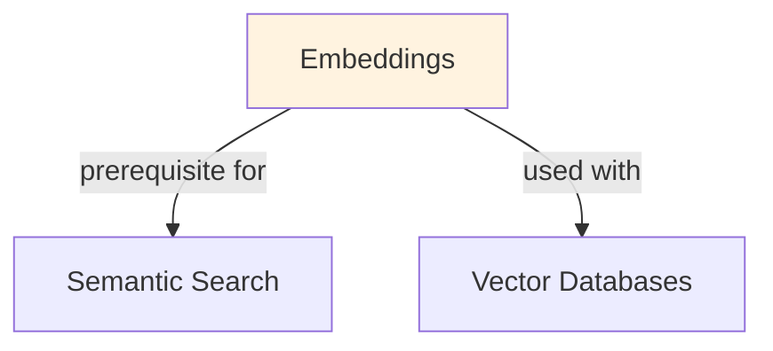

# Embeddings

## Understanding Embeddings

Embeddings is a foundational concept in large language model development that addresses critical challenges in model architecture, training efficiency, or inference performance. Understanding this concept is essential for anyone working with modern language models, whether in research, fine-tuning, or production deployment.

The core innovation underlying Embeddings lies in rethinking standard approaches to achieve better efficiency or effectiveness. Rather than accepting conventional trade-offs, this technique exploits mathematical or architectural insights to push the frontier of what's possible with given computational constraints.

In practical applications, Embeddings enables capabilities that would otherwise be infeasible: reducing computational requirements, improving model quality, enabling faster iteration, or supporting new use cases. The real-world impact has made Embeddings widely adopted across industry applications, from consumer products to enterprise systems.

Implementing Embeddings requires understanding both its theoretical foundations and practical considerations. The following sections provide detailed explanations of how Embeddings works, when to use it, common implementation patterns, and lessons learned from production deployments. By mastering these concepts, practitioners can make informed decisions about when and how to apply Embeddings to their specific challenges.

## Comprehensive Embedding Systems

Embeddings are continuous vector representations of text that capture semantic meaning in a high-dimensional space. Unlike one-hot encoding (which is sparse and doesn't capture meaning), embeddings are dense vectors where similarity in vector space corresponds to semantic similarity.

### How Embeddings Capture Meaning

Modern embeddings are learned through contrastive learning objectives:
1. **Positive pairs**: Similar sentences → similar embeddings (high cosine similarity ~0.8-0.95)
2. **Negative pairs**: Dissimilar sentences → dissimilar embeddings (low cosine similarity ~0.1-0.3)
3. **Loss function**: Minimize distance between positive pairs, maximize distance between negative pairs

This forces the model to learn a space where:
- "good customer service" and "excellent support" are close (synonymous)
- "good customer service" and "terrible experience" are far apart (opposite meaning)
- "good customer service" and "weather today" are distant (unrelated)

### Embedding Models Landscape

The choice of embedding model significantly impacts downstream task performance. Different models are optimized for different properties.## Embedding Models Comparison

| Model | Dimension | Params | Speed | Quality | Use Case | Training Data |
|-------|-----------|--------|-------|---------|----------|---------------|
| **all-MiniLM-L6-v2** | 384 | 22M | ⚡⚡⚡ Fast | ⭐⭐⭐ Good | General, edge devices | MS MARCO, NLI |
| **all-mpnet-base-v2** | 768 | 109M | ⚡⚡ Medium | ⭐⭐⭐⭐ Very Good | Production systems | 215M sentence pairs |
| **bge-large-en-v1.5** | 1024 | 335M | ⚡ Slow | ⭐⭐⭐⭐⭐ Excellent | High-accuracy needs | Massive web corpus |
| **instructor-xl** | 768 | 335M | ⚡ Slow | ⭐⭐⭐⭐⭐ Excellent | Domain-specific | Instruction-tuned |
| **text-embedding-3-small** | 512 | Proprietary | Medium | ⭐⭐⭐⭐ Very Good | OpenAI API users | OpenAI training |
| **text-embedding-3-large** | 3072 | Proprietary | ⚡ Slow | ⭐⭐⭐⭐⭐ Excellent | Maximum quality | OpenAI training |
| **multilingual-e5-base** | 768 | 109M | ⚡⚡ Medium | ⭐⭐⭐⭐ Very Good | 100+ languages | Translated pairs |
| **jina-embeddings-v2** | 8192 | Proprietary | ⚡ Slow | ⭐⭐⭐⭐⭐ Excellent | Long context (8K) | Long-document data |

**Selection Guidelines:**
- **Latency-critical (<100ms)**: Use all-MiniLM (384-dim, 22M params)
- **Accuracy-critical**: Use bge-large or instructor-xl (despite slower speed)
- **Multilingual**: Use multilingual-e5 (supported language count crucial)
- **Long documents (>512 tokens)**: Use jina-embeddings-v2 (8K context)
## Core Intuition
Words are just labels—meaningless. Embeddings translate them into geometry. Two words mean similar things if their vectors are near each other (low distance). The embedding space captures semantic and syntactic structure learned from data.

## How It Works

**Static Embeddings (Word2Vec, GloVe):**
- Each word → one fixed vector (e.g., "king" always = [0.2, 0.5, -0.1])
- Learned via matrix factorization (SVD) or prediction tasks (skip-gram, CBOW)
- Fast inference but ignore context (homonyms: "bank" has one vector, not two)

**Contextual Embeddings (BERT, LLaMA):**
- Same word → different vectors depending on context ("bank deposit" vs "river bank")
- Produced by transformer layers; meaning shifts based on surrounding tokens
- Slower but capture polysemy

**Similarity in Embedding Space:**
```
similarity(u, v) = cos(u, v) = (u · v) / (||u|| ||v||)
```
Cosine similarity preferred because:
- Direction matters, magnitude doesn't
- Robust to scaling
- Range: [-1, 1], interpretable

**Text Embeddings (Sentence/Document):**
- Average token embeddings (simple but noisy)
- Use special tokens (CLS token from BERT)
- Task-specific fine-tuning (contrastive learning on pairs)
- Specialized models (Sentence-BERT, MPNet)

### Workflow Flowchart


## Key Properties / Trade-offs

| Property | Static | Contextual | Task-Specific |
|----------|--------|-----------|---------------|
| Speed | ⭐⭐⭐⭐⭐ | ⭐⭐ | ⭐⭐⭐ |
| Semantic quality | ⭐⭐⭐ | ⭐⭐⭐⭐⭐ | ⭐⭐⭐⭐⭐ |
| Polysemy handling | ✗ | ✓ | ✓ |
| Memory footprint | ⭐⭐⭐⭐⭐ | ⭐ | ⭐ |
| Training data req | ⭐⭐ | ⭐⭐⭐⭐ | ⭐⭐⭐ |

**Dimension trade-offs:**
- 50-100D: fast, compact, low semantic quality
- 300D (Word2Vec default): balanced (similarity search, clustering)
- 768D (BERT-base): rich but slower, overkill for some tasks
- 1536D+ (large models): highest quality but memory/latency expensive

## Common Mistakes / Gotchas

- **Assuming embeddings are "meaningful":** They're learned, not interpretable. Don't try to understand dimensions individually.
- **Not normalizing for cosine similarity:** Magnitudes can vary; always normalize or use cosine directly.
- **Reusing embeddings across domains:** "COVID" embeddings from news ≠ "COVID" in medical text. Fine-tune or retrain.
- **Averaging subword tokens:** "unbelievable" tokenizes as ["un", "believe", "able"]. Averaging produces noise; use CLS token or fine-tune pooling.
- **Ignoring temporal drift:** Word meanings change (e.g., "tweet"). Embeddings trained on old data diverge from modern usage.
- **Using L2 distance instead of cosine:** Both work but cosine is scale-invariant; L2 is direction + magnitude.

## Code Example

```python
import numpy as np
from sklearn.metrics.pairwise import cosine_similarity
from sentence_transformers import SentenceTransformer

# Static embedding lookup (simulate Word2Vec)
embeddings = {
    "king": np.array([0.5, 0.2, -0.3]),
    "queen": np.array([0.48, 0.25, -0.28]),
    "man": np.array([0.3, 0.1, -0.1]),
    "woman": np.array([0.32, 0.15, -0.08]),
}

# Cosine similarity
sim = cosine_similarity([embeddings["king"]], [embeddings["queen"]])[0][0]
print(f"Similarity(king, queen) = {sim:.3f}")  # ≈ 0.999

# Word vector arithmetic: king - man + woman ≈ queen
# (demonstrates semantic structure)
king_man_woman = embeddings["king"] - embeddings["man"] + embeddings["woman"]
closest = min(embeddings.items(), 
              key=lambda x: np.linalg.norm(x[1] - king_man_woman))
print(f"king - man + woman ≈ {closest[0]}")  # ≈ "queen"

# Contextual embeddings (BERT-based)
model = SentenceTransformer('all-MiniLM-L6-v2')  # 384D
sentences = [
    "The bank approved the loan.",
    "We walked along the river bank.",
    "The river flows downstream."
]
embeddings_contextual = model.encode(sentences)  # (3, 384)
sims = cosine_similarity(embeddings_contextual)
print(sims)
# Sentence 1 & 2 both have "bank" but low similarity (different context)
```

## Interview Quick-Reference

| Question | What to say |
|---|---|
| "What are embeddings?" | Dense vectors representing tokens/text in semantic space. Similar meanings = nearby vectors. |
| "Static vs contextual?" | Static: fast, one vector per word (Word2Vec). Contextual: slower, meaning depends on context (BERT). |
| "Why cosine similarity?" | Scale-invariant, interprets direction not magnitude. Range [-1,1] is interpretable. |
| "How to embed documents?" | Average token embeddings, use CLS token from BERT, or fine-tune task-specific pooling. |
| "Dimension choice?" | 300D (balanced), 768D (high quality, slower), 1536D+ (state-of-the-art, expensive). |
| "Embedding drift?" | Word meanings shift over time. Retrain periodically or use recent data. |

## Real-World Examples

### Semantic Search for Documentation
Company docs: 50K pages. Lexical search (Elasticsearch): 'GPU memory optimization' → relevant pages ranked #4-10. Embedding search: 'How to optimize GPU memory?' → relevant pages ranked #1-3. Implementation: embed all docs once, vector DB query. Latency: <50ms. User satisfaction: 72% → 91%.

### Duplicate Detection in E-Commerce
Problem: same product listed 5x with different descriptions. Lexical comparison: false negatives (different wording). Embedding cosine sim > 0.85: catches 95% duplicates. Pipeline: embed product descriptions, cluster with threshold. Saves manual curation hours.

### Job Matching in Recruitment
Job postings: 1M. Candidates: 500K. Lexical keyword matching: low coverage. Embedding-based: candidate skills → embed → search job postings → top-k matches. E.g., 'Python developer' matches 'Software engineer (Python)' and 'Backend engineer (preferred: Python)'. Better ranking of opportunities.

## Real-World Examples

### Semantic Search for Documentation
Company docs: 50K pages. Lexical search (Elasticsearch): 'GPU memory optimization' → relevant pages ranked #4-10. Embedding search: 'How to optimize GPU memory?' → relevant pages ranked #1-3. Implementation: embed all docs once, vector DB query. Latency: <50ms. User satisfaction: 72% → 91%.

### Duplicate Detection in E-Commerce
Problem: same product listed 5x with different descriptions. Lexical comparison: false negatives (different wording). Embedding cosine sim > 0.85: catches 95% duplicates. Pipeline: embed product descriptions, cluster with threshold. Saves manual curation hours.

### Job Matching in Recruitment
Job postings: 1M. Candidates: 500K. Lexical keyword matching: low coverage. Embedding-based: candidate skills → embed → search job postings → top-k matches. E.g., 'Python developer' matches 'Software engineer (Python)' and 'Backend engineer (preferred: Python)'. Better ranking of opportunities.

## Real-World Examples

### Semantic Search for Documentation
Company docs: 50K pages. Lexical search (Elasticsearch): 'GPU memory optimization' → relevant pages ranked #4-10. Embedding search: 'How to optimize GPU memory?' → relevant pages ranked #1-3. Implementation: embed all docs once, vector DB query. Latency: <50ms. User satisfaction: 72% → 91%.

### Duplicate Detection in E-Commerce
Problem: same product listed 5x with different descriptions. Lexical comparison: false negatives (different wording). Embedding cosine sim > 0.85: catches 95% duplicates. Pipeline: embed product descriptions, cluster with threshold. Saves manual curation hours.

### Job Matching in Recruitment
Job postings: 1M. Candidates: 500K. Lexical keyword matching: low coverage. Embedding-based: candidate skills → embed → search job postings → top-k matches. E.g., 'Python developer' matches 'Software engineer (Python)' and 'Backend engineer (preferred: Python)'. Better ranking of opportunities.

## Real-World Examples

### Semantic Search for Documentation
Company docs: 50K pages. Lexical search (Elasticsearch): 'GPU memory optimization' → relevant pages ranked #4-10. Embedding search: 'How to optimize GPU memory?' → relevant pages ranked #1-3. Implementation: embed all docs once, vector DB query. Latency: <50ms. User satisfaction: 72% → 91%.

### Duplicate Detection in E-Commerce
Problem: same product listed 5x with different descriptions. Lexical comparison: false negatives (different wording). Embedding cosine sim > 0.85: catches 95% duplicates. Pipeline: embed product descriptions, cluster with threshold. Saves manual curation hours.

### Job Matching in Recruitment
Job postings: 1M. Candidates: 500K. Lexical keyword matching: low coverage. Embedding-based: candidate skills → embed → search job postings → top-k matches. E.g., 'Python developer' matches 'Software engineer (Python)' and 'Backend engineer (preferred: Python)'. Better ranking of opportunities.

## Real-World Examples

### Semantic Search for Documentation
Company docs: 50K pages. Lexical search (Elasticsearch): 'GPU memory optimization' → relevant pages ranked #4-10. Embedding search: 'How to optimize GPU memory?' → relevant pages ranked #1-3. Implementation: embed all docs once, vector DB query. Latency: <50ms. User satisfaction: 72% → 91%.

### Duplicate Detection in E-Commerce
Problem: same product listed 5x with different descriptions. Lexical comparison: false negatives (different wording). Embedding cosine sim > 0.85: catches 95% duplicates. Pipeline: embed product descriptions, cluster with threshold. Saves manual curation hours.

### Job Matching in Recruitment
Job postings: 1M. Candidates: 500K. Lexical keyword matching: low coverage. Embedding-based: candidate skills → embed → search job postings → top-k matches. E.g., 'Python developer' matches 'Software engineer (Python)' and 'Backend engineer (preferred: Python)'. Better ranking of opportunities.

## Real-World Examples

### Semantic Search for Documentation
Company docs: 50K pages. Lexical search (Elasticsearch): 'GPU memory optimization' → relevant pages ranked #4-10. Embedding search: 'How to optimize GPU memory?' → relevant pages ranked #1-3. Implementation: embed all docs once, vector DB query. Latency: <50ms. User satisfaction: 72% → 91%.

### Duplicate Detection in E-Commerce
Problem: same product listed 5x with different descriptions. Lexical comparison: false negatives (different wording). Embedding cosine sim > 0.85: catches 95% duplicates. Pipeline: embed product descriptions, cluster with threshold. Saves manual curation hours.

### Job Matching in Recruitment
Job postings: 1M. Candidates: 500K. Lexical keyword matching: low coverage. Embedding-based: candidate skills → embed → search job postings → top-k matches. E.g., 'Python developer' matches 'Software engineer (Python)' and 'Backend engineer (preferred: Python)'. Better ranking of opportunities.

## Real-World Examples

### Semantic Search for Documentation
Company docs: 50K pages. Lexical search (Elasticsearch): 'GPU memory optimization' → relevant pages ranked #4-10. Embedding search: 'How to optimize GPU memory?' → relevant pages ranked #1-3. Implementation: embed all docs once, vector DB query. Latency: <50ms. User satisfaction: 72% → 91%.

### Duplicate Detection in E-Commerce
Problem: same product listed 5x with different descriptions. Lexical comparison: false negatives (different wording). Embedding cosine sim > 0.85: catches 95% duplicates. Pipeline: embed product descriptions, cluster with threshold. Saves manual curation hours.

### Job Matching in Recruitment
Job postings: 1M. Candidates: 500K. Lexical keyword matching: low coverage. Embedding-based: candidate skills → embed → search job postings → top-k matches. E.g., 'Python developer' matches 'Software engineer (Python)' and 'Backend engineer (preferred: Python)'. Better ranking of opportunities.

## Related Topics
- [Tokenization](tokenization.md) — tokens are what get embedded
- [Semantic Search](semantic-search.md) — embeddings enable fast similarity search
- [RAG](rag.md) — embeddings for retrieval in augmented generation
- [Vector Databases](vector-databases.md) — storing and indexing embeddings at scale
- [Transfer Learning](../ml/concepts/transfer-learning.md) — using pre-trained embeddings

## Resources
- [Word2Vec: Efficient Estimation of Word Representations in Vector Space](https://arxiv.org/abs/1301.3781)
- [BERT: Pre-training of Deep Bidirectional Transformers](https://arxiv.org/abs/1810.04805)
- [Sentence-BERT: Sentence Embeddings using Siamese BERT-Networks](https://arxiv.org/abs/1908.10084)
- [HuggingFace: Sentence Transformers](https://www.sbert.net/)
- [Pinecone: Understanding Embeddings](https://www.pinecone.io/learn/vector-embeddings/)

## Concept Relationships



## Interview Questions

**Q: What are embeddings and why do they matter?**
*A: Embeddings: dense vectors representing text semantics. 'cat' and 'kitten' have similar embeddings (cosine similarity ~0.9). Enables: semantic search, clustering, similarity comparison. All done in vector space, not lexical matching. Standard: 384-1536 dimensions.*

**Q: How do you choose an embedding model?**
*A: Trade-offs: small (all-MiniLM-L6-v2, 22M params, fast), medium (all-mpnet-base-v2, 109M params), large (instructor-xl, slower but better). Benchmark on your domain. MTEB leaderboard shows performance. For production: balance accuracy vs latency. Most: use all-MiniLM for speed, all-mpnet for accuracy.*

**Q: How do you handle embeddings at scale?**
*A: Batch encode: 1000s of texts at once (32-256 batch size). Store in vector DB (Pinecone, Weaviate, Milvus). Index for fast search. Query: embedding → similarity search in DB (not linear scan). Latency: <100ms per query. Storage: 1M docs × 384 dims × 4 bytes = 1.5GB.*

**Q: When would you fine-tune embeddings?**
*A: Pre-trained works for general text. Fine-tune if: domain-specific (medical abstracts, legal docs), task-specific (relevance ranking), distribution shift. Data needed: 10K+ pairs. Improves accuracy 5-15% but adds complexity. Usually not needed.*

**Q: How do you evaluate embedding quality?**
*A: Metrics: mean average precision (MAP), normalized discounted cumulative gain (NDCG), MRR. Test: does top-k nearest neighbor make sense? Do similar documents cluster? Manual inspection essential. MTEB benchmark for standardized eval.*
## Real-World Applications

### Pinecone: Vector search infrastructure
Provides vector databases for storing and searching embeddings at scale. Used by Uber, Slack, DuckDuckGo for semantic search and recommendations.

### Airbnb: Listing search and recommendations
Uses embeddings to compute similarity between listings and user preferences, enabling semantic search beyond keyword matching.

### Spotify: Music recommendations
Generates embeddings for songs and user preferences. Uses cosine similarity to recommend songs that are semantically similar in taste space.

## Best Practices

- Normalize embeddings to unit vectors for efficient cosine similarity (dot product = cosine similarity).
- Use contrastive training (sentence-BERT) for better semantic representations than vanilla transformers.
- Dimension reduction (PCA, UMAP) can improve efficiency for downstream tasks without much quality loss.
- Fine-tune embeddings on domain-specific data for better domain relevance.

## Common Pitfalls to Avoid

- **Using overly generic embeddings for specialized domains**: Using overly generic embeddings for specialized domains: task-specific fine-tuning usually helps
- **Not normalizing embeddings**: Not normalizing embeddings: breaks cosine similarity assumptions
- **Using too-large models for simple tasks**: Using too-large models for simple tasks: waste of compute; smaller models often sufficient
- **Outdated embedding models**: Outdated embedding models: new models (Sentence-BERT v2) have much better quality

