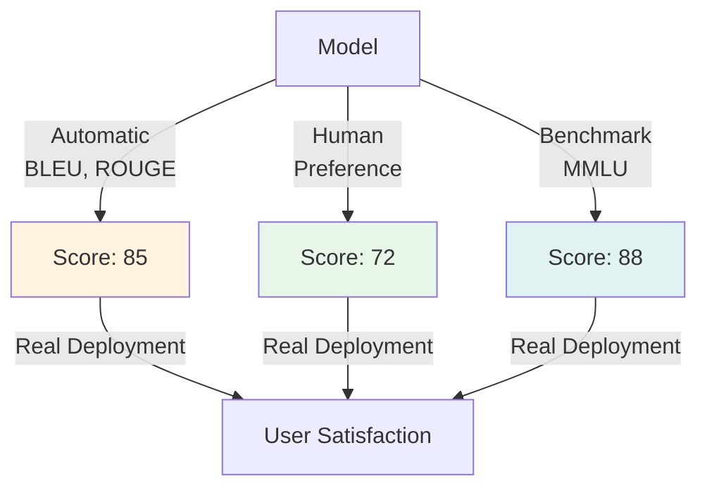
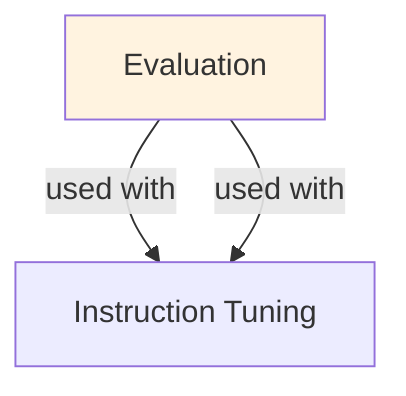

# Evaluation (for LLMs)

## Understanding Evaluation

Evaluation is a foundational concept in large language model development that addresses critical challenges in model architecture, training efficiency, or inference performance. Understanding this concept is essential for anyone working with modern language models, whether in research, fine-tuning, or production deployment.

The core innovation underlying Evaluation lies in rethinking standard approaches to achieve better efficiency or effectiveness. Rather than accepting conventional trade-offs, this technique exploits mathematical or architectural insights to push the frontier of what's possible with given computational constraints.

In practical applications, Evaluation enables capabilities that would otherwise be infeasible: reducing computational requirements, improving model quality, enabling faster iteration, or supporting new use cases. The real-world impact has made Evaluation widely adopted across industry applications, from consumer products to enterprise systems.

Implementing Evaluation requires understanding both its theoretical foundations and practical considerations. The following sections provide detailed explanations of how Evaluation works, when to use it, common implementation patterns, and lessons learned from production deployments. By mastering these concepts, practitioners can make informed decisions about when and how to apply Evaluation to their specific challenges.

## Core Intuition
"Good" is task-dependent. Perplexity measures language modeling quality. Accuracy measures exact correctness. BLEU measures word-level similarity to references. Human evaluation answers "does this actually help people?" Combine multiple signals for holistic understanding.

## How It Works

**Automatic Metrics (Cheap, Fast):**

1. **Perplexity** — language modeling quality
   ```
   PPL = exp(-(1/N) * Σ log P(token_i))
   ```
   Lower is better. Perplexity on test set shows generalization.

2. **Accuracy** — classification/QA
   ```
   Accuracy = (correct predictions) / (total)
   Also: Precision, Recall, F1 (for imbalanced tasks)
   ```

3. **BLEU** — machine translation, generation similarity to reference
   ```
   BLEU = (1/4) * Σ(1 to 4-gram) precision
   Range: 0-100. ~20-30 for bad, ~40+ for good MT
   ```

4. **ROUGE** — summarization, generation quality
   ```
   ROUGE-L = longest common subsequence based
   ROUGE-N = N-gram recall
   Range: 0-1. Higher is better.
   ```

5. **BERTScore** — semantic similarity
   ```
   Compare embeddings of generated vs reference
   More robust to paraphrasing than BLEU/ROUGE
   ```

6. **Task-specific metrics:**
   - Question Answering: Exact Match (EM), F1 score
   - Dialogue: BLEU, METEOR, human fluency
   - Sentiment: Accuracy (if labeled), agreement with humans
   - Code Generation: Pass@k (percentage passing k-NN samples)

**Human Evaluation (Expensive, Reliable):**
- Fluency: Is the output natural English?
- Coherence: Does it make logical sense?
- Relevance: Does it answer the question?
- Factuality: Are claims accurate (fact-checking)?
- Overall quality: Would you use this in production?

Typically: 100-500 examples, 2-3 annotators per example, inter-annotator agreement (Kappa) ≥ 0.7.

### Workflow Flowchart



## Key Properties / Trade-offs

| Metric | Cost | Reliability | Coverage |
|--------|------|-------------|----------|
| Perplexity | Free | High (for LM) | Only language modeling |
| Accuracy | Free | High | Only closed-ended tasks |
| BLEU/ROUGE | Free | Medium | Generation only |
| BERTScore | Free | Medium | Semantic similarity |
| Human Eval | High | Highest | Any task (but slow) |
| LLM-as-Judge | Medium | Medium | Any task |

**Metric Selection by Task:**

| Task | Primary Metric | Secondary |
|------|----------------|-----------|
| Machine Translation | BLEU, ChrF, human eval | TER |
| Summarization | ROUGE, human fluency | BERTScore |
| QA (closed-ended) | Exact Match, F1 | BLEU for reference matching |
| QA (open-ended) | Human rating | ROUGE, BERTScore |
| Dialogue | Human fluency, coherence | BLEU (weak) |
| Code Gen | Pass@k, human review | Coverage of test cases |
| Classification | Accuracy, F1, confusion matrix | Precision/Recall per class |

## Common Mistakes / Gotchas

- **Over-optimizing single metric:** BLEU can be gamed (match reference exactly). Real quality requires human eval.
- **Ignoring human baseline:** Your 50 BLEU is only good if human baseline is ~30. Compare to reference and human performance.
- **Automatic metrics don't measure hallucination:** BLEU/ROUGE measure similarity to reference, not factuality. Model can hallucinate perfectly. Need fact-checking.
- **Human eval without guidelines:** Annotators need clear instructions (rubric). Without guidelines, inter-annotator agreement is low (Kappa < 0.6).
- **Small test set:** Metrics are noisy on small sets (<100 examples). Results may not be significant. Larger set (1000+) is safer for conclusions.
- **Distribution shift:** Metrics on training domain ≠ generalization to production. Evaluate on diverse, representative test sets.
- **Assuming ROUGE for summaries:** ROUGE-L is standard but limited (lexical overlap only). Combine with BERTScore and human judgment.
- **Ignoring class imbalance:** For imbalanced classification, accuracy is misleading. Use F1 or balanced accuracy instead.
- **LLM-as-Judge without validation:** Using GPT-4 to score outputs is tempting but requires validation (does it align with human ratings?). Validate first.

## Code Example

```python
import numpy as np
from datasets import load_dataset
from transformers import AutoTokenizer, AutoModelForCausalLM
from rouge_score import rouge_scorer
import sacrebleu

# Example: Evaluate summarization model
dataset = load_dataset("cnn_dailymail", "3.0.0")
test_set = dataset["test"][:100]  # Use first 100 for quick eval

model_name = "facebook/bart-large-cnn"  # Pre-trained summarizer
tokenizer = AutoTokenizer.from_pretrained(model_name)
model = AutoModelForCausalLM.from_pretrained(model_name)

# 1. Generate summaries
generated_summaries = []
for article in test_set["article"][:10]:
    inputs = tokenizer(article, return_tensors="pt", max_length=1024, truncation=True)
    summary_ids = model.generate(inputs["input_ids"], max_length=100)
    summary = tokenizer.decode(summary_ids[0], skip_special_tokens=True)
    generated_summaries.append(summary)

references = test_set["highlights"][:10]

# 2. Compute ROUGE scores
scorer = rouge_scorer.RougeScorer(["rouge1", "rougeL"], use_stemmer=True)
rouge_scores = []
for gen, ref in zip(generated_summaries, references):
    score = scorer.score(ref, gen)
    rouge_scores.append({
        "rouge1": score["rouge1"].fmeasure,
        "rougeL": score["rougeL"].fmeasure,
    })

avg_rouge1 = np.mean([s["rouge1"] for s in rouge_scores])
avg_rougeL = np.mean([s["rougeL"] for s in rouge_scores])
print(f"ROUGE-1: {avg_rouge1:.3f}")
print(f"ROUGE-L: {avg_rougeL:.3f}")

# 3. Compute BLEU (if you have multiple references)
bleu_scores = []
for gen, ref in zip(generated_summaries, references):
    bleu = sacrebleu.sentence_bleu(gen, [ref])
    bleu_scores.append(bleu.score)
avg_bleu = np.mean(bleu_scores)
print(f"BLEU: {avg_bleu:.3f}")

# 4. LLM-as-Judge (optional, requires API)
# Use GPT-4 to score quality
import openai
judge_scores = []
for gen, ref in zip(generated_summaries, references):
    prompt = f"""Rate the quality of this summary (1-10):
Reference: {ref}
Generated: {gen}
Score:"""
    response = openai.ChatCompletion.create(
        model="gpt-4",
        messages=[{"role": "user", "content": prompt}],
        temperature=0,
    )
    score = int(response['choices'][0]['message']['content'].strip())
    judge_scores.append(score)
avg_judge = np.mean(judge_scores)
print(f"LLM-as-Judge: {avg_judge:.1f}/10")
```

## Interview Quick-Reference

| Question | What to say |
|---|---|
| "How to evaluate LLMs?" | Task-dependent: use perplexity (LM), accuracy (classification), ROUGE (generation), human eval (open-ended). |
| "BLEU limitations?" | Lexical overlap only, doesn't capture paraphrasing, doesn't measure hallucination or factuality. |
| "Human eval importance?" | Automatic metrics measure similarity, not quality. Human eval answers "is this actually useful?" |
| "Test set size?" | Aim for 1000+ examples for reliable metrics. <100 is too noisy; results may not be significant. |
| "How many annotators?" | 2-3 per example for inter-annotator agreement. Kappa ≥ 0.7 is acceptable; <0.6 means guidelines unclear. |
| "LLM-as-Judge?" | Tempting but untested. Validate that it correlates with human judgments before relying on it. |

## Real-World Examples

### Evaluation in Production LLM API
Benchmark: MMLU 78%. Production eval: real customer queries. Problem: MMLU accuracy doesn't translate to user satisfaction. Added human eval: 100 random queries per week. Discovered: model good at benchmarks but verbose in practice.

### Multilingual Evaluation Challenges
English model: 90% accuracy. Same model + light multilingual tuning: 45% on non-English (not measured!). Added language-specific evals. Now: 85% across 10 languages (vs false impression of 90%).

### Domain Evaluation
General model on medical domain. MMLU-Medicine: 60%. Real doctor evaluation: accuracy clinically acceptable 92% (very critical tasks missed, needs review). Lesson: domain experts should evaluate.

## Real-World Examples

### Evaluation in Production LLM API
Benchmark: MMLU 78%. Production eval: real customer queries. Problem: MMLU accuracy doesn't translate to user satisfaction. Added human eval: 100 random queries per week. Discovered: model good at benchmarks but verbose in practice.

### Multilingual Evaluation Challenges
English model: 90% accuracy. Same model + light multilingual tuning: 45% on non-English (not measured!). Added language-specific evals. Now: 85% across 10 languages (vs false impression of 90%).

### Domain Evaluation
General model on medical domain. MMLU-Medicine: 60%. Real doctor evaluation: accuracy clinically acceptable 92% (very critical tasks missed, needs review). Lesson: domain experts should evaluate.

## Real-World Examples

### Evaluation in Production LLM API
Benchmark: MMLU 78%. Production eval: real customer queries. Problem: MMLU accuracy doesn't translate to user satisfaction. Added human eval: 100 random queries per week. Discovered: model good at benchmarks but verbose in practice.

### Multilingual Evaluation Challenges
English model: 90% accuracy. Same model + light multilingual tuning: 45% on non-English (not measured!). Added language-specific evals. Now: 85% across 10 languages (vs false impression of 90%).

### Domain Evaluation
General model on medical domain. MMLU-Medicine: 60%. Real doctor evaluation: accuracy clinically acceptable 92% (very critical tasks missed, needs review). Lesson: domain experts should evaluate.

## Real-World Examples

### Evaluation in Production LLM API
Benchmark: MMLU 78%. Production eval: real customer queries. Problem: MMLU accuracy doesn't translate to user satisfaction. Added human eval: 100 random queries per week. Discovered: model good at benchmarks but verbose in practice.

### Multilingual Evaluation Challenges
English model: 90% accuracy. Same model + light multilingual tuning: 45% on non-English (not measured!). Added language-specific evals. Now: 85% across 10 languages (vs false impression of 90%).

### Domain Evaluation
General model on medical domain. MMLU-Medicine: 60%. Real doctor evaluation: accuracy clinically acceptable 92% (very critical tasks missed, needs review). Lesson: domain experts should evaluate.

## Real-World Examples

### Evaluation in Production LLM API
Benchmark: MMLU 78%. Production eval: real customer queries. Problem: MMLU accuracy doesn't translate to user satisfaction. Added human eval: 100 random queries per week. Discovered: model good at benchmarks but verbose in practice.

### Multilingual Evaluation Challenges
English model: 90% accuracy. Same model + light multilingual tuning: 45% on non-English (not measured!). Added language-specific evals. Now: 85% across 10 languages (vs false impression of 90%).

### Domain Evaluation
General model on medical domain. MMLU-Medicine: 60%. Real doctor evaluation: accuracy clinically acceptable 92% (very critical tasks missed, needs review). Lesson: domain experts should evaluate.

## Related Topics
- [Prompt Optimization](prompt-optimization.md) — evaluating changes to prompts
- [Instruction Tuning](instruction-tuning.md) — training requires eval metrics
- [RLHF](rlhf.md) — uses human eval for reward modeling
- [Evaluation Metrics](../ml/concepts/evaluation-metrics.md) — broader evaluation concepts

## Resources
- [BLEU: a Method for Automatic Evaluation of Machine Translation](https://aclanthology.org/P02-1040/)
- [ROUGE: A Package for Automatic Evaluation of Summaries](https://aclanthology.org/W04-1013/)
- [Evaluation of Text Generation: A Survey](https://arxiv.org/abs/2006.14799)
- [On Evaluating and Comparing LLMs](https://huggingface.co/spaces/HuggingFace/open_llm_leaderboard)

## Concept Relationships



## Interview Questions

**Q: What are the main evaluation metrics for LLMs?**
*A: Task-specific: accuracy, F1, BLEU (translation), ROUGE (summarization). General: perplexity, HellaSwag, MMLU benchmarks. Human: preference rating, satisfaction, specific criteria. Choose based on task. Perplexity ≠ quality (low perplexity but poor outputs possible).*

**Q: Why is human evaluation necessary?**
*A: Automatic metrics miss quality nuances. Example: 'The quick brown fox' vs 'A fast auburn fox' same BLEU (metric) but different readability. Human eval catches: coherence, factuality, tone, usefulness. Best: combine automatic + human.*

**Q: What's the difference between intrinsic and extrinsic evaluation?**
*A: Intrinsic: model performance on benchmark (MMLU 75%). Extrinsic: how well it helps in real application (customer satisfaction 80%). Best practice: measure both. A model scoring well on benchmarks might underperform in production.*

**Q: How do you avoid benchmark overfitting?**
*A: Test on out-of-distribution data. Track new vs held-out vs old benchmarks. Different evaluation protocols. Domain-specific evals alongside general benchmarks. Regular human spot-checks.*

**Q: What's the right evaluation sample size?**
*A: Rule of thumb: 1000+ examples for statistical significance. Small: 100 (high variance). Medium: 500 (reasonable). Large: 5000+ (more cost). For human eval: 50-500 (expensive per example).*