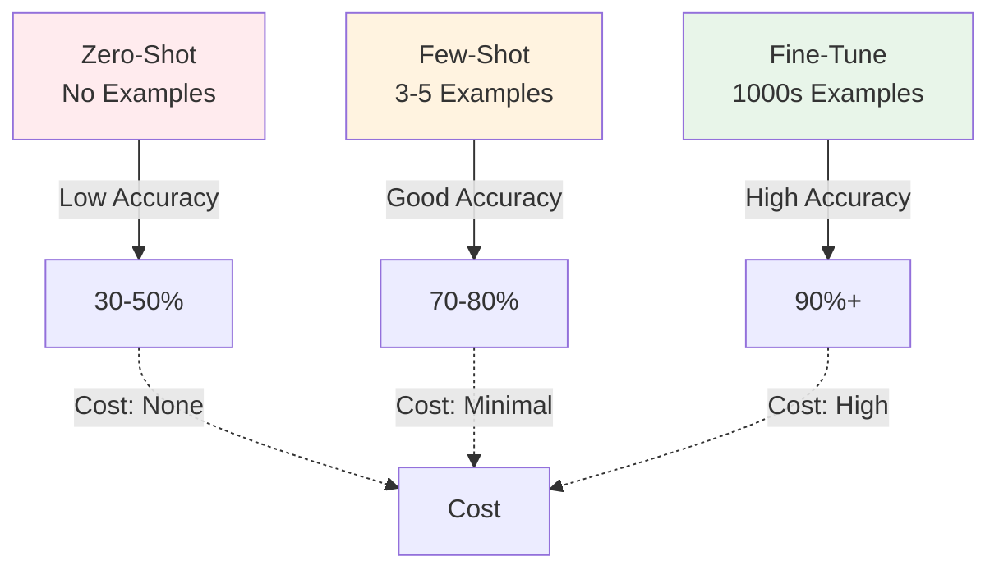
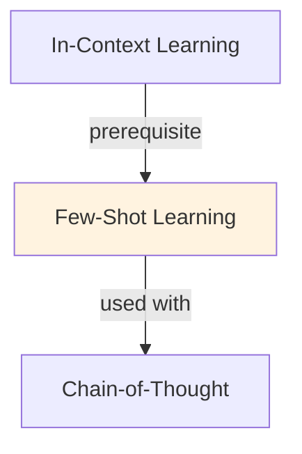

# Few-Shot Learning

## TL;DR
Provide a few examples (3-10) in the prompt to teach LLM a task. Model learns task structure from examples without fine-tuning. Enables rapid customization; trade-off: longer prompts, some tasks need more examples than others.

## Core Intuition
Humans learn fast from examples: show one translation, they get the pattern. Few-shot leverages LLMs' ability to recognize patterns from in-context examples. No weight updates needed.

## How It Works

**Structure:**
```
Task instruction (optional but helps)
Example 1: Input → Output
Example 2: Input → Output
Example 3: Input → Output
New input → [Model generates]
```

**Example: Sentiment Classification**
```
Classify sentiment (positive/negative):

Text: "I loved this movie!" → Sentiment: positive
Text: "Terrible experience." → Sentiment: negative
Text: "It was okay." → Sentiment: neutral

Text: "Amazing product, highly recommend!"
Sentiment:
```

**Effective Strategies:**
- **Diversity:** Mix different examples (long/short, obvious/subtle)
- **Order:** Put harder examples later (model performs better with warm-up)
- **Similarity:** Examples similar to test case → better few-shot performance
- **Explanations:** Include reasoning in examples (especially for complex tasks)

### Workflow Flowchart



## Key Properties / Trade-offs

| Shots | Examples | Latency | Accuracy | Best For |
|-------|----------|---------|----------|----------|
| Zero | 0 | Fast | Lower | Simple tasks, general |
| One | 1 | Fast | Medium | Basic patterns |
| Few | 3-5 | Medium | High | Most use cases |
| Many | 10+ | Slow | Marginal gain | Complex, nuanced |

**Diminishing returns:** Typically 3-5 examples sufficient; 20+ shows little improvement.

## Common Mistakes / Gotchas

- **Bad example selection:** Unrepresentative or wrong examples confuse model. Choose carefully.
- **Too many examples:** Exceeds context window, dilutes signal. Sweet spot: 3-10.
- **No instructions:** Only examples, no task description. Add instruction for clarity.
- **Inconsistent formats:** If examples vary in format, model confused. Be consistent.

## Code Example

```python
from anthropic import Anthropic

client = Anthropic()

# Few-shot prompt
prompt = """Classify sentiment (positive, negative, neutral):

Examples:
"I love this product!" → positive
"Waste of money" → negative
"It works fine" → neutral

Now classify: "This is amazing!"
Sentiment:"""

response = client.messages.create(
    model="claude-3-5-sonnet-20241022",
    max_tokens=50,
    messages=[{"role": "user", "content": prompt}]
)
print(response.content[0].text)
```

## Interview Quick-Reference

| Question | What to say |
|---|---|
| "Few-shot?" | Show examples in prompt to teach task. 3-5 examples typical. Fast, no fine-tuning. |
| "vs fine-tuning?" | Few-shot: instant, flexible. Fine-tuning: better accuracy, requires data/compute. |
| "How many examples?" | 3-5 for most tasks. More helps complex tasks; diminishing returns >10. |
| "Bad performance?" | Check example quality and diversity. Adjust format, add instructions. |

## Real-World Examples

### Few-Shot for Customer Intent Classification
Chatbot: classify support tickets. Examples: 'Refund request' → returns, 'Can't login' → technical, 'Feedback' → general. Zero-shot: 45% accuracy. Few-shot (3 examples): 72% accuracy. Deployed in Zendesk integration.

### Few-Shot Semantic Matching
Task: match product descriptions to categories. Descriptions vary (informal, typos, abbreviations). Few-shot with diverse examples: 88% accuracy. Cost: <$0.01 per classification vs. $0.50 with fine-tuning.

### Multi-Language Few-Shot
Translate task instructions to 10 languages. Few-shot examples in each language. Model generalizes zero-shot to other languages through few-shot anchoring. Accuracy: 75% (vs 40% direct translation).

## Real-World Examples

### Few-Shot for Customer Intent Classification
Chatbot: classify support tickets. Examples: 'Refund request' → returns, 'Can't login' → technical, 'Feedback' → general. Zero-shot: 45% accuracy. Few-shot (3 examples): 72% accuracy. Deployed in Zendesk integration.

### Few-Shot Semantic Matching
Task: match product descriptions to categories. Descriptions vary (informal, typos, abbreviations). Few-shot with diverse examples: 88% accuracy. Cost: <$0.01 per classification vs. $0.50 with fine-tuning.

### Multi-Language Few-Shot
Translate task instructions to 10 languages. Few-shot examples in each language. Model generalizes zero-shot to other languages through few-shot anchoring. Accuracy: 75% (vs 40% direct translation).

## Related Topics
- [In-Context Learning](in-context-learning.md) — broader ICL concept
- [Zero-Shot Learning](zero-shot-learning.md) — no examples, just instructions
- [Chain-of-Thought](chain-of-thought.md) — combine CoT with few-shot for better reasoning

## Resources
- [In-Context Learning in Large Language Models](https://arxiv.org/abs/2301.00234)
- [What In-Context Learning "Learns"](https://arxiv.org/abs/2310.00867)

## Concept Relationships



## Interview Questions

**Q: What's few-shot learning and how does it differ from zero-shot?**
*A: Zero-shot: 'Classify sentiment: positive/negative'. Few-shot: '"Good product" → positive. "Bad product" → negative. "Good quality" → positive. Now classify: "Great service"'. Few-shot dramatically improves accuracy (sometimes 30-50% gain).*

**Q: How many examples do you need for effective few-shot?**
*A: Task-dependent: simple classification = 1-2 examples sufficient. Complex reasoning = 5-10 needed. Diminishing returns beyond 10 (20+ shows minimal improvement). Rule of thumb: start with 3, increase if accuracy low. Quality > quantity (good examples matter more than many).*

**Q: What makes a good few-shot example?**
*A: Diverse: cover range of inputs (easy + hard cases). Representative: similar to test distribution. Explained: include reasoning if helpful. Consistent: same format for all. Bad: unrepresentative or noisy examples confuse model.*

**Q: How do you select few-shot examples programmatically?**
*A: Random: simple, sometimes okay. Similarity-based: choose examples most similar to test input (use embeddings). Uncertainty sampling: examples model uncertain on. Diversity-based: examples covering feature space. Best: combination of similarity + diversity.*

**Q: When is few-shot insufficient and you need fine-tuning?**
*A: Few-shot works: general tasks, simple patterns, prompt-able behaviors. Fails: task requires significant internal model change, distribution shift, style transfer. Example: sentiment classification (few-shot fine) vs. writing style adaptation (needs fine-tuning).*