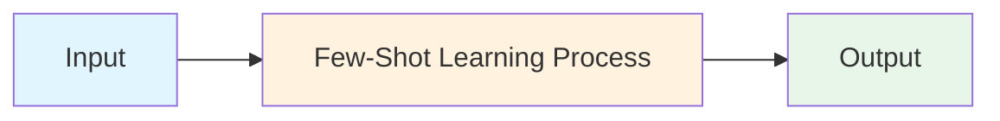
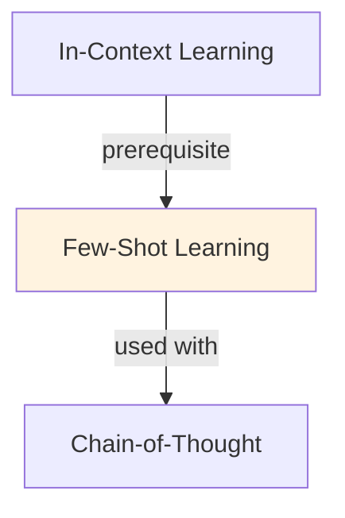

# Few-Shot Learning

## TL;DR
Provide a few examples (3-10) in the prompt to teach LLM a task. Model learns task structure from examples without fine-tuning. Enables rapid customization; trade-off: longer prompts, some tasks need more examples than others.

## Core Intuition
Humans learn fast from examples: show one translation, they get the pattern. Few-shot leverages LLMs' ability to recognize patterns from in-context examples. No weight updates needed.

## How It Works

**Structure:**
```
Task instruction (optional but helps)
Example 1: Input → Output
Example 2: Input → Output
Example 3: Input → Output
New input → [Model generates]
```

**Example: Sentiment Classification**
```
Classify sentiment (positive/negative):

Text: "I loved this movie!" → Sentiment: positive
Text: "Terrible experience." → Sentiment: negative
Text: "It was okay." → Sentiment: neutral

Text: "Amazing product, highly recommend!"
Sentiment:
```

**Effective Strategies:**
- **Diversity:** Mix different examples (long/short, obvious/subtle)
- **Order:** Put harder examples later (model performs better with warm-up)
- **Similarity:** Examples similar to test case → better few-shot performance
- **Explanations:** Include reasoning in examples (especially for complex tasks)

### Workflow Flowchart



## Key Properties / Trade-offs

| Shots | Examples | Latency | Accuracy | Best For |
|-------|----------|---------|----------|----------|
| Zero | 0 | Fast | Lower | Simple tasks, general |
| One | 1 | Fast | Medium | Basic patterns |
| Few | 3-5 | Medium | High | Most use cases |
| Many | 10+ | Slow | Marginal gain | Complex, nuanced |

**Diminishing returns:** Typically 3-5 examples sufficient; 20+ shows little improvement.

## Common Mistakes / Gotchas

- **Bad example selection:** Unrepresentative or wrong examples confuse model. Choose carefully.
- **Too many examples:** Exceeds context window, dilutes signal. Sweet spot: 3-10.
- **No instructions:** Only examples, no task description. Add instruction for clarity.
- **Inconsistent formats:** If examples vary in format, model confused. Be consistent.

## Code Example

```python
from anthropic import Anthropic

client = Anthropic()

# Few-shot prompt
prompt = """Classify sentiment (positive, negative, neutral):

Examples:
"I love this product!" → positive
"Waste of money" → negative
"It works fine" → neutral

Now classify: "This is amazing!"
Sentiment:"""

response = client.messages.create(
    model="claude-3-5-sonnet-20241022",
    max_tokens=50,
    messages=[{"role": "user", "content": prompt}]
)
print(response.content[0].text)
```

## Interview Quick-Reference

| Question | What to say |
|---|---|
| "Few-shot?" | Show examples in prompt to teach task. 3-5 examples typical. Fast, no fine-tuning. |
| "vs fine-tuning?" | Few-shot: instant, flexible. Fine-tuning: better accuracy, requires data/compute. |
| "How many examples?" | 3-5 for most tasks. More helps complex tasks; diminishing returns >10. |
| "Bad performance?" | Check example quality and diversity. Adjust format, add instructions. |

## Related Topics
- [In-Context Learning](in-context-learning.md) — broader ICL concept
- [Zero-Shot Learning](zero-shot-learning.md) — no examples, just instructions
- [Chain-of-Thought](chain-of-thought.md) — combine CoT with few-shot for better reasoning

## Resources
- [In-Context Learning in Large Language Models](https://arxiv.org/abs/2301.00234)
- [What In-Context Learning "Learns"](https://arxiv.org/abs/2310.00867)

## Concept Relationships



## Interview Questions

**Q: What's the core problem this concept solves?**
*A: See the 'Core Intuition' section above for the fundamental problem and how this concept addresses it.*

**Q: What are the main advantages and disadvantages?**
*A: See 'Key Properties / Trade-offs' section for detailed comparison with alternatives.*

**Q: How do you implement this in practice?**
*A: Refer to the corresponding Jupyter notebook in `llm/notebooks/` for working Python implementations and examples.*

