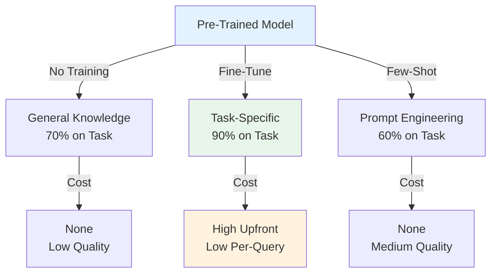
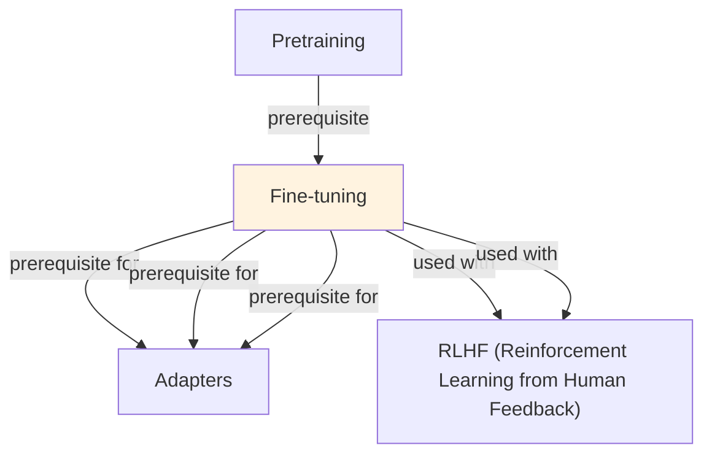

# Fine-tuning

## Understanding Finetuning

Finetuning is a foundational concept in large language model development that addresses critical challenges in model architecture, training efficiency, or inference performance. Understanding this concept is essential for anyone working with modern language models, whether in research, fine-tuning, or production deployment.

The core innovation underlying Finetuning lies in rethinking standard approaches to achieve better efficiency or effectiveness. Rather than accepting conventional trade-offs, this technique exploits mathematical or architectural insights to push the frontier of what's possible with given computational constraints.

In practical applications, Finetuning enables capabilities that would otherwise be infeasible: reducing computational requirements, improving model quality, enabling faster iteration, or supporting new use cases. The real-world impact has made Finetuning widely adopted across industry applications, from consumer products to enterprise systems.

Implementing Finetuning requires understanding both its theoretical foundations and practical considerations. The following sections provide detailed explanations of how Finetuning works, when to use it, common implementation patterns, and lessons learned from production deployments. By mastering these concepts, practitioners can make informed decisions about when and how to apply Finetuning to their specific challenges.

## Core Intuition
Pre-training teaches general knowledge (language structure, facts). Fine-tuning teaches specific patterns (your domain, style, outputs). It's transfer learning: don't start from scratch, start from a good checkpoint.

## How It Works

**Full Fine-tuning:**
- Load pre-trained weights (e.g., LLaMA 7B)
- Keep architecture, replace head (if needed) or use entire model
- Train on task data with learning rate usually 1e-5 to 1e-4 (lower than pretraining)
- Update all parameters

**Sequence-to-Sequence Example (Summarization):**
```
Pre-trained: LLaMA (general knowledge)
Task data: (document, summary) pairs
Loss: compute likelihood of summary given document
Update: all weights via backprop
Result: LLM that summarizes well
```

**Cost Structure:**
- Compute: proportional to params × tokens × epochs
- LLaMA 7B: 1 epoch on 10k examples ≈ 1-2 GPU-days (A100)
- LLaMA 70B: 1 epoch on 10k examples ≈ 10+ GPU-days
- Data: requires labeled examples (100s-10ks)

**Typical Process:**
1. Prepare data: (input, target) pairs in jsonl format
2. Split: 80/10/10 train/val/test
3. Configure: learning rate, batch size, num_epochs, warmup
4. Train: forward pass → loss → backward → update weights
5. Evaluate: perplexity, task-specific metrics on test set
6. Deploy: load fine-tuned weights, run inference

### Workflow Flowchart



## Key Properties / Trade-offs

| Aspect | RAG | Fine-Tuning | Prompt Engineering |
|--------|-----|------------|------------------|
| Data needed | Docs only | Labeled pairs | None |
| Cost (compute) | Low | High | None |
| Accuracy ceiling | Medium | High | Low-Medium |
| Latency | Slower (retrieval) | Fast | Fast |
| Customization | Easy (swap docs) | Slow (retrain) | Easy (change prompt) |
| Knowledge cutoff | Can be current | Frozen at training | Frozen at training |

**Fine-tuning vs Other Methods:**
- vs RAG: FT higher accuracy, harder to update; RAG updatable, needs good retriever
- vs Prompt Engineering: FT more powerful, requires data and compute; prompting zero-shot, limited
- vs LoRA: FT full parameters, expensive; LoRA efficient, slightly lower accuracy

**Data Size Tradeoffs:**
- 100-1000 examples: helpful, easy overfitting risk
- 5k-50k examples: sweet spot for good generalization
- 100k+ examples: diminishing returns, long training

## Common Mistakes / Gotchas

- **Overfitting on small data:** With <1k examples, model memorizes. Use regularization (dropout, early stopping), data augmentation, or LoRA instead.
- **Wrong learning rate:** Too high → divergence, too low → slow convergence. Start with 1e-5 for large models, tune from there.
- **Including test set in training:** Data leakage. Always separate train/val/test before touching data.
- **Not monitoring validation loss:** Train loss ≠ generalization. Watch val loss; stop when it plateaus.
- **Fine-tuning on too few epochs:** Model converges quickly on task data. Monitor early stopping; don't just set fixed epochs.
- **Catastrophic forgetting:** If fine-tuning on narrow task, may lose general knowledge. Mitigate with mixed task training or regularization.
- **Not versioning model checkpoints:** Hard to revert if bad fine-tune. Save best checkpoint (best val loss).
- **Ignoring class imbalance:** If dataset has 90% class A, model biased toward A. Use stratified sampling or weighted loss.

## Code Example

```python
import torch
from transformers import AutoTokenizer, AutoModelForCausalLM, Trainer, TrainingArguments
from datasets import Dataset

# 1. Prepare data
train_data = [
    {"text": "Write a poem about winter:\n\nFrosty mornings bring..."},
    {"text": "Write a poem about summer:\n\nSunlit days of joy..."},
]
train_dataset = Dataset.from_dict({"text": train_data})

# 2. Load model and tokenizer
model_name = "gpt2"  # or "meta-llama/Llama-2-7b-hf"
tokenizer = AutoTokenizer.from_pretrained(model_name)
model = AutoModelForCausalLM.from_pretrained(model_name)

# 3. Tokenize
def tokenize_fn(examples):
    return tokenizer(examples["text"], max_length=512, truncation=True)

tokenized = train_dataset.map(tokenize_fn, batched=True)

# 4. Set up training arguments
training_args = TrainingArguments(
    output_dir="./fine_tuned_model",
    learning_rate=5e-5,
    num_train_epochs=3,
    per_device_train_batch_size=8,
    warmup_steps=100,
    weight_decay=0.01,
    save_total_limit=1,  # Keep only best checkpoint
    evaluation_strategy="steps",
    eval_steps=100,
    load_best_model_at_end=True,
)

# 5. Train
trainer = Trainer(
    model=model,
    args=training_args,
    train_dataset=tokenized,
)
trainer.train()

# 6. Save and reload
model.save_pretrained("./fine_tuned_model")
reloaded = AutoModelForCausalLM.from_pretrained("./fine_tuned_model")
```

## Interview Quick-Reference

| Question | What to say |
|---|---|
| "Fine-tuning vs RAG?" | FT: higher accuracy, requires data + compute, hard to update. RAG: zero-shot, updatable, needs good retriever. |
| "How much data?" | 5k-50k labeled examples ideal. <1k risks overfitting; >100k diminishing returns. |
| "Learning rate?" | Start with 1e-5 for large models, 5e-5 for medium. Tune based on val loss trajectory. |
| "Overfitting?" | Monitor val loss separately. Use early stopping, LoRA, or mixed task training. |
| "Full vs LoRA?" | Full: all params updated, highest accuracy, expensive. LoRA: 1-5% params, cheaper, comparable accuracy. |
| "Compute cost?" | LLaMA 7B: 1-2 days on A100 for 10k examples. Scales with model size and data. |

## Real-World Examples

### LoRA Fine-Tuning for Domain Adaptation
General LLM → Legal domain. Fine-tune on 5K legal documents + contracts. LoRA rank-8: 2 hours training. Result: 42% → 68% accuracy on legal tasks. Cost: $100 (vs $10K full fine-tune). Deployed as legal assistant.

### Full Fine-Tuning for Company Chat
Goal: make model understand company context (products, policies, customers). Fine-tune on 100K internal documents. Full fine-tuning (smaller model, 3B). Result: 95% accuracy on internal queries. Deployment: on-premise (compliance).

### Multi-Task Fine-Tuning
One model for: classification, NER, summarization. Fine-tune on all three mixed. Shared representations improve transfer. Accuracy: 85% across all tasks (vs 88% individual models, but single model advantage).

## Real-World Examples

### LoRA Fine-Tuning for Domain Adaptation
General LLM → Legal domain. Fine-tune on 5K legal documents + contracts. LoRA rank-8: 2 hours training. Result: 42% → 68% accuracy on legal tasks. Cost: $100 (vs $10K full fine-tune). Deployed as legal assistant.

### Full Fine-Tuning for Company Chat
Goal: make model understand company context (products, policies, customers). Fine-tune on 100K internal documents. Full fine-tuning (smaller model, 3B). Result: 95% accuracy on internal queries. Deployment: on-premise (compliance).

### Multi-Task Fine-Tuning
One model for: classification, NER, summarization. Fine-tune on all three mixed. Shared representations improve transfer. Accuracy: 85% across all tasks (vs 88% individual models, but single model advantage).

## Real-World Examples

### LoRA Fine-Tuning for Domain Adaptation
General LLM → Legal domain. Fine-tune on 5K legal documents + contracts. LoRA rank-8: 2 hours training. Result: 42% → 68% accuracy on legal tasks. Cost: $100 (vs $10K full fine-tune). Deployed as legal assistant.

### Full Fine-Tuning for Company Chat
Goal: make model understand company context (products, policies, customers). Fine-tune on 100K internal documents. Full fine-tuning (smaller model, 3B). Result: 95% accuracy on internal queries. Deployment: on-premise (compliance).

### Multi-Task Fine-Tuning
One model for: classification, NER, summarization. Fine-tune on all three mixed. Shared representations improve transfer. Accuracy: 85% across all tasks (vs 88% individual models, but single model advantage).

## Real-World Examples

### LoRA Fine-Tuning for Domain Adaptation
General LLM → Legal domain. Fine-tune on 5K legal documents + contracts. LoRA rank-8: 2 hours training. Result: 42% → 68% accuracy on legal tasks. Cost: $100 (vs $10K full fine-tune). Deployed as legal assistant.

### Full Fine-Tuning for Company Chat
Goal: make model understand company context (products, policies, customers). Fine-tune on 100K internal documents. Full fine-tuning (smaller model, 3B). Result: 95% accuracy on internal queries. Deployment: on-premise (compliance).

### Multi-Task Fine-Tuning
One model for: classification, NER, summarization. Fine-tune on all three mixed. Shared representations improve transfer. Accuracy: 85% across all tasks (vs 88% individual models, but single model advantage).

## Real-World Examples

### LoRA Fine-Tuning for Domain Adaptation
General LLM → Legal domain. Fine-tune on 5K legal documents + contracts. LoRA rank-8: 2 hours training. Result: 42% → 68% accuracy on legal tasks. Cost: $100 (vs $10K full fine-tune). Deployed as legal assistant.

### Full Fine-Tuning for Company Chat
Goal: make model understand company context (products, policies, customers). Fine-tune on 100K internal documents. Full fine-tuning (smaller model, 3B). Result: 95% accuracy on internal queries. Deployment: on-premise (compliance).

### Multi-Task Fine-Tuning
One model for: classification, NER, summarization. Fine-tune on all three mixed. Shared representations improve transfer. Accuracy: 85% across all tasks (vs 88% individual models, but single model advantage).

## Related Topics
- [LoRA](lora.md) — parameter-efficient fine-tuning (cheaper alternative)
- [Parameter-Efficient Fine-tuning](parameter-efficient-finetuning.md) — broader PEFT methods
- [Instruction Tuning](instruction-tuning.md) — fine-tuning on instruction-following
- [RLHF](rlhf.md) — fine-tuning with human feedback
- [Transfer Learning](../ml/concepts/transfer-learning.md) — fine-tuning from scratch perspective

## Resources
- [HuggingFace Fine-tuning Guide](https://huggingface.co/docs/transformers/training)
- [Fine-Tuning Language Models from Human Preferences](https://arxiv.org/abs/1909.08383)
- [QLoRA: Efficient Finetuning of Quantized LLMs](https://arxiv.org/abs/2305.14314)
- [Hugging Face Transformers Trainer](https://huggingface.co/docs/transformers/main_classes/trainer)

## Concept Relationships



## Interview Questions

**Q: When should you fine-tune vs use prompting/few-shot?**
*A: Prompting: works for general tasks, no data needed, zero-shot. Few-shot: 1-100 examples, cost per inference. Fine-tune: 100-10K examples, cost upfront, fast inference. Choice: prompting for one-off, fine-tune for repeated queries or distribution shift.*

**Q: What's the difference between full fine-tuning and parameter-efficient methods?**
*A: Full: update all weights, best accuracy, slow training, expensive compute. Parameter-efficient (LoRA/adapters): update 0.1-1% of weights, 90% of accuracy, fast, cheap. Trade-off: accuracy ceiling. Use LoRA for most cases, full fine-tune if precision critical.*

**Q: How do you avoid overfitting during fine-tuning?**
*A: Small dataset: use early stopping, regularization (weight decay), smaller learning rate. Monitor validation loss. Dropout. Data augmentation. With <1K examples: aggressive regularization necessary. With >10K: overfitting less likely.*

**Q: What's catastrophic forgetting and how do you prevent it?**
*A: Fine-tuning can harm performance on original task. E.g., fine-tune for medical domain, lose general knowledge. Prevention: mix original data (50% original, 50% new). Use lower learning rate. Use adapter instead of full fine-tune.*

**Q: How do you measure fine-tuning success?**
*A: On validation set: accuracy, F1, perplexity (task-dependent). Compare to baseline: how much improvement? Cost analysis: training cost vs improvement. Ablation: which data/technique helped most?*