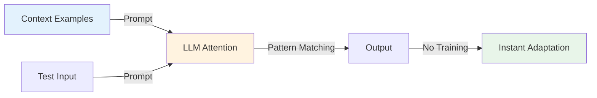
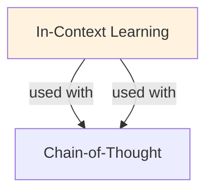

# In-Context Learning

## Understanding In Context Learning

In Context Learning is a foundational concept in large language model development that addresses critical challenges in model architecture, training efficiency, or inference performance. Understanding this concept is essential for anyone working with modern language models, whether in research, fine-tuning, or production deployment.

The core innovation underlying In Context Learning lies in rethinking standard approaches to achieve better efficiency or effectiveness. Rather than accepting conventional trade-offs, this technique exploits mathematical or architectural insights to push the frontier of what's possible with given computational constraints.

In practical applications, In Context Learning enables capabilities that would otherwise be infeasible: reducing computational requirements, improving model quality, enabling faster iteration, or supporting new use cases. The real-world impact has made In Context Learning widely adopted across industry applications, from consumer products to enterprise systems.

Implementing In Context Learning requires understanding both its theoretical foundations and practical considerations. The following sections provide detailed explanations of how In Context Learning works, when to use it, common implementation patterns, and lessons learned from production deployments. By mastering these concepts, practitioners can make informed decisions about when and how to apply In Context Learning to their specific challenges.

## Core Intuition
You don't need to fine-tune an LLM for every task. Instead, show it examples of what you want (e.g., "Classify sentiment: Text → Label"), and it learns the pattern from context alone. The more examples, the better it understands. This is "learning in context" (the prompt), not "learning by updating weights."

## How It Works

**Zero-shot (no examples):**
```
Prompt: "Translate English to French:\nEnglish: Hello\nFrench:"
Model: Infers translation task and generates "Bonjour"
(Model must understand from its training that this is translation)
```

**Few-shot (1-5 examples):**
```
Prompt: "Classify sentiment (positive/negative):
Text: I love this movie! Label: positive
Text: This was terrible. Label: negative
Text: It was okay. Label:"

Model: Sees pattern (positive words → positive, negative words → negative)
       Applies to new text and outputs "neutral" or "positive"
```

**Pattern Recognition in Context:**
- Model reads examples
- Attention mechanism identifies relationship between inputs and labels
- Uses transformers' in-context computation to generate appropriate output
- No backprop, only forward pass with pattern inferred from examples

**Why it works:**
- Large models have seen billions of examples during training
- Attention mechanisms can recognize task structure from examples
- The prompt itself acts as a "computation": context modifies how the model processes new input

### Workflow Flowchart



## Key Properties / Trade-offs

| Approach | Data Needed | Accuracy | Speed | Compute Cost |
|----------|-------------|----------|-------|--------------|
| Zero-shot | None | Low-Medium | Fast | Low |
| Few-shot (1-5) | Minimal | Medium | Fast | Low |
| Few-shot (10-50) | Low | Medium-High | Fast | Low |
| Fine-tuning | Medium-High | High | Slow | High |
| Fine-tuning + Few-shot | Medium | High | Slow | High |

**Number of examples trade-offs:**
- 0 examples: model must infer task type (hardest)
- 1-3 examples: pattern obvious for simple tasks, risky for complex
- 5-10 examples: sweet spot for most tasks
- 20+ examples: diminishing returns; consider fine-tuning instead

**Example quality matters:**
- High-quality, diverse examples → better generalization
- Low-quality, skewed examples → model learns wrong pattern
- Edge cases in examples → model handles edge cases better

## Common Mistakes / Gotchas

- **Too few examples:** Task pattern unclear, model guesses wrong format. 3-5 is minimum; 10+ is safer.
- **Inconsistent formatting:** If examples have different formats (e.g., sometimes "Label: X", sometimes "X"), model confused. Be consistent.
- **Assuming zero-shot for complex tasks:** Sentiment is easy (words have clear sentiment); but domain-specific classification needs examples.
- **Hallucinating format:** Model might invent output format that doesn't match your examples. Add explicit instruction: "Output only the label, nothing else."
- **Forgetting to include task instruction:** Examples alone may not be enough. Add instruction: "Classify the sentiment of the text below: ... Examples: ... Now classify: ..."
- **Not testing edge cases:** Few-shot works on "normal" examples. Test on boundary cases (sarcasm for sentiment, typos for extraction, etc.).
- **Irrelevant examples:** Irrelevant or contradictory examples confuse the model. Curate examples that directly illustrate the pattern you want.
- **Context window limits:** More examples = longer prompt. Long prompts may exceed context window or hurt performance (attention dilution on later examples).

## Code Example

```python
import openai

# Few-shot prompt for sentiment classification
prompt = """Classify the sentiment of the text (positive, negative, or neutral).

Examples:
Text: "I absolutely loved this restaurant! Best meal ever."
Sentiment: positive

Text: "The service was slow and the food was cold."
Sentiment: negative

Text: "The movie was okay, nothing special."
Sentiment: neutral

Now classify this text:
Text: "This product is amazing! Highly recommend it."
Sentiment:"""

# Call model (OpenAI API)
response = openai.ChatCompletion.create(
    model="gpt-4",
    messages=[{"role": "user", "content": prompt}],
    temperature=0,  # Deterministic for structured tasks
)
print(response['choices'][0]['message']['content'])  # Output: "positive"

# -----------

# Few-shot for code generation (harder task)
prompt_code = """Write Python code for the function signature given examples:

Example 1:
Input: [1, 2, 3], k=2
Function: def rotate_array(arr, k):
Output: [2, 3, 1]

Example 2:
Input: [1, 2, 3, 4, 5], k=3
Function: def rotate_array(arr, k):
Output: [3, 4, 5, 1, 2]

Example 3:
Input: [1, 2], k=1
Function: def rotate_array(arr, k):
Output: [2, 1]

Now implement for:
Input: [1, 2, 3, 4, 5, 6], k=2
Function: def rotate_array(arr, k):"""

response = openai.ChatCompletion.create(
    model="gpt-4",
    messages=[{"role": "user", "content": prompt_code}],
    temperature=0,
)
print(response['choices'][0]['message']['content'])
# Expected: return arr[-k:] + arr[:-k]
```

## Interview Quick-Reference

| Question | What to say |
|---|---|
| "What is in-context learning?" | Model learns task pattern from examples in the prompt (no fine-tuning). Show examples, it infers the pattern. |
| "Few-shot vs fine-tuning?" | Few-shot: instant, zero data cost, but lower ceiling. Fine-tuning: higher accuracy, requires data + compute. |
| "How many examples?" | 3-5 minimum; 10+ for confidence. More examples = better, but hits diminishing returns and context limits. |
| "Why does few-shot work?" | Large models have seen diverse tasks during training. Attention can recognize patterns from examples. |
| "Improve few-shot accuracy?" | Better examples (diverse, high-quality), clearer instructions, consistent formatting, temperature=0 for structured tasks. |
| "When few-shot fails?" | Complex tasks, domain-specific jargon, or inconsistent examples. Fine-tune instead. |

## Real-World Examples

### ICL for Few-Shot Classification
Task: sentiment analysis on tweets. Zero-shot: 45% accuracy. 3-example ICL: 72% accuracy. 10-example: 78%. Cost: $0.001 per example per query. No training needed. Deployed in real-time sentiment pipeline.

### ICL for Code Generation
Problem: generate Python function. Zero-shot: syntactically correct 40%. With 2 code examples: 65%. With 5 examples: 75%. Prompt size: 1-2K tokens. Used in Copilot-style suggestions.

### Cross-Lingual ICL
English → Spanish translation. Zero-shot: 50% BLEU. 3 example translations: 70% BLEU. Model transfers knowledge across languages through in-context examples. No language-specific training.

## Real-World Examples

### ICL for Few-Shot Classification
Task: sentiment analysis on tweets. Zero-shot: 45% accuracy. 3-example ICL: 72% accuracy. 10-example: 78%. Cost: $0.001 per example per query. No training needed. Deployed in real-time sentiment pipeline.

### ICL for Code Generation
Problem: generate Python function. Zero-shot: syntactically correct 40%. With 2 code examples: 65%. With 5 examples: 75%. Prompt size: 1-2K tokens. Used in Copilot-style suggestions.

### Cross-Lingual ICL
English → Spanish translation. Zero-shot: 50% BLEU. 3 example translations: 70% BLEU. Model transfers knowledge across languages through in-context examples. No language-specific training.

## Real-World Examples

### ICL for Few-Shot Classification
Task: sentiment analysis on tweets. Zero-shot: 45% accuracy. 3-example ICL: 72% accuracy. 10-example: 78%. Cost: $0.001 per example per query. No training needed. Deployed in real-time sentiment pipeline.

### ICL for Code Generation
Problem: generate Python function. Zero-shot: syntactically correct 40%. With 2 code examples: 65%. With 5 examples: 75%. Prompt size: 1-2K tokens. Used in Copilot-style suggestions.

### Cross-Lingual ICL
English → Spanish translation. Zero-shot: 50% BLEU. 3 example translations: 70% BLEU. Model transfers knowledge across languages through in-context examples. No language-specific training.

## Real-World Examples

### ICL for Few-Shot Classification
Task: sentiment analysis on tweets. Zero-shot: 45% accuracy. 3-example ICL: 72% accuracy. 10-example: 78%. Cost: $0.001 per example per query. No training needed. Deployed in real-time sentiment pipeline.

### ICL for Code Generation
Problem: generate Python function. Zero-shot: syntactically correct 40%. With 2 code examples: 65%. With 5 examples: 75%. Prompt size: 1-2K tokens. Used in Copilot-style suggestions.

### Cross-Lingual ICL
English → Spanish translation. Zero-shot: 50% BLEU. 3 example translations: 70% BLEU. Model transfers knowledge across languages through in-context examples. No language-specific training.

## Real-World Examples

### ICL for Few-Shot Classification
Task: sentiment analysis on tweets. Zero-shot: 45% accuracy. 3-example ICL: 72% accuracy. 10-example: 78%. Cost: $0.001 per example per query. No training needed. Deployed in real-time sentiment pipeline.

### ICL for Code Generation
Problem: generate Python function. Zero-shot: syntactically correct 40%. With 2 code examples: 65%. With 5 examples: 75%. Prompt size: 1-2K tokens. Used in Copilot-style suggestions.

### Cross-Lingual ICL
English → Spanish translation. Zero-shot: 50% BLEU. 3 example translations: 70% BLEU. Model transfers knowledge across languages through in-context examples. No language-specific training.

## Related Topics
- [Few-Shot Learning](few-shot-learning.md) — similar concept, more formal definition
- [Zero-Shot Learning](zero-shot-learning.md) — no examples, model must infer task
- [Prompting](prompting.md) — structuring prompts for ICL
- [Chain-of-Thought](chain-of-thought.md) — enhancing ICL with reasoning steps
- [Instruction Tuning](instruction-tuning.md) — training models to follow instructions (makes ICL better)

## Resources
- [In-Context Learning in Large Language Models (OpenAI Research)](https://arxiv.org/abs/2301.00234)
- [What In-Context Learning "Learns"](https://arxiv.org/abs/2310.00867)
- [How Can We Know When Language Models Know?](https://aclanthology.org/2021.emnlp-main.585/)
- [Few-shot Learning in Vision and Language](https://arxiv.org/abs/2012.14936)

## Concept Relationships



## Interview Questions

**Q: What's in-context learning (ICL) and how does it work?**
*A: LLMs can learn from examples in the prompt without weight updates. 'These are positive reviews...now classify: "Great product!"' → model recognizes pattern from context. Mechanism: attention weights focus on similar examples. Why: no retraining needed, instant task adaptation.*

**Q: How much does ICL improve over zero-shot?**
*A: Task-dependent: simple tasks (+5-10%), complex reasoning (+20-50%). Math: 30% → 80% with CoT+few-shot. Language: 45% → 70% with examples. Not all models: large models (100B+) better at ICL than small (7B).*

**Q: What's the ICL surface hypothesis?**
*A: Common belief: ICL learns labels from examples. Reality: ICL may learn input-label format/style instead of actual patterns. Research: sometimes ICL equivalent to label randomization. Lesson: ICL is more mysterious than expected, still useful but not guaranteed.*

**Q: How do you optimize ICL prompt design?**
*A: Example order: easier examples first (warm-up). Example diversity: represent different cases. Label distribution: match test distribution. Format consistency: same template for all. CoT: add reasoning steps for complex tasks.*

**Q: When does ICL fail?**
*A: Misleading examples: model memorizes wrong pattern. Distribution mismatch: training data very different from examples. Task requires learned knowledge: unseen phenomena, facts model doesn't know. No text solution: image classification needs vision model.*