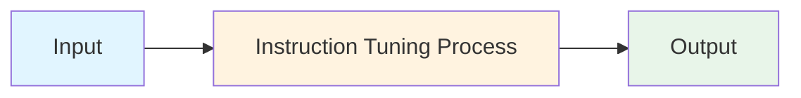
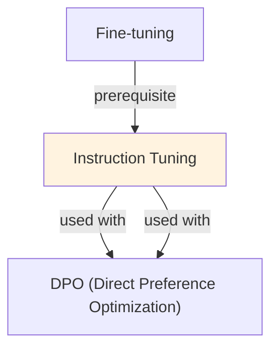

# Instruction Tuning

## TL;DR
Fine-tune LLMs on instruction-response pairs to teach them to follow instructions. Data: (instruction, response) pairs, not raw text. Teaches models to be helpful assistants, not just language models. Foundation for ChatGPT-style assistants.

## Core Intuition
Pre-trained LLMs generate text continuation (predict next token). Instruction tuning teaches them to be assistants: read instruction, generate helpful response. Models become more controllable, safer, more aligned with human expectations.

## How It Works

**Data Format:**
```
Pre-training: "Once upon a time, there was a..."
             → model learns to continue stories

Instruction tuning:
  Input: "What is the capital of France?"
  Output: "The capital of France is Paris."
  
  Input: "Summarize this article: [article text]"
  Output: "[summary]"
  
  Input: "Write a poem about winter"
  Output: "[poem]"
```

**Training Process:**
```
1. Collect instruction-response pairs (10k-100k pairs)
2. Format as: "[INST] {instruction} [/INST] {response}"
3. Train on response prediction (LM loss)
4. Use moderate learning rate (1e-5 to 5e-5)
5. Train for 1-3 epochs
```

**Data Mix:**
- Mix task types (QA, summarization, translation, reasoning, creative)
- Balance of easy and hard examples
- Include few-shot examples in some instructions
- Vary instruction phrasing (multiple ways to ask same thing)

**Example Dataset Structure:**
```json
{
  "instruction": "Classify sentiment",
  "input": "I love this movie!",
  "output": "Positive"
}
{
  "instruction": "Summarize in 1 sentence",
  "input": "[long article]",
  "output": "[1-sentence summary]"
}
```

### Workflow Flowchart



## Key Properties / Trade-offs

| Aspect | Pre-trained | Instruction-Tuned |
|--------|---|---|
| Task adherence | Low (ignores instructions) | High (follows instructions) |
| Helpfulness | Low (continues, not responds) | High (assistant-like) |
| Data required | Billions tokens (pre-training) | 10k-100k pairs (tuning) |
| Flexibility | Limited | High (handles new tasks) |
| Training cost | Enormous | Low (weeks, not months) |

**Data quality vs quantity:**
- 100 high-quality instructions: 85% performance
- 10k low-quality instructions: 75% performance
- 10k high-quality instructions: 95% performance

## Common Mistakes / Gotchas

- **Low-quality responses:** Garbage in, garbage out. If training responses are bad, model learns bad behavior.
- **Overfitting on instructions:** Model memorizes specific phrasing. Vary instruction phrasing to generalize.
- **Forgetting pre-trained knowledge:** If tuning on narrow domain, model loses general knowledge. Mix in diverse tasks.
- **No validation:** Train/test on same task types → false confidence. Test on unseen instructions.
- **Imbalanced data:** If 80% summarization, 20% translation, model biased toward summarization. Balance task distribution.
- **Long-term instruction sensitivity:** If all training examples start with "Classify:", model expects that format. Vary formats.

## Code Example

```python
from transformers import AutoTokenizer, AutoModelForCausalLM, Trainer, TrainingArguments
from datasets import Dataset

# Training data (instruction-response pairs)
training_data = [
    {
        "instruction": "Classify the sentiment of this text: I love this!",
        "response": "Positive"
    },
    {
        "instruction": "Translate to Spanish: Hello, how are you?",
        "response": "Hola, ¿cómo estás?"
    },
    {
        "instruction": "Summarize in one sentence: [long text]",
        "response": "[summary]"
    }
]

# Format data
def format_instruction(example):
    text = f"[INST] {example['instruction']} [/INST] {example['response']}"
    return {"text": text}

dataset = Dataset.from_dict({
    "instruction": [d["instruction"] for d in training_data],
    "response": [d["response"] for d in training_data]
})
formatted_dataset = dataset.map(format_instruction)

# Load model
model_name = "meta-llama/Llama-2-7b-hf"
tokenizer = AutoTokenizer.from_pretrained(model_name)
model = AutoModelForCausalLM.from_pretrained(model_name)

# Tokenize
def tokenize(examples):
    return tokenizer(examples["text"], max_length=512, truncation=True)

tokenized = formatted_dataset.map(tokenize, batched=True)

# Train
training_args = TrainingArguments(
    output_dir="./instruction_tuned_model",
    learning_rate=5e-5,
    num_train_epochs=3,
    per_device_train_batch_size=8,
    warmup_steps=100,
)

trainer = Trainer(
    model=model,
    args=training_args,
    train_dataset=tokenized,
)
trainer.train()
```

## Interview Quick-Reference

| Question | What to say |
|---|---|
| "Instruction tuning?" | Fine-tune on (instruction, response) pairs. Teaches models to follow instructions, not just continue text. |
| "vs fine-tuning?" | Fine-tuning can be task-specific. Instruction tuning is broad (many task types) to make assistants. |
| "Data requirements?" | 10k-100k high-quality pairs. Quality > quantity. Vary phrasing, mix task types. |
| "Forgetting knowledge?" | Mix general + domain tasks. Don't tune exclusively on narrow domain. |
| "Evaluation?" | Test on unseen instructions (not seen during training). Zero-shot generalization is key. |

## Related Topics
- [Fine-tuning](finetuning.md) — broader fine-tuning concept
- [RLHF](rlhf.md) — further aligning with human preferences
- [In-Context Learning](in-context-learning.md) — similar goal (instruction following) via prompting

## Resources
- [Instruction Tuning with GPT-3.5](https://platform.openai.com/docs/guides/fine-tuning)
- [The Flan Collection: Designing Data and Methods for Effective Instruction Tuning](https://arxiv.org/abs/2301.13688)
- [Alpaca: A Strong, Replicable Instruction-Following Model](https://crfm.stanford.edu/2023/03/13/alpaca.html)

## Concept Relationships



## Interview Questions

**Q: What's the core problem this concept solves?**
*A: See the 'Core Intuition' section above for the fundamental problem and how this concept addresses it.*

**Q: What are the main advantages and disadvantages?**
*A: See 'Key Properties / Trade-offs' section for detailed comparison with alternatives.*

**Q: How do you implement this in practice?**
*A: Refer to the corresponding Jupyter notebook in `llm/notebooks/` for working Python implementations and examples.*

