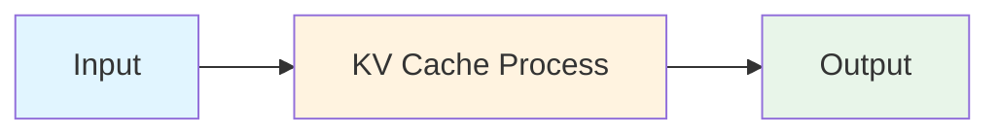
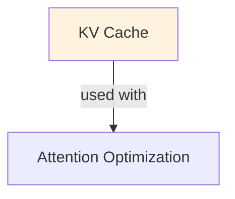

# KV Cache

## TL;DR
Cache Key-Value matrices from previous tokens to avoid redundant computation during generation. Trade: store cache (memory) for faster decoding (no recomputation). Critical for inference speed; enables longer sequences without quadratic cost.

## Core Intuition
Autoregressive generation means predicting token 1, then token 2 (using token 1), then token 3 (using tokens 1+2), etc. Without KV cache, computing attention for token T requires recomputing attention over ALL previous tokens (T-1 times). Store the K and V matrices once, reuse them → O(1) per token instead of O(T).

## How It Works

**Without KV Cache (Naive):**
```
Token 1: compute Q1, K1, V1; output logits
Token 2: recompute Q1, K1, V1 (from scratch!), then compute Q2, K2, V2
Token 3: recompute Q1, K1, V1, Q2, K2, V2 (from scratch!), then compute Q3, K3, V3
...
Total: O(T^2) computation (quadratic)
```

**With KV Cache:**
```
Token 1: compute Q1, K1, V1; save K1, V1 in cache; output logits
Token 2: retrieve cached K1, V1; compute only Q2, K2, V2; append to cache
Token 3: retrieve cached K1, V1, K2, V2; compute only Q3, K3, V3; append to cache
...
Total: O(T) computation (linear!)
```

**Memory Layout:**
```
Cache for a transformer layer:
  key_cache[layer][batch_size][seq_len, d_k]      # shape: (B, T, d_k)
  value_cache[layer][batch_size][seq_len, d_v]    # shape: (B, T, d_v)

For each new token:
  new_k = compute(input_t)              # (B, 1, d_k)
  new_v = compute(input_t)              # (B, 1, d_v)
  key_cache[:, :, t:t+1, :] = new_k    # append new K
  value_cache[:, :, t:t+1, :] = new_v  # append new V
  
  # Attention uses full cached K, V (all previous + current)
  attn = softmax(Q @ cached_K^T) @ cached_V
```

**Impact on Latency:**
```
Without cache:
  Attention FLOPS = O(seq_len^2 × d)  per token
  
With cache:
  Attention FLOPS = O(seq_len × d)  per token
  
Speedup: O(seq_len) improvement! For seq_len=2048, ~2000x faster
```

### Workflow Flowchart



## Key Properties / Trade-offs

| Aspect | No Cache | With Cache |
|--------|----------|-----------|
| FLOPS per token | O(T × d) | O(d) |
| Memory overhead | Minimal | O(T × L × d) |
| Latency per token | ~const | ~const ✓ |
| Throughput (batch) | High | Lower (cache memory limit) |
| Sequence length | Fast up to ~512 | Scales to 8k+ |
| Batch size | Limited by compute | Limited by memory (cache) |

**Sequence length tradeoff:**
- seq_len=100: cache ≈ 100MB
- seq_len=1000: cache ≈ 1GB
- seq_len=10000: cache ≈ 10GB (exceeds GPU memory for large models)

**Memory cost per token:**
```
For LLaMA 7B (4096 hidden_dim, 32 layers):
  per token, per layer = 4096 × 32 × 2 (for K and V) = 262KB per layer
  all 32 layers = 8.4MB per token
  
For seq_len=2048: 8.4MB × 2048 ≈ 17GB
```

## Common Mistakes / Gotchas

- **Not clearing cache between sequences:** If processing multiple sequences, old cache corrupts new predictions. Always reset cache per sequence.
- **Assuming cache is "free":** Cache memory grows with sequence length. Can OOM on long sequences (2k+ tokens).
- **Batch size assumptions:** Batch size is limited by cache size, not just compute. Small cache limits batching for long sequences.
- **Cache format consistency:** Different frameworks (HF, vLLM, llama.cpp) use different cache formats. Reusing cache across frameworks fails.
- **No updates for new tokens:** Cache is immutable after generation. If you want to regenerate, must start fresh (can't splice new branch).
- **Ignoring batch size in cache:** total_cache_mem = batch_size × seq_len × num_layers × d. Doubling batch size doubles memory.
- **Not using Flash Attention compatible:** Some flashy optimizations (Flash Attention v2) are incompatible with certain cache formats. Check integration.

## Code Example

```python
import torch
from transformers import AutoTokenizer, AutoModelForCausalLM

model_name = "meta-llama/Llama-2-7b-hf"
model = AutoModelForCausalLM.from_pretrained(model_name)
tokenizer = AutoTokenizer.from_pretrained(model_name)

# Example 1: Inference WITHOUT explicit cache (HuggingFace handles it)
prompt = "Once upon a time"
inputs = tokenizer(prompt, return_tensors="pt")

# Generate with cache enabled (default in HF)
outputs = model.generate(
    **inputs,
    max_new_tokens=100,
    use_cache=True,  # Explicitly enable KV cache (default is True)
    return_dict_in_generate=True,
    output_scores=True,
)
print(tokenizer.decode(outputs.sequences[0]))

# Example 2: Manual KV cache handling (lower-level)
input_ids = tokenizer.encode(prompt, return_tensors="pt")
cache = None  # Initialize empty cache

# Autoregressive loop
for step in range(100):  # Generate up to 100 tokens
    outputs = model(
        input_ids[:, -1:],  # Only pass current token (feed from cache)
        past_key_values=cache,  # Pass cache from previous step
        use_cache=True,
    )
    
    logits = outputs.logits[:, -1, :]
    next_token = torch.argmax(logits, dim=-1, keepdim=True)
    
    cache = outputs.past_key_values  # Update cache for next step
    input_ids = torch.cat([input_ids, next_token], dim=1)
    
    if next_token.item() == tokenizer.eos_token_id:
        break

print(tokenizer.decode(input_ids[0]))

# Example 3: Compare with/without cache (timing)
import time

prompt_long = "Once upon a time " * 100  # Long prompt
inputs = tokenizer(prompt_long, return_tensors="pt", max_length=512, truncation=True)

# With cache
start = time.time()
outputs_cached = model.generate(**inputs, max_new_tokens=50, use_cache=True)
time_cached = time.time() - start

# Without cache (for comparison, set use_cache=False)
start = time.time()
outputs_no_cache = model.generate(**inputs, max_new_tokens=50, use_cache=False)
time_no_cache = time.time() - start

print(f"With cache: {time_cached:.2f}s")
print(f"Without cache: {time_no_cache:.2f}s")
print(f"Speedup: {time_no_cache / time_cached:.1f}x")
```

## Interview Quick-Reference

| Question | What to say |
|---|---|
| "What is KV cache?" | Cache Key-Value matrices from previous tokens to avoid recomputation. O(T) FLOPS per token instead of O(T²). |
| "Memory cost?" | Grows linearly with sequence length. For 7B model, ~8MB/token. Can OOM on very long sequences. |
| "When to use?" | Always for inference. Disable only if memory is extremely constrained. |
| "Batch size impact?" | Cache memory scales with batch size. Doubling batch size doubles total cache memory. |
| "Incompatible with?" | Some optimizations (certain quantization, non-standard attention) may not support KV caching. Check docs. |
| "Multi-batch vs single?" | Single long sequence vs multiple short sequences: cache hurts throughput but helps per-token latency. |

## Related Topics
- [Inference Optimization](inference-optimization.md) — KV cache is one technique among many
- [Speculative Decoding](speculative-decoding.md) — uses KV cache for parallelization
- [Continuous Batching](continuous-batching.md) — manages KV cache for multiple sequences
- [Attention Mechanism](../ml/concepts/deep-learning/attention-mechanism.md) — what KV cache optimizes

## Resources
- [Transformer-XL: Attentive Language Models Beyond a Fixed-Length Context](https://arxiv.org/abs/1901.02860)
- [vLLM: Efficient Memory Management for LLM Serving](https://arxiv.org/abs/2309.06180)
- [Flash-Decoding: Fast and Accurate Generation in Long-Context LLMs](https://arxiv.org/abs/2307.01841)
- [HuggingFace: Using KV Cache](https://huggingface.co/docs/transformers/llm_tutorial_generate)

## Concept Relationships



## Interview Questions

**Q: What's the core problem this concept solves?**
*A: See the 'Core Intuition' section above for the fundamental problem and how this concept addresses it.*

**Q: What are the main advantages and disadvantages?**
*A: See 'Key Properties / Trade-offs' section for detailed comparison with alternatives.*

**Q: How do you implement this in practice?**
*A: Refer to the corresponding Jupyter notebook in `llm/notebooks/` for working Python implementations and examples.*

