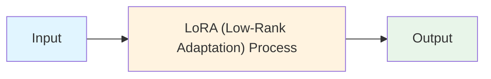
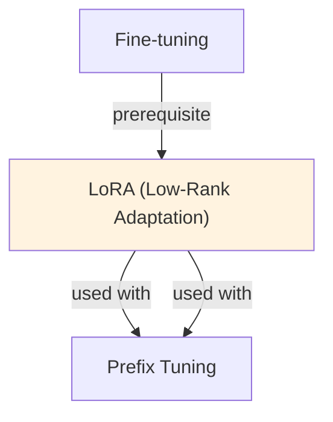

# LoRA (Low-Rank Adaptation)

## TL;DR
Fine-tune LLMs by training only low-rank decomposition matrices, not all weights. Instead of updating W ∈ ℝ^(d × d), add A ∈ ℝ^(d × r) and B ∈ ℝ^(r × d) where r << d. Reduces parameters by 99%+, enables many task-specific models, minimal memory/compute cost.

## Core Intuition
Full fine-tuning updates all weights—expensive and redundant. The insight: weight changes during fine-tuning are low-rank. Store only the "directions of change" (r-rank factorization), not the full update. Recover full behavior with LoRA adapter on top of frozen base.

## How It Works

**Standard Fine-tuning (Baseline):**
```
Output = W · input
Update: W ← W - lr × ∇L
Cost: d × d parameters, gradient storage
```

**LoRA Approach:**
```
Output = W · input + (A · B^T) · input
        = W · input + Δ W · input

where:
  Δ W = A @ B  (low-rank decomposition)
  A ∈ ℝ^(d_in × r)  [trainable]
  B ∈ ℝ^(r × d_out) [trainable]
  r << min(d_in, d_out)  [rank, e.g., r=8]
```

**Typical rank reduction:**
- Full: 7B model ≈ 14B parameters to train
- LoRA (r=8): only 8 × d_hidden parameters per layer
- Result: 99% fewer parameters, ~90% training speedup

**Example: Adapting a Transformer:**
```
For each attention head and FFN layer:
  - Freeze: W (original weights)
  - Add: LoRA matrices A, B
  - Update: only A and B via backprop
  - Scaling: scale LoRA output by α/r to control magnitude
```

**Inference:**
```
Option 1: Keep base model + LoRA separate
  y = Wx + ABx  (merge at inference time)

Option 2: Merge weights offline
  W_LoRA = W + AB  (save merged checkpoint)
  y = W_LoRA × x  (same latency as full FT)
```

### Workflow Flowchart



## Key Properties / Trade-offs

| Aspect | Full FT | LoRA | QLoRA |
|--------|---------|------|-------|
| Trainable params | 100% | 1-5% | 1-5% |
| Memory (training) | 100% | 10-20% | 2-4% |
| Training time | 100% | 30-50% faster | 50-70% faster |
| Accuracy | 100% | ~95-98% | ~95-98% |
| Inference overhead | None | Minimal (can merge) | Minimal |
| Deployment | 1 model | Multiple adapters | Multiple adapters |

**Rank (r) tradeoff:**
- r=4: fastest, lower quality (good for multiple fine-tunes)
- r=8: balanced (default)
- r=16: higher quality, slower (approaching full FT)
- r=64+: very close to full FT, marginal gains

**Scaling factor (α):**
- α controls magnitude of LoRA update relative to base model
- Common: α = 16 for r = 8 (scale = α/r)
- Too large: dominates base model; too small: negligible effect

## Common Mistakes / Gotchas

- **Misunderstanding the rank:** r is per matrix, not total. Each layer's attention/FFN gets its own A, B. Total params = sum across all layers.
- **Freezing wrong weights:** Must freeze base W; only train A, B. Accidentally unfreezing base = wasted compute.
- **Not scaling LoRA output:** Without scaling (α/r), LoRA effects can be too large or too small. Always use scaling.
- **Too many LoRA adapters:** Each task-specific LoRA adds memory at inference. 5-10 is manageable; 100+ becomes unwieldy.
- **Merging LoRA offline:** If you merge W + LoRA into a checkpoint, you lose the ability to load just the base model. Keep adapters separate unless explicitly merging.
- **LoRA on already fine-tuned models:** LoRA adds low-rank to pre-trained. If you LoRA on top of an already fine-tuned model, updates compound non-linearly. Specify target.
- **Ignoring LoRA target selection:** Only certain layers benefit from LoRA (attention > FFN usually). Applying to all layers wastes parameters.

## Code Example

```python
import torch
from peft import LoraConfig, get_peft_model
from transformers import AutoTokenizer, AutoModelForCausalLM, Trainer, TrainingArguments
from datasets import Dataset

# 1. Load base model
model_name = "meta-llama/Llama-2-7b-hf"
model = AutoModelForCausalLM.from_pretrained(model_name, torch_dtype=torch.float16)
tokenizer = AutoTokenizer.from_pretrained(model_name)

# 2. Configure LoRA
lora_config = LoraConfig(
    r=8,                              # Low-rank dimension
    lora_alpha=16,                    # Scaling factor
    target_modules=["q_proj", "v_proj"],  # Which layers to apply LoRA
    lora_dropout=0.05,                # Dropout on LoRA
    bias="none",                      # Don't train bias
    task_type="CAUSAL_LM",
)

# 3. Wrap model with LoRA
model = get_peft_model(model, lora_config)
print(model.print_trainable_parameters())
# trainable params: 4,194,304 || all params: 7,000,000,000 || trainable%: 0.06%

# 4. Prepare data
train_data = [{"text": "Your training data here..."}]
dataset = Dataset.from_dict({"text": train_data})

def tokenize_fn(examples):
    return tokenizer(examples["text"], max_length=512, truncation=True)

tokenized = dataset.map(tokenize_fn, batched=True)

# 5. Train with LoRA
training_args = TrainingArguments(
    output_dir="./lora_model",
    learning_rate=1e-4,  # LoRA can use slightly higher LR
    num_train_epochs=3,
    per_device_train_batch_size=4,  # Smaller due to lower memory
    warmup_steps=100,
)

trainer = Trainer(
    model=model,
    args=training_args,
    train_dataset=tokenized,
)
trainer.train()

# 6. Save and load LoRA adapter
model.save_pretrained("./lora_adapter")

# 7. Load for inference
from peft import AutoPeftModelForCausalLM
lora_model = AutoPeftModelForCausalLM.from_pretrained("./lora_adapter")

# Option: Merge LoRA into base (if deploying as single model)
merged = lora_model.merge_and_unload()
merged.save_pretrained("./merged_model")
```

## Interview Quick-Reference

| Question | What to say |
|---|---|
| "What is LoRA?" | Low-rank adaptation. Train only A, B matrices (r << d) instead of full weights. 99% fewer params, comparable accuracy. |
| "Why low-rank?" | Weight updates during FT are low-rank (empirical observation). Store only the "directions of change." |
| "Rank choice?" | r=8 is balanced default. Lower for speed, higher for quality. Scales linearly with compute cost. |
| "Inference overhead?" | Negligible. Can merge LoRA offline (AB added to W), or keep separate and apply at inference. |
| "LoRA vs full FT?" | LoRA: 1% params, 30-50% faster, slightly lower quality. Full FT: higher ceiling, more compute. |
| "Multiple LoRA on same base?" | Yes. Load different LoRA adapters for different tasks. Base model frozen, only load relevant LoRA. |

## Related Topics
- [Fine-tuning](finetuning.md) — LoRA is an efficient alternative to full fine-tuning
- [Parameter-Efficient Fine-tuning](parameter-efficient-finetuning.md) — broader PEFT category
- [Adapters](adapters.md) — alternative parameter-efficient method
- [QLoRA](../llm/concepts/quantization.md) — quantization + LoRA for ultra-low memory

## Resources
- [LoRA Paper: Low-Rank Adaptation of Large Language Models](https://arxiv.org/abs/2106.09685)
- [PEFT Library by HuggingFace](https://github.com/huggingface/peft)
- [QLoRA: Efficient Finetuning of Quantized LLMs](https://arxiv.org/abs/2305.14314)
- [LoRA Explained in Detail](https://lightning.ai/pages/community/tutorial/lora-fine-tuning/)

## Concept Relationships



## Interview Questions

**Q: Why does LoRA work so well despite using so few parameters?**
*A: LoRA is based on the hypothesis that weight updates during fine-tuning have low intrinsic dimensionality. Instead of updating all parameters, LoRA learns low-rank factors A (in_dim × r) and B (r × out_dim) where r << both dimensions. The update is W ← W + AB^T.*

**Q: How do you choose the LoRA rank?**
*A: Rank is task and model dependent. Common values: r=4-8 (10-20% of LoRA params), r=16-32 (40-60%), r=64 (heavy adaptation). Start with r=8 and tune based on performance. Diminishing returns after rank ≈ model_dim/4.*

**Q: Can you stack multiple LoRA adapters?**
*A: Yes! LoRA is composable. You can have separate LoRA modules for different tasks and combine them (e.g., task1_weights + task2_weights). This enables multi-task adaptation with minimal additional parameters.*

**Q: What's the relationship between LoRA and matrix factorization?**
*A: LoRA decomposes large weight matrices into products of smaller matrices. This is essentially low-rank matrix factorization. It works because fine-tuning updates are approximately low-rank (empirically verified).*

## Real-World Applications

### Microsoft: Efficient LLM fine-tuning
Original LoRA paper. Used for fine-tuning LLAMA and other large models with 99% parameter reduction while maintaining performance.

### Hugging Face: PEFT library
Provides production-ready LoRA implementation. Used by 100k+ developers for fine-tuning models on consumer hardware.

### OpenAI: Model customization
Uses LoRA-like techniques for efficient fine-tuning of GPT models for enterprise customers.

## Best Practices

- Use alpha/rank scaling: multiply LoRA updates by alpha/rank for stable training across different ranks.
- Apply LoRA to both Q and V projections in attention; less critical but helps for heavy adaptation.
- Start with frozen base model + LoRA. Only unfreeze base if significant gains plateau.
- Use moderate learning rates (1e-4 to 5e-4). LoRA is more sensitive than full fine-tuning.

## Common Pitfalls to Avoid

- **Too small rank**: Too small rank: insufficient capacity; performance plateaus quickly
- **Too large rank**: Too large rank: loses efficiency benefits; approaching full fine-tuning cost
- **High learning rate**: High learning rate: LoRA can diverge quickly if not careful
- **Not scaling updates**: Not scaling updates: unstable training when switching between ranks

