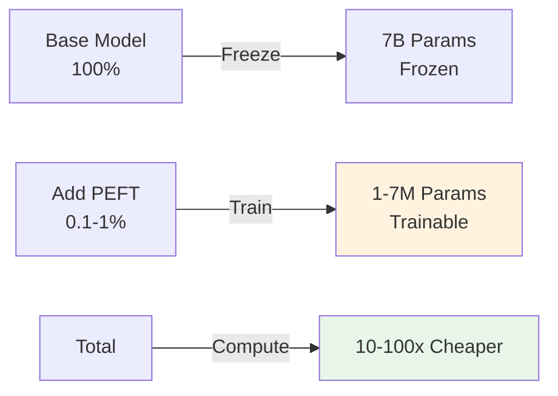
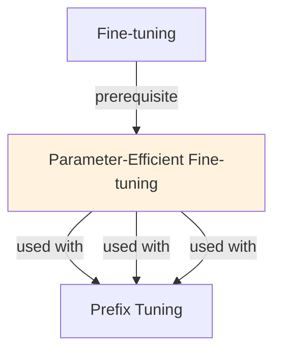

# Parameter-Efficient Fine-Tuning (PEFT)

## Understanding Parameter Efficient Finetuning

Parameter Efficient Finetuning is a foundational concept in large language model development that addresses critical challenges in model architecture, training efficiency, or inference performance. Understanding this concept is essential for anyone working with modern language models, whether in research, fine-tuning, or production deployment.

The core innovation underlying Parameter Efficient Finetuning lies in rethinking standard approaches to achieve better efficiency or effectiveness. Rather than accepting conventional trade-offs, this technique exploits mathematical or architectural insights to push the frontier of what's possible with given computational constraints.

In practical applications, Parameter Efficient Finetuning enables capabilities that would otherwise be infeasible: reducing computational requirements, improving model quality, enabling faster iteration, or supporting new use cases. The real-world impact has made Parameter Efficient Finetuning widely adopted across industry applications, from consumer products to enterprise systems.

Implementing Parameter Efficient Finetuning requires understanding both its theoretical foundations and practical considerations. The following sections provide detailed explanations of how Parameter Efficient Finetuning works, when to use it, common implementation patterns, and lessons learned from production deployments. By mastering these concepts, practitioners can make informed decisions about when and how to apply Parameter Efficient Finetuning to their specific challenges.

## Core Intuition
Full fine-tuning is expensive. PEFT methods train only small modules or low-rank updates. Achieve 95-98% of full FT quality with 1-5% of parameters and compute.

## How It Works

**Full Fine-Tuning (Baseline):**
```
Update all W (billions of params)
Cost: 7B model = 2-4 weeks on A100
```

**PEFT Methods:**

**1. LoRA (Low-Rank Adaptation):**
- Add A ∈ ℝ(d×r), B ∈ ℝ(r×d) where r << d
- Trainable: only LoRA params (~1-3% of total)
- Output: (W + AB)x

**2. Adapters:**
- Bottleneck layers: down-project → ReLU → up-project
- Similar param count to LoRA, different architecture

**3. Prefix Tuning:**
- Prepend learnable prefix tokens to input
- Only prefix is trainable
- Affects all layers

**4. BitFit:**
- Only train bias vectors (0.1% params)
- Surprisingly effective for some tasks
- Ultra-light

**Typical Results:**
```
Method          Params  Accuracy vs FT  Speed  Cost
Full FT         100%    100%            1x     1x
LoRA (r=8)      1%      96-98%          30x    30x
LoRA (r=16)     2%      97-99%          15x    15x
Adapters        2%      96-98%          30x    30x
BitFit          0.1%    90-95%          50x    50x
```

### Workflow Flowchart



## Key Properties / Trade-offs

| Method | Flexibility | Accuracy | Param Count | Combine |
|--------|-------------|----------|-------------|---------|
| LoRA | High | 96-99% | 1-5% | Yes (multi-LoRA) |
| Adapters | High | 96-98% | 2-5% | Yes |
| Prefix | Medium | 92-97% | 1-2% | No (conflicts) |
| BitFit | Low | 90-95% | 0.1% | Yes |

**When to use each:**
- LoRA: default choice (balanced, well-tested)
- Adapters: if you prefer different architecture
- Prefix: sequence tasks where prefix makes sense
- BitFit: extreme memory constraints only

## Common Mistakes / Gotchas

- **Choosing wrong rank:** r=2 might be too small, r=64 defeats purpose. Try r=8, r=16 first.
- **Not scaling learning rate:** PEFT often uses higher LR than FT. Experiment: 1e-4 to 5e-4.
- **Freezing wrong layers:** accidentally update base weights → cost increases. Double-check only target modules frozen.
- **Comparing unfairly:** 1-hour LoRA vs 100-hour FT; quality difference small but time difference huge.
- **Not merging for deployment:** keep base + LoRA separate during dev; merge offline for inference.
- **Using on tiny models:** PEFT has overhead. On 100M models, full FT might be faster.

## Code Example

```python
from peft import get_peft_model, LoraConfig
from transformers import AutoModelForCausalLM, Trainer, TrainingArguments

# Load model
model = AutoModelForCausalLM.from_pretrained("meta-llama/Llama-2-7b-hf")

# Configure PEFT (multiple options below)

# Option 1: LoRA
lora_config = LoraConfig(
    r=8,
    lora_alpha=16,
    target_modules=["q_proj", "v_proj"],
    lora_dropout=0.05,
    bias="none"
)

# Option 2: Adapters
from peft import AdaptionPromptConfig
adapter_config = AdaptionPromptConfig(
    adapter_len=10,
    adapter_layers=2
)

# Option 3: BitFit (only bias)
from peft import get_peft_model
bitfit_config = LoraConfig(
    r=1,  # minimal rank
    lora_alpha=16,
    target_modules=["q_proj", "v_proj"],
    bias="all"  # only train bias
)

# Apply config
model = get_peft_model(model, lora_config)
print(model.print_trainable_parameters())
# Output: trainable params: 4.19M || all params: 7B || trainable%: 0.06%

# Train as normal
trainer = Trainer(model=model, args=training_args, ...)
trainer.train()

# Merge for deployment (optional)
merged_model = model.merge_and_unload()
merged_model.save_pretrained("./merged_model")
```

## Interview Quick-Reference

| Question | What to say |
|---|---|
| "PEFT?" | Methods that update <5% params. LoRA, adapters, prefix tuning, BitFit. Trade accuracy for cost. |
| "LoRA vs full?" | LoRA: 1% params, 96-99% accuracy, 30x faster. Full: 100% accuracy, expensive. Usually LoRA wins. |
| "Rank choice?" | r=8 default, r=16 for higher quality, r=4 for memory. Try empirically. |
| "Multi-task PEFT?" | Load different LoRAs for different tasks on same base. Flexible, efficient. |
| "Deploy PEFT?" | Merge base + LoRA offline (save merged) or keep separate (load LoRA at inference). |

## Real-World Examples

### LoRA Multi-Task
10 downstream tasks, LoRA per task. Total: 10M params (vs 70GB×10 for full models). Deployment: 1 base + 10 LoRA = 4.5GB.

### QLoRA on Consumer GPU
13B model with QLoRA: 6GB memory. RTX 3090 (24GB) trains comfortably. Enables researchers without cloud budget.

## Related Topics
- [LoRA](lora.md) — specific PEFT variant
- [Fine-tuning](finetuning.md) — full FT baseline
- [Adapters](adapters.md) — another PEFT method
- [Quantization](quantization.md) — orthogonal technique for compression

## Resources
- [PEFT: Hugging Face Library](https://github.com/huggingface/peft)
- [LoRA: Low-Rank Adaptation](https://arxiv.org/abs/2106.09685)
- [Adapter Modules](https://arxiv.org/abs/1902.00751)
- [Prefix Tuning](https://arxiv.org/abs/2101.00297)
- [BitFit](https://arxiv.org/abs/2106.10199)

## Concept Relationships



## Interview Questions

**Q: What's parameter-efficient fine-tuning (PEFT)?**
*A: Train <1% of model parameters instead of 100%. Methods: LoRA (low-rank), Adapters (bottleneck), Prefix-tuning (learned tokens). Advantage: 10-100x cheaper, faster, fewer GPUs. Trade-off: slightly lower accuracy ceiling.*

**Q: How much parameter reduction do you get?**
*A: LoRA rank-8: 0.1% params trainable. Adapters: 0.5-1% params. Prefix-tuning: 0.05%. All compress 100-1000x. For 7B model: 1-7M params instead of 7B.*

**Q: When is PEFT sufficient vs when do you need full fine-tuning?**
*A: PEFT: general tasks (classification, QA, summarization). Full: style transfer, major behavior change, science domain. Most tasks: PEFT sufficient. Full fine-tune: <5% of use cases.*

**Q: How do you combine multiple PEFT methods?**
*A: LoRA + quantization (QLoRA): reduce memory 4x further. Adapters + LoRA: more parameters, better accuracy. Trade-off: complexity.*

**Q: How does PEFT affect inference?**
*A: LoRA: merged for deployment (no overhead). Adapters: slight overhead (2-5% latency increase). Prefix: no overhead. Choice: LoRA for production (no inference cost).*