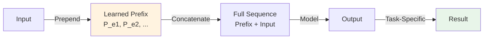
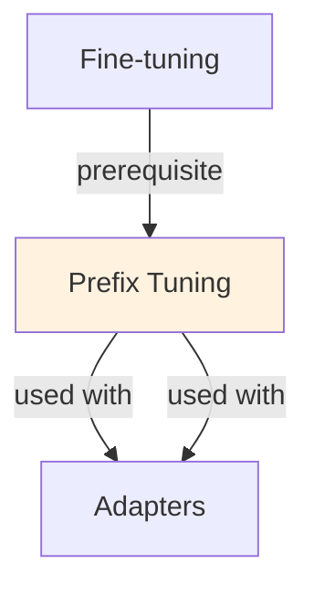

# Prefix Tuning

## TL;DR
Learn task-specific prefix tokens prepended to input, affecting all transformer layers. Only prefix trainable (~1-2% params). Better than LoRA for sequence-to-sequence tasks; worse for multi-task (prefix conflicts). Trade-off: simplicity vs flexibility.

## Core Intuition
Instead of training LoRA matrices or adapter layers, prefix tuning learns "soft prompt" tokens. Prepend ~50-100 learnable vectors to every input. Model learns what these vectors mean in latent space (like instruction embeddings). They attend to input, influencing all layers. Simple but less flexible than adapters.

## How It Works

**Standard Task (no tuning):**
```
Input text: "Summarize: [document]"
→ tokenize → [tok_1, tok_2, ...]
→ embedding layer → [e_1, e_2, ...]
→ transformer layers → output
```

**Prefix Tuning:**
```
Prefix: p_0, p_1, ..., p_k (learned vectors in latent space)
Document: [tok_1, tok_2, ...] → embeddings [e_1, e_2, ...]

Combined input to transformer:
  [p_0, p_1, ..., p_k, e_1, e_2, ..., e_T]

Only p_0...p_k are trained (updated via gradient)
Base model weights frozen
```

**Mathematical Formulation:**

Transformer with prefix:
```
Attention at layer l:
  Q_l = W_Q h_l
  K_l = W_K [p_l_prefix; h_l]     # prefix + hidden states
  V_l = W_V [p_l_prefix; h_l]
  
  Attn = softmax(Q_l @ K_l^T / √d) @ V_l

Prefix activation:
  p_0^l = h_0^(l-1) (from previous layer)
  where h_0^(l-1) includes attention to prefix tokens
```

**Parameterization:**

Prefix tokens can be:
1. **Direct:** p = learnable vectors (768-dim each)
   - Parameters: prefix_length × hidden_dim
   - Simple, but many parameters
   
2. **Reparameterized (better):** p = MLP(p_0)
   - p_0: small matrix (e.g., 10 × 768)
   - MLP: projects to full prefix (e.g., 10 × 100)
   - Reduces parameters, improves stability
   ```
   p = MLP(p_0)  where p_0 ∈ ℝ^(10 × 768)
   MLP = Linear(768 → 4096) → ReLU → Linear(4096 → 7680)
   Result: p ∈ ℝ^(100 × 768)
   
   Parameters: (10 × 768) + (768 → 4096) + (4096 → 7680)
             = 7,680 + 3.2M + 31.2M = ~34M (larger but more stable)
   ```

**Prefix Length & Optimal Size:**

```
Too short (<10 tokens):
  - capacity too limited
  - underfitting
  - can't encode task adequately
  
Short (10-50 tokens):
  - minimal parameters (~8-38K)
  - limited expressiveness
  - works for simple tasks
  
Medium (50-100 tokens):
  - ~38-76K parameters (with direct) or ~1-2M (reparameterized)
  - good balance
  - default recommendation
  
Long (100-500 tokens):
  - ~76-384K direct or ~5-10M reparameterized
  - higher capacity
  - risk of overfitting on small tasks
  - can handle complex tasks
```

### Workflow Flowchart



## Key Properties / Trade-offs

| Aspect | Prefix | LoRA | Adapters | BitFit |
|--------|--------|------|----------|--------|
| Parameters | 1% | 1-2% | 2-5% | 0.1% |
| Trainability | Prefix only | Low-rank matrices | Bottleneck layers | Bias only |
| Multi-task | No (conflicts) | Yes (multi-LoRA) | Yes (stacked) | Yes |
| Quality | 92-96% vs FT | 96-98% vs FT | 96-98% vs FT | 85-92% vs FT |
| Flexibility | Low (affects all) | High (surgical) | High | Low |
| Initialization | Critical | Neutral | Neutral | Neutral |
| Combination | No conflicts possible | Can combine multiple | Can stack | Can combine |

**Task Suitability:**
```
Prefix Tuning works well:
  - Summarization (task is prepended instruction)
  - Translation (source + prefix → translation)
  - Question answering (question + prefix → answer)
  - Paraphrasing (text + prefix → paraphrase)

Not ideal:
  - Multiple tasks (prefix conflicts)
  - Fine-grained control (affects all layers equally)
  - Classification (instruction doesn't flow naturally)
```

## Common Mistakes / Gotchas

- **Poor initialization:** random prefix vectors don't work. Initialize with embeddings of task-related words (e.g., "summarize", "translate") or pretrained prompt embeddings.

- **Prefix too short:** (<20 tokens) → model can't encode task complexity. Underfits. Use ≥50 tokens.

- **Prefix too long:** (>200 tokens) → overfits on small datasets. Also, long prefixes add latency. Use <100 typically.

- **Prefix attending to itself:** prefixes can attend to each other, creating spurious patterns. Mitigate: mask self-attention in prefix, or use low-rank initialization.

- **Can't combine with LoRA:** both modify hidden states. Combining prefix + LoRA → interference, training instability. Choose one.

- **Mode-seeking loss:** prefix tuning sometimes converges to mode-seeking solution (always generates same output). Use diverse training data, dropout on prefix.

- **Not updating all layers:** prefix affects input to all layers, but early layers might not utilize it well. Fine-tuning later layers helps (hybrid approach).

- **Ignoring learning rate:** prefix tuning needs careful learning rate. Too high (1e-2) → instability. Too low (1e-5) → slow. Typical: 1e-4 to 5e-4.

## Code Example

```python
from transformers import AutoModelForSeq2SeqLM, AutoTokenizer
import torch
import torch.nn as nn
from torch.optim import AdamW

# Load pre-trained model
model = AutoModelForSeq2SeqLM.from_pretrained("facebook/bart-large-cnn")
tokenizer = AutoTokenizer.from_pretrained("facebook/bart-large-cnn")

# Freeze all model parameters
for param in model.parameters():
    param.requires_grad = False

# Prefix tuning setup
class PrefixTuningModel(nn.Module):
    def __init__(self, model, prefix_length=50, hidden_dim=1024):
        super().__init__()
        self.model = model
        self.prefix_length = prefix_length
        self.hidden_dim = hidden_dim
        
        # Option 1: Direct prefix vectors
        # self.prefix = nn.Parameter(torch.randn(prefix_length, hidden_dim))
        
        # Option 2: Reparameterized prefix (more stable)
        self.prefix_projection = nn.Sequential(
            nn.Linear(10, hidden_dim),  # 10 → hidden_dim
            nn.Tanh(),
            nn.Linear(hidden_dim, prefix_length * hidden_dim),  # → prefix_length × hidden_dim
        )
        
        # Small initialization for prefix_projection
        self.prefix_init = nn.Parameter(torch.randn(10, hidden_dim) * 0.1)
    
    def get_prefix(self):
        """Get prefix embeddings."""
        prefix = self.prefix_projection(self.prefix_init)  # (prefix_length * hidden_dim,)
        prefix = prefix.view(self.prefix_length, self.hidden_dim)  # (prefix_length, hidden_dim)
        return prefix
    
    def forward(self, input_ids, attention_mask=None, labels=None):
        """Forward with prefix prepended."""
        batch_size = input_ids.size(0)
        
        # Get prefix
        prefix = self.get_prefix()  # (prefix_length, hidden_dim)
        prefix = prefix.unsqueeze(0).expand(batch_size, -1, -1)  # (batch_size, prefix_length, hidden_dim)
        
        # Get input embeddings
        embeddings = self.model.encoder.embed_tokens(input_ids)  # (batch_size, seq_len, hidden_dim)
        
        # Concatenate prefix + input
        combined_embeddings = torch.cat([prefix, embeddings], dim=1)  # (batch_size, prefix_len + seq_len, hidden_dim)
        
        # Adjust attention mask
        if attention_mask is not None:
            prefix_mask = torch.ones(batch_size, self.prefix_length, device=attention_mask.device)
            attention_mask = torch.cat([prefix_mask, attention_mask], dim=1)
        
        # Forward through model with combined embeddings
        outputs = self.model(
            inputs_embeds=combined_embeddings,
            attention_mask=attention_mask,
            labels=labels,
        )
        
        return outputs

# Create prefix-tuned model
prefix_model = PrefixTuningModel(model, prefix_length=50, hidden_dim=1024)

# Only train prefix parameters
optimizer = AdamW(
    [p for p in prefix_model.parameters() if p.requires_grad],
    lr=5e-4
)

# Training loop
for epoch in range(3):
    for batch in train_dataloader:
        input_ids = batch['input_ids']
        attention_mask = batch['attention_mask']
        labels = batch['labels']
        
        # Forward
        outputs = prefix_model(input_ids, attention_mask, labels)
        loss = outputs.loss
        
        # Backward
        optimizer.zero_grad()
        loss.backward()
        torch.nn.utils.clip_grad_norm_(prefix_model.parameters(), 1.0)
        optimizer.step()
        
        print(f"Loss: {loss.item():.4f}")

# Save prefix
torch.save(prefix_model.prefix_projection.state_dict(), "prefix_weights.pt")

# Loading and inference
prefix_loaded = nn.Sequential(
    nn.Linear(10, 1024),
    nn.Tanh(),
    nn.Linear(1024, 50 * 1024),
)
prefix_loaded.load_state_dict(torch.load("prefix_weights.pt"))

# Generate with prefix
test_input = "Summarize: " + test_text
input_ids = tokenizer(test_input, return_tensors="pt").input_ids
prefix = prefix_loaded(torch.randn(10, 1024))
prefix_embeddings = prefix.view(50, 1024).unsqueeze(0)

input_embeddings = model.encoder.embed_tokens(input_ids)
combined = torch.cat([prefix_embeddings, input_embeddings], dim=1)

outputs = model.generate(inputs_embeds=combined, max_length=50)
response = tokenizer.decode(outputs[0], skip_special_tokens=True)
```

## Interview Quick-Reference

| Question | What to say |
|---|---|
| "Prefix tuning?" | Learn soft prompt tokens prepended to input. Only prefix trainable (~1% params). Simple but affects all layers equally. |
| "vs LoRA?" | Prefix: acts like instruction embedding, simpler. LoRA: surgical updates, more flexible, better for multi-task. |
| "Prefix length?" | 50-100 tokens typical. Shorter: underfits. Longer: overfits, higher latency. Reparameterized prefix more stable. |
| "Multi-task?" | Not suitable. Prefix conflicts (one task's prefix ≠ another's). Use LoRA or adapters for multi-task. |
| "Initialization?" | Critical. Initialize with task-related word embeddings or pretrained prompts. Random fails. |
| "Latency impact?" | ~10-20ms per 100 prefix tokens (prepending + attention). Minor compared to generation. |

## Real-World Examples

### Interpretable Prefix-Tuning
Learned prefix for medical domain: doctors can inspect what the model learned (somewhat). vs LoRA: black-box low-rank matrices. Useful for explainability.

## Real-World Examples

### Interpretable Prefix-Tuning
Learned prefix for medical domain: doctors can inspect what the model learned (somewhat). vs LoRA: black-box low-rank matrices. Useful for explainability.

## Real-World Examples

### Interpretable Prefix-Tuning
Learned prefix for medical domain: doctors can inspect what the model learned (somewhat). vs LoRA: black-box low-rank matrices. Useful for explainability.

## Related Topics
- [[lora]] — alternative parameter-efficient method, better for multi-task
- [[adapters]] — bottleneck layers, more flexible than prefix
- [[parameter-efficient-finetuning]] — PEFT umbrella
- [[prompt-optimization]] — discrete prompts vs learned prefixes

## Resources
- [Prefix Tuning: Optimizing Continuous Prompts for Generation](https://arxiv.org/abs/2101.00297)
- [The Power of Scale for Parameter-Efficient Prompt Tuning](https://arxiv.org/abs/2104.08691)
- [Prompt Tuning vs Fine-tuning: A Comparative Study](https://arxiv.org/abs/2210.01241)

## Concept Relationships



## Interview Questions

**Q: What's prefix-tuning and how does it compare to LoRA?**
*A: Prefix-tuning: add learnable tokens to input prefix. LoRA: add low-rank matrices to weights. Prefix: simpler (just tokens), easier to understand. LoRA: more flexible, works everywhere. Both: parameter-efficient (~0.1% params trainable).*

**Q: When would you use prefix-tuning vs LoRA?**
*A: Prefix: when you want visible/interpretable parameters (the learned tokens). LoRA: when you want better accuracy or lower memory. Most: use LoRA. Prefix: still research-popular.*

**Q: How many prefix tokens do you need?**
*A: Typical: 10-100 tokens. More tokens = more expressiveness but more memory. 50 tokens: ~200KB (tiny). Can stack multiple tasks' prefixes.*

**Q: Can you combine prefix-tuning with other methods?**
*A: Yes: prefix-tuning + LoRA = more parameters, better accuracy. Prefix-tuning + fine-tuning = full fine-tune plus guided prefix. Trade-off: complexity vs performance.*

**Q: What's the intuition behind prefix-tuning?**
*A: Idea: in-context learning works, so learnable prefix (like learned examples) should work. Instead of new examples in prompt, learn prefix embeddings. Acts like implicit multi-task instruction.*