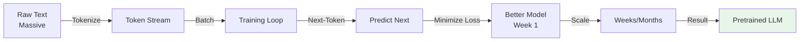
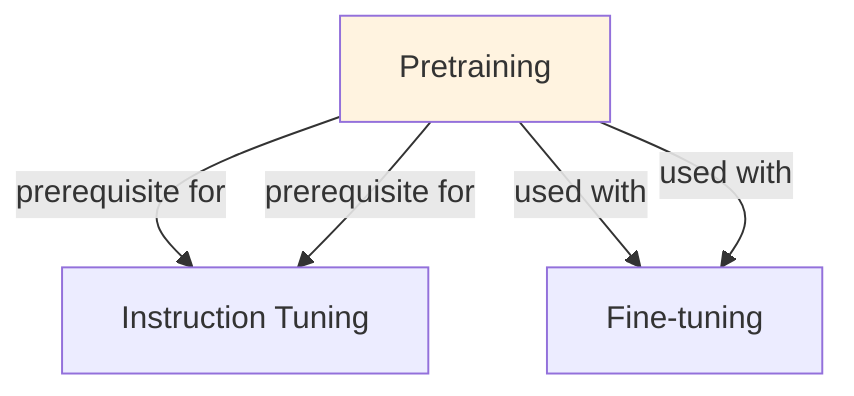

# Pretraining

## Understanding Pretraining

Pretraining is a foundational concept in large language model development that addresses critical challenges in model architecture, training efficiency, or inference performance. Understanding this concept is essential for anyone working with modern language models, whether in research, fine-tuning, or production deployment.

The core innovation underlying Pretraining lies in rethinking standard approaches to achieve better efficiency or effectiveness. Rather than accepting conventional trade-offs, this technique exploits mathematical or architectural insights to push the frontier of what's possible with given computational constraints.

In practical applications, Pretraining enables capabilities that would otherwise be infeasible: reducing computational requirements, improving model quality, enabling faster iteration, or supporting new use cases. The real-world impact has made Pretraining widely adopted across industry applications, from consumer products to enterprise systems.

Implementing Pretraining requires understanding both its theoretical foundations and practical considerations. The following sections provide detailed explanations of how Pretraining works, when to use it, common implementation patterns, and lessons learned from production deployments. By mastering these concepts, practitioners can make informed decisions about when and how to apply Pretraining to their specific challenges.

## Core Intuition
Humans learn language by reading books (not studying grammar rules). Pretraining is similar: model reads billions of tokens and learns patterns—syntax, semantics, facts, reasoning. This compressed knowledge transfers to downstream tasks (classification, generation, QA) via fine-tuning. The goal: learn representations that capture structure of language and world.

## How It Works

**Causal Language Modeling (GPT-style, Autoregressive):**

Objective: predict next token given all previous tokens
```
P(x) = P(x_1) × P(x_2|x_1) × P(x_3|x_1,x_2) × ... × P(x_T|x_1...x_{T-1})

Loss = -log P(x_1...x_T) = Σ_i -log P(x_i | x_{<i})

Example:
  Input: "The cat sat on the"
  Model predicts: "mat" with probability 0.8
  Loss = -log(0.8) = 0.22
```

Architecture:
```
Token embedding → Positional embedding
  ↓
Transformer (12-96 layers)
  Attention (causal mask: attend only to past)
  Feed-forward
  LayerNorm, Dropout
  ↓
Output embedding → softmax → next token probability
```

Key properties:
- **Causal masking:** Q can only attend to positions ≤ Q's position
- **Autoregressive generation:** generate one token at a time (sequential)
- **Harder objective:** predicting future is harder than filling in the middle
- **Better generalization:** learned representations useful for generation

**Masked Language Modeling (BERT-style, Bidirectional):**

Objective: predict masked tokens given full context
```
1. Corrupt text: replace 15% tokens with [MASK]
   "The cat sat on the mat" → "The [MASK] sat on the [MASK]"
2. Model predicts masked tokens bidirectionally
   P(x_2 | context without x_2) = ...
3. Loss: cross-entropy on masked positions only
```

Architecture:
```
Same as causal, but WITHOUT causal masking
Attention: attend to all positions (bidirectional)
```

Key properties:
- **Bidirectional context:** more information for prediction (easier task)
- **Non-autoregressive:** can extract representations in parallel
- **Better for understanding:** classification, retrieval
- **Can't generate directly:** no causal structure for sequential generation

**Scale Laws (Chinchilla / Scaling Laws):**

Performance improves predictably:
```
Loss(N, D) ∝ 1/N^α + 1/D^β

Where:
  N = number of model parameters
  D = number of tokens seen
  α ≈ 1.0, β ≈ 0.14 (empirically)

Scaling law insights:
1. Compute budget C ≈ 6 × N × D (6 FLOPs per parameter-token pair)
2. Optimal: N ≈ D / 20 (Chinchilla ratio)
   Example: 10B token budget → 500M params optimal
3. Training on too much data (D >> C/6N) is inefficient
4. Larger models are more sample-efficient
```

**Training Distribution & Curriculum:**

Data mixing:
```
Wikipedia: 3%
Books: 15%
Code: 25%
Web (Common Crawl): 57%

Different corpora teach different skills:
  - Books: narrative, complex reasoning
  - Code: structured logic, precision
  - Web: diverse topics, common knowledge
  - Wikipedia: factual, encyclopedia-style
```

Curriculum learning (optional):
```
Phase 1: Clean, high-quality data (Books, Wikipedia)
  → establish language foundation
  
Phase 2: Diverse web data
  → learn breadth of topics, styles
  
Phase 3: Domain-specific data (code, scientific papers)
  → specialized knowledge
```

### Workflow Flowchart



## Key Properties / Trade-offs

| Aspect | Causal (GPT) | Masked (BERT) | Hybrid |
|--------|--------------|---------------|--------|
| Training objective | Next token prediction | Masked token prediction | Both |
| Directionality | Unidirectional | Bidirectional | Varies |
| Generation | Direct (autoregressive) | Requires decoding tricks | Both |
| Classification | Via prompting/fine-tuning | Direct (embed + classify) | Both |
| Training ease | Harder (future unpredictable) | Easier (context available) | Moderate |
| Data efficiency | Needs more data | Less data needed | Moderate |
| Example models | GPT-2/3/4, Llama, Claude | BERT, RoBERTa | T5, BART |

**Computational Cost:**

Example: Pretraining Llama-2-70B
```
Parameters: 70B
Tokens seen: 2T (2 trillion)
Compute budget: 6 × 70B × 2T = 840 × 10^18 FLOPs

H100 GPU: ~3 × 10^17 FLOPs/s = 1 exaflop/s
Time: 840 × 10^18 FLOPs / 10^18 FLOPs/s = 840s... wait, that's parallel

With 2048 H100 GPUs:
  Total compute: 2048 × 10^18 FLOPs/s = 2 exaflops/s
  Time: 840 × 10^18 / (2 × 10^18) ≈ 420 seconds? No, that's wrong.
  
Correct calculation:
  Time = Compute_FLOPs / (GPUs × FLOPs_per_GPU_per_sec)
  Time = (840 × 10^18) / (2048 × 3 × 10^17) ≈ 1,370 seconds ≈ 23 minutes

This assumes 100% utilization, which is optimistic. In practice:
  - Actual: 2-5 weeks on 2000 H100s
  - Cost: 2-5 weeks × 2000 GPUs × ~$3/hour = $3-7M
```

## Common Mistakes / Gotchas

- **Confusing pretraining and fine-tuning:** Pretraining is unsupervised (self-supervised) on massive data. Fine-tuning is supervised on task-specific data. Both are essential. Pretraining without fine-tuning ≠ good downstream performance on specific tasks.

- **Data quality vs quantity:** 1T tokens of high-quality data >> 10T tokens of noisy data. Invest in data curation early.

- **Assuming larger always better:** Larger models help, but architectural choices matter (attention heads, layers, width). Also: larger models need more data (Chinchilla scaling).

- **Ignoring context length during pretraining:** If pretrained on short contexts (4K), doesn't generalize well to long contexts (32K+). Pretrain with target context length in mind.

- **Data leakage:** If pretraining data contains test set → unfair comparison. Use careful data deduplication and version control.

- **Not measuring on realistic tasks:** Perplexity (pretraining loss) doesn't always correlate with downstream task performance. Evaluate on your actual use cases.

- **Overcounting epochs:** 1T tokens over small dataset (repeated many times) << 1T tokens of diverse data. Avoid excessive data repetition.

- **Ignoring instruction-tuning after pretraining:** Base pretrained model often doesn't follow instructions well. Need instruction-tuning (SFT) or RLHF to make it useful.

## Code Example

```python
import torch
from transformers import GPT2Tokenizer, GPT2LMHeadModel, TextDataset, DataCollatorForLanguageModeling
from transformers import Trainer, TrainingArguments

# Load pretrained (simpler) or train from scratch
# Here we show fine-tuning a pretrained model, which is more practical

model_name = "gpt2"
tokenizer = GPT2Tokenizer.from_pretrained(model_name)
model = GPT2LMHeadModel.from_pretrained(model_name)

# Prepare dataset
dataset = TextDataset(
    tokenizer=tokenizer,
    file_path="my_text.txt",
    block_size=128,
)

data_collator = DataCollatorForLanguageModeling(
    tokenizer=tokenizer,
    mlm=False,  # Causal LM, not masked
)

# Training arguments
training_args = TrainingArguments(
    output_dir="./pretrained_model",
    overwrite_output_dir=True,
    num_train_epochs=3,
    per_device_train_batch_size=8,
    save_steps=10000,
    save_total_limit=2,
    logging_steps=100,
    gradient_accumulation_steps=4,
)

# Trainer
trainer = Trainer(
    model=model,
    args=training_args,
    data_collator=data_collator,
    train_dataset=dataset,
)

trainer.train()

# Full pretraining from scratch (conceptual)
from transformers import GPT2Config, GPT2LMHeadModel

config = GPT2Config(
    vocab_size=50000,
    n_positions=2048,  # context length
    n_embd=768,        # embedding dimension
    n_layer=12,        # number of layers
    n_head=12,         # number of attention heads
)

model = GPT2LMHeadModel(config)

# Would train on 1T+ tokens with distributed training
# In practice: use nanoGPT, Megatron, or use pretrained models

# Inference with pretrained
input_text = "The future of AI is"
input_ids = tokenizer.encode(input_text, return_tensors="pt")
output = model.generate(input_ids, max_length=50, temperature=0.7)
generated_text = tokenizer.decode(output[0], skip_special_tokens=True)
print(generated_text)

# Masked LM example (BERT-style)
from transformers import BertConfig, BertForMaskedLM

bert_config = BertConfig(
    vocab_size=30522,
    hidden_size=768,
    num_hidden_layers=12,
    num_attention_heads=12,
    intermediate_size=3072,
)

bert_model = BertForMaskedLM(bert_config)

# Would pretrain on masked language objective:
# Loss = -log P(x_masked | context_without_x)
```

## Interview Quick-Reference

| Question | What to say |
|---|---|
| "Pretraining?" | Unsupervised learning on 100B-10T tokens to predict next (causal) or masked tokens. Foundation for all LLMs. |
| "Causal vs masked?" | Causal: next-token prediction, autoregressive, better for generation. Masked: bidirectional, better for classification. |
| "Scaling laws?" | Performance ∝ model size ^ -α. Optimal: ~20 tokens per parameter (Chinchilla). Larger models more sample-efficient. |
| "Cost?" | 7B model: 2 weeks on 100 A100s (~$500k). 70B model: 2-5 weeks on 2000 H100s (~$5M). Most orgs use pretrained. |
| "Transfer learning?" | Pretrain learns general patterns. Fine-tune on task-specific data (1-100x cheaper than pretraining). |
| "Data quality?" | Matters more than quantity. 1T high-quality >> 10T noisy. Curate carefully. |

## Real-World Examples

### OpenAI Pretraining
GPT-3: 175B model, 300B tokens, cost $10M+. Time: 3+ months. Result: strong zero-shot, few-shot capability. Established that scale enables capabilities.

### Open-Source Pretraining
Llama 2: 70B model, 2T tokens, compute-optimal training. Result: competitive with GPT-3.5 on many benchmarks. Cost: lower (open source infrastructure).

## Related Topics
- [[tokenization]] — text → token IDs for pretraining
- [[fine-tuning]] — adapting pretrained model to tasks
- [[instruction-tuning]] — making pretrained model follow instructions
- [[scaling-laws]] — how performance scales with size, data, compute

## Resources
- [Attention Is All You Need (Transformers)](https://arxiv.org/abs/1706.03762)
- [Language Models are Unsupervised Multitask Learners (GPT-2)](https://d4mucfpksywv.cloudfront.net/better-language-models/language_models_are_unsupervised_multitask_learners.pdf)
- [BERT: Pre-training of Deep Bidirectional Transformers](https://arxiv.org/abs/1810.04805)
- [Chinchilla Scaling Laws & Optimal Compute Allocation](https://arxiv.org/abs/2203.15556)
- [Training Compute-Optimal Large Language Models](https://arxiv.org/abs/2309.03494)

## Concept Relationships



## Interview Questions

**Q: What's pretraining and why is it important?**
*A: Pretraining: train model on massive unlabeled text (next-token prediction). Learns language, factual knowledge, reasoning patterns. Foundation for all downstream tasks. Cost: millions of dollars, weeks of GPU time. Benefit: transfers to any task.*

**Q: What's the pretraining objective?**
*A: Next-token prediction: given 'The capital of France is', predict 'Paris'. Objective: minimize cross-entropy. Simple but powerful: emergent abilities appear at scale (reasoning, coding, translation).*

**Q: How much pretraining data do you need?**
*A: Rule of thumb: more data > larger model. Chinchilla scaling laws: compute ≈ data, model size ≈ data. 1.3T tokens (GPT-3): 175B model. Trade-off: too little (underfitting), too much (diminishing returns).*

**Q: What's the relationship between model size and pretraining quality?**
*A: Larger models learn more. But: compute grows cubically with size. 70B model = 27x compute vs 7B. Typical: scale to largest affordable size (time/money constrained).*

**Q: How do you evaluate pretraining quality?**
*A: Loss on held-out test set (perplexity). Downstream task performance (MMLU, etc). Both matter: low loss ≠ good downstream performance always. Look at both metrics.*