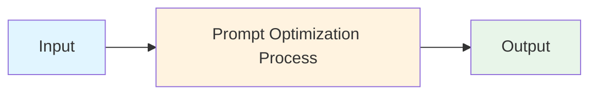
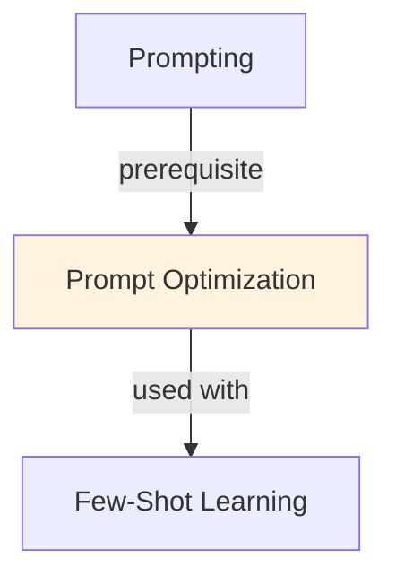

# Prompt Optimization

## TL;DR
Iteratively improve LLM outputs by refining prompts: clarity, examples (few-shot), structure, constraints, reasoning cues. Typical gains: 10-30% accuracy improvement with same model. Combines instruction engineering, in-context learning, and output formatting.

## Core Intuition
Prompts are interfaces to LLMs. Small changes in wording, structure, or examples significantly affect output quality. "Classify sentiment" (70% accuracy) vs. "Classify sentiment as positive/negative/neutral, considering sarcasm" (85% accuracy) show the impact. Optimization is iterative: baseline → refine → measure → repeat.

## How It Works

**Iterative Optimization Loop:**
```
1. Baseline prompt: "Classify this sentiment: [text]"
   Performance: 70% accuracy
   
2. Add clarity: "Classify this text as positive, negative, or neutral sentiment. If sarcastic, consider actual intent."
   Performance: 75% (+5%)
   
3. Add examples: Include 2-3 examples of sentiment classifications
   Performance: 82% (+7%)
   
4. Add structure: Specify output format (JSON)
   Performance: 85% (+3%)
   
5. Add reasoning: "Let's analyze step-by-step"
   Performance: 87% (+2%)
```

**Optimization Dimensions:**

**1. Clarity & Specificity**
```
❌ Bad: "Analyze this text"
✅ Good: "Analyze the sentiment of this customer review. Respond with one of: positive, negative, neutral"
✅ Better: "Analyze the sentiment of this product review. Identify: 1) overall sentiment, 2) main complaint or praise, 3) whether genuine or sarcastic"
```

**2. Examples (Few-Shot Learning)**
```
Classify sentiment:

Example 1: "This product is amazing!" → positive
Example 2: "Waste of money" → negative
Example 3: "It works, nothing special" → neutral
Example 4: "Oh sure, GREAT job" (sarcastic) → negative

Now classify: "Your customer service is outstanding!"
Sentiment:
```

**3. Output Structure**
```
❌ Unstructured: "The sentiment is positive because..."
✅ Structured (JSON): {"sentiment": "positive", "confidence": 0.95, "key_phrases": ["..."], "reasoning": "..."}
✅ Structured (XML): <response><sentiment>positive</sentiment>...</response>
```

**4. Chain-of-Thought**
```
Classify sentiment step by step:
1. Identify emotional keywords
2. Check for sarcasm indicators
3. Determine overall sentiment
4. Output result

Text: "This is just fantastic"
1. Emotional keywords: "fantastic" (positive indicator)
2. Sarcasm: Check tone... (low sarcasm probability)
3. Overall: positive
4. Result: positive
```

**5. Constraints & Tone**
```
- Constraint: "Output ONLY the sentiment label, nothing else"
- Tone: "Be analytical and fair, don't assume bias"
- Instruction: "Prioritize accuracy over speed"
```

**6. Context & Role**
```
❌ Generic: "Classify sentiment"
✅ Contextualized: "You are an expert at sentiment analysis for product reviews. Classify with expertise in e-commerce language."
```

### Workflow Flowchart



## Key Properties / Trade-offs

| Optimization Technique | Time | Cost | Accuracy Gain | Best For |
|------------------------|------|------|---------------|----------|
| Clarity (+20 chars) | 2 min | $0 | +3-5% | All tasks |
| Few-shot (3 examples) | 10 min | $0 | +5-15% | Specific tasks |
| Output structure | 5 min | $0 | +2-5% | Parsing-dependent |
| Chain-of-Thought | 10 min | $0 | +5-10% | Reasoning tasks |
| Role/context | 5 min | $0 | +2-8% | Domain-specific |
| Temperature tuning | 5 min | $0 | +0-3% | Creative tasks |
| Prompt ensemble | 30 min | 3-5x cost | +5-15% | Critical paths |

**Diminishing Returns:**
- First 2-3 optimizations: 5-15% gains
- Next 3-4 optimizations: 2-5% gains each
- Beyond 7-8: <2% gains, time/cost not worth it

**Trade-offs:**
- More specific → better accuracy, less flexible
- More examples → higher token cost, stronger few-shot
- More structure → easier parsing, slightly verbose
- Reasoning prompts → slower, better quality

## Common Mistakes / Gotchas

- **Over-specification:** "Classify sentiment: positive, negative, neutral, very positive, somewhat positive, mostly negative..." → confuses model. Keep categories clear and minimal.
- **Bad examples:** Unrepresentative or inconsistent examples → worse performance. Check examples match distribution.
- **Too many examples:** 15+ examples exceeds diminishing returns and uses tokens. Optimal: 3-5.
- **Inconsistent format:** "Output: {sentiment}" vs "Answer: sentiment" → model confused. Be consistent across examples.
- **Ignoring model personality:** GPT-4 reasoning better with CoT, Claude better with natural language, some models struggle with strict format requirements.
- **Not testing edge cases:** Sarcasm, idioms, domain jargon. Add examples for these.
- **Assuming one prompt fits all:** Sentiment in reviews vs tweets vs technical docs need different prompts. Domain matters.
- **Not measuring baseline:** Can't improve if you don't measure starting point. Always establish baseline first.
- **Chasing accuracy in wrong metric:** 95% accuracy on test set but 40% on production drift. Measure on representative data.

## Code Example

```python
from anthropic import Anthropic

client = Anthropic()

# Define prompts at different optimization levels

prompt_v1 = """Classify sentiment: "This product is amazing!""""

prompt_v2 = """Classify the sentiment as positive, negative, or neutral: "This product is amazing!" """

prompt_v3 = """Classify the sentiment of this customer review as positive, negative, or neutral. If the review contains sarcasm, classify based on actual sentiment.

Text: "This product is amazing!""""

prompt_v4_few_shot = """Classify sentiment as positive, negative, or neutral. Consider sarcasm.

Examples:
"I love this!" → positive
"Terrible quality" → negative  
"It works fine" → neutral
"Oh sure, just FANTASTIC" (sarcasm) → negative

Text: "This product is amazing!""""

prompt_v5_cot = """Classify sentiment step-by-step.

1. Identify emotional words
2. Check for sarcasm  
3. Determine final sentiment

Text: "This product is amazing!"

Step-by-step analysis:"""

prompt_v6_structured = """Classify sentiment with structured output.

Output JSON with: {"sentiment": "...", "confidence": 0.0-1.0, "reasoning": "..."}

Text: "This product is amazing!"

JSON:"""

# Compare prompts
prompts = [
    ("v1: Minimal", prompt_v1),
    ("v2: Clarity", prompt_v2),
    ("v3: Instructions", prompt_v3),
    ("v4: Few-shot", prompt_v4_few_shot),
    ("v5: CoT", prompt_v5_cot),
    ("v6: Structured", prompt_v6_structured),
]

for name, prompt in prompts:
    response = client.messages.create(
        model="claude-3-5-sonnet-20241022",
        max_tokens=100,
        messages=[{"role": "user", "content": prompt}]
    )
    print(f"{name}: {response.content[0].text.strip()}")

# Output might look like:
# v1: Minimal: positive
# v2: Clarity: positive
# v3: Instructions: positive
# v4: Few-shot: positive
# v5: CoT: Step 1) "amazing" is emotional, positive. Step 2) No sarcasm. Step 3) positive
# v6: Structured: {"sentiment": "positive", "confidence": 0.98, "reasoning": "Strong positive emotion"}

# Optimization framework
def optimize_prompt(base_prompt, test_cases, metric_fn):
    """
    Iteratively optimize prompt against test cases.
    
    Args:
        base_prompt: Starting prompt template
        test_cases: List of (input, expected_output)
        metric_fn: Function to evaluate quality
    
    Returns:
        optimized_prompt, accuracy
    """
    current_prompt = base_prompt
    best_accuracy = 0
    improvements = []
    
    for iteration in range(5):  # Try up to 5 improvements
        scores = []
        for test_input, expected in test_cases:
            response = client.messages.create(
                model="claude-3-5-sonnet-20241022",
                max_tokens=50,
                messages=[{"role": "user", "content": current_prompt.format(text=test_input)}]
            )
            score = metric_fn(response.content[0].text, expected)
            scores.append(score)
        
        accuracy = sum(scores) / len(scores)
        
        if accuracy > best_accuracy:
            best_accuracy = accuracy
            improvements.append(f"Iteration {iteration}: {accuracy:.2%}")
        else:
            break  # No improvement, stop
    
    return current_prompt, best_accuracy, improvements

# Example usage
test_cases = [
    ("I love this!", "positive"),
    ("Terrible experience", "negative"),
    ("It's okay", "neutral"),
]

def simple_metric(output, expected):
    return 1.0 if expected.lower() in output.lower() else 0.0

prompt, accuracy, history = optimize_prompt(
    base_prompt=prompt_v4_few_shot,
    test_cases=test_cases,
    metric_fn=simple_metric
)

print(f"\nOptimization history: {history}")
print(f"Final accuracy: {accuracy:.2%}")
```

## Interview Quick-Reference

| Question | What to say |
|---|---|
| "Prompt optimization?" | Iteratively improve LLM outputs by refining instructions, adding examples, structuring output, constraining format. Typical: 10-30% gains. |
| "Key techniques?" | Clarity, few-shot examples, output structure (JSON), chain-of-thought, role/context, constraints. Combine 2-4 most impactful. |
| "How many examples?" | 3-5 examples optimal. More → diminishing returns + higher cost. Choose representative, diverse examples. |
| "Chain-of-thought?" | Prompt reasoning steps. Helps complex tasks (math, logic). Costs more tokens but boosts accuracy 5-15%. |
| "Structured output?" | JSON or XML format. Easier parsing, +2-5% accuracy from clarity. Specify exact schema. |
| "When stop optimizing?" | When gains drop below 2% or ROI not worth effort. Most gains in first 2-3 iterations. |
| "One-shot vs few-shot?" | One shot: 1 example, 10% gain typical. Few-shot (3-5): 15-25% gain. More is diminishing. |

## Related Topics
- [[prompting]] — general prompting principles and frameworks
- [[few-shot-learning]] — in-context examples as optimization technique
- [[chain-of-thought]] — reasoning prompts for complex tasks
- [[in-context-learning]] — broader ICL patterns
- [[instruction-tuning]] — fine-tuning to improve instruction following

## Resources
- [Prompt Engineering Guide](https://www.promptingguide.ai/)
- [OpenAI: Prompt Engineering Best Practices](https://platform.openai.com/docs/guides/prompt-engineering)
- [Anthropic: Prompt Engineering](https://docs.anthropic.com/en/docs/guides/prompt-engineering)
- [AutoPrompt: Eliciting Knowledge from Language Models with Automatically Generated Prompts](https://arxiv.org/abs/2010.15980)
- [Large Language Models Are Zero-Shot Reasoners](https://arxiv.org/abs/2205.11916)

## Concept Relationships



## Interview Questions

**Q: What's the core problem this concept solves?**
*A: See the 'Core Intuition' section above for the fundamental problem and how this concept addresses it.*

**Q: What are the main advantages and disadvantages?**
*A: See 'Key Properties / Trade-offs' section for detailed comparison with alternatives.*

**Q: How do you implement this in practice?**
*A: Refer to the corresponding Jupyter notebook in `llm/notebooks/` for working Python implementations and examples.*

