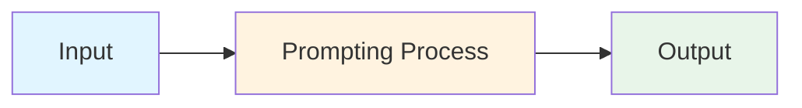
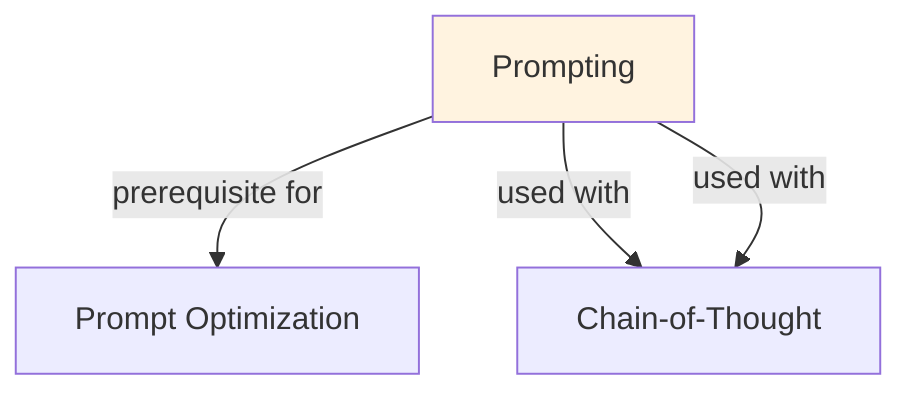

# Prompting

## TL;DR
Art and science of structuring text queries to LLMs. Clarity, examples, constraints dramatically affect quality. Techniques: instruction clarity, few-shot, role-play, output formatting, chain-of-thought.

## Core Intuition
LLM output quality depends hugely on input framing. Same question asked differently → different quality. Prompt engineering is leverage: no code change, big quality gains.

## How It Works

**Core Principles:**
1. **Be specific:** vague prompts → vague outputs
2. **Show format:** "output JSON" vs show example
3. **Add examples:** few-shot beats zero-shot
4. **Use roles:** "You are expert in X" helps
5. **Constrain:** "output only X, no explanation"
6. **Chain reasoning:** "think step by step"

**Prompt Structure:**
```
System role: "You are a helpful assistant expert in ML"
Task: "Classify sentiment of: [text]"
Constraints: "Output only: positive/negative/neutral"
Examples:
  "I love this!" → positive
  "Terrible" → negative
Input: [user text]
```

**Techniques:**
- Zero-shot: instruction only
- Few-shot: instruction + examples
- Chain-of-thought: show reasoning
- Role-play: "assume you are..."
- Format specification: "output as JSON"
- Constraints: "do not mention X", "be concise"

### Workflow Flowchart



## Key Properties / Trade-offs

| Approach | Clarity | Examples | Output | Quality |
|----------|---------|----------|--------|---------|
| Vague | Low | None | Unpredictable | Low |
| Clear | High | None | Better | Medium |
| Clear + examples | High | 3-5 | Consistent | High |
| Clear + CoT | High | Examples | Detailed | Very High |

## Common Mistakes / Gotchas

- **Too wordy:** long prompts confuse. Be concise.
- **Conflicting constraints:** "be brief" + "explain in detail" → model confused.
- **Assuming shared knowledge:** LLM doesn't know context you know. Specify.
- **Bad examples:** wrong examples teach wrong behavior. Curate carefully.
- **No format spec:** model invents format. Specify exactly what you want.
- **Not handling edge cases:** prompt works for common cases, breaks on unusual input.

## Code Example

```python
import anthropic

client = anthropic.Anthropic()

# Bad prompt (vague)
bad_prompt = "Analyze this: The movie was good but slow"

# Good prompt (specific, formatted)
good_prompt = """You are a movie critic expert in sentiment analysis.
Classify the sentiment of the following review.

Instructions:
- Output ONLY the sentiment label
- Choose from: positive, negative, neutral, mixed
- Do not explain, just output the label

Examples:
"Terrible movie, waste of time" → negative
"Amazing! Best film ever" → positive
"It was okay, some good parts" → neutral

Review: "The movie was good but slow"
Sentiment:"""

# Test both
response_bad = client.messages.create(
    model="claude-3-5-sonnet-20241022",
    max_tokens=100,
    messages=[{"role": "user", "content": bad_prompt}]
)
print("Bad:", response_bad.content[0].text)

response_good = client.messages.create(
    model="claude-3-5-sonnet-20241022",
    max_tokens=100,
    messages=[{"role": "user", "content": good_prompt}]
)
print("Good:", response_good.content[0].text)
# Bad: rambling explanation
# Good: "mixed"
```

## Interview Quick-Reference

| Question | What to say |
|---|---|
| "Prompting?" | Art of structuring queries for LLM. Clarity, examples, constraints matter hugely. |
| "Few-shot vs zero?" | Few-shot (examples) better 80% of time. ~3-5 examples optimal. |
| "Output format?" | Specify exactly: "JSON", "list", "one word only". Model invents if unspecified. |
| "Bad performance?" | Improve prompt: be specific, add examples, add constraints, clarify intent. |
| "Role-play helps?" | Yes. "You are expert in X" guides LLM behavior, improves quality 10-20%. |

## Related Topics
- [Prompt Optimization](prompt-optimization.md) — iterative improvement
- [In-Context Learning](in-context-learning.md) — how prompts teach
- [Chain-of-Thought](chain-of-thought.md) — reasoning in prompts

## Resources
- [OpenAI Prompt Engineering](https://platform.openai.com/docs/guides/prompt-engineering)
- [Prompt Engineering Guide](https://www.promptingguide.ai/)

## Concept Relationships



## Interview Questions

**Q: What's the core problem this concept solves?**
*A: See the 'Core Intuition' section above for the fundamental problem and how this concept addresses it.*

**Q: What are the main advantages and disadvantages?**
*A: See 'Key Properties / Trade-offs' section for detailed comparison with alternatives.*

**Q: How do you implement this in practice?**
*A: Refer to the corresponding Jupyter notebook in `llm/notebooks/` for working Python implementations and examples.*

