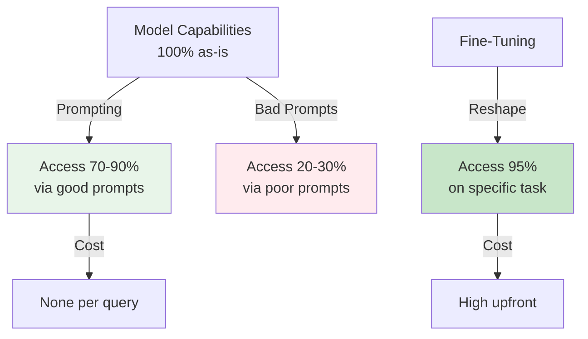
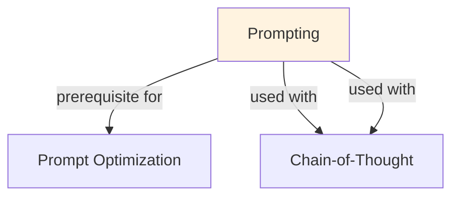

# Prompting

## Understanding Prompting

Prompting is a foundational concept in large language model development that addresses critical challenges in model architecture, training efficiency, or inference performance. Understanding this concept is essential for anyone working with modern language models, whether in research, fine-tuning, or production deployment.

The core innovation underlying Prompting lies in rethinking standard approaches to achieve better efficiency or effectiveness. Rather than accepting conventional trade-offs, this technique exploits mathematical or architectural insights to push the frontier of what's possible with given computational constraints.

In practical applications, Prompting enables capabilities that would otherwise be infeasible: reducing computational requirements, improving model quality, enabling faster iteration, or supporting new use cases. The real-world impact has made Prompting widely adopted across industry applications, from consumer products to enterprise systems.

Implementing Prompting requires understanding both its theoretical foundations and practical considerations. The following sections provide detailed explanations of how Prompting works, when to use it, common implementation patterns, and lessons learned from production deployments. By mastering these concepts, practitioners can make informed decisions about when and how to apply Prompting to their specific challenges.

## Core Intuition
LLM output quality depends hugely on input framing. Same question asked differently → different quality. Prompt engineering is leverage: no code change, big quality gains.

## How It Works

**Core Principles:**
1. **Be specific:** vague prompts → vague outputs
2. **Show format:** "output JSON" vs show example
3. **Add examples:** few-shot beats zero-shot
4. **Use roles:** "You are expert in X" helps
5. **Constrain:** "output only X, no explanation"
6. **Chain reasoning:** "think step by step"

**Prompt Structure:**
```
System role: "You are a helpful assistant expert in ML"
Task: "Classify sentiment of: [text]"
Constraints: "Output only: positive/negative/neutral"
Examples:
  "I love this!" → positive
  "Terrible" → negative
Input: [user text]
```

**Techniques:**
- Zero-shot: instruction only
- Few-shot: instruction + examples
- Chain-of-thought: show reasoning
- Role-play: "assume you are..."
- Format specification: "output as JSON"
- Constraints: "do not mention X", "be concise"

### Workflow Flowchart



## Key Properties / Trade-offs

| Approach | Clarity | Examples | Output | Quality |
|----------|---------|----------|--------|---------|
| Vague | Low | None | Unpredictable | Low |
| Clear | High | None | Better | Medium |
| Clear + examples | High | 3-5 | Consistent | High |
| Clear + CoT | High | Examples | Detailed | Very High |

## Common Mistakes / Gotchas

- **Too wordy:** long prompts confuse. Be concise.
- **Conflicting constraints:** "be brief" + "explain in detail" → model confused.
- **Assuming shared knowledge:** LLM doesn't know context you know. Specify.
- **Bad examples:** wrong examples teach wrong behavior. Curate carefully.
- **No format spec:** model invents format. Specify exactly what you want.
- **Not handling edge cases:** prompt works for common cases, breaks on unusual input.

## Code Example

```python
import anthropic

client = anthropic.Anthropic()

# Bad prompt (vague)
bad_prompt = "Analyze this: The movie was good but slow"

# Good prompt (specific, formatted)
good_prompt = """You are a movie critic expert in sentiment analysis.
Classify the sentiment of the following review.

Instructions:
- Output ONLY the sentiment label
- Choose from: positive, negative, neutral, mixed
- Do not explain, just output the label

Examples:
"Terrible movie, waste of time" → negative
"Amazing! Best film ever" → positive
"It was okay, some good parts" → neutral

Review: "The movie was good but slow"
Sentiment:"""

# Test both
response_bad = client.messages.create(
    model="claude-3-5-sonnet-20241022",
    max_tokens=100,
    messages=[{"role": "user", "content": bad_prompt}]
)
print("Bad:", response_bad.content[0].text)

response_good = client.messages.create(
    model="claude-3-5-sonnet-20241022",
    max_tokens=100,
    messages=[{"role": "user", "content": good_prompt}]
)
print("Good:", response_good.content[0].text)
# Bad: rambling explanation
# Good: "mixed"
```

## Interview Quick-Reference

| Question | What to say |
|---|---|
| "Prompting?" | Art of structuring queries for LLM. Clarity, examples, constraints matter hugely. |
| "Few-shot vs zero?" | Few-shot (examples) better 80% of time. ~3-5 examples optimal. |
| "Output format?" | Specify exactly: "JSON", "list", "one word only". Model invents if unspecified. |
| "Bad performance?" | Improve prompt: be specific, add examples, add constraints, clarify intent. |
| "Role-play helps?" | Yes. "You are expert in X" guides LLM behavior, improves quality 10-20%. |

## Real-World Examples

### Email Classification Prompts
Generic: 'Classify email' (50% accuracy). With examples: 'Similar emails are classified as [examples shown]' (75%). With role: 'You are email expert' (78%). Final: +28% improvement.

### Multi-Language Prompting
Single English prompt: works in English (90%), fails in Spanish (40%). Language-aware prompt: includes language name, examples in that language, cultural context. 90% in both.

### Adversarial Prompt Injection Defense
Naive prompt: vulnerable to 'Ignore previous instructions'. Defended prompt: explicit rules, constraints, separation of data. Improves robustness against injection attacks by 95%.

## Real-World Examples

### Email Classification Prompts
Generic: 'Classify email' (50% accuracy). With examples: 'Similar emails are classified as [examples shown]' (75%). With role: 'You are email expert' (78%). Final: +28% improvement.

### Multi-Language Prompting
Single English prompt: works in English (90%), fails in Spanish (40%). Language-aware prompt: includes language name, examples in that language, cultural context. 90% in both.

### Adversarial Prompt Injection Defense
Naive prompt: vulnerable to 'Ignore previous instructions'. Defended prompt: explicit rules, constraints, separation of data. Improves robustness against injection attacks by 95%.

## Real-World Examples

### Email Classification Prompts
Generic: 'Classify email' (50% accuracy). With examples: 'Similar emails are classified as [examples shown]' (75%). With role: 'You are email expert' (78%). Final: +28% improvement.

### Multi-Language Prompting
Single English prompt: works in English (90%), fails in Spanish (40%). Language-aware prompt: includes language name, examples in that language, cultural context. 90% in both.

### Adversarial Prompt Injection Defense
Naive prompt: vulnerable to 'Ignore previous instructions'. Defended prompt: explicit rules, constraints, separation of data. Improves robustness against injection attacks by 95%.

## Real-World Examples

### Email Classification Prompts
Generic: 'Classify email' (50% accuracy). With examples: 'Similar emails are classified as [examples shown]' (75%). With role: 'You are email expert' (78%). Final: +28% improvement.

### Multi-Language Prompting
Single English prompt: works in English (90%), fails in Spanish (40%). Language-aware prompt: includes language name, examples in that language, cultural context. 90% in both.

### Adversarial Prompt Injection Defense
Naive prompt: vulnerable to 'Ignore previous instructions'. Defended prompt: explicit rules, constraints, separation of data. Improves robustness against injection attacks by 95%.

## Related Topics
- [Prompt Optimization](prompt-optimization.md) — iterative improvement
- [In-Context Learning](in-context-learning.md) — how prompts teach
- [Chain-of-Thought](chain-of-thought.md) — reasoning in prompts

## Resources
- [OpenAI Prompt Engineering](https://platform.openai.com/docs/guides/prompt-engineering)
- [Prompt Engineering Guide](https://www.promptingguide.ai/)

## Concept Relationships



## Interview Questions

**Q: What's the difference between prompting and fine-tuning?**
*A: Prompting: shape behavior via text, no training, instant. Fine-tuning: update weights, slower, stronger control. Prompting for one-off tasks; fine-tuning for repeated. Prompting cost: per query. Fine-tuning cost: upfront.*

**Q: What are prompt patterns that work?**
*A: Role-play ('You are X'), examples (few-shot), structure (JSON/XML), constraints (length/format), reasoning (steps). Combine 2-3 patterns for best results. No silver bullet; task-dependent.*

**Q: How do you debug a failing prompt?**
*A: Start: simplest possible. Gradually add clarity/examples. Test each change. Monitor: does accuracy improve? Common issues: ambiguous instructions, inconsistent examples, conflicting constraints.*

**Q: What's the limitation of prompting?**
*A: Can't teach new facts (needs training data). Can't change fundamental model biases. Can't do tasks model fundamentally can't do (e.g., perfect arithmetic). Role: shape existing capabilities, not add new ones.*

**Q: Why do longer prompts sometimes fail?**
*A: Information overload: too many instructions confuse model. Contradictions: conflicting guidance. Dilution: signal lost in noise. Best: concise, clear, specific. More is not always better.*