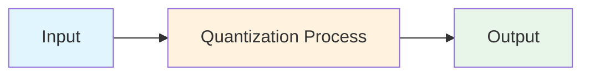
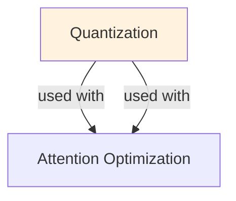

# Quantization (for LLMs)

## TL;DR
Reduce model precision (float32 → int8, int4, or lower) to shrink memory and accelerate inference. Trade: memory/speed gain for small accuracy loss. Critical for deploying large models. Methods: Post-Training Quantization (PTQ), Quantization-Aware Training (QAT), mixed precision.

## Core Intuition
LLMs are huge (LLaMA 70B = 140GB in float32). Store weights in lower precision (8-bit, 4-bit) → same model, 4-16x smaller. Run inference on GPU/CPU with less memory → faster, cheaper. Small accuracy drop because LLM outputs are often robust to quantization noise.

## How It Works

**Precision Reduction:**
```
float32:  32 bits per param (8.3 billion params = 33.2 GB)
float16:  16 bits (16.6 GB) ← 2x smaller, standard "half precision"
int8:      8 bits (4.15 GB) ← 8x smaller, common for inference
int4:      4 bits (2.1 GB) ← 16x smaller, aggressive
```

**Quantization Formula:**
```
quantized_value = round((value - min_val) / scale) 
scale = (max_val - min_val) / (2^bits - 1)
```

**Post-Training Quantization (PTQ) — Simplest:**
- Load float32 model
- Measure ranges of activations on a small calibration set
- Map float values to int8/int4 based on observed ranges
- Fast (no retraining), but slightly lower quality

**Quantization-Aware Training (QAT) — Better:**
- Train with fake quantization: quantize → dequantize during training
- Model learns to be robust to quantization noise
- Higher accuracy than PTQ, but requires retraining

**Grouped Quantization:**
```
Instead of: one scale for entire weight matrix
Better:     compute scale per block (e.g., per group of 128 weights)
Result:     finer control, less accuracy loss
```

**Dynamic vs Static:**
- Static: calibrate scales once, same for all inference
- Dynamic: recompute scales per batch at inference (slower but adaptive)

### Workflow Flowchart



## Key Properties / Trade-offs

| Method | Model Size | Speed | Accuracy | Cost | Use Case |
|--------|-----------|-------|----------|------|----------|
| float32 | 100% | 1x | 100% | High | Reference |
| float16 | 50% | 1.5x | ~100% | Medium | Standard FP16 mixed precision |
| int8 PTQ | 25% | 2-3x | 98-99% | Low | Fast deployment, acceptable loss |
| int8 QAT | 25% | 2-3x | 99% | Medium | Higher bar for accuracy |
| int4 PTQ | 12.5% | 3-4x | 95-97% | Low | Aggressive compression |
| int4 QAT | 12.5% | 3-4x | 97-99% | Medium | Balance quality + efficiency |

**Quantization per layer vs global:**
- Global: one scale for entire model (simple but crude)
- Per-layer: per-weight-matrix scales (better quality)
- Per-channel: per-neuron scales (highest quality, slightly slower)

## Common Mistakes / Gotchas

- **Quantizing activations naively:** Activations have outliers (large values) that don't quantize well. Use clipping or smooth quantization.
- **Ignoring outlier patterns:** Some weights/activations are outliers (rare large values). Quantizing equally to all values wastes precision. Use asymmetric quantization.
- **Too aggressive reduction:** int4 on all layers can hurt accuracy. Try int8 first; use int4 selectively on FFN layers.
- **Not calibrating on representative data:** Calibration set quality matters. If calibration data ≠ actual input distribution, quantization scales are wrong.
- **Forgetting that int4 may not be "free":** int4 kernels aren't available on all hardware. GPU/CPU support varies. Check before deploying.
- **Quantizing in wrong order:** Should be done after training is complete. Quantizing mid-training can be suboptimal.
- **Assuming symmetric quantization works:** For weights with skewed distributions, asymmetric quantization (e.g., int8 with signed range [-127, 127]) works better.

## Code Example

```python
import torch
from transformers import AutoTokenizer, AutoModelForCausalLM
from bitsandbytes.nn import Linear8bitLt

# Post-Training Quantization (PTQ) with bitsandbytes
model_name = "meta-llama/Llama-2-7b-hf"
model = AutoModelForCausalLM.from_pretrained(
    model_name,
    load_in_8bit=True,  # Quantize to int8
    device_map="auto",
)
print(f"Model size: {sum(p.numel() for p in model.parameters()) / 1e9:.2f}B params")

# Inference with quantized model
tokenizer = AutoTokenizer.from_pretrained(model_name)
inputs = tokenizer("Once upon a time", return_tensors="pt").to(model.device)
outputs = model.generate(**inputs, max_length=50)
print(tokenizer.decode(outputs[0]))

# -----------

# Quantization with lower precision (int4)
# Use bitsandbytes or GPTQ
from transformers import BitsAndBytesConfig

quantize_config = BitsAndBytesConfig(
    load_in_4bit=True,
    bnb_4bit_compute_dtype=torch.float16,
    bnb_4bit_use_double_quant=True,  # Double quantization
    bnb_4bit_quant_type="nf4",       # "nf4" for normal float 4
)

model = AutoModelForCausalLM.from_pretrained(
    model_name,
    quantization_config=quantize_config,
    device_map="auto",
)
print(model.get_memory_footprint() / 1e9)  # Memory in GB

# -----------

# Saving quantized model
model.save_pretrained("./quantized_model")

# Loading quantized model (requires same quantization config)
quantized_model = AutoModelForCausalLM.from_pretrained(
    "./quantized_model",
    quantization_config=quantize_config,
)
```

## Interview Quick-Reference

| Question | What to say |
|---|---|
| "What is quantization?" | Reduce precision (float32 → int8/int4) to shrink model, speed up inference. Trade: memory/speed for small accuracy loss. |
| "PTQ vs QAT?" | PTQ: fast, no retraining. QAT: higher accuracy, requires retraining. PTQ for quick deployment; QAT if accuracy critical. |
| "How much compression?" | int8: 4x smaller, 2-3x faster. int4: 8x smaller, 3-4x faster (if supported). Accuracy drops 1-3% typically. |
| "Grouped quantization?" | Quantize per block (e.g., per 128 weights) instead of globally. Finer control, better accuracy with similar compute. |
| "When to quantize?" | Always for deployment. int8 default. Use int4 if memory critical or batch size matters. |
| "Calibration data?" | Use representative data (similar to production). Wrong distribution → scales are off → accuracy loss. |

## Related Topics
- [Inference Optimization](inference-optimization.md) — quantization is one technique among many
- [KV Cache](kv-cache.md) — another memory optimization for inference
- [Speculative Decoding](speculative-decoding.md) — speed optimization compatible with quantization
- [Model Compression](../ml/concepts/model-compression.md) — broader compression techniques

## Resources
- [Quantization Fundamentals with Hugging Face](https://huggingface.co/docs/transformers/quantization)
- [bitsandbytes: Quantization Library](https://github.com/TimDettmers/bitsandbytes)
- [GPTQ: Accurate Post-Training Quantization for Generative Pre-trained Transformers](https://arxiv.org/abs/2210.17323)
- [QLoRA: Efficient Finetuning of Quantized LLMs](https://arxiv.org/abs/2305.14314)

## Concept Relationships



## Interview Questions

**Q: What's the intuition behind quantization?**
*A: Neural networks can operate at lower precision without significant accuracy loss. Quantization reduces precision (float32 → int8/int4), shrinking model size by 4-8x and speeding inference. Trade-off: slight accuracy loss, faster speed, less memory.*

**Q: What's the difference between post-training quantization and QAT?**
*A: PTQ: quantize pre-trained weights directly, fast but may lose accuracy. QAT (Quantization-Aware Training): simulate quantization during training, learn optimal scaling factors, better accuracy but requires retraining.*

**Q: How do you choose quantization bits?**
*A: 8-bit: standard, minimal loss, 4x compression. 4-bit: aggressive, noticeable but acceptable loss for many tasks, 8x compression. 2-bit: extreme, only for specific models. Research shows 4-8 bit is sweet spot.*

**Q: What's the relationship between quantization and hardware?**
*A: Modern GPUs have int8 operations but less common for int4. CPUs have int8 support. Specialized hardware (TPUs, Qualcomm Snapdragon) have excellent int8 performance. Quantization choice should match target hardware.*

## Real-World Applications

### NVIDIA: TensorRT optimization
Provides automated quantization and optimization for deep learning models on GPUs, enabling 4-8x speedup.

### Apple: On-device ML
Uses INT8 and mixed-precision quantization to run models efficiently on iPhones and Macs without cloud computing.

### Meta: Efficient inference
Uses post-training quantization for LLAMA models to serve billions of requests with reduced latency and cost.

## Best Practices

- Start with 8-bit symmetric quantization, most tools support it well.
- Use calibration data: quantization needs representative samples to determine good scaling factors.
- Per-channel quantization: quantize each filter differently for better accuracy than per-layer.
- Test on actual hardware: simulated quantization != real hardware performance.

## Common Pitfalls to Avoid

- **Naive uniform quantization**: Naive uniform quantization: loses precision for outlier weights; use asymmetric or per-channel instead
- **Calibration on unrepresentative data**: Calibration on unrepresentative data: scaling factors won't generalize to real data
- **Extreme quantization (2-bit) for all layers**: Extreme quantization (2-bit) for all layers: some layers are sensitive, need higher precision
- **Ignoring hardware**: Ignoring hardware: int4 speedup varies wildly by hardware; may not justify complexity

