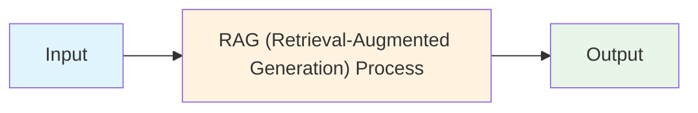
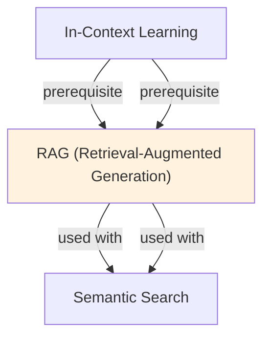

# RAG (Retrieval-Augmented Generation)

## TL;DR
Augment LLM generation with retrieved external documents. Query → retrieve top-k relevant documents → feed to LLM → generate response. Solves: hallucination, knowledge cutoff, up-to-date information, domain-specific knowledge without fine-tuning.

## Core Intuition
LLMs hallucinate because they only know what's in their weights (frozen at training). RAG is like giving them a reference library: retrieve relevant passages first, then generate. Cheap, effective, updatable without retraining.

## How It Works

**1. Indexing Phase (Offline):**
- Break documents into chunks (paragraphs, sentences, fixed tokens)
- Embed chunks using a dense encoder (e.g., BERT, Sentence-Transformers)
- Store embeddings + text in a vector database (Pinecone, Weaviate, FAISS)

**2. Retrieval Phase (At Query Time):**
```
Query → Embed query → Find top-k chunks by cosine similarity → Retrieve text
```
- User query: "What is the capital of France?"
- Embed: dense vector
- Search: find k nearest embedding vectors (ANN search)
- Retrieve: text of k closest matches

**3. Generation Phase:**
- Combine retrieved context with original query
- Prompt template:
  ```
  Context: {retrieved_text}
  Question: {query}
  Answer: {LLM generates}
  ```
- LLM generates conditioned on context

**Example Flow:**
```
User: "How many employees does Acme Corp have?"
  ↓ [Embed query]
  ↓ [Search vector DB for "Acme Corp employees"]
  ↓ [Top result: "As of Q3 2024, Acme Corp employs 5,000 people"]
  ↓ [Prompt LLM: Context + Query]
  → LLM: "Acme Corp has 5,000 employees as of Q3 2024."
```

### Workflow Flowchart



## Key Properties / Trade-offs

| Aspect | Naive Generation | RAG | Fine-Tuning |
|--------|------------------|-----|------------|
| Hallucination risk | High | Low | Medium |
| Knowledge freshness | Training date | Real-time | Requires retraining |
| Domain knowledge | Needs training | Zero-shot on docs | Requires labeled data |
| Latency | Fast | Slow (retrieval) | Fast |
| Cost (training) | Expensive | Cheap | Medium |
| Customization | Not possible | Easy (swap docs) | Requires retraining |

**Chunk Size Trade-offs:**
- Small chunks (50-100 tokens): precise, higher retrieval noise
- Medium chunks (256-512 tokens): balanced
- Large chunks (1k+ tokens): context-rich but may include irrelevant info

**Retrieval Quality:**
- Sparse (BM25): fast, lexical match only, brittle
- Dense (embeddings): slower, semantic match, robust
- Hybrid: combine both, best results

## Common Mistakes / Gotchas

- **Low retrieval quality:** Embedding model mismatch (query ≠ document domain), bad chunk boundaries, insufficient k
- **Context length:** Retrieved text + query + generation can exceed model's context window. Manage carefully.
- **Hallucinating while citing:** LLM may cite retrieved docs while generating false info. Add grounding metrics.
- **Retrieval latency:** Dense embeddings + ANN search can be slow. Optimize with approximate methods.
- **Chunk boundary artifacts:** Cutting mid-sentence loses context. Use overlap or intelligent segmentation.
- **No re-ranking:** Raw retrieval scores may rank documents poorly. Add re-ranker (cross-encoder) to reorder top-k.
- **Forgetting to update docs:** If docs change but embeddings don't, stale information. Version and re-embed.

## Code Example

```python
from sentence_transformers import SentenceTransformer
import numpy as np
from sklearn.metrics.pairwise import cosine_similarity

# Mock document store
documents = [
    "Paris is the capital of France.",
    "France is in Western Europe.",
    "The Eiffel Tower is in Paris.",
    "London is the capital of the UK.",
    "Madrid is the capital of Spain.",
]

# 1. Indexing: embed documents
encoder = SentenceTransformer('all-MiniLM-L6-v2')
doc_embeddings = encoder.encode(documents)  # (5, 384)

# 2. Query and retrieve
query = "What is the capital of France?"
query_emb = encoder.encode(query)  # (384,)
similarities = cosine_similarity([query_emb], doc_embeddings)[0]
top_k = np.argsort(-similarities)[:2]  # Top 2

retrieved = [documents[i] for i in top_k]
print("Retrieved context:")
for doc in retrieved:
    print(f"  - {doc}")

# 3. Generation (simulate with template)
context = "\n".join(retrieved)
prompt = f"""Context: {context}
Question: {query}
Answer:"""

# In practice, call your LLM:
# response = llm.generate(prompt)
print(f"\nPrompt to LLM:\n{prompt}")

# Expected LLM response:
# "Paris is the capital of France."
```

## Interview Quick-Reference

| Question | What to say |
|---|---|
| "What is RAG?" | Retrieve relevant documents, feed to LLM, generate grounded answer. |
| "Why RAG vs fine-tuning?" | RAG: cheap, updatable, zero-shot. Fine-tuning: higher accuracy, slower to update, needs data. |
| "How to handle latency?" | Use approximate ANN (HNSW, IVF), cache embeddings, batch queries, add re-ranker for quality. |
| "Chunk size?" | 256-512 tokens balanced. Smaller for precision, larger for context. |
| "Retrieval quality low?" | Check embedding model fit to domain, chunk segmentation, k value. Try dense + BM25 hybrid. |
| "How to mitigate hallucination?" | Enforce citations to retrieved text, use grounding metrics, add re-ranker. |

## Related Topics
- [Embeddings](embeddings.md) — how documents are encoded for retrieval
- [Semantic Search](semantic-search.md) — the retrieval component of RAG
- [Vector Databases](vector-databases.md) — where embeddings are stored and searched
- [Prompting](prompting.md) — structuring the prompt with retrieved context
- [Context Window](context-window.md) — managing size of retrieved context + query

## Resources
- [RAG Paper: Retrieval-Augmented Generation for Knowledge-Intensive NLP Tasks](https://arxiv.org/abs/2005.11401)
- [LangChain RAG Tutorial](https://python.langchain.com/docs/use_cases/question_answering/)
- [Pinecone: RAG Explained](https://www.pinecone.io/learn/retrieval-augmented-generation/)
- [HuggingFace: RAG Model](https://huggingface.co/docs/transformers/model_doc/rag)

## Concept Relationships



## Interview Questions

**Q: Why is RAG necessary if LLMs are large?**
*A: LLMs have knowledge cutoff dates, can hallucinate, and have limited context windows. RAG retrieves fresh, relevant information at query time, grounding generation in actual documents. This reduces hallucination and enables current information access.*

**Q: What are the three main components of RAG?**
*A: 1) Retriever: finds relevant documents via semantic/BM25 search. 2) Reader/LLM: generates answer using retrieved documents. 3) Ranking: orders retrieved docs by relevance. Often uses dense retrievers (embeddings) + re-rankers.*

**Q: How do you evaluate RAG quality?**
*A: Retrieval metrics: MRR, NDCG, Recall@k (is relevant doc in top-k?). Generation metrics: BLEU, ROUGE (similarity to reference). End-to-end: EM, F1 on QA datasets. Human evaluation for factuality and relevance.*

**Q: What's the trade-off between retrieval and generation in RAG?**
*A: Better retrieval → better context → better generation. But retrieval is expensive (vector similarity over millions of docs). Need to balance: retrieve more docs (higher latency) vs. fewer docs (lower quality). Sweet spot: top-5 to top-20.*

## Real-World Applications

### OpenAI: ChatGPT plugins and browsing
Uses RAG-like approach to fetch real-time information from web and plugins, grounding responses in live data.

### LinkedIn: Search and Q&A
Uses RAG for enterprise Q&A over company knowledge bases, enabling employees to ask natural questions.

### Amazon: Customer service automation
Retrieves from FAQs and product documentation to answer customer questions accurately without hallucination.

## Best Practices

- Hybrid retrieval: combine dense (semantic) + sparse (BM25) search for robustness.
- Re-ranking: use cross-encoder to re-rank retrieved documents by relevance before generation.
- Chunk documents carefully: too small → multiple docs with partial info, too large → noise.
- Cache embeddings: pre-compute and store document embeddings for fast retrieval.

## Common Pitfalls to Avoid

- **Retrieving irrelevant documents**: Retrieving irrelevant documents: LLM can't fix bad retrieval, garbage in = garbage out
- **Too many documents**: Too many documents: overwhelms context window and confuses model
- **Poor document indexing**: Poor document indexing: missing relevant documents makes retrieval impossible
- **Outdated embeddings**: Outdated embeddings: if documents change, embeddings become stale

