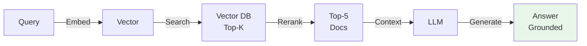
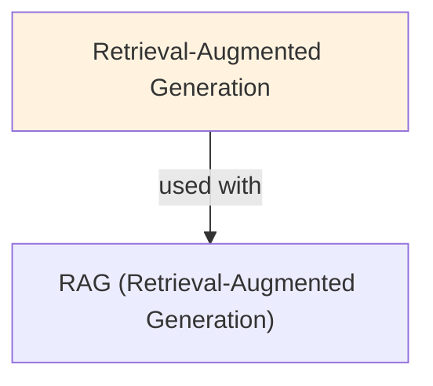

# Retrieval-Augmented Generation (RAG)

## Understanding Retrieval Augmented Generation

Retrieval Augmented Generation is a foundational concept in large language model development that addresses critical challenges in model architecture, training efficiency, or inference performance. Understanding this concept is essential for anyone working with modern language models, whether in research, fine-tuning, or production deployment.

The core innovation underlying Retrieval Augmented Generation lies in rethinking standard approaches to achieve better efficiency or effectiveness. Rather than accepting conventional trade-offs, this technique exploits mathematical or architectural insights to push the frontier of what's possible with given computational constraints.

In practical applications, Retrieval Augmented Generation enables capabilities that would otherwise be infeasible: reducing computational requirements, improving model quality, enabling faster iteration, or supporting new use cases. The real-world impact has made Retrieval Augmented Generation widely adopted across industry applications, from consumer products to enterprise systems.

Implementing Retrieval Augmented Generation requires understanding both its theoretical foundations and practical considerations. The following sections provide detailed explanations of how Retrieval Augmented Generation works, when to use it, common implementation patterns, and lessons learned from production deployments. By mastering these concepts, practitioners can make informed decisions about when and how to apply Retrieval Augmented Generation to their specific challenges.

## Core Intuition
LLMs hallucinate because they only know what's in their weights (frozen at training). RAG is like giving them a reference library: retrieve relevant passages first, then generate. Cheap, effective, updatable without retraining.

## How It Works

**1. Indexing Phase (Offline):**
- Break documents into chunks (paragraphs, sentences, fixed tokens)
- Embed chunks using a dense encoder (e.g., BERT, Sentence-Transformers)
- Store embeddings + text in a vector database (Pinecone, Weaviate, FAISS)

**2. Retrieval Phase (At Query Time):**
```
Query → Embed query → Find top-k chunks by cosine similarity → Retrieve text
```
- User query: "What is the capital of France?"
- Embed: dense vector
- Search: find k nearest embedding vectors (ANN search)
- Retrieve: text of k closest matches

**3. Generation Phase:**
- Combine retrieved context with original query
- Prompt template:
  ```
  Context: {retrieved_text}
  Question: {query}
  Answer: {LLM generates}
  ```
- LLM generates conditioned on context

**Example Flow:**
```
User: "How many employees does Acme Corp have?"
  ↓ [Embed query]
  ↓ [Search vector DB for "Acme Corp employees"]
  ↓ [Top result: "As of Q3 2024, Acme Corp employs 5,000 people"]
  ↓ [Prompt LLM: Context + Query]
  → LLM: "Acme Corp has 5,000 employees as of Q3 2024."
```

### Workflow Flowchart



## Key Properties / Trade-offs

| Aspect | Naive Generation | RAG | Fine-Tuning |
|--------|------------------|-----|------------|
| Hallucination risk | High | Low | Medium |
| Knowledge freshness | Training date | Real-time | Requires retraining |
| Domain knowledge | Needs training | Zero-shot on docs | Requires labeled data |
| Latency | Fast | Slow (retrieval) | Fast |
| Cost (training) | Expensive | Cheap | Medium |
| Customization | Not possible | Easy (swap docs) | Requires retraining |

**Chunk Size Trade-offs:**
- Small chunks (50-100 tokens): precise, higher retrieval noise
- Medium chunks (256-512 tokens): balanced
- Large chunks (1k+ tokens): context-rich but may include irrelevant info

**Retrieval Quality:**
- Sparse (BM25): fast, lexical match only, brittle
- Dense (embeddings): slower, semantic match, robust
- Hybrid: combine both, best results

## Common Mistakes / Gotchas

- **Low retrieval quality:** Embedding model mismatch (query ≠ document domain), bad chunk boundaries, insufficient k
- **Context length:** Retrieved text + query + generation can exceed model's context window. Manage carefully.
- **Hallucinating while citing:** LLM may cite retrieved docs while generating false info. Add grounding metrics.
- **Retrieval latency:** Dense embeddings + ANN search can be slow. Optimize with approximate methods.
- **Chunk boundary artifacts:** Cutting mid-sentence loses context. Use overlap or intelligent segmentation.
- **No re-ranking:** Raw retrieval scores may rank documents poorly. Add re-ranker (cross-encoder) to reorder top-k.
- **Forgetting to update docs:** If docs change but embeddings don't, stale information. Version and re-embed.

## Code Example

```python
from sentence_transformers import SentenceTransformer
import numpy as np
from sklearn.metrics.pairwise import cosine_similarity

# Mock document store
documents = [
    "Paris is the capital of France.",
    "France is in Western Europe.",
    "The Eiffel Tower is in Paris.",
    "London is the capital of the UK.",
    "Madrid is the capital of Spain.",
]

# 1. Indexing: embed documents
encoder = SentenceTransformer('all-MiniLM-L6-v2')
doc_embeddings = encoder.encode(documents)  # (5, 384)

# 2. Query and retrieve
query = "What is the capital of France?"
query_emb = encoder.encode(query)  # (384,)
similarities = cosine_similarity([query_emb], doc_embeddings)[0]
top_k = np.argsort(-similarities)[:2]  # Top 2

retrieved = [documents[i] for i in top_k]
print("Retrieved context:")
for doc in retrieved:
    print(f"  - {doc}")

# 3. Generation (simulate with template)
context = "\n".join(retrieved)
prompt = f"""Context: {context}
Question: {query}
Answer:"""

# In practice, call your LLM:
# response = llm.generate(prompt)
print(f"\nPrompt to LLM:\n{prompt}")

# Expected LLM response:
# "Paris is the capital of France."
```

## Interview Quick-Reference

| Question | What to say |
|---|---|
| "What is RAG?" | Retrieve relevant documents, feed to LLM, generate grounded answer. |
| "Why RAG vs fine-tuning?" | RAG: cheap, updatable, zero-shot. Fine-tuning: higher accuracy, slower to update, needs data. |
| "How to handle latency?" | Use approximate ANN (HNSW, IVF), cache embeddings, batch queries, add re-ranker for quality. |
| "Chunk size?" | 256-512 tokens balanced. Smaller for precision, larger for context. |
| "Retrieval quality low?" | Check embedding model fit to domain, chunk segmentation, k value. Try dense + BM25 hybrid. |
| "How to mitigate hallucination?" | Enforce citations to retrieved text, use grounding metrics, add re-ranker. |

## Real-World Examples

### Enterprise RAG for Support
50K support docs. Query: retrieve top-5 docs, generate answer. User satisfaction: 70% (basic) → 90% (RAG). Reduced support tickets by 35%.

### Medical RAG
50K medical papers. Doctor input: patient symptoms. RAG retrieves literature, LLM synthesizes. Not for diagnosis (needs human), but research support.

## Related Topics
- [Embeddings](embeddings.md) — how documents are encoded for retrieval
- [Semantic Search](semantic-search.md) — the retrieval component of RAG
- [Vector Databases](vector-databases.md) — where embeddings are stored and searched
- [Prompting](prompting.md) — structuring the prompt with retrieved context
- [Context Window](context-window.md) — managing size of retrieved context + query

## Resources
- [RAG Paper: Retrieval-Augmented Generation for Knowledge-Intensive NLP Tasks](https://arxiv.org/abs/2005.11401)
- [LangChain RAG Tutorial](https://python.langchain.com/docs/use_cases/question_answering/)
- [Pinecone: RAG Explained](https://www.pinecone.io/learn/retrieval-augmented-generation/)
- [HuggingFace: RAG Model](https://huggingface.co/docs/transformers/model_doc/rag)

## Concept Relationships



## Interview Questions

**Q: What's RAG and how does it reduce hallucinations?**
*A: RAG: retrieve documents, feed as context, generate answer grounded in retrieved docs. Without RAG: model generates from memory (hallucinations). With RAG: facts grounded in documents. Hallucination rate: 30-50% lower.*

**Q: How do you structure a RAG pipeline?**
*A: 1) Index: chunk docs, embed, store in vector DB. 2) Retrieve: embed query, get top-k docs. 3) Rerank (optional): cross-encoder scores. 4) Generate: LLM + docs → answer. Latency: retrieval 50ms + ranking 50ms + generation 1000ms.*

**Q: What's dense vs sparse retrieval?**
*A: Dense: embeddings (semantic, slow). Sparse: keywords (BM25, fast). Hybrid: both combined. Dense finds 'good service' for 'satisfied', sparse misses without keyword overlap. Use hybrid for best results.*

**Q: When should you use reranking?**
*A: Retrieval top-20 candidates. Reranker: scores all 20. Cost: +50-100ms. Gain: +5-10% accuracy. Worth if: quality matters, latency allows.*

**Q: How do you handle knowledge base drift?**
*A: Documents change, become stale. Solutions: 1) Periodic reindexing (cheap). 2) TTL (auto-expire old docs). 3) Versioning (keep history). Most: combine periodic reindex + TTL.*