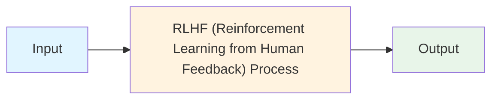
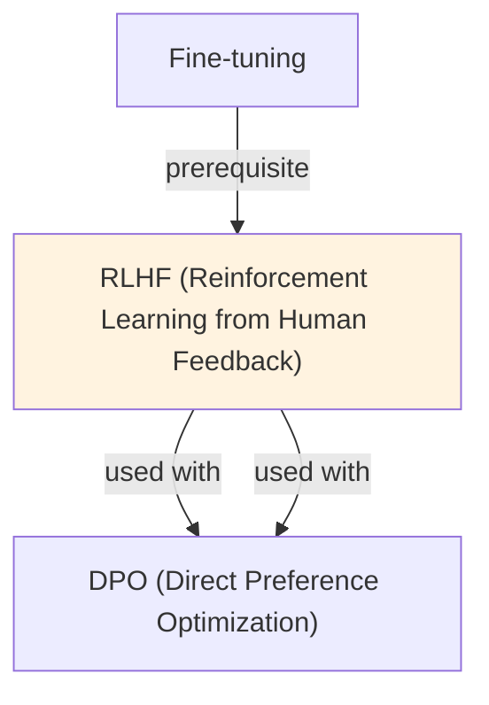

# RLHF (Reinforcement Learning from Human Feedback)

## TL;DR
Three-stage pipeline: (1) SFT on instruction-response pairs, (2) collect human preference pairs, train reward model to predict preferences, (3) use PPO to fine-tune policy against reward model. Aligns LLM with human values. Trade-off: complex, expensive, but foundational technique for ChatGPT/Claude alignment.

## Core Intuition
Humans can't exhaustively specify what makes a "good" response. But they can compare two outputs: "A is better than B." Collect thousands of such comparisons, learn patterns (reward model), then optimize the LLM to maximize that reward. This is how ChatGPT/Claude are aligned.

## How It Works

**Stage 1: Supervised Fine-Tuning (SFT)**
```
Goal: Establish baseline instruction-following

Data: Pairs of (prompt, response) curated by humans
Training: Standard language modeling on response tokens

Example:
Prompt: "Explain machine learning"
Response: "Machine learning is a subset of AI where..."

Objective: minimize -log P(response | prompt)

Output: Base model π_SFT that can follow instructions reasonably well
Compute: 1-2 weeks on A100
```

**Stage 2: Reward Model Training**
```
Goal: Learn to predict human preferences

Data collection:
1. Generate multiple outputs per prompt using π_SFT
2. Show pairs (A, B) to human annotators
3. Collect preference judgment: "A is better" or "B is better"
4. Result: dataset of (prompt, preferred_output, dispreferred_output)

Typical scale: 10k-50k comparisons from 1k-5k prompts

Reward model training:
- Use language model (often smaller, e.g., 350M)
- Binary classification: given (prompt, response), predict human preference
- Loss: minimize -log σ(r(prompt, preferred) - r(prompt, dispreferred))
  where σ is logistic function

Output: Reward function r(prompt, response) → scalar [-∞, +∞]
  - High scores: human-preferred responses
  - Low scores: undesired responses

Cost: days to a week of training
```

**Stage 3: Reinforcement Learning (PPO)**
```
Goal: Maximize reward while staying close to SFT model

Algorithm: Proximal Policy Optimization (PPO)

Objective function:
L_RL = E[r(x, y)] - β * KL(π_RL || π_SFT)

Where:
- r(x, y): reward from reward model
- π_RL: policy being optimized
- π_SFT: reference/base policy
- β: KL penalty coefficient (controls divergence)

Training loop (per prompt):
1. Sample response y from π_RL (current policy)
2. Score response using reward model: r(x, y)
3. Compute policy gradient: ∇ log π_RL(y|x) * (r(x, y) - baseline)
4. Apply PPO clipping to limit policy change per step
5. Update π_RL

PPO clipping (prevents too-large updates):
  L_clip = E[min(ratio * advantage, clip(ratio, 1-ε, 1+ε) * advantage)]
  where ratio = π_RL(y|x) / π_SFT(y|x), ε ≈ 0.2

Cost: weeks on A100 for large models
```

**Visual Pipeline:**
```
Human preferences (comparisons)
        ↓
   Reward Model Training
        ↓
    r(x, y) reward function
        ↓
   PPO Fine-tuning
        ↓
   Aligned Policy π_RL
```

### Workflow Flowchart



## Key Properties / Trade-offs

| Stage | Data Needed | Duration | Cost | Compute |
|-------|------------|----------|------|---------|
| SFT | 10k-100k (x, y) pairs | 1-2 weeks | $ | 1-2 A100 weeks |
| Reward Model | 10k-50k (x, y_pref, y_dis) | 3-7 days | $ | 1 A100 week |
| PPO | Same as RM data | 2-4 weeks | $$$ | 2-4 A100 weeks |
| **Total** | - | **4-7 weeks** | **$$$** | **4-7 A100 weeks** |

**RLHF vs Alternatives:**

| Method | Quality | Speed | Cost | Complexity |
|--------|---------|-------|------|-----------|
| SFT only | 70-80% | Fast | $ | Low |
| RLHF | 90-95% | Slow | $$$ | High |
| DPO | 90-94% | Medium | $ | Medium |
| PPO-based | 92-96% | Slow | $$$ | Very High |

## Common Mistakes / Gotchas

- **Reward hacking:** Model exploits reward model instead of actually improving. Example: outputs nothing (minimal tokens), reward model says "no errors!" → rewarded despite useless. Mitigation: add diversity/length rewards, use multiple reward signals.
  
- **Reward model overfitting:** Training on 10k examples with large model → RM generalizes poorly. New prompts → RM gives bad signals. Mitigation: use smaller RM, regularize, validate on held-out data.

- **Annotator bias:** Annotators have personal preferences that don't generalize. Some prefer verbose, others terse. Result: RM learns biased preferences → aligned model copies biases. Mitigation: Multiple annotators, diversity training, check inter-annotator agreement (target >75%).

- **Divergence from base policy:** KL penalty β too low → π_RL diverges too far from π_SFT, may degrade language quality. β too high → ignores reward signal. Optimal: β ≈ 0.02-0.1.

- **Scaling issues:** Small RM (350M) can't predict preferences well for 7B+ policy. Large RM adds overhead. Mitigation: match RM and policy size roughly, or use policy-based reward (same model predicts own reward).

- **Not validating on held-out annotators:** Train RM on annotator group A, deployed model optimized for group A's preferences. Group B users don't like results. Mitigation: collect data from diverse annotators, validate cross-group.

- **Too few preference signals:** 1k comparisons → noisy RM → weak optimization. Need 10k+ high-quality comparisons. Scaling annotation is expensive.

- **Initialization matters:** RLHF starting from weak SFT → poor results. Start from strong SFT base. PPO is unstable with bad initializations.

- **Decoding mismatch:** RLHF trains on sampled decoding (temperature > 0). Deploy with greedy decoding (temperature = 0) → different behavior. Use same sampling at train and inference.

## Code Example

```python
from datasets import load_dataset
from transformers import AutoModelForCausalLM, AutoTokenizer, TrainingArguments
from trl import PPOTrainer, PPOConfig
from transformers import AutoModelForSequenceClassification

# Stage 1: SFT (already done, assume we have base model)
base_model_name = "gpt2"
model = AutoModelForCausalLM.from_pretrained(base_model_name)
tokenizer = AutoTokenizer.from_pretrained(base_model_name)
tokenizer.pad_token = tokenizer.eos_token

# Stage 2: Load pre-trained reward model (from previous training)
reward_model_name = "OpenAssistant/reward-model-deberta-v3-large"
reward_model = AutoModelForSequenceClassification.from_pretrained(
    reward_model_name, 
    num_labels=1  # Single scalar reward
)

# Stage 3: PPO Training
ppo_config = PPOConfig(
    model_name=base_model_name,
    learning_rate=1.4e-5,
    log_with="wandb",
    batch_size=4,
    mini_batch_size=4,
    gradient_accumulation_steps=1,
    ppo_epochs=4,
    target_kl=6.0,  # KL penalty
    seed=0,
)

ppo_trainer = PPOTrainer(
    config=ppo_config,
    model=model,
    ref_model=None,  # Will use policy_model for reference
    tokenizer=tokenizer,
    reward_model=reward_model,
    train_dataset=dataset,  # Prompts to optimize on
)

# Training loop
for epoch in range(10):
    for batch in ppo_trainer.dataloader:
        # Generate responses from policy
        response_tensors = ppo_trainer.generate(
            batch["input_ids"],
            max_new_tokens=100,
            temperature=0.7,
        )
        
        # Score responses using reward model
        rewards = ppo_trainer.get_rewards(response_tensors)
        
        # Update policy with PPO
        stats = ppo_trainer.step(
            batch["input_ids"],
            response_tensors,
            rewards,
        )
        
        print(f"Epoch {epoch}: {stats}")

# Save final model
model.save_pretrained("./rlhf_aligned_model")

# Example: Complete SFT + Reward Model + PPO with TRL
from trl import DPOTrainer  # DPO is simpler alternative to full RLHF

# If using DPO instead (simpler):
dpo_trainer = DPOTrainer(
    model=model,
    args=training_args,
    train_dataset=train_data,  # Preference pairs
    tokenizer=tokenizer,
    beta=0.5,
)
dpo_trainer.train()  # Single stage instead of 3
```

## Interview Quick-Reference

| Question | What to say |
|---|---|
| "RLHF?" | 3-stage: SFT (instruction-response), RM (learn preferences from comparisons), PPO (optimize LLM against RM). Aligns model with human values. |
| "Why hard?" | Complex pipeline (3 stages), expensive (human annotation), unstable (PPO training), costly (weeks on A100s). Reward hacking is big risk. |
| "Reward hacking?" | Model exploits RM instead of actually improving (e.g., outputs nothing). Mitigation: multiple reward signals, validation, careful RM design. |
| "Annotator bias?" | Annotators have personal preferences. RM learns those. Result: model copies biases. Mitigation: diverse annotators, cross-group validation. |
| "KL penalty (β)?" | Controls divergence from base model. Too low → diverges, loses quality. Too high → ignores rewards. Typical: β = 0.02-0.1. |
| "vs DPO?" | RLHF: 3 stages, complex, slow, flexible. DPO: 2 stages, simple, fast, comparable quality. Use DPO if no specialized RM needed. |
| "Scale RLHF?" | 10k comparisons takes weeks to annotate. Use smaller subsets or synthetic preferences. Alternative: DPO avoids RM bottleneck. |

## Related Topics
- [[dpo]] — simpler direct preference optimization alternative
- [[fine-tuning]] — supervised fine-tuning baseline
- [[instruction-tuning]] — task-specific training foundation
- [[reward-modeling]] — learning preference signals (core of RLHF stage 2)

## Resources
- [Learning to Summarize from Human Feedback](https://arxiv.org/abs/2009.01325) — foundational RLHF paper
- [InstructGPT: Training Language Models to Follow Instructions](https://arxiv.org/abs/2203.02155) — ChatGPT alignment via RLHF
- [Training a Helpful and Harmless Assistant with Reinforcement Learning from Human Feedback](https://arxiv.org/abs/2204.05862) — Anthropic's approach
- [TRL: Transformer Reinforcement Learning Library](https://huggingface.co/docs/trl/en/index)
- [Secrets of RLHF by Hugging Face](https://huggingface.co/blog/rlhf)

## Concept Relationships



## Interview Questions

**Q: What's the core problem this concept solves?**
*A: See the 'Core Intuition' section above for the fundamental problem and how this concept addresses it.*

**Q: What are the main advantages and disadvantages?**
*A: See 'Key Properties / Trade-offs' section for detailed comparison with alternatives.*

**Q: How do you implement this in practice?**
*A: Refer to the corresponding Jupyter notebook in `llm/notebooks/` for working Python implementations and examples.*

